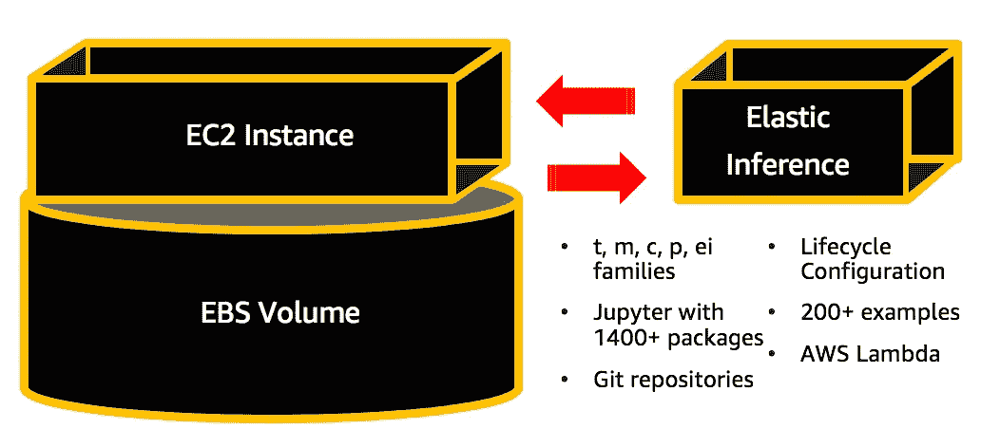
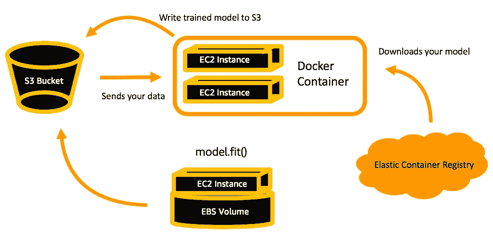
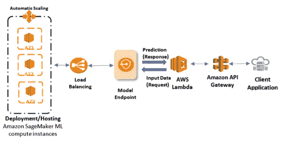
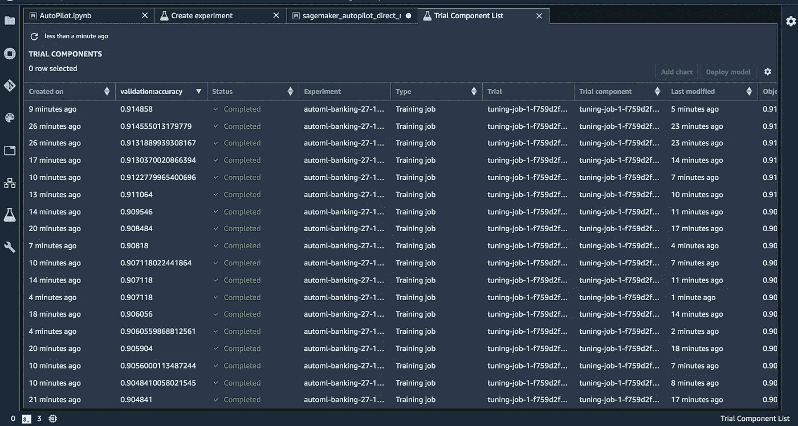

# 介绍亚马逊 SageMaker

> 原文：<https://towardsdatascience.com/introducing-amazon-sagemaker-8061d0fc476d?source=collection_archive---------39----------------------->

## 说到 SageMaker

## **面向云的解耦数据科学解决方案**

[https://www . pexels . com/photo/白天蓝天白云下的玉米田-158827/](https://www.pexels.com/photo/corn-fields-under-white-clouds-with-blue-sky-during-daytime-158827/)

电脑。它们是棘手的事情——有些日子你会觉得不够，有些日子你会觉得比你需要的更多。您可能认为您只是在安装一个新的开源项目，但是四个小时后您仍然在和安装经理争论。你有一个很好的模型，但是没有一个框架来把它构建到应用程序中。现在，让我们重新想象一下这种体验，但是要使用专门为您构建的工具。欢迎，亚马逊 SageMaker。

亚马逊 SageMaker 是来自 AWS 的全托管机器学习解决方案。它将您的环境从开发、培训和部署中分离出来，使您能够分别扩展这些环境，并优化您的支出和时间。世界各地成千上万的开发人员正在以各种方式采用 SageMaker，有时是为了端到端的流程，有时是为了扩大培训工作，有时是为了死一般简单的 RESTful API 集成。在这里，我将带你了解我称之为 SageMaker classic 的主要方面，或者 SageMaker 的基本要素。

# SageMaker 提供了一个托管的开发环境

SageMaker 从一个 notebook 实例开始，这是一个 EC2 实例，专门用于运行 Jupyter、您的环境以及您进行特性工程所需的任何额外代码。笔记本实例会自动配置您的 AWS 凭证，如 boto3 和 aws cli，因此您只需几行代码就可以轻松连接到您在 S3、红移、RDS、DynamoDB、Aurora 或任何其他位置的数据。为了将访问从您的笔记本实例扩展到其他 AWS 资源，只需确保更新分配给您的笔记本实例的 ExecutionRole。

**SageMaker 笔记本实例**

**亚马逊 SageMaker 上的笔记本实例**

SageMaker 提供了运行 Jupyter 的完全托管的 EC2 实例，有 10 多个环境、1400 多个包和数百个示例。

最好在一个较小的 EC2 实例上启动您的笔记本，一般来说 **ml.t2.medium** 是一个不错的选择。这是一台笔记本电脑每小时可以获得的最低金额。

但是一旦你开始钻研你的特性工程，当你意识到你实际上需要一个更大的实例或者更多的磁盘空间时，你可以**轻松地调整托管你的笔记本的 EC2 实例的大小**。你需要关闭它，更新设置，然后再次打开它。往返 7 分钟，但非常值得。

不要忘记关闭您的笔记本电脑，因为费用是按小时计算的，而不是按次计算的。通常最好是 [**实现一个 Lambda 函数来自动关闭这些**](https://github.com/aws-samples/amazon-sagemaker-architecting-for-ml/blob/master/Starter-Code/clean-sm-resources.py) ，要么基于一天中的某个时间，要么根据笔记本本身的使用情况。

# SageMaker 专门为您的每一款车型提供集群

现在有趣的部分来了——你可以在训练的时候为你的每个模型获得专用的 EC2 实例。这些被称为**训练作业**，无论你是使用 17 种内置算法中的一种，在 Docker 容器中引入自己的模型，还是在脚本模式下使用 AWS 管理的容器，你都可以配置它们。

亚马逊 SageMaker 上的培训工作

**亚马逊 SageMaker 上的培训工作**

关于你的培训工作的所有细节都被发送到 CloudWatch，并且你的模型工件在完成后被存储在 S3。

每个训练作业在 SageMaker 上都配置了一个 [**估算器**](https://sagemaker.readthedocs.io/en/stable/estimators.html) ，需要使用 17 种内置算法中的一种，没有任何限制。它们可能提供一些时间优势，因为通过使用它们，您编写的代码更少，但是如果您更喜欢使用 TensorFlow、MxNet、PyTorch、Sci-kit Learn 或任何框架来创建自己的模型，SageMaker [提供了一些示例来看看这是如何工作的](https://github.com/awslabs/amazon-sagemaker-examples)。

每个训练作业都记录在 AWS 控制台中，因此您可以很容易地看到您使用了哪个数据集、它在哪里、模型在哪里以及客观结果，甚至在您完成 6 个多月后也是如此。

# SageMaker 会围绕您的模型自动创建一个 RESTful API

在别的地方训练你的模特？别担心！实际上，你可以把任何预先训练好的模型放在 SageMaker 上——只要你能把它放在 Docker 容器中，你就可以在 SageMaker 上运行它。

[https://AWS . Amazon . com/blogs/machine-learning/load-test-and-optimize-an-Amazon-sagemaker-endpoint-using-automatic-scaling/](https://aws.amazon.com/blogs/machine-learning/load-test-and-optimize-an-amazon-sagemaker-endpoint-using-automatic-scaling/)

**使用 SageMaker 围绕任何模型创建 RESTful API**

如果您在脚本模式托管容器支持的框架中引入模型，AWS 会为您实现 API。

初始化您的端点的所有资源需要 7 分钟以上，所以如果您看到端点显示“Pending”状态，请不要担心如果您将它投入生产以响应常规流量，那么最好为高可用性 API 设置至少两个 EC2 实例。这些将位于 AWS 管理的负载平衡器之后，位于 API 端点本身之后，API 端点可以连接到接收应用程序流量的 Lambda 函数。

保持开启的端点也会变得昂贵，因此确保 [**实现一个 Lambda 函数**](https://github.com/aws-samples/amazon-sagemaker-architecting-for-ml/blob/master/Starter-Code/clean-sm-resources.py) ，以便在它们不在生产环境中时定期关闭它们。您可以在这里随意试验，选择一个更小的 EC2 实例，但是仍然能够满足您的需求。端点自带自动扩展功能，您只需[配置和负载测试这些](https://aws.amazon.com/blogs/machine-learning/load-test-and-optimize-an-amazon-sagemaker-endpoint-using-automatic-scaling/)。

# SageMaker 记录你所有的资源

默认情况下，SageMaker 会在控制台中为您记录所有培训作业、端点和超参数调整作业。每个作业都会向 CloudWatch 发出指标，因此您可以近乎实时地查看这些指标，以监控您的模型的训练情况。此外，通过 **SageMaker Studio** 提供的改进，您可以建立**实验**并监控这些实验的进展。

**SageMaker Studio 提供实验管理，方便查看和跟踪项目进展。**

在 SageMaker 中创建了一个实验之后，只需点击一个按钮，所有与之相关的作业就会在 Studio 中显示出来。

SageMaker Studio 在 re:Invent 2019 上公布，目前仍在公开预览中。这意味着 AWS 仍在微调解决方案，随着他们的开发，可能会有一些变化。因为预览版是公开的，任何拥有 AWS 帐户的人都可以在美国东部 2 区或俄亥俄州开设工作室，并开始使用。

# 资源

AWS 在机器学习方面的资源正呈爆炸式增长。GitHub [上为 SageMaker 托管了 250 多个示例笔记本，就在这里](https://github.com/awslabs/amazon-sagemaker-examples)。数百个培训视频可供不同角色和经验水平的人免费使用[点击这里](https://aws.amazon.com/training/learning-paths/machine-learning/)。如果你想深入了解这篇文章中的任何内容，我亲自经历了在一个 11 视频系列中概述所有这些功能的麻烦，[在这里主持](https://www.youtube.com/playlist?list=PLhr1KZpdzukcOr_6j_zmSrvYnLUtgqsZz)。看看吧！

默认情况下，SageMaker 存在于每个 AWS 帐户中。你也可以创建自己的 AWS 账户，并在[免费等级中进行实验。](https://aws.amazon.com/free/?all-free-tier.sort-by=item.additionalFields.SortRank&all-free-tier.sort-order=asc)

黑客快乐！在 LinkedIn 上随时联系——我喜欢听你在自己的机器学习冒险中如何实现 SageMaker 的成功故事，所以继续吧！