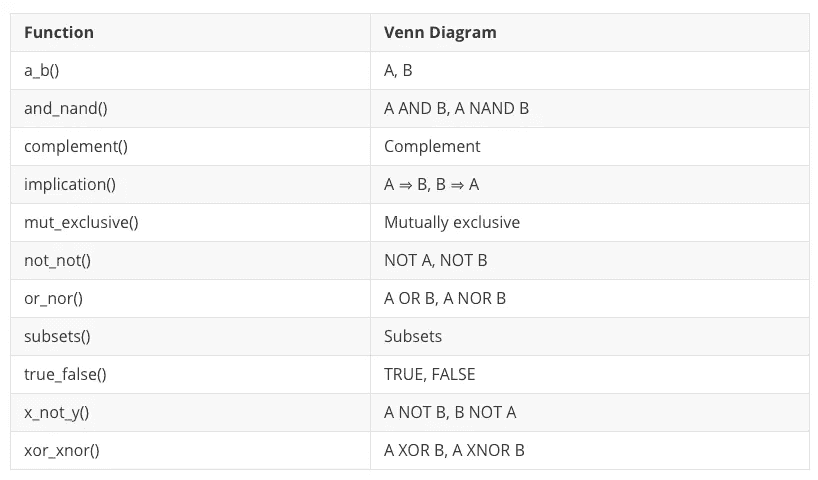
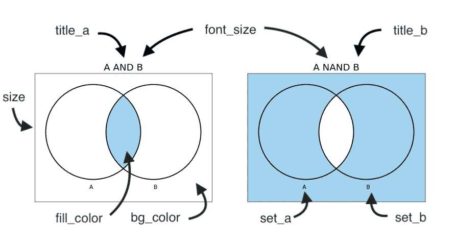
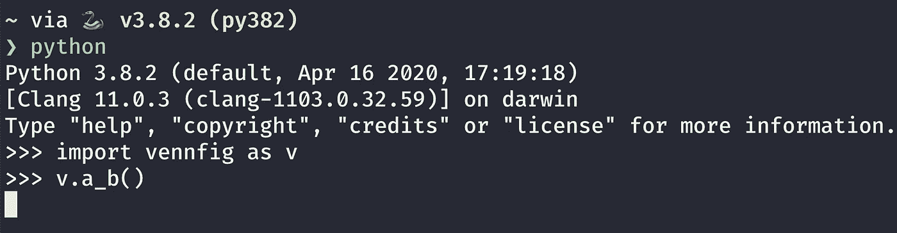
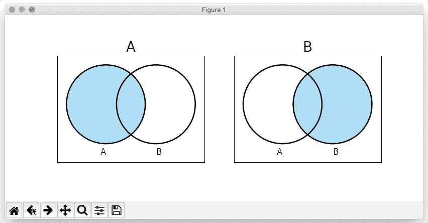

# 维恩图 Python 包:Vennfig

> 原文：<https://towardsdatascience.com/introducing-basic-venn-diagram-python-package-vennfig-fa3f8e4dcb36?source=collection_archive---------35----------------------->

## 在 Jupyter 或 Terminal 上用一行代码画一个维恩图


作者图片

```
**Table of Contents**[**Introduction**](#19c2)1\. [Installation:](#79a1)
2\. [Default Functions](#6842)
3\. [Parameters](#bc07)
4\. [A, B Venn Diagram](#d255)
5\. [A AND B, A NAND B Venn Diagram](#266d)
6\. [TRUE, FALSE Venn Diagram](#6746)
7\. [OR, NOR Venn Diagram](#4e16)
8\. [XOR, XNOR Venn Diagram](#d4dd)
9\. [NOT A, NOT B Venn Diagram](#3fd9)
10\. [A NOT B, B NOT A Venn Diagram](#fdf0)
11\. [Implication Venn Diagram](#a981)
12\. [Mutually exclusive Venn Diagram](#e045)
13\. [Complement Venn Diagram](#7fbc)
14\. [Subsets Venn Diagram](#36b7)
15\. [Terminal](#ce5a)[**Conclusion**](#18bf)
```

# 介绍

在上一篇[文章](/how-to-draw-venn-diagrams-on-jupyter-75c604b093ac)中，我展示了如何使用`[matplotlib_venn](https://github.com/konstantint/matplotlib-venn)`绘制基本的维恩图。

每个图需要 40 行代码，所以我创建了我的第一个 Python 包，名为 [**Vennfig**](https://pypi.org/project/vennfig/) 。你可以用一行代码画一个基本的维恩图，但是足够灵活以满足你的需要。

# 安装:

您可以使用`pip`安装它:

```
pip install vennfig
```

在 Jupyter 上:

```
!pip install vennfig
```

你需要进口`vennfig`。

```
import vennfig as v
```

# 默认功能



所有的 vennfig 函数。

下表显示了您可以使用的所有功能。

除了`subsets`和`mut_exclusive`函数，所有默认函数都显示两个维恩图，例如 A 和 B，A 和 B。

它们有默认的颜色、大小、字体大小、标题等。

# 因素

参数允许你修改你的文氏图。你可以在[每个源代码](https://github.com/shinokada/vennfig/tree/master/vennfig)中找到参数的描述。

示例:

```
import vennfig as v
v.a_b(subs=2, size=6, fill_color='#f5b705', bg_color='#f7edd0', 
    font_size=25, title_a='P', set_a='P', set_b='Q')
```



参数名称

**subs** 你想要显示的文氏图的标识符。

-1:默认(两者)
-2: A
-3: B

**大小
Matplotlib`figsize`。默认值为 15。**

**fill_color** 默认颜色为‘天蓝色’。您可以使用其中一个字符`{'b', 'g', 'r', 'c', 'm', 'y', 'k', 'w'}`，它是蓝色、绿色、红色、青色、品红色、黄色、黑色和白色的缩写。您也可以使用十六进制 RGB 或 RGBA 字符串(例如，`'#4287f5'`或`'#4287f580'`)。

**BG _ color** `bg_color`设置 matplotlib 的 facecolor，即背景色。

默认为`'white'`。

**font _ size
标题字体大小。默认为`20`。**

**标题 _ a
左侧文氏图的标题。**

**标题 _b** 标题为右侧文氏图。

**set _ a
左侧设置标签。默认为`'A'`。**

**设置 _b** 右侧设置标签。默认为`'B'`。

**text_size** 设置文本字体大小。默认值为 15。

让我们看看画维恩图有多容易。

[](/how-to-run-jupyter-notebook-on-docker-7c9748ed209f) [## 如何在 Docker 上运行 Jupyter 笔记本

### 不再有 Python 环境和包更新

towardsdatascience.com](/how-to-run-jupyter-notebook-on-docker-7c9748ed209f) [](/how-to-draw-venn-diagrams-on-jupyter-75c604b093ac) [## 如何在 Jupyter 上画维恩图

### 使用 Matplotlib-Venn 的所有基本逻辑文氏图

towardsdatascience.com](/how-to-draw-venn-diagrams-on-jupyter-75c604b093ac) 

# 文氏图

请在[源代码](https://github.com/shinokada/vennfig/blob/master/vennfig/a_b.py)中找到更多细节。

a、B 默认文氏图

a、B 维恩图设置参数。

# A 和 B，A 和 B 维恩图

请在[源代码](https://github.com/shinokada/vennfig/blob/master/vennfig/and_nand.py)中找到更多细节。

A 和 B，A 和 B 默认维恩图。

a 和 B 默认文氏图设置参数。

# 真假文氏图

请在[源代码](https://github.com/shinokada/vennfig/blob/master/vennfig/true_false.py)中找到更多详细信息。

真，假默认文氏图。

真实维恩图设置参数。

# 或，或非文氏图

请在[源代码](https://github.com/shinokada/vennfig/blob/master/vennfig/or_nor.py)中找到更多细节。

也不是默认的维恩图。

NOR 维恩图设置参数。

# 异或，XNOR 文氏图

请在[源代码](https://github.com/shinokada/vennfig/blob/master/vennfig/xor_xnor.py)中找到更多细节。

异或，XNOR 默认文氏图。

XOR 文氏图设置参数。

# 不是 A，不是 B 文氏图

请在[源代码](https://github.com/shinokada/vennfig/blob/master/vennfig/not_not.py)中找到更多细节。

不是 A，不是 B 默认文氏图。

不是 Q 维恩图设置参数。

# A 不是 B，B 不是维恩图

请在[源代码](https://github.com/shinokada/vennfig/blob/master/vennfig/x_not_y.py)中找到更多细节。

A 不是 B，B 不是默认的维恩图。

P NOT Q 维恩图设置参数。

# 蕴涵维恩图

请在[源代码](https://github.com/shinokada/vennfig/blob/master/vennfig/implication.py)中找到更多细节。

隐含默认文氏图。

`Q ⇒ P Venn diagram setting parameters.`

# 互斥文氏图

请在[源代码](https://github.com/shinokada/vennfig/blob/master/vennfig/mut_exclusive.py)中找到更多细节。

互斥默认文氏图。

互斥文氏图设置参数。

# 互补文氏图

请在[源代码](https://github.com/shinokada/vennfig/blob/master/vennfig/complement.py)中找到更多细节。

补充默认文氏图。

补充文氏图设置参数。

# 子集文氏图

请在[源代码](https://github.com/shinokada/vennfig/blob/master/vennfig/subsets.py)中找到更多细节。

子集默认文氏图。

子集文氏图设置参数。

# 末端的

你可以用终端创建一个文氏图。



在终端上运行 vennfig。

您也可以使用`pan`来移动图表。



终端的输出

# 结论

让我知道你的想法。你可以在这里找到 Github repo。

请继续关注下一篇文章。

**通过** [**成为**](https://blog.codewithshin.com/membership) **会员，获得媒体上所有故事的访问权限。**


[https://blog.codewithshin.com/subscribe](https://blog.codewithshin.com/subscribe)