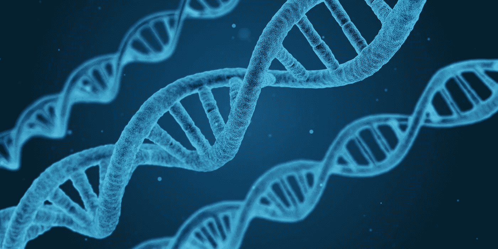
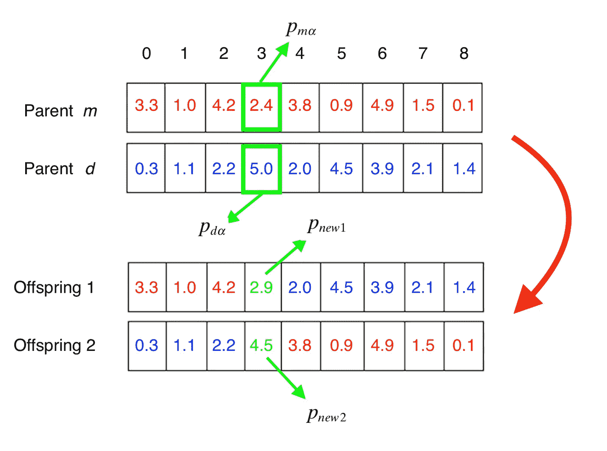
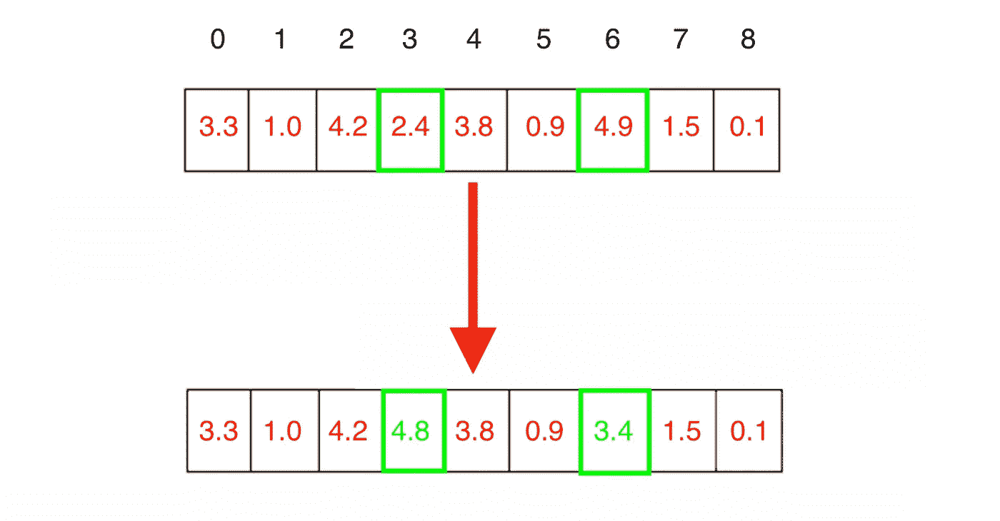
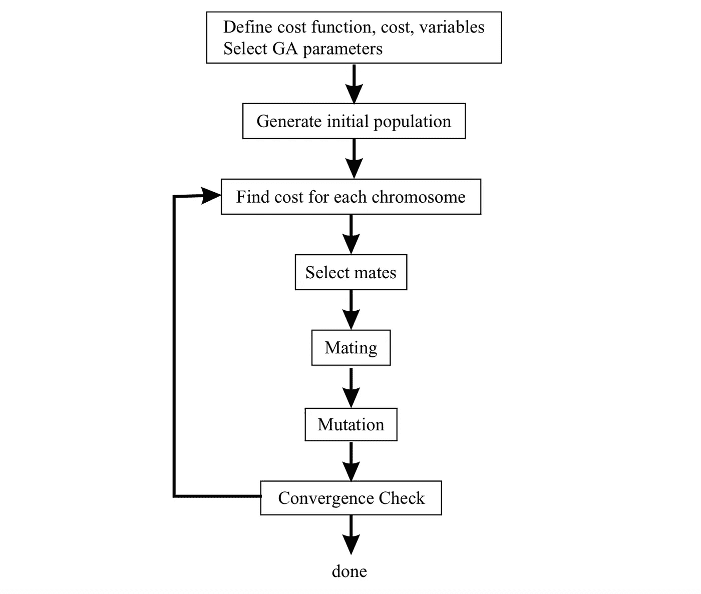

# 介绍 GeneAl:一个遗传算法 Python 库

> 原文：<https://towardsdatascience.com/introducing-geneal-a-genetic-algorithm-python-library-db69abfc212c?source=collection_archive---------10----------------------->

## 在这篇文章中，我将介绍 [GeneAl](https://github.com/diogomatoschaves/geneal) ，这是一个用遗传算法(GA)解决优化问题的 python 库。在这个过程中，我们将了解它们背后的理论，并通过 python 示例了解它们是如何工作的。



图片由[阿雷克索查](https://pixabay.com/users/qimono-1962238/?utm_source=link-attribution&amp;utm_medium=referral&amp;utm_campaign=image&amp;utm_content=1811955)通过[皮克斯巴伊](https://pixabay.com/?utm_source=link-attribution&amp;utm_medium=referral&amp;utm_campaign=image&amp;utm_content=1811955)

遗传算法(GA)是一种基于遗传学和自然选择原理的优化和搜索技术，本质上是模仿我们在生活中观察到的自然进化过程。他们的一般原则是基于这样的概念，即拥有一个由几个个体组成的初始群体，每个个体代表问题的一个特定解决方案，并允许它进化到一个最大化其整体适应度的状态，使用三个主要算子:**选择**、**交叉**和**变异**。我们将在下面更详细地研究这些方面。

遗传算法简直不可思议，因为它们可以应用于多种优化问题，并找到我们没有数学表达式的复杂函数的解决方案。然而，这是以计算复杂性为代价的，因为对于庞大的群体，我们必须评估每一代所有个体的适应度。如果适应度函数是昂贵的，算法运行将是缓慢的。

遗传算法可以分为*二元*和*连续*，这取决于我们正在优化的问题的类型。潜在地，所有问题都可以被分解为用二进制串表示它们的变量(*基因)*，但是一般来说，如果输入空间是实值的，那么使用*连续* GA 更有意义。

由于连续 GA 的例子很少，这里显示的例子是针对 GA 版本的。

**初始化**

搜索从随机的 N 个个体开始。这些个体中的每一个都对应于一条*染色体*，它编码了一个基因序列，代表着我们试图优化的问题的特定解决方案。根据手头的问题，代表解决方案的基因可以是位(0 和 1)或连续的(实值)。下面显示了一个实值*染色体*的例子，它代表了一个具有 9 个变量(*基因*)的给定问题的解决方案。


个体染色体的例子

**健身**

每个个体的*适应度*定义了我们要优化的内容，因此，给定一个编码特定问题解决方案的*染色体*，其适应度将对应于特定个体作为问题解决方案的表现。因此，其适应值越高，该解决方案就越最优。

毕竟，个体的适应度分数是经过计算的，它们是经过排序的，因此可以选择最适应的个体进行交叉。

**选择**

选择是选择一定比例的个体相互交配并创造新后代的过程。就像现实生活中的自然选择一样，更健康的个体有更高的机会存活下来，因此，将他们的基因传递给下一代。虽然存在有更多个体的版本，但是通常选择过程匹配两个个体，创建成对的个体。有四种主要策略:

*配对*:这可能是最直接的策略，因为它只包括将最适合的染色体两两配对(将奇数行与偶数行配对)。

随机:这种策略包括从交配池中随机选择个体。

*轮盘*:这种策略也遵循随机原则，但是更健康的个体被选中的概率更高。

*锦标赛*:采用这种策略，算法先选出几个个体作为候选(通常是 3 个)，然后选出最适合的个体。该选项的优点在于，它不需要首先按照适合度对个体进行分类。

下面的代码片段显示了*轮盘*策略的 python 实现。

**交叉**

这是产生新后代的步骤，新后代将取代种群中最不适合的个体。杂交个体背后的想法是，通过组合不同的基因，我们可能会产生更健康的个体，这将是我们问题的更好解决方案。或者没有，在这种情况下，这些解决方案不会延续到下一代。

为了执行实际的交叉，来自选择步骤的每一对被组合以产生两个新个体，这两个新个体都具有来自父母中每一个的遗传物质。执行交叉有几种不同的策略，所以为了简洁起见，我们只讨论其中一种。

假设我们有一个由 9 个变量定义的问题，如果我们有 2 个父母，我们随机选择交叉基因作为索引 3，那么每个后代将是每个父母的组合，如下图所示。



显示双亲如何杂交产生新后代的图表

每个后代的交叉基因根据以下规则计算:


计算新交叉基因的方程式

其中 *β* 将是 0 和 1 之间的随机数。下面给出了交叉的 python 代码。

**突变**

变异是我们在群体中引入新的遗传物质的过程，允许算法搜索更大的空间。如果没有突变，群体中现有的遗传物质多样性不会增加，而且由于一些个体在世代之间“死亡”,实际上会减少，个体倾向于非常快地变得非常相似。

就优化问题而言，这意味着在没有新的遗传物质的情况下，该算法可以在探索足够大的输入空间以确保我们可以达到全局最优之前收敛到局部最优。因此，变异在保持种群多样性方面发挥着重要作用，并使其进化为更适合问题解决方案的*。*

我们可以做到这一点的最简单的方法是，给定一定的*突变率*，随机选择一些个体和一些基因，并为这些位置分配一个新的随机数。下面的图表和代码片段对此进行了举例说明。



个体中两个基因的突变

**解算器**

现在是时候把这一切联系起来了。使用我们上面定义的操作符，该算法现在可以解决这个问题，只需几行代码就可以实现该算法的实际主循环。该算法的流程图以及 python 中的示例实现如下所示。



遗传算法的流程图

# 介绍通用

[GeneAl](https://github.com/diogomatoschaves/geneal) 是一个实现遗传算法的 python 库，可以用来解决许多优化问题。您可以使用提供的现成解算器类—**binarygenalsolver**和**continuousgenalsolver**——或者创建一个从其中一个继承的自定义类，并实现覆盖内置方法的方法。它还支持解决著名的旅行推销员问题。

为了简洁起见，我们将只看到如何使用连续版本——与本文保持一致——但是要了解更多细节，请查看该项目的自述文件。

第一件事是安装软件包，这可以通过`pip`完成，如下所示:

```
pip install geneal 
```

安装完成后，就可以开始使用了。所以让我们看看如何使用**continuousgenalsolver**类。

作为最低要求，该类要求用户提供问题中存在的基因数量，以及提供自定义的适应度函数。为了方便起见，该库提供了一些可用于测试的默认适应度函数。

完成上述初始化后，该类将使用所有参数的默认值来解决问题。如果我们希望对算法运行有更多的控制，我们将希望调整这些，这可以如下所示:

最后，这个类允许用户指定问题的类型(如果可能的值是整数或浮点数)以及变量的限制，以便限制搜索空间。

这就完成了对这个库的简短介绍。如果你想知道更多，查看一下 [GitHub 库](https://github.com/diogomatoschaves/geneal)，那里有更多的信息:)

感谢阅读！