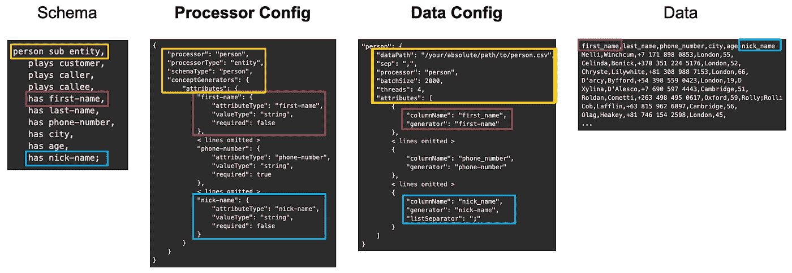
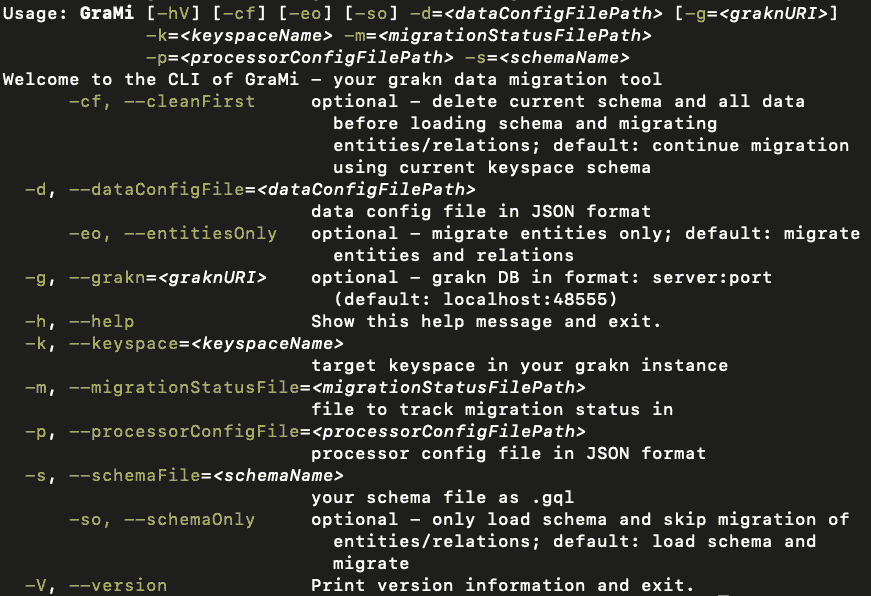
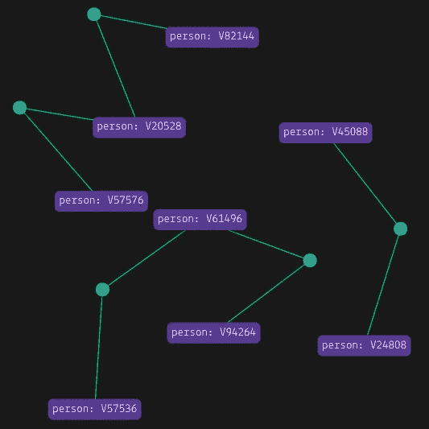

# GraMi 简介 Grakn 的数据迁移工具

> 原文：<https://towardsdatascience.com/introducing-grami-a-data-migration-tool-for-grakn-d4051582f867?source=collection_archive---------41----------------------->


艾莉娜·格鲁布尼亚克在 [Unsplash](https://unsplash.com?utm_source=medium&utm_medium=referral) 上的照片

如果你和我一样，没多久你就会对 [Grakn](https://grakn.ai/) 感到兴奋。如果你像我一样，最令人兴奋的部分是数据建模、规则推理及其查询和分析功能。

在经历了如何迁移数据的官方示例之后，我确信只有几天时间可以远离所有的乐趣。然后，我花了几周时间构建了一个可靠且健壮的数据迁移器，它具有以下特性:

*   可扩展性和性能
*   基本数据清理
*   数据有效性
*   记录
*   故障恢复

它叫做 [GraMi](https://github.com/bayer-science-for-a-better-life/grami) (Grakn Migrator)。如果你想，你也可以用它。


[在 Github 上找到 GraMi](https://github.com/bayer-science-for-a-better-life/grami)

# 格拉米是什么？

GraMi 从文件中流式传输表格数据，并生成有效的 Graql insert 查询，然后提交到您选择的 Grakn 服务器。更具体地说:

## **数据输入:**

*   数据从文件中流出，以保持低内存占用
*   支持任何表格数据文件(即:csv，。tsv，。*sv…)，是否压缩

## **实体和关系迁移:**

*   迁移 Grakn 中任何可用类型的必需/可选属性(字符串、布尔、长整型、双精度、日期时间)
*   迁移必需/可选的角色扮演者
*   将类似列表的属性列作为 n 个属性迁移(Grakn 推荐)

## **数据清理和验证:**

*   基本数据清理(删除前导和尾随空格以及不一致的特殊字符)
*   在写入 Grakn 之前，验证基于每个数据行**的插入查询**
*   记录所有无效数据记录，以便于分析(例如，缺少属性/球员或数据记录格式不正确)

## **表现:**

*   在单线程和并行异步写入 Grakn 之间进行选择，以充分利用您的硬件配置

## **故障恢复:**

*   跟踪迁移进度，允许停止/重启和(硬件)故障恢复

# 为什么是格兰米？

## 数据输入:

*   大多数数据将来自现有系统或结构化文件，并且大多数系统可以导出为表格格式
*   如果您有大量数据，您会希望以压缩格式存储

## 实体和关系迁移:

*   模板逻辑是为大型数据集复制的多种形式，大型数据集具有许多实体和必需/可选属性/参与者的关系以及具有属性列表的列

## 数据清理和验证:

如果你对数据很认真，你会使用大量的数据，并且非常关心数据的质量。所以你可能想:

*   记录所有不符合模式和数据建模约束的行
*   防止对 Grakn 的无效/空写入，浪费时间和无意义的迁移

## 性能:

*   如果您有数百万条记录，就不能缓慢插入
*   批处理和并行化代码并不简单，而且在 Grakn Discord 上经常被请求

## 故障恢复:

在处理大量不同质量的数据时，硬件和软件最终会出现故障/变得不可用，因此您需要跟踪迁移进度，并能够从中断的地方重新开始。

# 它是如何工作的

GraMi 要求你指定一个*处理器配置*文件(*处理器配置*)和一个*数据配置*文件(*数据配置*)。*处理器配置*充当你的模式、它的实体、关系、属性、播放器、值类型以及*数据配置*之间的粘合剂。*数据配置*描述了数据是如何格式化的，以及哪些列包含哪些模式概念。

## 配置约定:

*   对于模式中指定的每个实体和关系，在*处理器配置*中必须至少有一个处理器(至少如果您希望 GraMi 插入它的话)
*   每个数据文件只包含一个模式概念(即一个实体或关系以及它们相应的属性和参与者)
*   每个数据文件必须包含具有唯一列名的标题行

在这篇文章中，我们将构建你可以在 github 上找到的 [grami-example 项目。这是对 Grakn 的电话呼叫示例的详细描述，扩展到显示 GraMi 此时的所有功能。](https://github.com/bayer-science-for-a-better-life/grami-example)

从这个例子中可以看出，下面是如何使用处理器和数据配置将数据映射到模式的概述:



图 1 —使用 GraMi 的处理器和数据配置将数据映射到模式。

从左到右(模式到数据):

*   给定一个模式概念(用黄色标记)，在本例中是实体 *person* …
*   **处理器配置**定义了一个名为*人*的*处理器*，它创建了 schemaType *人*的*实体*的实例。对于 *person* 的每个属性，我们指定属性的*值类型*以及是否*需要将记录插入到 Grakn 中(read 中的 *first-name* ，蓝色的 *nick-name* )。**注意:**关键属性应该始终是必需的；但是，对于所有其他记录，如果缺少某些属性，这将使您能够排除对您的域没有用处的记录。*
*   **数据配置**包含每个*数据文件*的一个条目。每个文件映射到**处理器配置**中的*处理器*(黄色框)，然后将数据文件中的每一列映射到所选*处理器*中的*属性生成器*。如果该列实际上是一个值列表(对于*昵称*，您可以指定*列表分隔字符*。

# 辅导的

让我们来看一下扩展电话呼叫的例子(完整的项目，包括模式、数据和配置可以在[这里](https://github.com/bayer-science-for-a-better-life/grami-example)找到)。

## 步骤 1-实体的处理器配置

对于我们模式中的以下*人*实体(在这里找到完整模式[):](https://github.com/bayer-science-for-a-better-life/grami-example/blob/master/src/main/resources/schema.gql)

对应的*处理器配置*条目将是:

1.  你的*处理者*的 ID——这里是*人——*行 2
2.  创建一个*实体—* 行 3
3.  类型*人—* 第 4 行
4.  具有以下*属性:*
5.  您的*属性生成器的 ID—这里的*是*名字*，w *是第 7 行*
6.  创建*名字*属性—第 8 行
7.  *值类型的*字符串(其他可能是:long、double、boolean、datetime) —第 9 行
8.  那是*不需要的—* 第 10 行
9.  或者*必填*(在电话示例中，电话号码是必填的)—第 16 行

请注意，在为关系定义处理器配置时，将会考虑到实体的“播放”定义。对于实体，只需指定属性生成器。

对模式中的所有实体执行上述操作。点击查看电话示例[的完整处理器配置。](https://github.com/bayer-science-for-a-better-life/grami-example/blob/master/src/main/resources/processorConfig.json)

## 步骤 2—关系的处理器配置

对于我们的[模式](https://github.com/bayer-science-for-a-better-life/grami-example/blob/master/src/main/resources/schema.gql)中的以下*调用*关系:

对应的*处理器配置*条目将是:

1.  你的*处理器*的 ID——这里*调用——*行 2
2.  创建一个*关系—* 行 3
3.  类型为*的调用—* 第 4 行
4.  与以下*玩家:* —第 6 行
5.  你的*玩家生成器的 ID——此处*为*呼叫者*，w *为*第 7 行
6.  匹配类型为 *person* 的实体—第 8 行
7.  使用属性*电话号码*识别*人* —第 9 行
8.  属于*值类型*字符串—第 10 行
9.  插入*人*作为扮演*呼叫者*的角色—第 11 行
10.  对于每个*调用*记录-第 12 行，哪一个是*必需的*角色

所有关系及其参与者都是如此。如果一个关系有属性，如*调用*的情况，只需为每个属性添加属性生成器，如步骤 1 实体所述。

## 步骤 3-实体的数据配置

我们现在将数据映射到刚刚创建的*处理器配置*。让我们来看看我们的 [*person.csv*](https://github.com/bayer-science-for-a-better-life/grami-example/blob/master/src/main/resources/person.csv) 数据文件:

我们的数据配置条目如下所示:

1.  对于迁移步骤“person”——第 1 行
2.  我们指定*文件路径*——第 2 行
3.  表格列的*分隔字符*—第 3 行
4.  通过 ID 从*处理器配置*中选择*处理器*，这里是*p*person—line 4
5.  我们设置*批次大小*——见下文
6.  以及用于迁移的*线程*的数量——见下文
7.  然后，我们在数据文件中的*列名*和在*处理器配置中指定的*属性生成器*之间提供一个映射*
8.  如果列包含值列表，您可以指定*列表分隔字符* —第 21 行

使用 4 个*线程*的 2000 年*批次大小意味着每批 2000 条记录中，每个线程将向 Grakn 写入和提交大约 500 个插入查询。*

GraMi 根据插入查询的长度将其均匀地分配给线程，这样每个线程都有大致相同数量的实体/关系和属性/播放器要插入——这可以防止一个线程在处理下一批之前比其他线程花费更长的时间来关闭，从而防止 CPU 浪费。不均匀的 insert 语句通常是由包含属性列表的列造成的，其中每个列表的值的数量在记录之间有很大差异。

## 步骤 4-关系的数据配置

继续这些关系，我们现在通过我们的 [*calls.csv*](https://github.com/bayer-science-for-a-better-life/grami-example/blob/master/src/main/resources/call.csv) 数据文件来工作:

数据条目如下所示:

这里唯一的新东西是第 7-16 行，在这里我们定义了从包含唯一标识关系 *call* 的角色玩家的属性的*列*到步骤 2 中的*处理器配置*中的适当玩家生成器的映射。

# 使用 GraMi

完成我们的*处理器*和*数据配置*后，我们准备开始迁移。有两种使用 GraMi 的方法:作为 Maven/Gradle Java 项目中的依赖项或作为独立的可执行文件(适用于 Linux 和 Mac):

## 在您的 Maven/Gradle 项目中使用 GraMi

使用 Maven 导入 GraMi:

或者使用 Gradle 导入 GraMi:(参见完整的 [build.gradle 这里](https://github.com/bayer-science-for-a-better-life/grami-example/blob/master/build.gradle))

然后，您可以在代码中使用 GraMi，如下所示:

布尔标志 *cleanAndMigrate* 设置为**真**，如所示

```
GraknMigrator mig = new GraknMigrator(migrationConfig, migrationStatus, true);
```

如果存在，将删除模式和给定键空间中的所有数据。
如果设置为**假**，GraMi 将根据迁移状态继续之前的迁移——这意味着它将从之前停止的地方继续(关于迁移状态的更多细节——见下文)。

至于吗

```
mig.migrate(true, true);
```

*migrateEntities* 和 *migrateRelations* 标志总共有四种可能性，分别为:

1.  **真，真** -迁移*数据配置*中的所有内容
2.  **真，假** -仅迁移实体(对调试有用)
3.  **假，假** -仅迁移模式(注意:*如上所述的 cleanAndMigrate* 标志也必须为**真)**
4.  **假，真** -不能迁移没有实体的关系-设置为与 3 相同。

## 在 Java 项目中配置 GraMi 日志记录

要获得对 GraMi 日志记录的控制，请将以下内容添加到 log4j2.xml 配置文件中:

为了跟踪迁移进度，GraMi 的建议日志级别是 *INFO。*对于更详细的输出，在你空闲的时候将级别设置为*调试*或*跟踪*——以及错误报告...

## 使用 GraMi 作为 CLI 应用程序

在确保你的机器上安装了 Java 8 之后，在这里下载[GraMi](https://github.com/bayer-science-for-a-better-life/grami/releases)。解包后，您可以直接在/bin 目录下运行它，如下所示:

```
./bin/grami \
-d /path/to/dataConfig.json \
-p /path/to/processorConfig.json \
-m /path/to/migrationStatus.json \
-s /path/to/schema.gql \
-k yourFavoriteKeyspace \
-cf
```

只需确保您调整了文件的路径，并选择了您最喜欢的键空间。还要确保将 dataConfig.json 中指定的文件路径调整为本地路径。你可以在这里找到所有的数据和配置文件。

通过使用-h 标志，您可以找到 GraMi 的所有选项和标志:



图 2— GraMi CLI

## 格拉米伐木公司

GraMi 生成两个日志:应用程序日志和数据日志。

应用程序日志可让您跟踪迁移进度，如果发生异常，它会写出异常或给出软件崩溃原因的信息。对于成功的迁移，您可能会看到如下内容:

数据日志记录了与您的数据相关的所有问题。例如，当列应该是某种值类型，但不是时:

同样，所有违反数据有效性检查的数据记录(缺少必需的属性或玩家、空行等)都会被记录下来:

这使您可以快速找到数据文件中的问题，并在重试之前调整您的预处理(或者不调整，因为不应插入违反您的约束的记录，即需要的属性/球员)。

计划在下一个版本中为每个包含所有未插入 Grakn 的原始数据记录的数据文件创建一个相应的错误文件，这将进一步简化错误分析和修复。

## GraMi 迁移状态

GraMi 通过记录为每个文件处理的数据记录数量来跟踪迁移过程。如果失败，GraMi 可以重新启动，或者跳过 *-cf* 标志(如果用作应用程序)，或者在应用程序代码中将 *cleanAndMigrate* 设置为 false(见上文)。GraMi 将读取您的 *migrationStatus.json* 文件，可能如下所示:

如果一个文件已经被完整地处理，则 *isCompleted* 被设置为真。否则为假，文件中处理的行数记录在 *migratedRows* 下。如果继续中止的迁移，GraMi 将跳过所有已完成的文件和每个未完全迁移的文件中的*迁移行*(如上面的 *call.csv* 所示)，然后继续下一个数据记录。欢迎您对此进行测试，方法是手动中止迁移，然后按照说明重新启动。

# 摘要

如果您已经按照上述教程进行了操作，并且从您的 Maven/Gradle 项目中或者通过使用 GraMi 作为独立的应用程序来运行示例迁移，那么您的*应用程序日志* ( *grami-log.log* )应该与代码/应用程序运行的目录 *)* 类似:

然后，您可以使用以下查询使用 [Grakn Workbase](https://dev.grakn.ai/docs/workbase/overview) 来浏览数据集:

```
match $e (caller: $caller, callee: $callee) isa call; get; offset 0; limit 5;
```

您应该会看到类似这样的内容:



图 3 —使用 [Grakn 工作库](https://dev.grakn.ai/docs/workbase/overview)探索电话呼叫

至此，您已经成功地完成了教程，现在可以使用 GraMi 获取您自己的数据了(希望不到几周)！

如果没有，请通过 Github 联系我或在下面留下评论…

# 链接和资源

[Github 上的 Grakn](https://github.com/graknlabs/grakn)

格拉克工作基地

[GraMi on Github](https://github.com/bayer-science-for-a-better-life/grami)

[Github 上的 GraMi 示例项目](https://github.com/bayer-science-for-a-better-life/grami-example)

# 贡献

GraMi 是在语义和知识图技术小组@ [Bayer AG](https://www.bayer.com/) 的工程师@ [Grakn Labs 的**大力支持下建立的！**](https://github.com/orgs/graknlabs/people)

# 批准

GraMi 和[GraMi-示例](https://github.com/bayer-science-for-a-better-life/grami-example)存储库包括在[拜耳公司](https://www.bayer.com/)开发的软件。它是在 GNU-3 通用公共许可证下发布的。

# 信用

来自 [Flaticon](https://www.flaticon.com/) 的 [Smashicons](https://www.flaticon.com/de/autoren/smashicons) 横幅中的图标。