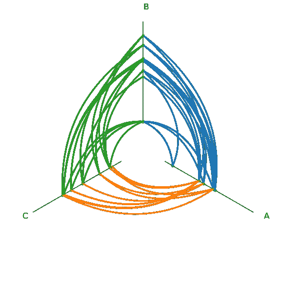
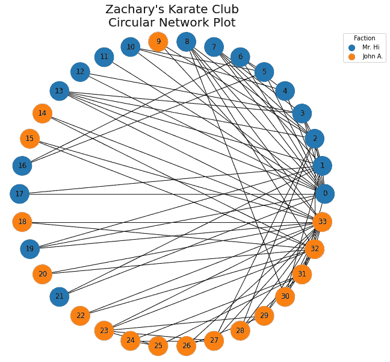
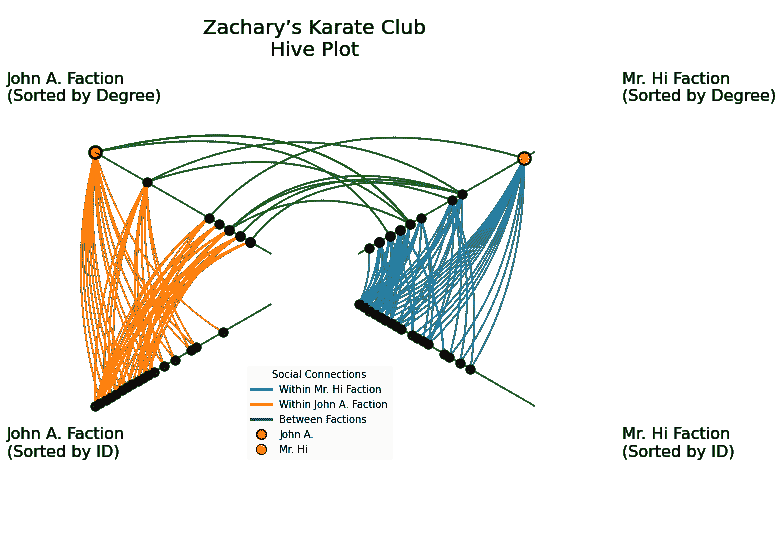

# Hiveplotlib 简介

> 原文：<https://towardsdatascience.com/introducing-hiveplotlib-31014cefc7ac?source=collection_archive---------32----------------------->

## 通过蜂巢图在 Python 中实现更好的网络可视化


Hiveplotlib 是一个新的开源 Python 包，用于生成蜂巢图。

介绍`hiveplotlib`——一个用于生成蜂巢图的新的开源 Python 包。[Hive Plots 最初是由 Martin Krzywinski](https://academic.oup.com/bib/article/13/5/627/412507) 开发的，它生成定义明确的图形，允许对网络数据进行可解释的可视化探索。

`hiveplotlib`库在 [Gitlab](https://gitlab.com/geomdata/hiveplotlib) 上对所有人可见，其中[文档](https://geomdata.gitlab.io/hiveplotlib/index.html)包括对蜂巢图的进一步解释、示例(玩具数据和真实数据)以及完整的代码文档。

Hiveplotlib 可以通过`pip`安装:

```
$ pip install hiveplotlib
```

目前，我们只支持基于`[matplotlib](https://matplotlib.org/)`的可视化，但我们计划扩展 hiveplotlib，以用于交互式 Python viz 包，如`[bokeh](https://docs.bokeh.org/en/latest/index.html)`、`[plotly](https://plotly.com/)`和`[holoviews](https://holoviews.org/).`

# 运行时间

`hiveplotlib`很好地扩展到大型网络数据集。作为对合成数据的演示，让我们构建一个类似于`hiveplotlib`标志中的“o”的蜂巢图:

```
from hiveplotlib import hive_plot_n_axes, Node
from hiveplotlib.viz import hive_plot_viz_mpl
import numpy as np
import matplotlib.pyplot as pltnum_nodes = 20
num_edges = 80np.random.seed(0)*# build node data*
nodes = []
for i in range(num_nodes):
    temp_node = Node(unique_id=i,
                     data={'a': np.random.uniform(),
                           'b': np.random.uniform(),
                           'c': np.random.uniform()})
    nodes.append(temp_node)*# give the nodes simple int IDs*
node_ids = np.arange(num_nodes)*# build random edges*
edges = np.random.choice(np.arange(num_nodes),
                         size=num_edges*2).reshape(-1, 2)*# construct HivePlot instance, evenly spacing out nodes over 3 axes*
hp = hive_plot_n_axes(node_list=nodes, edges=edges,
                      axes_assignments=[
                          node_ids[:num_nodes//3],
                          node_ids[num_nodes//3:2*num_nodes//3],
                          node_ids[2*num_nodes//3:]
                      ], sorting_variables=["a", "b", "c"],
                      axes_names=["A", "B", "C"],
                      vmins=[0, 0, 0], vmaxes=[1, 1, 1],
                      orient_angle=-30)*# change the line kwargs for edges in plot*
hp.add_edge_kwargs(axis_id_1="A", axis_id_2="B",
                   c=f"C0", lw=3, alpha=1, zorder=1.5)
hp.add_edge_kwargs(axis_id_1="B", axis_id_2="C",
                   c=f"C2", lw=3, alpha=1, zorder=1.5)
hp.add_edge_kwargs(axis_id_1="A", axis_id_2="C",
                   c=f"C1", lw=3, alpha=1, zorder=1.5)fig, ax = hive_plot_viz_mpl(hive_plot=hp)
plt.show()
```



用 hiveplotlib 生成的蜂巢图的合成示例。

这段代码(减去导入语句)在笔记本电脑上运行大约需要 200 毫秒。如果我们只将上面的代码更改为`num_nodes = 10000`和`num_edges = 10000`，运行时间会增加大约 1 秒。100，000 个节点和边在大约 10 秒内运行。

# 数据输入

为了使用 hiveplotlib，我们需要争论两个数据源，**节点**和**边**。

## 节点

在我们的框架中设置一个节点只需要一个数据字典和一个 unique_id。这对于来自数据库查询的任何`json`输出(例如，通过`pymongo`来自 Mongo 数据库的查询)来说都是非常好的。`pandas`数据帧也可以通过`df.to_dict(orient="records")`轻松转换成这种格式。

## 优势

边存储为一个`(n, 2) numpy.ndarray`，其中边(如果有方向)从第一列移动*到第二列*。**

为了用真实数据演示代码，让我们看一个小而流行的例子:Zachary 的空手道俱乐部。

# 一个例子:扎卡里的空手道俱乐部

从 1970 年到 1972 年，韦恩·w·扎卡里观察到一个空手道俱乐部分裂成两个派别，一派支持俱乐部主席，被称为“约翰·A”，另一派支持一名教练，被称为“嗨先生”最终，这两个派别正式分裂成两个俱乐部。

这个经常使用的数据集包含 34 个俱乐部成员(节点)和一个记录，记录了在俱乐部正式分裂之前谁与谁在班级之外交往(边缘)。

让我们首先将以下工作的所有导入放在一个地方:

```
**from** **hiveplotlib** **import** Axis, Node, HivePlot
**from** **hiveplotlib.viz** **import** axes_viz_mpl, node_viz_mpl, edge_viz_mpl
**from** **matplotlib.lines** **import** Line2D
**import** **matplotlib.pyplot** **as** **plt**
**import** **networkx** **as** **nx**
**import** **numpy** **as** **np**# if you're in a jupyter notebook
%matplotlib inline
```

通过`networkx`抓取空手道俱乐部数据集很方便:

```
G = nx.karate_club_graph()
```

这个网络的可视化——在最初的论文`[networkx](https://networkx.github.io/documentation/stable/auto_examples/graph/plot_karate_club.html)`，甚至[维基百科](https://en.wikipedia.org/wiki/Zachary%27s_karate_club)——总是用一个圆形图来完成，所以让我们以此为起点:

```
*# color the nodes by faction*
color = []
**for** node **in** G.nodes():
    **if** G.nodes.data()[node]['club'] == "Mr. Hi":
        color.append("C0")
    **else**:
        color.append("C1")

fig, ax = plt.subplots(figsize=(10, 10))
plt.axis("equal")
nx.draw_circular(G, with_labels=**True**, node_color=color, ax=ax, node_size=1000)
ax.set_title("Zachary's Karate Club**\n**Circular Network Plot", fontsize=20)

*# legend*
john_a_legend = Line2D([], [], markerfacecolor="C1", markeredgecolor='C1',
                       marker='o', linestyle='None', markersize=10)

mr_hi_legend = Line2D([], [], markerfacecolor="C0", markeredgecolor='C0',
                       marker='o', linestyle='None', markersize=10)

ax.legend([mr_hi_legend, john_a_legend],
          ["Mr. Hi", "John A."],
          loc='upper left', bbox_to_anchor=(1, 1), title="Faction")
plt.show()
```



扎卡里空手道俱乐部的环形网络图

## 从循环图得出的结论

从这张图表中可以得出一个清晰而不令人惊讶的结论，那就是 Hi 先生(node `0`)和 John A. (node `33`)很受欢迎，但很难得出更多其他结论。

用大约 10 秒钟的时间看上面的图，然后问自己以下问题:

> 这两个派别在社会上的分离程度如何？确认蓝色和橙色之间存在联系需要多长时间？
> 
> 这两个群体之间的联系是来自一般更社会化的人吗？

要回答第一个问题，我们当然可以更小心地在我们的图中排序这些节点，将橙色与蓝色分开，但第二个问题仍然很难。

## 设计蜂巢图

蜂巢图允许我们仔细选择放置节点的轴以及如何在这些轴上对齐节点。

因此，有许多必要的声明，但有一个更易解释的网络可视化的回报。

为了回答上述问题，我们将按照以下方式构建蜂巢图:

*   我们将总共构建 *4* *轴——*2 轴用于约翰 a 派，2 轴用于嗨先生派。使用*重复轴*可以让我们在结果可视化中以明确定义的方式看到*内部*派系的行为。
*   我们将查看 *3 组边缘* —约翰 a .派系内的边缘、嗨先生派系内的边缘以及两个派系之间的边缘。这就给了我们上面第一个问题一个明确的答案。
*   我们将按照*节点度*为每个阵营排序一个轴。这让我们可以很好地回答上面的第二个问题，稍后会有更多的内容。

让我们首先计算所有节点的度，同时为 hiveplotlib 构建必要的数据结构:

```
edges = np.array(G.edges)

*# pull out degree information from nodes for later use*
node_ids, degrees = np.unique(edges, return_counts=**True**)

nodes = []
**for** node_id, degree **in** zip(node_ids, degrees):
    *# store the index number as a way to align the nodes on axes*
    G.nodes.data()[node_id]['loc'] = node_id
    *# also store the degree of each node as another way to
    #  align nodes on axes*
    G.nodes.data()[node_id]['degree'] = degree
    temp_node = Node(unique_id=node_id,
                     data=G.nodes.data()[node_id])
    nodes.append(temp_node)
```

接下来是`hiveplotlib`组件。让我们构建一个`HivePlot()`实例:

```
karate_hp = HivePlot()

*### nodes ###*

karate_hp.add_nodes(nodes)

*### axes ###*

axis0 = Axis(axis_id="hi_id", start=1, end=5, angle=-30,
             long_name="Mr. Hi Faction**\n**(Sorted by ID)")
axis1 = Axis(axis_id="hi_degree", start=1, end=5, angle=30,
             long_name="Mr. Hi Faction**\n**(Sorted by Degree)")
axis2 = Axis(axis_id="john_degree", start=1, end=5, angle=180 - 30,
             long_name="John A. Faction**\n**(Sorted by Degree)")
axis3 = Axis(axis_id="john_id", start=1, end=5, angle=180 + 30,
             long_name="John A. Faction**\n**(Sorted by ID)")

axes = [axis0, axis1, axis2, axis3]

karate_hp.add_axes(axes)

*### node assignments ###*

*# partition the nodes into "Mr. Hi" nodes and "John A." nodes*
hi_nodes = [node.unique_id **for** node **in** nodes
            **if** node.data['club'] == "Mr. Hi"]
john_a_nodes = [node.unique_id **for** node **in** nodes
                **if** node.data['club'] == "Officer"]

*# assign nodes and sorting procedure to position nodes on axis*
karate_hp.place_nodes_on_axis(axis_id="hi_id", unique_ids=hi_nodes,
                              sorting_feature_to_use="loc",
                              vmin=0, vmax=33)
karate_hp.place_nodes_on_axis(axis_id="hi_degree", 
                              unique_ids=hi_nodes,
                              sorting_feature_to_use="degree",
                              vmin=0, vmax=17)
karate_hp.place_nodes_on_axis(axis_id="john_degree",
                              unique_ids=john_a_nodes,
                              sorting_feature_to_use="degree",
                              vmin=0, vmax=17)
karate_hp.place_nodes_on_axis(axis_id="john_id",
                              unique_ids=john_a_nodes,
                              sorting_feature_to_use="loc",
                              vmin=0, vmax=33)

*### edges ###*

karate_hp.connect_axes(edges=edges, axis_id_1="hi_degree",
                       axis_id_2="hi_id", c="C0")
karate_hp.connect_axes(edges=edges, axis_id_1="john_degree",
                       axis_id_2="john_id", c="C1")
karate_hp.connect_axes(edges=edges, axis_id_1="hi_degree",
                       axis_id_2="john_degree", c="C2")
```

作为`hiveplotlib`可视化的扩展，我们还将拉出 John A .和 Mr. Hi 节点位置，在最终图形中用不同的颜色绘制它们。

```
*# pull out the location of the John A. and Mr. Hi nodes
#  for visual emphasis later*
john_a_degree_locations = \
    karate_hp.axes["john_degree"].node_placements
john_a_node = \
    john_a_degree_locations\
        .loc[john_a_degree_locations.loc[:, 'unique_id'] == 33,
             ['x', 'y']].values.flatten()

mr_hi_degree_locations = \
    karate_hp.axes["hi_degree"].node_placements
mr_hi_node = \
    mr_hi_degree_locations\
        .loc[mr_hi_degree_locations.loc[:, 'unique_id'] == 0,
             ['x', 'y']].values.flatten()
```

## 测绘

我们现在准备绘图:

```
*# plot axes*
fig, ax = axes_viz_mpl(karate_hp,
                       axes_labels_buffer=1.4)*# plot nodes*
node_viz_mpl(karate_hp,
             fig=fig, ax=ax, s=80, c="black")*# plot edges*
edge_viz_mpl(hive_plot=karate_hp, fig=fig, ax=ax, alpha=0.7,
             zorder=-1)

ax.set_title("Zachary’s Karate Club\nHive Plot", fontsize=20, y=0.9)
```

我们还将为 Hi 先生和 John A .添加一个突出显示节点，以及一个自定义图例以供参考，所有这些都使用标准的`matplotlib`:

```
*# highlight Mr. Hi and John. A on the degree axes*
ax.scatter(john_a_node[0], john_a_node[1],
           facecolor="red", edgecolor="black", s=150, lw=2)
ax.scatter(mr_hi_node[0], mr_hi_node[1],
           facecolor="yellow", edgecolor="black", s=150, lw=2)### legend ###*# edges*
custom_lines = [Line2D([0], [0], color=f'C{i}', lw=3, linestyle='-')
                **for** i **in** range(3)]

*# John A. and Mr. Hi nodes*
john_a_legend = Line2D([], [], markerfacecolor="red", 
                       markeredgecolor='black',
                       marker='o', linestyle='None', markersize=10)
custom_lines.append(john_a_legend)

mr_hi_legend = Line2D([], [], markerfacecolor="yellow",
                      markeredgecolor='black',
                      marker='o', linestyle='None', markersize=10)
custom_lines.append(mr_hi_legend)

ax.legend(custom_lines, ["Within Mr. Hi Faction",
                         "Within John A. Faction",
                         "Between Factions",
                         "John A.",
                         "Mr. Hi"],
          loc='upper left', bbox_to_anchor=(0.37, 0.35),
          title="Social Connections")

plt.show()
```



Zachary 的空手道俱乐部用 hiveplotlib 包可视化为一个蜂巢图。

## 蜂巢图的结论

让我们重温一下之前的问题:

> 这两个派别在社会上的分离程度如何？确认蓝色和橙色之间存在联系需要多长时间？

从这个图来看，派系内部的联系似乎比派系之间的联系多得多，但是我们可以清楚地看到绿色的派系之间的联系。

> 这两个群体之间的联系是来自更普遍的社会性的人吗？

派系间的联系和一般的社交能力之间似乎没有特别强的相关性。否则，只会在每个度数轴上较高的节点之间有绿色连接。

与圆形布局相比，生成这种蜂巢图可视化的设置成本当然更高——我们必须做出轴和排序决策。

然而，作为回报，我们可以生成明确的可视化，作为回答真正的研究问题的第一步。

# Hiveplotlib 后续步骤

我们很高兴能继续开发这个项目。我们计划的后续步骤包括但不限于:

*   扩展包以使用交互式 Python 可视化包。
*   扩展排序过程(通过单调函数进行缩放，对分类数据进行排序)。
*   在结果可视化中操纵单个边权重。
*   “分箱蜂巢图”——绘制边上节点分箱之间的连接，而不是单个节点到节点的边。

# 承认

感谢[几何数据分析](https://geomdata.com/)对该项目的开发和开源的支持。

我们还要感谢罗德里格·加西亚-埃雷拉对`[pyveplot](https://gitlab.com/rgarcia-herrera/pyveplot)`所做的工作，我们将其作为结构设计的起点。我们还翻译了他的一些实用方法用于这个资源库。

# 更多资源

*   我们的文件可以在[https://geomdata.gitlab.io/hiveplotlib/index.html](https://geomdata.gitlab.io/hiveplotlib/index.html)找到
*   Hiveplotlib Gitlab 库:[https://gitlab.com/geomdata/hiveplotlib](https://gitlab.com/geomdata/hiveplotlib)
*   https://pypi.org/project/hiveplotlib/
*   蜂巢地块的另一个优秀资源:[http://www.hiveplot.com/](http://www.hiveplot.com/)
*   如果你正在寻找网络数据，斯坦福大学的大型网络数据集集合是一个很好的资源:[https://snap.stanford.edu/data/](https://snap.stanford.edu/data/)

# 参考

Krzywinski M，Birol I，Jones S，Marra M (2011 年)。蜂巢图——可视化网络的理性方法。生物信息学简报(2011 年 12 月 9 日，doi: 10.1093/bib/bbr069)。

扎卡里 W. (1977)。小团体中冲突和分裂的信息流模型。人类学研究杂志，33，452–473。