# 介绍 Hone:Julia 的模块化面向对象图形库

> 原文：<https://towardsdatascience.com/introducing-hone-a-modular-object-oriented-graphing-library-for-julia-823b028b462a?source=collection_archive---------67----------------------->

## 为 Julia 对我的图形库的第一个版本进行最后的润色。

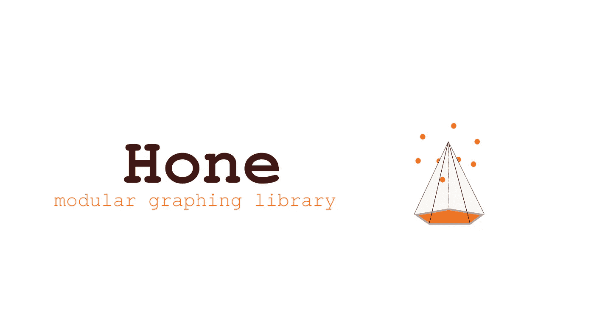

绘制数据可能非常令人兴奋，尤其是当你已经使用了一段时间的绘图功能，并且它最终以你想要的方式工作的时候。尽管仍然缺少许多参数，仍然有许多令人头痛的工作要做，但是有许多非常有前途的特性已经解决了。伴随着这些伟大的东西，第一版的《征服》也随之而来。现在您可以从 Github URL 将 Hone 添加到您的 Julia 环境中，

[](https://github.com/emmettgb/Hone.jl) [## emmettgb/Hone.jl

### 模块化的形状，网格和线条容易预制快速绘图简单和轻型车床集成(即将推出)…

github.com](https://github.com/emmettgb/Hone.jl) 

> [笔记本](https://github.com/emmettgb/Emmetts-DS-NoteBooks/blob/master/Julia/Metaprogramming%20a%20Scatterplot%20with%20compose%20(Pt.%203).ipynb)
> 
> [第一部](/metaprogramming-a-coordinate-parser-with-compose-in-julia-a0d163c6fb21)
> 
> [第二部分](/metaprogramming-a-graph-class-in-julia-90a90e8ab45b)

如果您一直关注这个小系列，您可能会记得，在上一篇文章中，我们在绘图软件中留下了两个大漏洞:

> 颜色和轴。

# 颜色

因为我们使用 meta 标签来保存我们所有的数据，所以将数据转换成字符串格式可能会非常繁琐，这使得设置形状的填充颜色比通常情况下更具挑战性。哪里有问题，哪里就有想法，我想尝试的下一个想法是把我之前的两个想法结合起来。看一下我们的 Circle 函数，我们可以看到这个特定的问题是如何在原本打算放在那里的 meta 中放了一个重要的洞。

```
function Circle(x,y,diameter,fillin)
   # composition = compose(context(), circle(x,y,diameter), fill(string(fillin))
   #     "compose(context(),circle(.5,.5,.1))
    tag = string("circle(",string(x),", ",string(y),", ",string(diameter),"fill(string(","))")
    tree() = introspect(composition)
    show() = composition
    x = x
    y = y
    update(x,y) =  string("circle(",string(x),",",string(y),',',diameter,",fill(string(",Symbol(fillin),")))")
    (var)->(show;composition;tree;tag;x;y;update;diameter)
end
```

我决定的第一件事是明确使用符号而不是字符串。我决定这样做，因为我认为这样会让我在将来出于其他目的需要调用这些对象的创建时不那么头疼。我们要做的第一件事是将我在第二部分中提到的正则表达式连接到我们的符号上。我们的符号还需要字符串类型断言，如下所示:

```
color = string("\"",string(fillin),"\"")
```

简单得很，现在我们所要做的就是重建我们的更新函数，它要么工作，要么不工作。

```
update(x,y) =  string("circle(",string(x),",",string(y),',',diameter,"), fill(", color , "),")
```

现在让我们画些东西来测试一下！

```
x = [5,6,5,5.25,5.5,5.8,5,20]
y = [7,7,4,3.8,3.7,3.8,4,20]
shape = Circle(.5,.5,.01,:blue)
b = Scatter(x,y,shape)
```

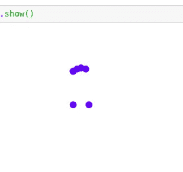

> 我可能把它画倒了…

现在让我们试着把颜色改成粉红色:

```
x = [5,6,5,5.25,5.5,5.8,5,20]
y = [7,7,4,3.8,3.7,3.8,4,20]
shape = Circle(.5,.5,.01,:pink)
b = Scatter(x,y,shape)
```

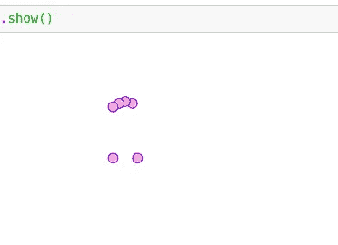

# 轴

我休息的另一个特性是绘制 x 轴和 y 轴的能力。当然，轴只是从向量 2 (0，0)到向量 2 (1，0)为 X 轴，从向量 2(0，0)到向量 2(0，1)为 Y 轴绘制的简单直线。

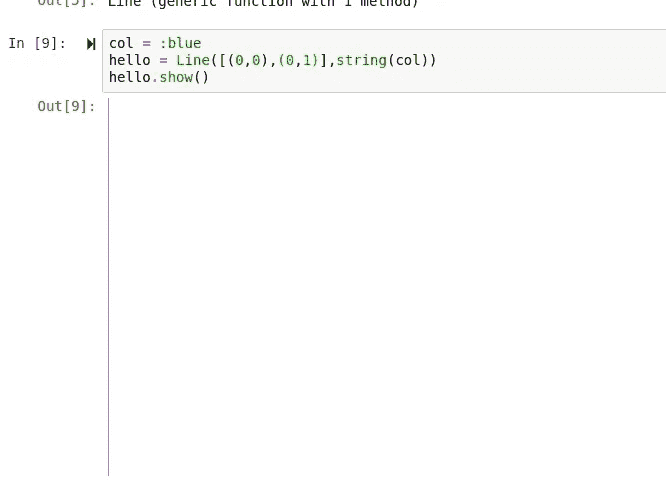

这是我们留在“Line”对象中的代码，它允许我们这样做:

```
function Line(pairs, color)
    tree() = introspect(composition)
    show() = composition
    composition = compose(context(), line(pairs), stroke(string(color)))
    pairstring = ""
    for i in pairs
        s = string(i) * ","
        pairstring = pairstring * s
    end
    update(pairs) = string("line([",string(join(pairstring)),"]), stroke(",string(color) ,")", )
    (var)->(show;composition;tree;update;color;pairs)
end
```

这个函数遵循与 shape 函数相同的自然流程，首先进行合成，然后输入元信息，然后创建一个可调用的函数，用于返回一个标签。这个函数中最突出的部分可能是迭代循环，其中创建了一个空字符串，然后与坐标位置的各个向量连接起来。之所以这样做，是因为 Julia 的 NTuple-to-string 类型断言并不像您预期的那样工作，因此一个很好的解决方法是在一个循环内将单个 dim 转换为字符串，而不是整个变量。

这段代码中缺少的另一点是改变 meta 标记内部颜色的能力。为了解决这个问题，我当然会重复使用之前改变形状颜色的方法。第一步是将这一行添加到函数的第二步，其中定义了元表达式的各个部分。

```
color = string("\"",string(color),"\"")
```

> 相当简单…

现在我们可以将该字符串添加到更新函数中:

```
string("line([",string(join(pairstring)),"]), stroke(", color, "),")
```

既然我们的 Line 对象的 update 函数实际上正在工作(我希望如此)，我们可以将逻辑添加到我们的 Scatter 类中来实际呈现线条。第一步是获取标签:

```
axisx = Line([(-1,-1), (-1,1), (1,1)],:blue)
   axisx_tag = axisx.update([(-1,-1), (-1,1), (1,1)])
    axisy = Line([(0,0), (0,1), (0,1)],:blue)
    axisy_tag = axisy.update([(0,0), (0,1), (0,1)])
```

与 Shape 对象不同，我们不能用 update 函数一致地调用同一个 line 对象。这是因为需要保留 update 函数，以便返回不会混淆整个类的内容。用不太宽泛的术语来说，如果我们要在这里添加一个回报:

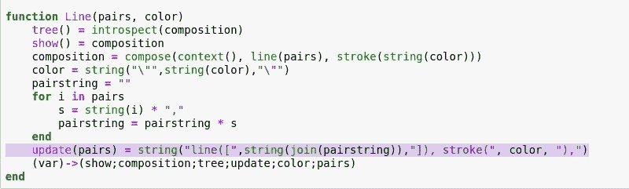

然后，当我们运行函数“Line”来创建行时，我们将从更新函数中获得返回。考虑到这一点，尝试避免每个函数都返回一个值是非常明智的，这样我们仍然可以在不妨碍函数的情况下获得标签。问题是，只有在调用上面的迭代循环时，这些对才会被更新，您可能记得这是将数据转换为字符串所必需的。

现在是简单的部分；回到我们的 Scatter 函数，我们只需要在坐标解析器完成它的工作之前向表达式添加两行标记。

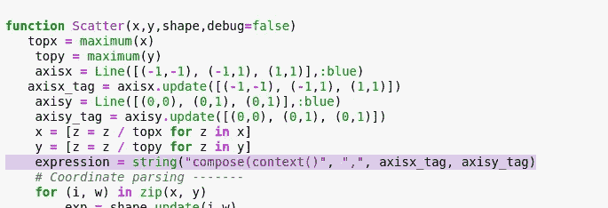

你可能已经注意到我硬编码了轴的颜色，这不是一成不变的，将来也不会是这样。在编程中，我从来不喜欢为了一个测试做不必要的事情。你可能还注意到我添加了一个“debug”参数，这只是为了让我更容易看到将要被计算的表达式，而不必添加临时打印。我认为这也可以帮助最终用户，因为这个库是模块化的，他们可能会自己构建很多东西。

> 所以让我们来测试一下吧！

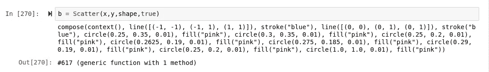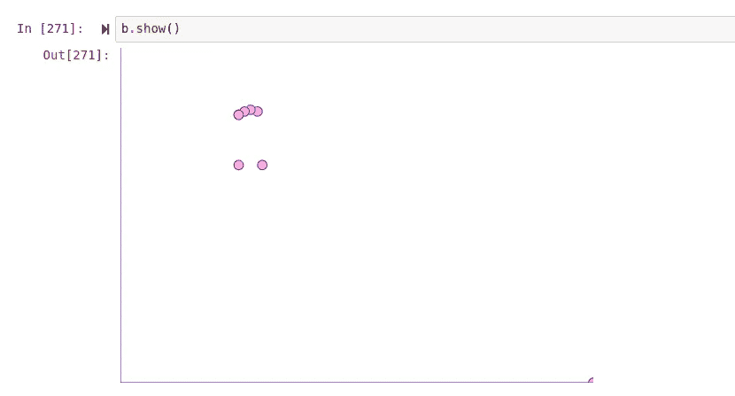

## 观察

首先，您可能已经注意到，笔画也应用到了圆上。这可能是一个简单的解决办法，我只需要给我们的表达式添加一个新的上下文。另一个值得注意的是右下角的点。这一点之所以存在，是因为否则颠倒的笑脸会正好在图的边缘。我认为这明确说明了在散点对象中作为参数的边距的必要性。

# 绘制真实数据！

既然我们的散点图起作用了，是时候用一些真实的数据来测试它了！对于这个例子，我将使用我的小“WeatherHistory.csv ”,我不知道我从哪里获得的，也不知道我有多长时间了…

> 数据狂人的症状。

像往常一样，我们需要做的第一件事是用 CSV.jl 读入数据。

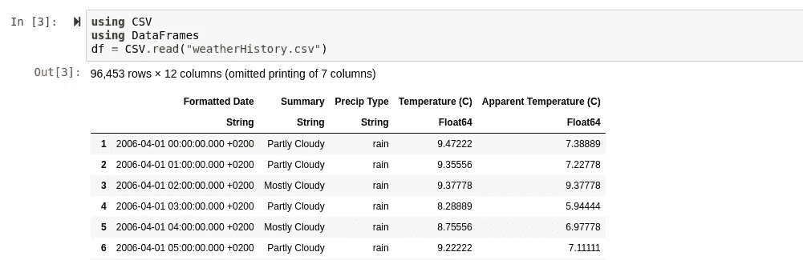

现在(不幸的是),我们需要显示参数 allcols 设置为 true 的数据。

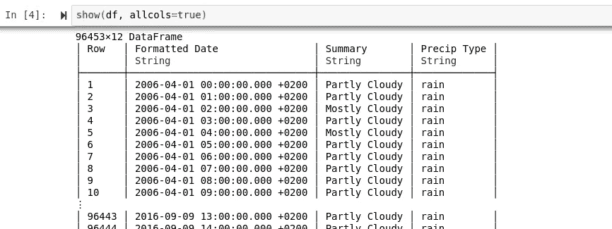

> 数据筛选开始了…

找到我想要绘制的列后，我将它们放入名为“x”和“y”的变量中供我们使用。

```
x = df[Symbol("Wind Speed (km/h)")]
y = df[Symbol("Temperature (C)")]
```

接下来，我们需要创建我们想要用来绘制点的形状:

```
shape = Circle(.5,.5,.10,:lightblue)
```

然后我们可以把它代入我们的散射函数:

```
plot = Scatter(x,y,shape)
```


> 所以…这杀死了内核，但我不能说我感到惊讶。

事实上，它不仅杀死了我的内核，我认为它也杀死了韦兰。我的终端清空了，这意味着它 CD 回到了家里，彻底关闭了我的 Jupyter 服务器。

> 很奇怪。

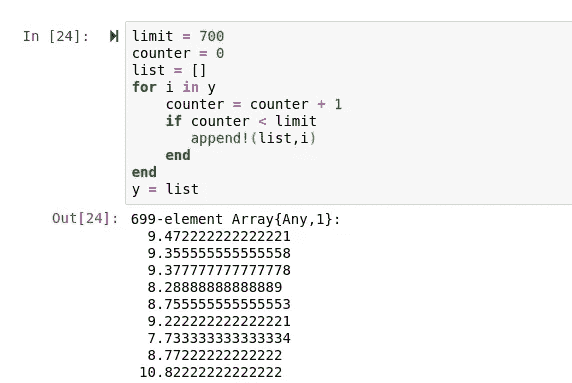

在用 for 循环将 X 和 Y 数组的 dim 数限制到 700 之后(我打赌有一个默认函数我可以使用)，我们终于有了输出！令人惊讶的是，这实际上并没有花费我预期的那么长时间。我还对函数进行了计时，这样我们就可以很好地了解计算速度和分配情况。

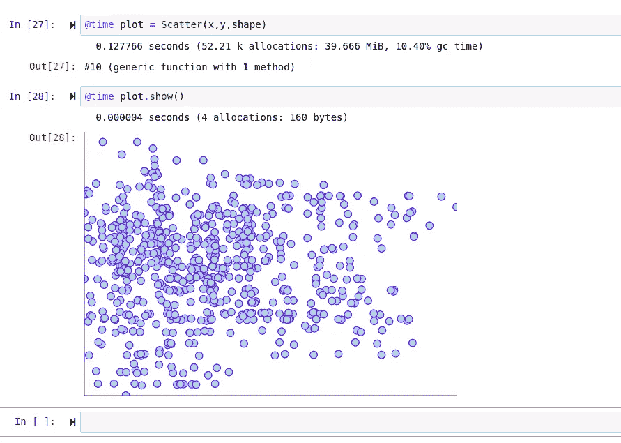

我决定做的下一件事是将它与 Plots.jl 进行比较，plots . JL 是用于在 Julia 中绘图的标准库。Plots 模块的问题在于它依赖于 GR、Plot.ly 和 Matplotlib。虽然这很有趣，因为它们都是非常不同的库，并且将它们放在一个模块中肯定很酷也很奇怪，但我不认为使用 Pythonic 代码在 Julia 中绘图对性能来说是个好主意。我做的第一件比较的事情是设置限幅器到 3000 暗，做一个相对基本的测试。结果如下:


对于 Plots.jl:

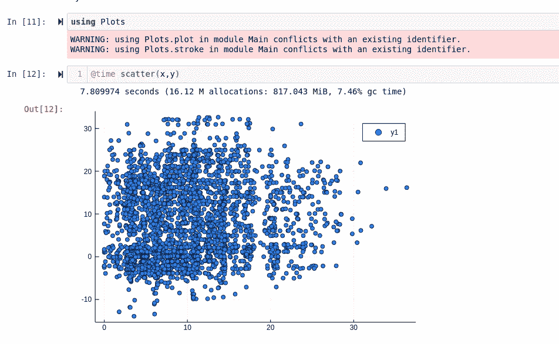

这些时间没有说明的另一件事是导入 Plots.jl 所花费的令人痛苦的时间。好消息是我的函数比 Plots.jl 快得多。虽然 clearly Plots 绘制了更多的线条，以及图例和轴标签，但我不认为从长远来看这有什么价值，尤其是在我修改函数并寻求更多优化之后。

# 结论

对于 Hone，我还有很多事情需要完成，因为它还处于生命的早期。我认为我现在所做的所有工作将会使添加新的特征和形状变得非常容易，因为所要做的只是添加一个元表达式。使用 meta 的另一个很大的优点是，每个单独的对象仍将存储在内存中，并完全可以由最终用户调整，因为它存储在 debug 设置为 true 时，您可能会想起打印的相同表达式中。我对 Hone 最大的担忧可能是性能。虽然现在我当然可以进行一些优化，但我担心大量的优化可能会导致整个模块的彻底返工，就像发生在车床上的情况一样。虽然这可能是不可避免的，因为我喜欢不断地改进我工作的软件，我非常希望不必重写模块。

刚刚绘制的阵列大约有 96，000 个观察值，这当然是一个很大的数字，

> 但应该不是不可能的。

我也打算尽我所能地挑战极限，所以从这里开始并不一定是一件好事，因为这意味着我面前可能有很多工作要做。重要的是要记住，这些也是可缩放的图形；这意味着我们可以预期，在没有拉动一些字符串的情况下，类似的光栅化输出库的性能会更差。

尽管它的问题和一些改进肯定是可以做的，我对它目前为止的表现非常满意，我期待着为这个包添加更多的功能和优化。