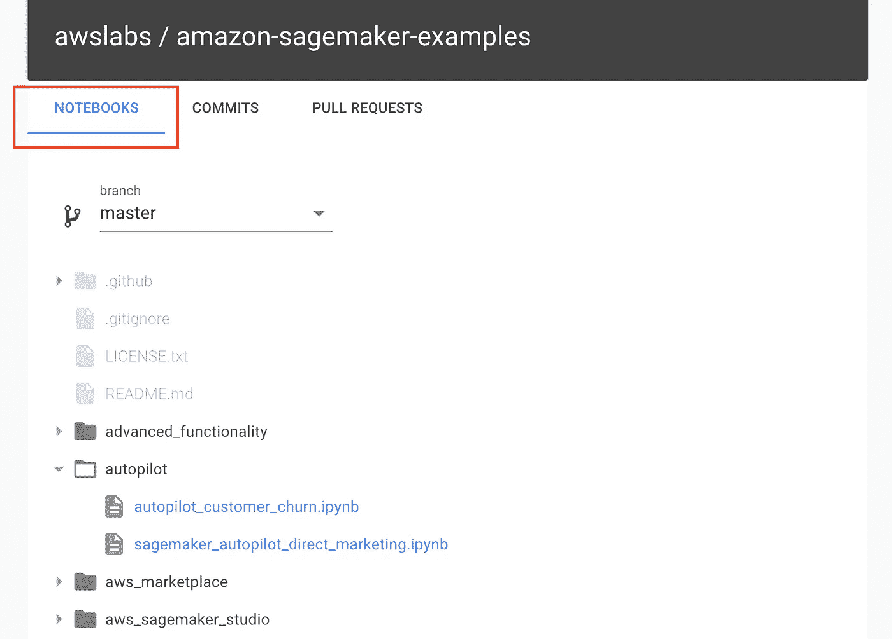
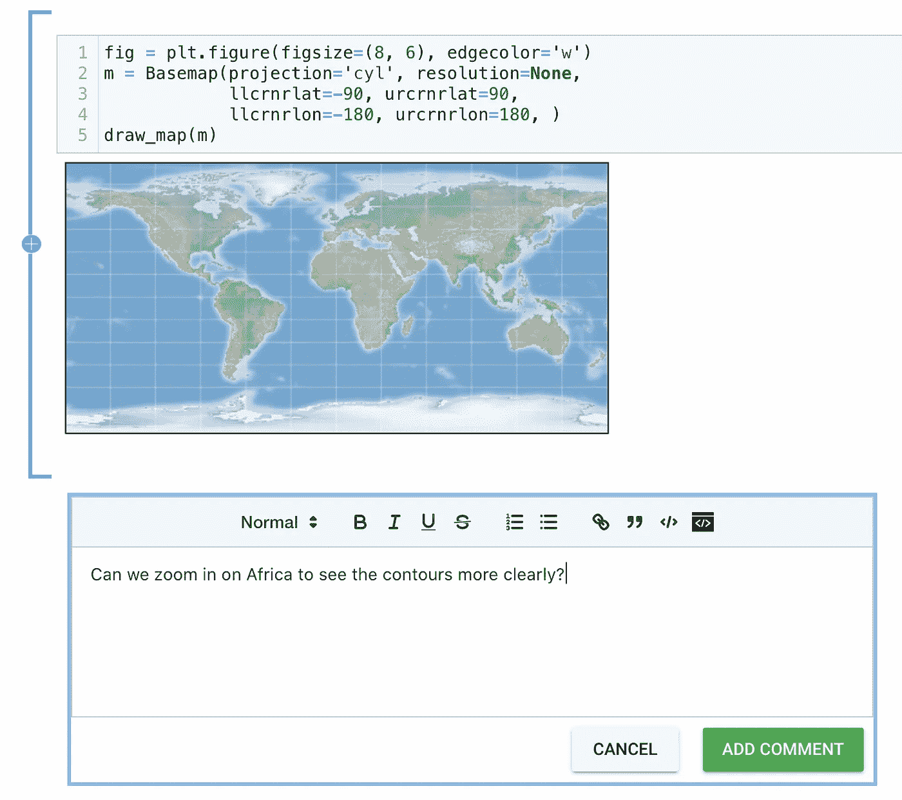
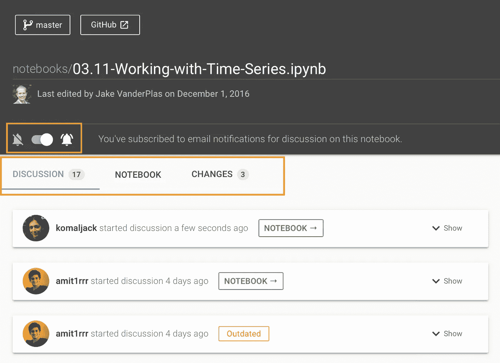

# JDoc 简介:Jupyter 笔记本上的团队对话

> 原文：<https://towardsdatascience.com/introducing-jdoc-team-conversation-on-jupyter-notebooks-78b5553d7804?source=collection_archive---------51----------------------->

## 团队在 GitHub 上查看 Jupyter 笔记本的简单方法

在 [ReviewNB](https://www.reviewnb.com?utm_source=reviewnb_blog) 中，我们已经支持 GitHub 提交/拉取请求的 Jupyter 笔记本视觉差异&评论。

**今天我们发布了 JDoc，这是一个让团队在 GitHub 上查看笔记本的简单方法。**您可以打开存储库中的笔记本&在任何笔记本单元格下开始讨论。观看此存储库或参与对话的团队成员将会收到通知(通过电子邮件),以便他们能够插话并推进对话。这个工作流程对于数据科学/ ML 团队来说非常有用，他们可以互相回顾彼此的工作，提出澄清性问题&并直接在笔记本电脑上提供反馈。

# 为什么是新功能？

我们在“拉”请求上提供笔记本审阅功能，这在许多情况下非常有效，但在某些情况下却不尽如人意。

*   **有时候你并不在乎笔记本的差异。**例如，我提交了一个新笔记本，上面有一些特别的分析&想让我团队中的某个人审阅一下。为了评审而创建一个 pull 请求有点多余，因为这个文件(新添加的笔记本)没有区别&没有*合并到主文档*工作流事后评审(特别分析)。
*   **不是每个笔记本用户都精通 Git/GitHub。要求他们创建功能分支并打开拉取请求可能有点过分。有了 JDoc，作者只需将笔记本提交给 GitHub，就可以查看了。**
*   有时你想在特定笔记本上查看**所有过去的讨论&导航到文件**的不同版本。JDoc 通过其以笔记本为中心的同行评审方法&版本控制使这变得容易。

# 它是如何工作的？

*   当您在 ReviewNB 上打开存储库时，您现在可以看到新的*笔记本*选项卡

*   您可以打开笔记本并在任何笔记本手机上开始对话

*   观看此存储库或参与对话的队友将在电子邮件中收到新的评论通知。当然，如果他们愿意，他们可以取消电子邮件通知。
*   队友可以回复/解决/开始新的对话或浏览评论。还有一个*变更*标签，显示该笔记本的版本历史。

# 需要注意的重要事项

*   有了拉式请求评论，你在 ReviewNB 上写的所有评论都会直接发布到 GitHub 上相应的 PR 上。**有了 JDoc，你写的所有评论都用 ReviewNB 保存。**这是因为 GitHub 没有提供任何直接在文件上发布注释的方式(GitHub 注释只允许在 commits/PRs 上发布)。当然，您的评论在 ReviewNB &中是安全的，存储库管理员可以请求机器可读导出他们报告中的所有评论。
*   目前，**如果您更改了存储库中的笔记本名称/路径，它将被视为一个新文件** &您将不会在其中看到旧的对话。这是因为用原始 git 数据检测文件重命名并不容易。将来，我们将提供一个 UI 来指定重命名，然后通过注释进行移植。
*   由于 JDoc 就像是 Jupyter 的 Google Docs，所以在笔记本的整个生命周期中会产生很多对话。明智的做法是积极解决/删除旧的对话，以保持文档的整洁。

# 结论

JDoc 降低 Jupyter 笔记本同行评审的准入门槛。在某些情况下，它们比拉式请求审核更有意义，例如，您想要审核新添加的笔记本，或者您只想发布最终的笔记本版本进行审核，而不关心如何实现增量更新。

拉式请求评论仍然很值得一看[视觉差异](https://uploads-ssl.webflow.com/5ba4ebe021cb91ae35dbf88c/5ba93ded243329a486dab26e_sl-code%2Bimage.png) &它们充当了讨论的奇妙容器。公关过程也有工程上的严格要求，因为最终结果是*合并到母版*。

我希望你能结合公关审查的力量和 JDoc 的灵活性，达成一个适合你的团队的平衡。

黑客快乐！

*原载于 2020 年 6 月 20 日 https://blog.reviewnb.com**[*。*](https://blog.reviewnb.com/commenting-for-jupyter/)*