# Julia 简介:数据科学中 Python 和 R 的替代方案

> 原文：<https://towardsdatascience.com/introducing-julia-an-alternative-to-python-and-r-for-data-science-dcbf98346253?source=collection_archive---------2----------------------->

## 迎接面向科学计算、数据科学和机器学习的 21 世纪编程语言。

当有人对我说，有一个新的孩子在这个街区，在这种情况下，孩子=编程语言，我有点怀疑。有一段时间，我是一个重度 Python 用户，工作时看 8 小时，在家看 3-4 小时——我喜欢它，没有理由不喜欢它。

嗯，也许有几个…


可以想象，一天中有一半甚至更多的时间在用 Python 编程的人，在尝试新语言时可能会有点怀疑。不久前，有几个人试图说服我转到 R，我真的尝试过，但不喜欢它。

**数据科学不仅仅是关于统计的**，你还必须创建 API 和其他东西，这样最终用户才能以某种方式与你所做的东西进行交互，所以对我来说，选择编程语言而不是统计语言是很自然的。但你可能不同意，这没关系。

无论如何，让我们回到主题。 ***那么朱丽亚是什么呢？*** 根据快速网络搜索，Julia 是一种由麻省理工学院创建的高级、高性能、动态和通用编程语言，主要用于数值分析。该语言的工作始于 2009 年左右，第一次发布是在 2012 年。所以这种语言到现在已经有 8 年了，不是一个短时期，但肯定没有 Python 那么长。

那是一个相当的句子。你可以把它想象成 R 和 Python 的混合体，但是更快，因为它是一种编译语言。Julia 相对于 R 和 Python 的一些主要优势是:

1.  它是编译过的——Julia 是实时(JIT)编译的，最好能接近或匹配 C 语言的速度
2.  **它可以调用 Python、C 和 Fortran 库**——是的，你没看错，我们以后会更详细地探讨这个问题
3.  **并行化**—Julia 中的并行化比 Python 中的更加精细

然而，举几个例子来说，每一个优点都有一个缺点:

1.  **数组索引从 1 开始**——这对我来说太疯狂了
2.  **没有 Python 成熟**
3.  **没有 Python 的那么多包**——但是你可以通过 Julia 调用 Python 库

好的，我只希望你还在，因为现在我们将探索 Julia 编程语言的一些关键概念。然而，首先我们应该安装语言，对吗？

# 如何安装 Julia

在这一小节中，我们将快速浏览一下安装 Julia 的过程，并为 Jupyter 设置一个内核。如果你不使用 Jupyter，请随意下载你选择的编辑器插件。

让我们开始吧。打开[下面的网址](https://julialang.org/)，点击那个写着**下载**的绿色大按钮。你将被要求指定你的操作系统，对我来说是 Windows x64，然后你可以下载文件。安装本身很简单，只需按几次**下一步**，你就可以开始了。

总之，我们还有一些工作要做。你需要打开 **Julia 提示符**，窗口应该是这样的:

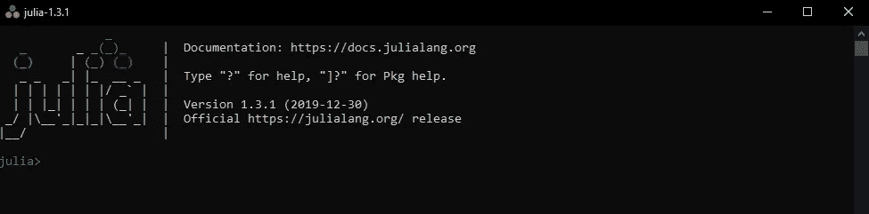

现在输入下面两行:

```
using Pkg
Pkg.add("IJulia")
```

大约一分钟后，Julia 内核将配置有 Jupyter，我们可以通过打开 **JupyterLab** 来验证这一点，现在我已经有了 Julia 解释器和 Python 解释器:

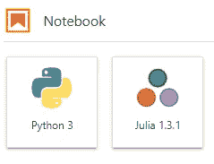

太好了，现在创建一个 Julia 笔记本，你就可以开始享受乐趣了！

# 让我们探索一下基础知识

在新创建的笔记本中，您可以像使用 Python 一样定义变量:

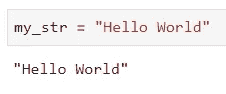

默认情况下，变量值会被打印出来，为了避免这种情况，你可以把分号(；)在最后。如果你已经注意到，字符串需要用双引号**括起来，因为单引号是为字符类型保留的。**

您可以轻松地**连接**两个或更多字符串:

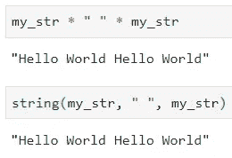

一开始乘法符号可能会很奇怪，但是你会习惯的。您还可以轻松检查任何给定变量(或值)的数据类型:

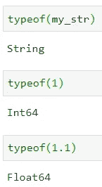

Julia 在**数组**的创建方面与 Python 类似(在某种程度上)，您不必指定数据类型或元素数量:

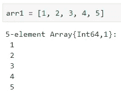

但这并不意味着你不能:

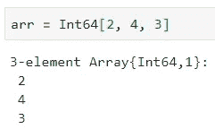

您可以用类似的方式声明**向量**，只是不要用逗号(，)分隔项目:

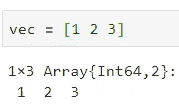

以类似的方式，你可以声明**多维数组**:

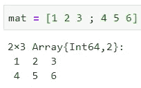

现在我们已经讲述了一些基础知识。接下来，我想快速介绍一下如何与 Julia 一起处理**数据**。

# 数据科学部分

首先，让我们安装 3 个库—用于处理 CSV 文件、数据可视化和一般数据框:

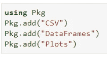

安装需要一分钟左右的时间，但安装完成后，我们必须在使用前导入它们:

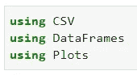

好了，现在我们准备好了。对于一些快速的数据分析，我将使用 GitHub 上免费提供的 [**虹膜数据集**](https://gist.githubusercontent.com/netj/8836201/raw/6f9306ad21398ea43cba4f7d537619d0e07d5ae3/iris.csv) 。让我们把它装进去，变点魔法:

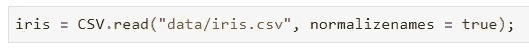

如果您想知道，`normalizenames` param 将确保列名没有任何不需要的字符，比如点(。)，这些将被替换为下划线(_)。

您可以像使用 Python 的 Pandas 库一样浏览数据。让我们看看如何获取前 5 行和后 5 行，以及快速统计摘要:

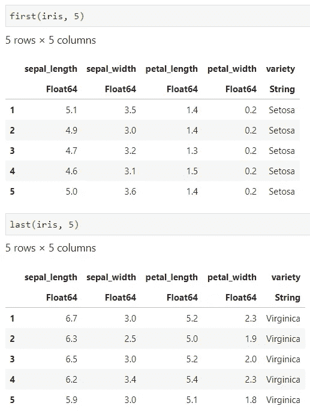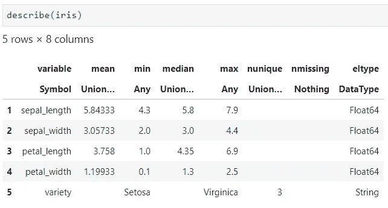

这还没有触及表面。你能想到的熊猫图书馆的任何东西，很可能在朱莉娅中有一个替代品。

是的，这种语言在策划方面也很神奇。看看这几行代码能够产生什么:

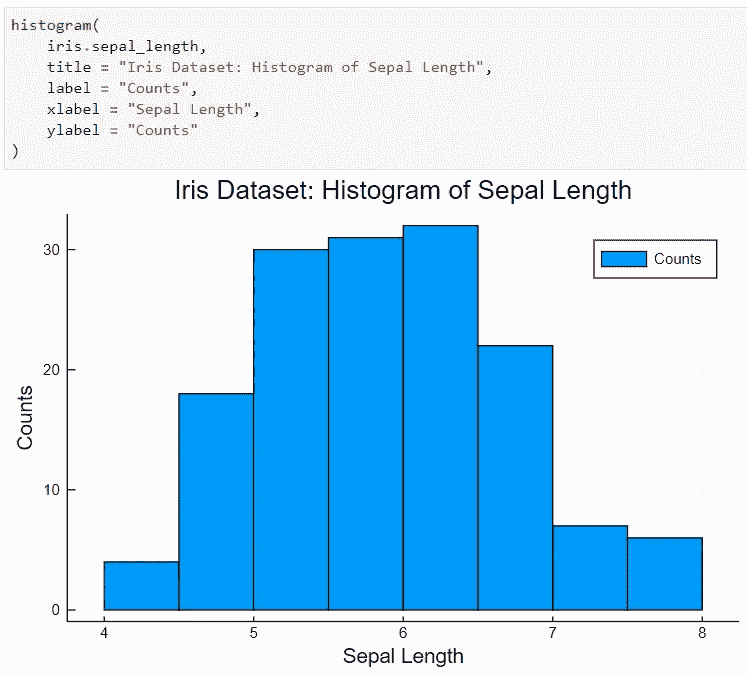

开箱即用，它看起来比我用 Matplotlib 制作的任何东西都要好。你也可以做一些新奇的事情，比如组合情节:

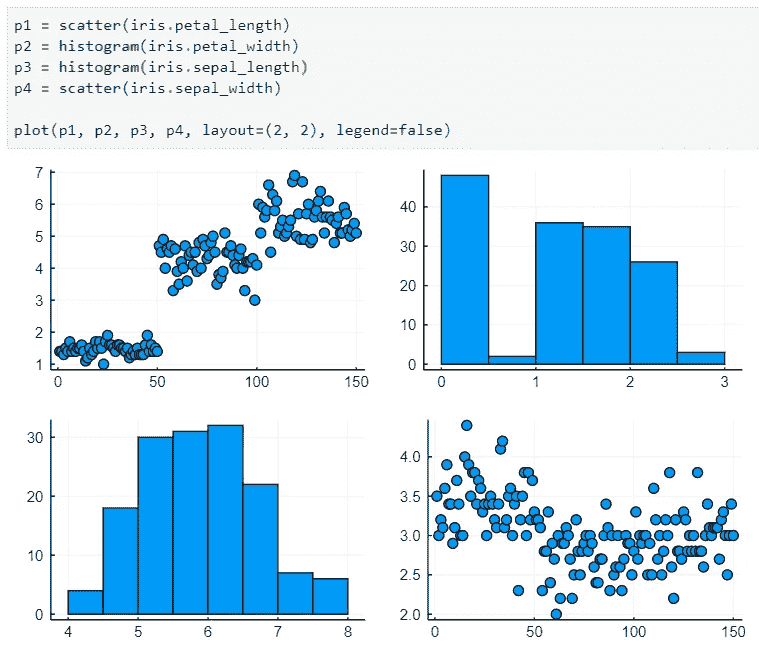

您还可以做更多的事情，但这超出了本文的范围。

# 在你走之前

毫无疑问，朱莉娅是一种令人惊叹的语言。这篇文章的目标是展示基础知识——无论是语言本身，还是它处理数据的能力。

在接下来的文章中，我将更深入地关注各个部分，同时考虑它与 Python 的不同之处，以及我认为这种不同是积极的还是消极的。现在，我要说的是，**数据可视化**功能远远超出了传统 Python 可视化库所能提供的。

我在其他问题上的立场如何，嗯，你将不得不继续关注来找出答案。感谢阅读。

*喜欢这篇文章吗？成为* [*中等会员*](https://medium.com/@radecicdario/membership) *继续无限制学习。如果你使用下面的链接，我会收到你的一部分会员费，不需要你额外付费。*

[](https://medium.com/@radecicdario/membership) [## 通过我的推荐链接加入 Medium-Dario rade ci

### 作为一个媒体会员，你的会员费的一部分会给你阅读的作家，你可以完全接触到每一个故事…

medium.com](https://medium.com/@radecicdario/membership)