# 介绍 Label Studio，数据标签的瑞士军刀

> 原文：<https://towardsdatascience.com/introducing-label-studio-a-swiss-army-knife-of-data-labeling-140c1be92881?source=collection_archive---------4----------------------->

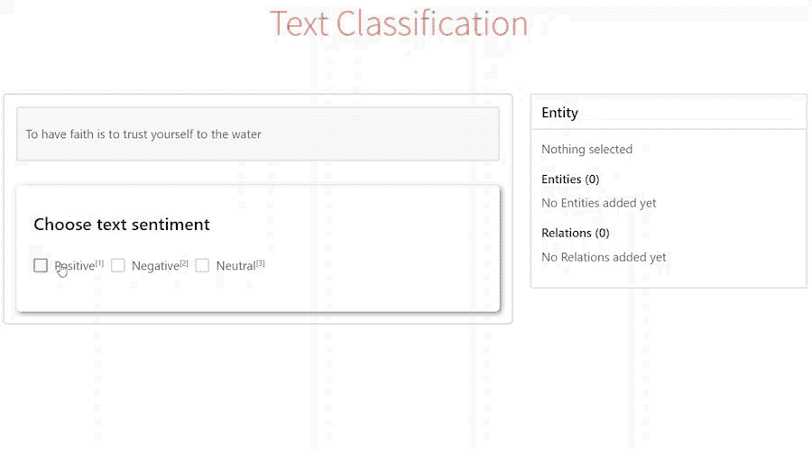

## 专业的机器学习工具是构建成功的基于 ML 的产品的基础和脚手架。

当我在一家企业从事个人虚拟助理项目时，我自己也经历过工具的缺乏，这个项目被大约 2000 万人使用。我们的团队一直在寻找提高质量、处理边缘案例和测试假设的方法。这通常需要处理非结构化数据，对其进行标记，直观地检查和探索模型预测。我们将一套内部工具拼凑在一起，用**成吨的样板代码工作一次**。不用说，共享这些工具或试图扩展它或将其嵌入到主应用程序中几乎是不可能的。

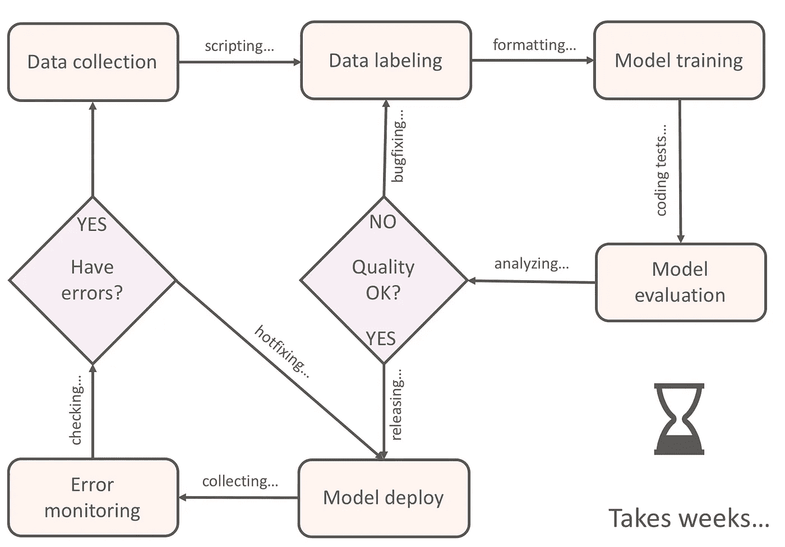

一次又一次

而且，这个过程是关于产品的**定量分析**。在试图改进模型时，机器学习工程师严重依赖于在固定数据集上计算的精度/召回统计数据，而忽略了该数据集如何与实际的真实世界数据保持一致。最终，它会导致生产中的系统误差，这只能通过**定性分析来识别，即**用你的眼睛观察模型的预测。

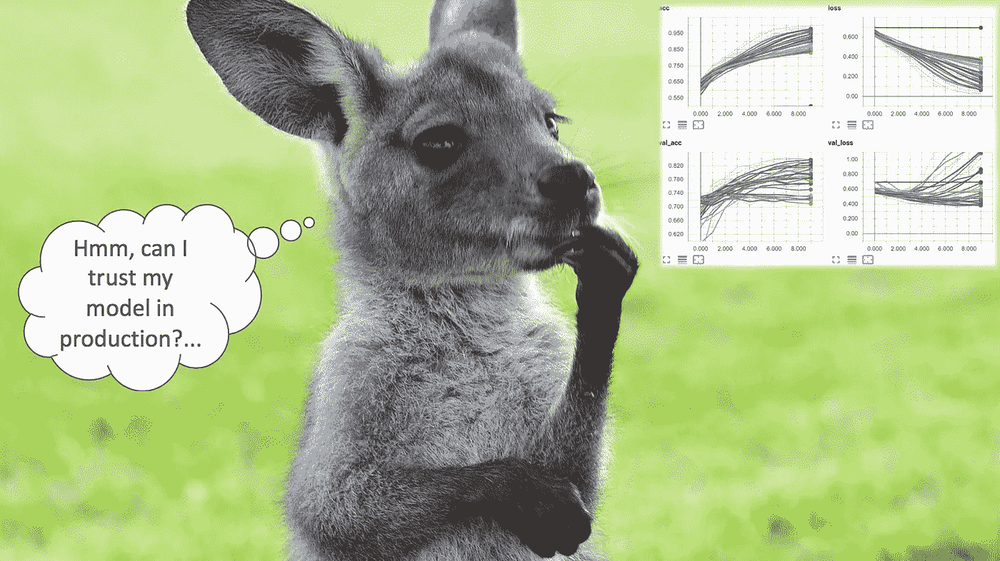

在生产中我能信任我的模型吗？照片由黛比·兰福德拍摄

我和几个朋友在想，我们能做得更好吗？Label Studio 就是这样诞生的。它旨在**为个人机器学习实践者节省原型/实验时间**，以及**为技术团队缩短 ML 产品发布生命周期**。

我们在工作时遵循的一些原则是:

*   **化繁为简。**没有复杂的配置，易于集成到机器学习管道中。Label Studio 可以在不同的地方使用，具体取决于使用情况:

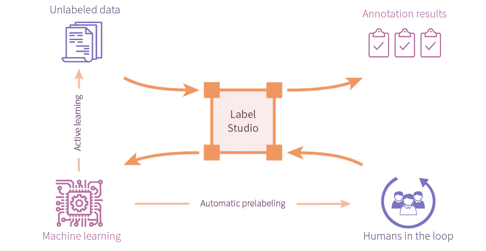

*   **可快速配置多种数据类型。10 分钟内准备好工具。应该有一种简单的方法在标记文本、音频或图像之间切换，甚至同时注释所有三种类型。**

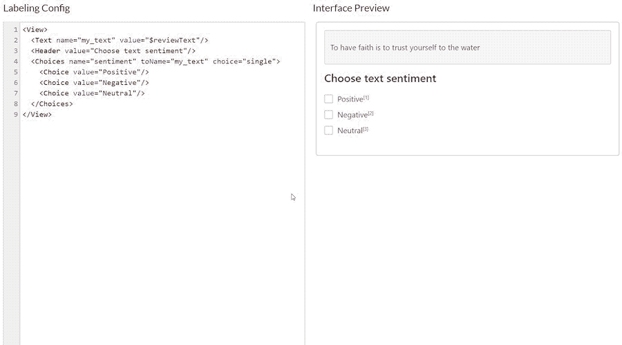

在左侧面板中添加组件，并立即预览界面和输入/输出。

*   **机器学习集成。**它应该能够集成所有过多的机器学习框架和模型。ML 有许多不同约束的应用，Label Studio 必须足够灵活来处理它们并提供帮助，而不是复杂化。

> 如果这听起来很有趣，让我们安装它，让你开始运行！

# 我们开始吧

启动 Label Studio 非常容易:

```
pip install label-studio
label-studio start my_project --init
```

它会自动在您的浏览器中打开 web 应用程序。只需配置您想要标记的内容和方式。就是这样。

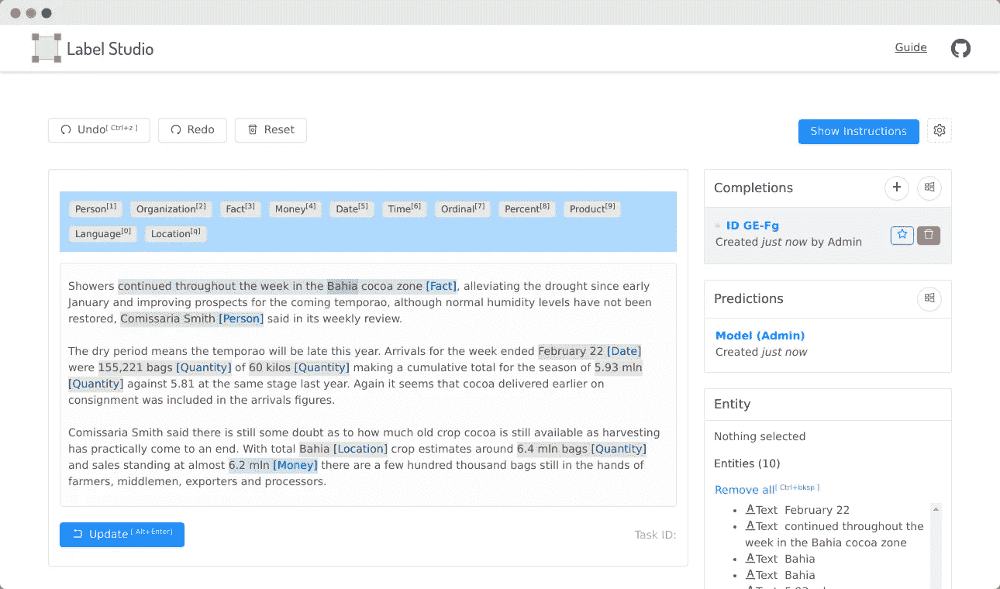

文本的命名实体识别

许多现有的标记框架只接受一种数据类型，每次学习一个新的应用程序变得很乏味。开箱即用 Label Studio 处理**文本**、**图像**、**音频**、 **HTML 文档**(称为*对象组件*)，以及任何可以想象的注释任务组合，如**分类**、**回归**、**标记**、**跨越**、**成对比较**、**对象检测**、“

> 让我们来探索如何为您的用例配置 Label Studio 服务器

**配置贴标界面**

Label Studio 的界面不是预先构建的。相反，你可以自己创建它，就像创建网页一样。但是你得到的不是 HTML 标签，而是基于 jsx 的组件。不要害怕！除非你想，否则你不需要写 JavaScript。组件知道如何根据它们的类型和名称进行连接。这是一个图像分类的例子，其中通过使用 **toName** 属性指定名称，将**选择**(注释组件)连接到**图像**(对象组件)。

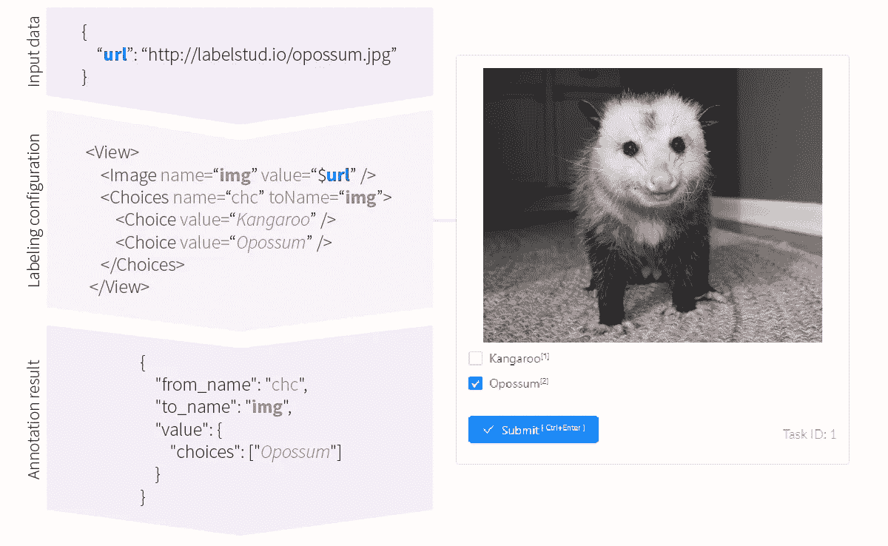

用预期的输入和输出标记配置

注意美元符号变量 *$url* 。它指定该组件的值来自您的数据集，它期望带有关键字 *url* 的记录提供图像的 url。前进到[设置](http://127.0.0.1:8200/setup)页面，用我们在那里的例子玩一玩。或者如果你还没有在当地经营，你可以去看看[游乐场](https://labelstud.io/playground/)。

目前，大约有 20 个组件涵盖不同类型的标签，例如，图像的 Bbox 或文本的 NER。完整的列表可以在[网站](https://labelstud.io/tags)上找到。

**数据导入和导出**

配置好标注界面的外观后，您可以导入数据。web 导入支持多种格式:JSON、CSV、TSV 以及由这些格式组成的档案。您想要标记的每个数据点被称为一个**任务**。如果您的任务包含图像，您必须将它们保存在某个地方，并在数据键中公开 URL，就像上面例子中的`{"url": "https://labelstud.io/opossum.jpg"}`。然后，任务被加载到标签界面，等待您对其进行标签。

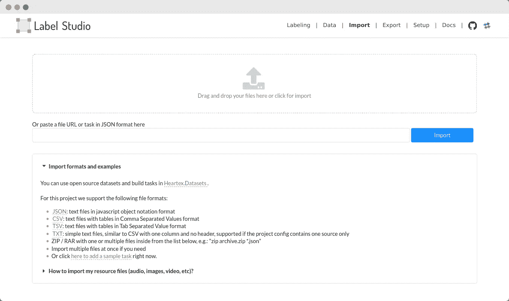

直接从文件系统导入数据集或使用 URL 上传，S3 集成即将推出

使用[标签-工作室-转换器](https://github.com/heartexlabs/label-studio-converter)完成输出。这是一个库，可以采用基于内部 Label Studio JSON 的格式，并输出一些通用格式(JSON、CSV、TSV)或特定于模型的格式，如用于文本标记的 **CONLL** 或用于计算机视觉模型的 **Pascal VOC** 或 **COCO** 。

底层存储是普通文件。这使得集成变得非常容易，您只需要将数据放入 Label Studio 可以解析的格式中。您可以在[网站](https://labelstud.io/guide/format.html)上找到更多关于格式的信息。

> 好吧！现在你有了数据，你知道如何标记和如何导出，让我们来看几个用例，如何将 Label Studio 集成到你的管道中。

# 功能和使用案例

Label Studio 首先是一个数据标注工具，这使得它非常适用于所有基本的数据标注活动，如标注整个数据集或**创建用于验证的基础事实标签**。除了这些基础知识，这里还有一些对其功能非常独特的用例。

**嵌入你的应用**

对于某些应用，你能得到的最好的标签之一可能来自你产品的用户。你可以要求他们从头开始标记任务，或者提供一个模型预测并请求调整它。然后利用它来不断更新模型和提高应用程序的效率。

Label Studio 的独特之处在于，它是一个前端 [NPM 包](http://github.com/heartexlabs/label-studio-frontend)，可以包含在你的应用程序中。这里有一个例子:

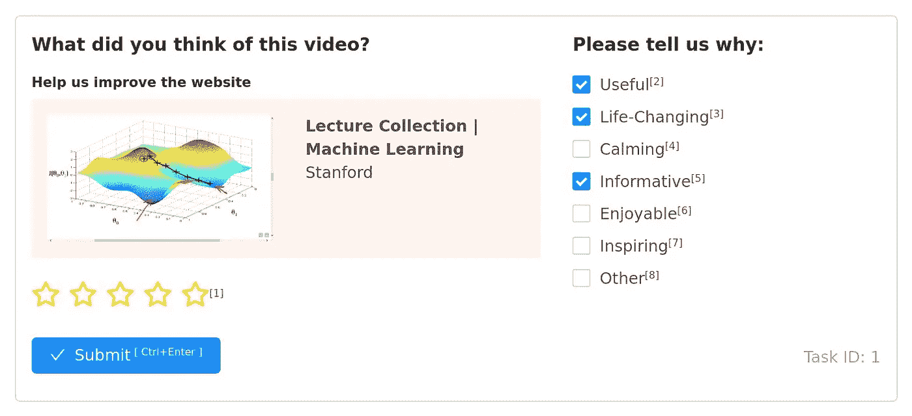

收集用户反馈，灵感来自一个流行的视频共享服务

这里可以现场查看[。或者看看](https://ls-pub.s3.amazonaws.com/ls_feedback_embed.html)[要诀](https://gist.github.com/deppp/32c557f541821152eb2f3f59c2fc42e7)的来源。可以保存在本地，在浏览器中打开！

**机器学习集成，连接模型**

你可以通过使用 [SDK](https://github.com/heartexlabs/pyheartex) 轻松地将你喜欢的机器学习框架与 Label Studio 连接起来。

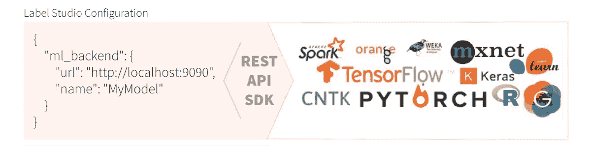

SDK 创建可通过 URL 访问的微服务。它的框架是不可知的，并提供了集成示例。

这让你有机会使用:

*   **自动贴标。**使用模型预测标注数据。通过任务**预标记**，以及使用**伪标记**进行进一步训练，有助于更快地进行注释
*   **不断学习。**从数据流中持续注释和训练您的模型，潜在地改变注释目标
*   **主动学习。**实现对要标记的任务的[更智能选择](/learn-faster-with-smarter-data-labeling-15d0272614c4)的技术
*   预测服务。即时创建和部署 REST API 预测服务

要了解更多关于起床和跑步的信息，请查看[自述文件](https://github.com/heartexlabs/label-studio#machine-learning-integration)中的示例。

**比较预测**

您可以将来自不同模型体系结构或版本的多个预测加载到界面中，直观地验证、查找差异，并编辑您的模型所预测的内容:

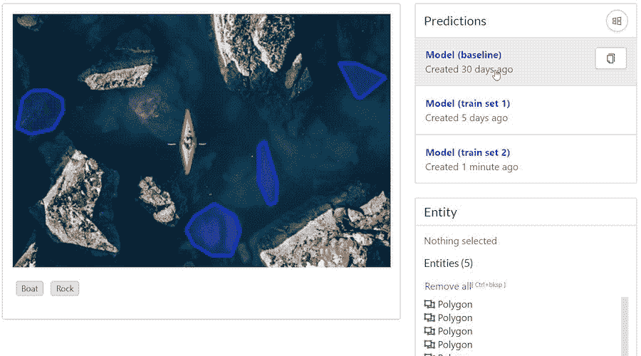

来自不同模型的预测，并排比较它们

# 甚至更多

我们只讨论了我们自己发现令人兴奋的少数几个用例，以及我们看到 Label Studio 可以提供优于现有解决方案的优势的地方，但在我们撰写下一篇文章时，这里还有一些想法供您探索:


**监控模型预测误差**

你能永远相信你的模型预测吗？您如何理解什么时候是重新培训和重新部署模型的好时机？您可以将 Label Studio 集成到模型监控管道中。与上面的示例一样，您可以显示模型预测的多个版本，并检查预测质量是否有所下降。

**(循环)预测管道中的人类**

对于预测质量至关重要的应用，当模型不确定或充当低精度检测器时，可以使用 Label Studio 来调整模型预测。在这些场景中，模型预测首先被发送给注释器，注释器可以手动调整它。

**从多人那里收集结果**

Label Studio 支持每个任务多个结果(称为完成)，如果您需要将同一个任务分发给许多注释者，然后验证或组合他们的结果，这是非常有价值的。它的工作方式类似于模型预测可视化，不同之处在于可以将完成设置为基础事实并进行编辑。

**增量数据集标注**

在将模型部署到生产环境中之后，或者在开发它的过程中，您可能会意识到多标注一个属性可以增强模型的结果。这可能是您想要测试的假设或预定义的策略——从少量属性开始，随着时间的推移添加更多属性。您可以使用 Label Studio 进行增量标注:修改标注配置并随时添加新类。

# 后续步骤

这仅仅是一个开始。我们计划覆盖越来越多的数据类型，并实现更多覆盖不同标签场景的组件。

*   访问 GitHub 上的[主库](https://github.com/heartexlabs/label-studio)
*   探索我们为一些流行的贴标案例创建的模板[https://labelstud.io/templates/](https://labelstud.io/templates/)
*   检查标签[https://labelstud.io/tags/](https://labelstud.io/tags/)
*   尝试[运行一个演示](https://app.labelstud.io/?ref=medium),您可以在浏览器会话中创建持久的注释运动场

我们总是很乐意了解更多可能的人在回路中的用例，并期待在 Label Studio 中实现它们。如果您有建议和/或反馈，请通过在 [GitHub](https://github.com/heartexlabs/label-studio/issues) 上发帖或加入我们日益壮大的 [Slack 社区](https://docs.google.com/forms/d/e/1FAIpQLSdLHZx5EeT1J350JPwnY2xLanfmvplJi6VZk65C2R4XSsRBHg/viewform)与我们分享！

快乐贴标签！