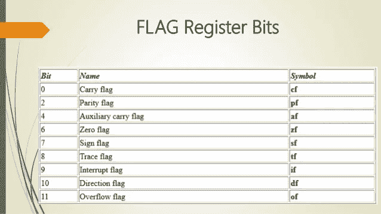
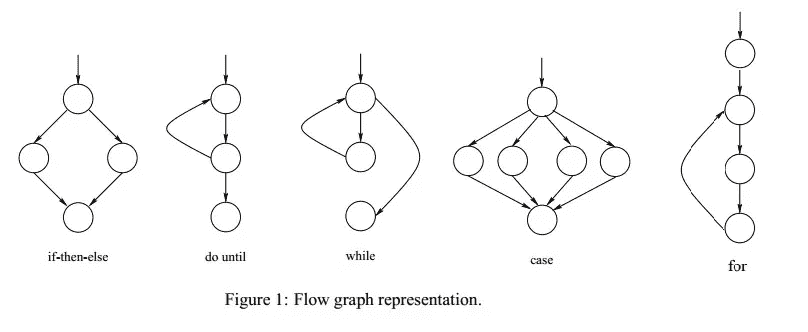

# Leya 简介:元统计 Lisp 类语言

> 原文：<https://towardsdatascience.com/introducing-leya-the-meta-statistical-lisp-like-language-ef9012affbdb?source=collection_archive---------31----------------------->

## 我正在创造我梦想中的语言。


在过去的几周里，我一直在享受 GNU Common Lisp 的强大功能。在 Common Lisp 中，所有代码都包含一个列表，它是 list 中的一个数据类型。本质上，Lisp 程序只是列表中的一系列参数。首先，这使得 Lisp 成为元编程极其可行的语言。Lisp 的宏进一步增强了这种效果。Lisp 的宏使得从语言内部调用子进程和使用代码作为数据类型变得非常容易。这当然是非常有效的，不仅可以使你的代码干净、简洁、易读，而且可以自动化。

我正在构建的语言 Leya 是一个将这种方法论发挥到极致的计划。Lisp 很棒，但我确实不喜欢 Common Lisp 的某些地方:

*   包裹绝对是一种痛苦。我想有一个简单的结构类似这样的导入功能:

```
(import :package)
```

在 Lisp 中，添加包绝对是一场噩梦。当然，这不一定是 Lisp 的错，因为这种语言是在 1958 年创造的，但这肯定是一个缺点。包作为一个简单的文件存储在任何外部环境的本地，并且必须直接从源代码加载。如果不考虑安装在系统范围内的 lib-dependency(例如-lib-SDL 2)不能在 Lisp 中使用，这可能并不奇怪。有替代方案，比如 beta 版 Quick Lisp 包，但是这些肯定不能替代一个有效的包管理器。

*   Lisp 实际上可以快得多，只要在后端做一些性能上的调整。

Lisp 具有强大的统计能力和惊人的速度！对于数据科学来说，这两者可能是致命的组合。事实是 Lisp 实际上可以比现在快得多。要理解这是为什么，我们需要理解一个叫做控制流的概念。每种语言都有一个控制流，控制流既可以“跳转”，也可以根据具体情况忽略。跳转是这里的关键词，因为无论何时进行跳转，程序的控制流都会随之改变。

默认情况下，控制流是垂直的，每个部分从 1 开始向上计数。这里有一个例子，写在 NASM 编译的汇编里:

```
_start:; Allocate our memory; Get the current brk address
        mov rax, 12 ; brk
        mov rdi, 0
        syscall; rax => alloc_ptr && heap_start
        mov [alloc_ptr], rax
        mov [heap_start], rax; (Allocate memory)
        mov rdi, rax
        ; 64 == 9 million;
        add rdi, 1000000; Syscall
        mov rax, 12
        syscall; Read the source code into memory
;   VVVVVVVVVVVV Recreate this with call reading_loop attached
;            for read evaluate print
    reading_loop:; Read from stdin
        mov rax, 0
        mov rdi, 0 ; stdin
        mov rsi, [alloc_ptr]
        mov rdx, 100000
        syscalladd [alloc_ptr], raxcmp rax, 0
        jne reading_loop
    ;   call reading_loop
    ; After the loop:; Save the end of the program
        mov rax, [alloc_ptr]
        mov [program_end], rax; Add a null terminator
        mov byte [rax], 0
        inc rax; Align pointer
    align_loop:
        mov rdi, rax
        and rdi, 0
```

> 好吧，这看起来像很多代码。

但是为了理解控制流，我们只需要看几个例子。每当调用“_start:”时，控制流被设置为降序，一个包含数字 0 的字节被放入内存。在“_start:”完成后，由于没有跳转或调用，控制流将继续下降，当它完成与内核的 syscall 通信时，它将进入位置 1:“reading _ loop:。”

在读取循环的最后，我们会看到三个命令:add、cmp、jne。首先，add 是做什么的？Add 将把我们在。bss 部分或。数据段添加到注册表 rax，它是 64 位高位注册表中的第一个位置。下一个命令 cmp 是 compare 的缩写。这将比较两个值，并根据标志的结果更改标志。在这个特殊的例子中，我使用存储在字节 0 的注册表标志，CF 标志。



(img src:[https://www . slide share . net/safayethossain 3/assembly-flag-resister](https://www.slideshare.net/safayethossain3/assembly-flag-resister))

最后但同样重要的是 jne，这是一个条件跳转。如果满足这个标志，那么 jne 命令将通过将控制流保持在位置 1:“reading _ loop:.”来将控制流变成一个圆形

控制流实际上驱动了我们在日常语言中使用的大多数东西，以及我们使用的每个高级工具，例如循环、条件等。实际上通常会使用非常特殊的控制流。



(img src:【https://dzone.com/articles/how-draw-control-flow-graph】T2

当然，控制流不仅对我们想要做的事情非常重要，对性能也非常重要。你可能听说过 for 循环，一般来说，非常能够坦克性能。这是因为 for 循环使用至少四个位置的组合，并将根据添加的数据字节进行条件跳转(将字符长度存储在内存中，并将 cmp 值保存在内存中，循环数。)这意味着每次不满足最终迭代条件时，控制流将减少 2。假设我们在位置 3，每次 for 循环没有完成，我们就跳到位置 1，重复这个过程。

很明显，有很多方法可以通过调整控制流来提高性能。这个方法其实是朱莉娅想出来的，所以我不能居功；每当汇编编译器调用自身时，控制流就会不断地循环。这意味着在语言内部运行比汇编语言更有性能。这是因为汇编的进程在执行前由处理器读取。这类似于大多数语言的编译方式。

然而，当语言中最常用的核心函数是用语言本身编写的时候，就可以在运行时进行调用，而不需要另一次汇编。所以我们的目标是在一个单独的线程上运行一个已经分配、加载并标记了内存的代码。

# 结论

作为一种类似 Lisp 的语言，Leya 编程语言拥有 Lisp 的所有优点。轻松编译，用汇编器只汇编 3000 行左右的代码，一切都是列表，还有用宏进行元编程的轻松和流畅。

创建一种与另一种语言做同样事情的语言是有点愚蠢的，尽管我会第一个说构建编译器使我在汇编和编程方面做得更好。实际上，有一本有趣的书叫做《用 C 语言构建你自己的 Lisp 》,如果你想学习 C 语言，我建议你去看看。构建 Lisp 不仅能让你更好地学习 C 语言，或者帮助你学习 C 语言，而且我认为它还能让你更接近许多理解起来非常重要的计算机科学基础。

“Leya”这个名字的本意是解释它自己，而这种语言的构建意图完全不同:

> 机器学习的快速元编程。

“Leya”这个名字来源于术语 Lemma，它是一个论证或证明中的数学分离，也是中间的。这是我的原话，但这是谷歌的定义:

> "论证或证明中的附属或中间定理."

这非常类似于编程中的宏指令。Y 来自于我们都知道并且喜爱的 Y，我们算法的目标。

因为 Lisp 是轻量级的，易于编译，所以 Lisp 是一种非常快速的编程语言。Lisp 通常被认为不能像 C 那样使用，但是它的语法非常高级，很容易习惯。Lisp 最难的一点是，为了使用它，你必须直接从传统的角度来思考所有的事情。从回报开始，一直到价值。通常我只在一个值被循环使用的特殊情况下设置一个变量，以避免多次计算。

感谢您阅读到最后，如果您想了解 Leya，请访问 Github:

[](https://github.com/emmettgb/Leya) [## emmettgb/Leya

### Leya -火烈鸟的官方编程语言。通过在…上创建帐户，为 emmettgb/Leya 的发展做出贡献

github.com](https://github.com/emmettgb/Leya) 

每天都有越来越多的问题涌现出来，慢慢地，但肯定地，问题正在得到解决。截至目前，我有大约六个项目，我一直在工作，所以开发一直很慢(请放心提交！)但是希望到最后，这种语言是我所有数据科学需求的理想选择。