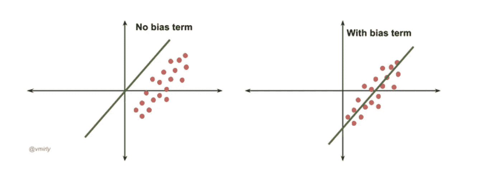
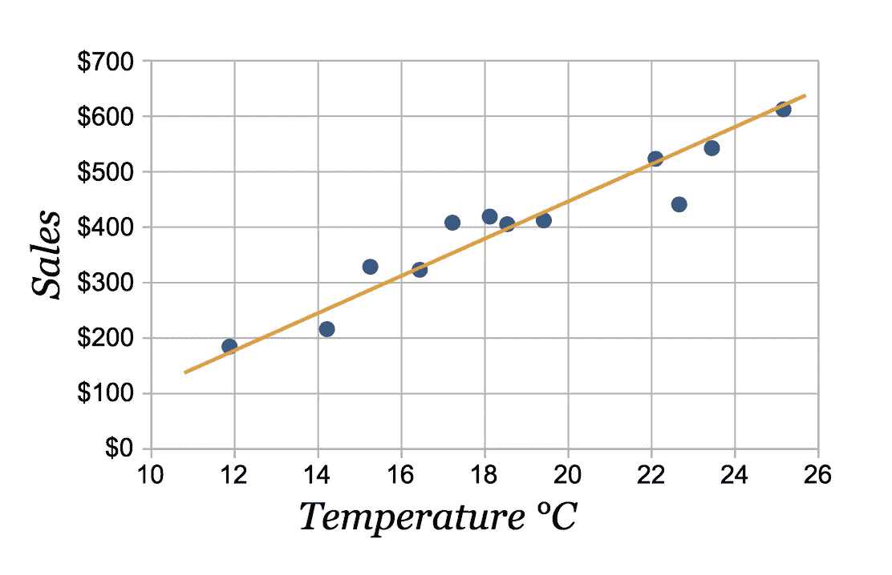
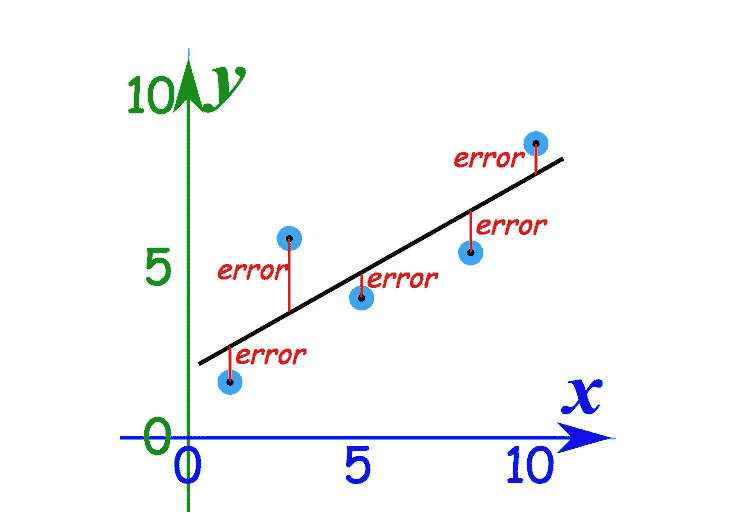
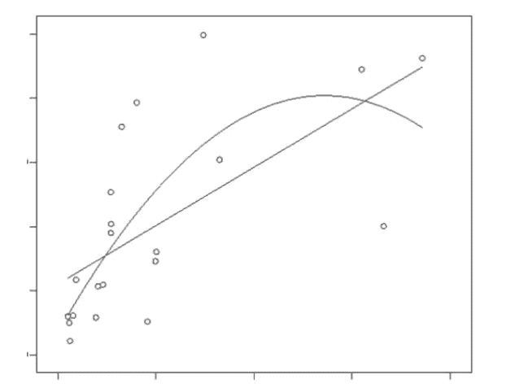

# 简单介绍线性回归(最小二乘法)

> 原文：<https://towardsdatascience.com/introducing-linear-regression-least-squares-the-easy-way-3a8b38565560?source=collection_archive---------28----------------------->

## 编码前理解

杰克·布吕克在 [Unsplash](https://unsplash.com/search/photos/logistic?utm_source=unsplash&utm_medium=referral&utm_content=creditCopyText) 上的照片

线性**最小二乘**监督拟合技术是最简单和最常用的线性回归形式，为通过一组点找到最佳拟合直线的问题提供了解决方案。

> 我们的一般线性回归模型看起来像这样-
> 
> 输入是一个特征向量 ***(x1，x2，⋯，xk)***
> 输出是一个标量 ***y***
> 该模型将输出与输入特征向量以线性关系联系起来:
> 
> ***y = w0+w1 * x1+w2 * x2+w3 * x3+…+wk * xk***
> 
> w0 是**偏差**。
> 
> **我们为什么需要偏置？**
> 
> 在线性回归中，如果没有偏差项，我们的解必须经过原点。也就是说，当我们所有的特征都为零时，我们的预测值也必须为零。然而，这可能不是训练数据给出的答案。添加不依赖于任何特征的偏置权重允许由学习的权重描述的超平面更容易拟合不经过原点的数据。

偏置与无偏置

简单线性模型

现在，考虑一个非常基本的两变量线性模型。*温度*是自变量，我们希望找出温度对*销售*(因变量)的影响。

这 12 个数据点是(x，Y)的形式。x 坐标代表以摄氏度为单位的温度，Y 坐标代表以美元为单位的销售额。第一步是**将数据**可视化——绘制成图表(如上图所示)。在这种情况下，绘图是可能的，因为我们只考虑两个变量。

我们的目标是找到一条线，它是最适合上述数据的*，如上图所示。*

## *这条最佳拟合线是如何计算的？*

*任何一行都具有以下形式:*

> *y = mx +c*

*其中 *m* 为直线的斜率(逆时针计算直线与 *x* 轴所成角度的**tan**)*c*为 *y* 截距。*

*这里 *y* 表示特定温度下的销售额 *x.**

*因此，我们的 ***最佳拟合*** 线也将是 *y = mx + c.* 的形式*

*考虑第一个数据点(x1，Y1):*

****x1*** : *实际*温度值，单位为摄氏度*

****Y1*** : *实际*销售金额对应 *x1**

****y1 = m * x1+c***:*根据最佳拟合线预测 *x1* 对应的*销售值*

> *E1 = y1 — Y1*

****E1*** 是第一个错误术语。*

**

*计算单个误差*

## *注意:在统计学中，当我们使用术语“线性模型”时，我们不一定描述一条直线。*

> **图中的两个形状都是“线性的”:**

**

*哪个是线性的？*

> **“线性”在统计学中是用来描述我们正在使用的模型中的参数。线性意味着响应(y 变量)预期是解释变量(离散或连续)的线性组合。线性是指解释变量是可加的。**
> 
> *当我们说模型是线性的时，这种说法实际上是不完整的。线性回归需要指定和检查的是，如果模型是线性 w . r . t .**参数** *(w0，w1，w2，…，wk)。**

*回到错误上来。我们的目标是减少这些误差，从而最小二乘误差。*

## *为什么我们使用“平方”误差，而不是误差的高次幂或绝对值？*

*这里有两个原因:*

1.  *随着功率的增加，异常值的误差会放大更多。结果，越多的“最佳拟合”线将被拉向异常值，这将不再是最佳拟合。*
2.  *最小化一个二次函数很容易——你只需要对它求导并将导数设置为零，这就产生了一个线性方程——我们有几个世纪的技巧来帮助我们解决这个问题。*