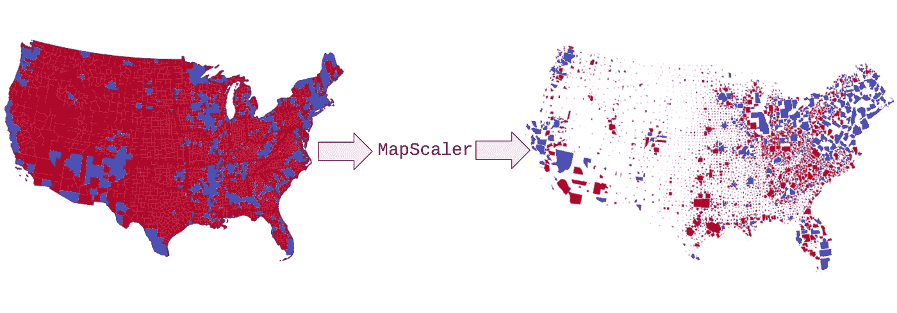

# 通过缩放区域来直观地传达基础数据，从而提高地图的可视化效果

> 原文：<https://towardsdatascience.com/introducing-mapscaler-42a57e68aead?source=collection_archive---------36----------------------->

使用 mapscaler 按人口或任何其他值缩放州或县，以实现 choropleth 数据可视化

## 如何根据人口或任何其他值缩放州或县，以实现 choropleth 数据可视化

许多使用颜色作为维度的地图可视化具有误导性。

社交数据经常被放在地图上(一个 choropleth)，并用颜色来表示一些活动或行为。问题是，数据往往是关于**人**，但在读者眼里，地图本来就是关于**地区**的。地图上最大的区域吸引了读者的注意力，而忽略了数据中有多少人与该区域相关。如果你显示的数据恰好是按区域标准化的，比如人口密度，这没什么，但是这通常不是我们可视化的目标。

> 问题是，数据往往是关于**人**，但在读者眼里，地图本来就是关于**地区**的。

有时[图表](https://en.wikipedia.org/wiki/Cartogram)是更好的选择，但是大多数图表要么扭曲[难以辨认](https://en.wikipedia.org/wiki/Cartogram#/media/File:Cartlinearlarge.png)，要么高度手工创建。因此，**我创建了一个 Python 包，通过任何变量自动缩放任何地图的各个部分，没有任何重叠的形状，失真最小。**

介绍[贴图缩放器](https://mapscaler.readthedocs.io/en/latest/index.html)！您所需要的只是一个 GeoPandas 数据框架，包括一个列，其中包含用于缩放每个多边形的值。Mapscaler 将从那里开始做繁重的工作——将每个多边形缩放到适当的大小，然后重新排列它们(最低限度),直到它们不重叠。

这可以让你的地图对读者来说更加直观，而且出奇的漂亮！这里有一些例子来说明:

## 例子

1)美国各县

政治分析家喜欢用政治偏好来渲染地理。下面是一个典型的地图样式，使用的是 2000 年乔治·w·布什和阿尔·戈尔之间的总统选举数据:

这是一个*差的*形象化！目标是传达关于人们如何投票的信息，但这隐藏了一个完整的维度:并非所有这些县都有相等的投票人口！眼睛很容易被颜色比例所迷惑。2000 年的选举是历史上最接近的选举之一，只有 5 个选举人获胜！从这张地图上你永远也猜不到。一个更好的方法是根据投票的多少来划分各县。通过这种方式，读者可以了解有多少人投票给了哪个政党，也可以了解选民的地理分布情况:

如果您喜欢“气泡”而不是保留原始形状，mapscaler 也可以做到这一点:

2)美国各州

如果你有脸书，你(希望)知道他们追踪你带着手机去的任何地方。最近，脸书的“数据为好计划”发布了匿名数据，以证明新冠肺炎导致的流动性下降。在撰写本文时，你可以在[链接](https://visualization.covid19mobility.org/?date=2020-05-19&dates=2020-03-10_2020-05-19)找到一张地图，显示每个州有多少人留在原地:

资料来源:美国人口普查局，脸书良好计划数据

当大多数人看到这一点时，他们的目光会被吸引到美国中部色彩鲜艳的州，或者最多是中西部。毕竟，那是美国大部分地区的所在地！一个更好的地图应该按照人口比例来划分各州，以显示人口的实际分布情况:

资料来源:美国人口普查局，脸书良好计划数据

在后一张图中，你的视线被吸引到了德克萨斯州和沿海地区。这是应该的，因为那是大多数人真正生活的地方！这张地图，用同样的数据，讲述了一个更好的故事。

3)较小的地理区域

为了展示 mapscaler 的灵活性，这里有一个更局部的例子。北卡罗来纳州公共教育部公布了他们的支出；以下是 2018 年按县分列的用于残疾儿童的所有美元:

当然，在不知道孩子们实际上学地点的情况下，这张地图用处不大:

Mapscaler 可以用`pip install mapscaler`从 PyPi 下载。它还包括一些内置的地图，让你开始；我已经在[官方文档](https://mapscaler.readthedocs.io/en/latest/index.html)中发布了一些示例代码。给我反馈或问题！

其他链接:

*   [mapscaler 官方文档](https://mapscaler.readthedocs.io/en/latest/index.html)
*   [github 上的地图缩放器](https://github.com/conditg/mapscaler)
*   [PyPi 上的地图缩放器](https://pypi.org/project/mapscaler/)