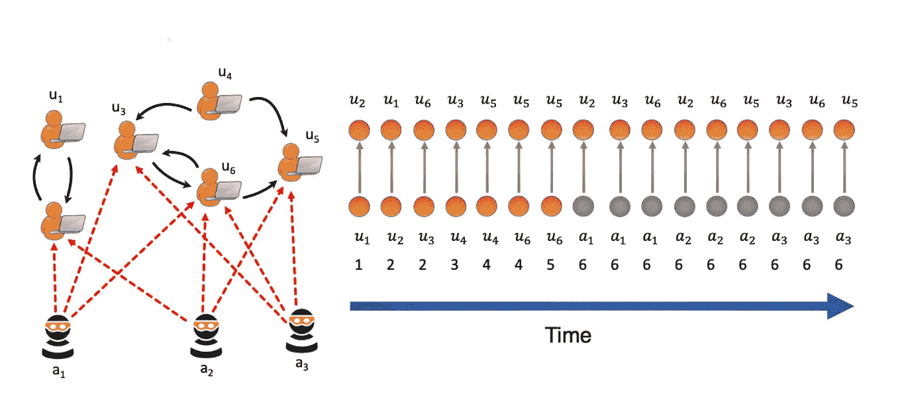

# MIDAS 简介:图中异常检测的新基线

> 原文：<https://towardsdatascience.com/introducing-midas-a-new-baseline-for-anomaly-detection-in-graphs-4311b8f7a737?source=collection_archive---------53----------------------->

图片来自 [Github](https://github.com/bhatiasiddharth/MIDAS)

在机器学习中，自动驾驶汽车、GANs 和人脸识别等热门话题经常占据媒体的大部分聚光灯。然而，数据科学家正在努力解决的另一个同样重要的问题是异常检测。从网络安全到金融欺诈，异常检测有助于保护企业、个人和在线社区。为了帮助改进异常检测，研究人员开发了一种叫做 MIDAS 的新方法。

# 迈达斯是什么？

在新加坡国立大学，博士生[西达尔特·巴蒂亚](https://www.comp.nus.edu.sg/~sbhatia/)和他的团队开发了 MIDAS，这是一种新的异常检测方法，在速度和准确性上都优于基线方法。

MIDAS 代表基于微簇的边缘流异常检测器。顾名思义，MIDAS 检测微团簇异常或图形中突然出现的可疑相似边缘组。MIDAS 的主要优势之一是它能够实时检测这些异常，速度比现有的最先进的模型快许多倍。

# 图中异常检测的真实用例

简而言之，异常检测是寻找偏离数据集中预期的模式或异常值的实践。它可以帮助我们找到并消除有害内容。“图中的异常检测是在无数系统中发现可疑行为的关键问题，”西达尔特说。"其中一些系统包括入侵检测、虚假评级和金融欺诈."

这项技术可以帮助 Twitter 和脸书等社交网络检测用于垃圾邮件和网络钓鱼的虚假个人资料。它甚至可以用来帮助调查人员识别网上的性侵犯者。“使用 MIDAS，我们可以在动态(时间演化)图中找到异常的边缘和节点，”西达尔特说。“在 Twitter 和脸书，推文和消息网络可以被视为一个时间演化图，我们可以通过找到这些图中的异常边缘和节点来发现恶意消息和虚假信息。”

异常检测的一些其他常见用例包括:

*   垃圾邮件过滤器
*   信用卡欺诈检测
*   数据集预处理
*   网络安全性
*   社交媒体内容审核

# MIDAS 优于最先进的方法

“异常检测是一个经过充分研究的问题，大多数提出的方法都集中在静态图上，”西达尔特说。但是，许多真实世界的图表本质上是动态的，基于静态连接的方法可能会遗漏图表和异常的时间特征

MIDAS 解决了实时检测异常情况的需要，以便尽快开始恢复，并减少恶意活动的影响，如欺诈性信用卡购买。

“此外，由于顶点的数量会随着我们处理边流而增加，我们需要一种在图形大小上使用恒定内存的算法，”西达尔特解释道。此外，许多应用中的欺诈或异常事件发生在微集群或突然到达的可疑相似边缘组中，例如网络流量数据中的拒绝服务攻击和锁步行为

“通过使用一个原则性的假设检验框架，”西达尔特说。" MIDAS 提供了假阳性概率的理论界限，这是早期的方法所不能提供的."

# 迈达斯是怎么测试的？

西达尔特和他的同事展示了 MIDAS 在社交网络安全和入侵检测任务中的潜力。他们使用以下数据集进行异常检测:

*   **Darpa 入侵检测**(450 万次 IP-IP 通信)
*   **Twitter 安全数据集**(2014 年有 260 万条与安全事件相关的推文)
*   **推特世界杯数据集**(2014 年足球世界杯期间 170 万条推文)

为了比较 MIDAS 的性能，团队查看了以下基线:

*   **RHSS**
*   **色丹斯波特**

然而，由于 RHSS 在 Darpa 数据集上的 AUC 测量值[很低，为 0.17，该团队通过与 SEDANSPOT 进行比较来测量准确性、运行时间和真实世界的有效性。](https://www.kdnuggets.com/2010/09/pub-is-auc-the-best-measure.html)

# 结果呢

MIDAS 检测微团簇异常的准确率高达 48%,速度是当前基线方法的 644 倍。

“我们的实验结果表明，MIDAS 比基线方法高 42%-48%的准确率(就 AUC 而言)，”西达尔特说。"此外，MIDAS 处理数据的速度比基线方法快 162644 倍."

# 改进 MIDAS:未来的工作

“我们已经将 MIDAS 扩展到 M-Stream:快速流式多方面群体异常检测，”西达尔特说。“在 M-Stream 中，我们检测具有分类和数字属性的多方面数据上的异常。”

西达尔特和他的团队表示，M-Stream 在准确性和运行时间方面也优于几个基准，包括流行的 Sklearn 算法，如隔离森林和局部离群因子。然而，他们与 M-Stream 的合作目前正在审查中。

“考虑到 MIDAS 的性能，我们认为它将成为一种新的基线方法，对异常检测非常有用，”西达尔特说。"此外，探索 MIDAS 如何在其他应用中发挥作用也将是一件有趣的事情."

如果你有兴趣了解更多关于迈达斯的知识，请查阅西达尔特的全文。你也可以在 [Github](https://github.com/bhatiasiddharth/MIDAS) 上下载代码和数据集。

要获得更多机器学习采访、指南和新闻，请查看下面的相关资源，不要忘记[订阅我们的时事通讯。](https://lionbridge.ai/ai-newsletter-subscription/)

*原载于*[*Lionbridge AI*](https://lionbridge.ai/articles/introducing-midas-a-new-baseline-for-anomaly-detection-in-graphs/)