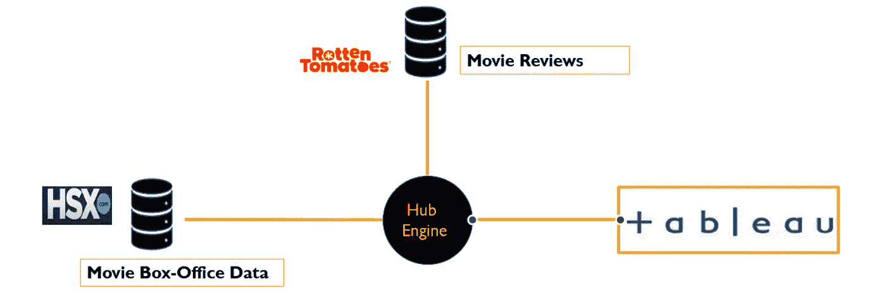

# 介绍电影大亨:GCP 为好莱坞主持的产品创意

> 原文：<https://towardsdatascience.com/introducing-movie-tycoon-a-gcp-hosted-product-idea-for-hollywood-733105c6f3e0?source=collection_archive---------56----------------------->

## 利用谷歌云平台上的自然语言处理和大数据帮助电影投资

按作者分类的图片—产品徽标

****向好莱坞的潜在客户和投资者推销产品****…**

# *产品背后的动机*

*电影和观众的关系已经有几十年的历史了。电影不仅反映了我们生活的社会，也塑造了流行文化和愿望。然而，在互联网时代，这种联系已经逐渐超越了票房、影院和电视领域，成为在线流媒体和电影股票交易。*

*哼！电影炒股？那是什么？让我解释一下…*

> ****好莱坞证券交易所******是世界领先的娱乐证券市场。在 HSX.com 的***，游客用一种叫做好莱坞美元的货币买卖名人和电影的虚拟股票。*****

***显然，人们正在以更新的方式参与电影。作为一个行业，好莱坞也越来越多地期待利用数据分析来为创意和商业决策提供信息，这一点在大西洋上一篇名为 [**大数据和好莱坞:爱情故事**](https://www.theatlantic.com/sponsored/ibm-transformation-of-business/big-data-and-hollywood-a-love-story/277/) 的报道中得到了强调。***

> ***“我的梦想是，当好莱坞真正开始关注数据，大规模使用数据，并推动商业价值时。”IBM 高级分析全球负责人 Richard Maraschi***

# ***电影大亨***

***电影大亨为 HSX.com 的电影投资者提供投资方向和投资对象的建议。此外，目的是为创意人员提供一个工具来分析评论，并将其作为未来项目的反馈。通过这种方式，投资者可以确定投资影院业务的正确价格，影院所有者可以根据票房预测安排电影放映。***

## ***数据管道***

******

***图一。来自 HSX 和烂番茄的数据流进入中枢引擎***

***除了来自[罗顿番茄](https://www.rottentomatoes.com/)的评论，以下数据点来自 HSX 的[周末票房](https://www.hsx.com/security/feature.php?type=boxoffice):***

*   ***电影名称***
*   ***标志***
*   ***周毛收入***
*   ***总额***
*   ***类型***
*   ***出厂日期***
*   ***剧院***
*   ***美国电影协会评级***

## *****数据架构*****

******

***图二。数据架构和相关的数据收集工具***

## ***产品管道***

***在数据来源于允许在电影数据库上查询解决方案的 Hive，以及 python web 抓取工具被部署来构建用于执行自然语言处理的语料库之后，电影大亨利用 GCP 上的 Cloudera Hadoop 来创建 **mapper-reducer** 框架。***

***然后，所有数据被发送到 Jupyter Notebook 进行进一步分析，最终输出以 csv 文件形式发送到 Tableau，以便为最终用户创建仪表板。***

******

***图三。电影大亨的产品渠道***

## *****蜂巢工作流程*****

***通过 HIVE SQL 计算作业，所有数据流都变得很容易获得。为了确保将所有新的票房电影数据纳入分析中，Movie Tycoon 中的整个工作流都是使用调度程序作业自动执行的，每个作业都在每周一上午 8:00 运行。***

***在试运行期间，自动计划程序大约需要 10 分钟。***

******

***图 4。配置单元工作流***

# ***可视化产品洞察***

***为了帮助电影投资者、编剧和制片公司，整个决策支持系统在 Tableau 上可视化，使用如下所示的实时仪表板。***

******

***图五。实时 Tableau 仪表板***

***最高票房收入出现在以下类型中:***

1.  ***行动***
2.  ***音乐的***
3.  ***家庭的***

# ***NLP 洞察***

***理解电影评论对产品的成功和稳健至关重要，它能对观众如何看待电影提出战略性和深刻的观察。内容作者将从这个尚未开发的数据源中获得巨大收益。在使用各种 NLP 技术进行详细分析后，发现以下主题会产生非常积极的情绪:***

*   ***故事***
*   ***表演***
*   ***精彩的戏剧***

***电影院 GIF 由[詹姆士·柯伦](https://giphy.com/gifs/3o6Ztl7RvfwCp9mqhW)***

# ***结论***

***再回到《大西洋月刊》的文章…***

> ***好莱坞的许多人希望，通过结合对内容和观众的深刻理解，电影公司将能够从一开始就选择和定制他们的电影，甚至可能找到某种编剧的神奇公式。***

*****电影大亨**将让你做到这一点，甚至更多，通过**可扩展性**、**云安全**和**智能分析**等功能来推动决策。它使好莱坞和观众之间的距离比以往任何时候都更近，同时利用现代数据科学和大数据工具来实现这些利益相关者之间的协同作用。***

***更多的技术文档，你可以在这里查看相关的代码文件[。](https://github.com/akshay-madar/MovieTycoon-gcp-based-BI-tool)***