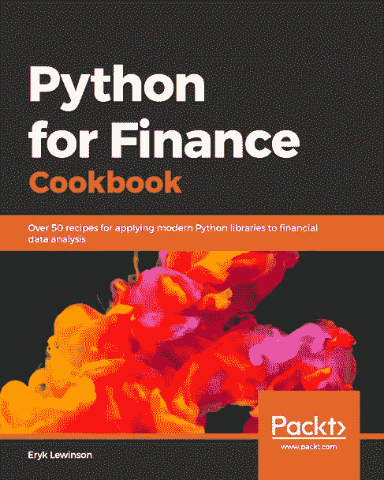

# 介绍我的书:Python 金融烹饪书

> 原文：<https://towardsdatascience.com/introducing-my-book-python-for-finance-cookbook-de219ca0d612?source=collection_archive---------19----------------------->

来源: [Unsplash](https://unsplash.com/photos/qFH7-yKoxik)

## 我的短篇小说从中型文章到图书合同

在这篇文章中，我想分享我的故事，即写关于走向数据科学的文章是如何开始一场冒险的，并最终成为一本书。我还将描述我在这个过程中学到了什么，以及在这个过程中哪些工具帮助了我。开始吧！

# 它是如何开始的

2019 年 2 月的某个时候，一位收购编辑联系了我，问我是否有兴趣创作一本书。我已经写了几篇关于 Medium 的文章，我对这个项目的规模有点不知所措。然而，这听起来像是一个令人兴奋的想法，并且有可能扩大我小小的写作爱好。很快，我同意接受挑战。

# 这个提议

整个过程的第一步是求婚。出版商已经对这本书的总体主题(主题，而不是内容本身)有了想法，这将是一本什么类型的书，以及它应该面向谁。

这是一个提到书的格式的好地方。如标题所示，这是一本烹饪书，侧重于实践方法。每一章都包含一系列的*方法*，每一个都是分析师在金融领域工作时可能遇到的独立任务。

在写提案的时候，我可以自由选择我想在章节中包含的食谱。提案必须非常详细，对于每一个食谱，我必须包括标题，一个简短的总结，以及预期的页数。这被证明是相当棘手的，但我稍后将回到这一点。

经过几次反复，并结合了编辑的一些建设性反馈，提案准备好了，我签了合同，开始写作。

# 该过程

我收到了出版商的一些介绍性文件。它们包括一些关于这本书应该遵循的风格的一般信息，但也包括一些关于写作过程本身的提示。根据他们的说法，每天写 1-2 页，按时完成这本书应该不成问题。

至少对我来说，大多数时候事情看起来并不是那样。写书可以类似于拥有另一份工作，至少在时间上是这样。将两者结合起来并拥有足够的个人生活时间是一个挑战。

为了让我更轻松，我尽可能在上下班的路上做更多的工作。因为我每天要坐两次 40 分钟的火车，所以尽可能有效地利用这段时间是有意义的。之前我在那时候看书或者做文章，所以我已经习惯在这样的条件下工作了。

即使我在上下班途中一天写两次书，我也很少能写出足够的内容来填满 1-2 页的配额。大多数时候，我也在晚上工作。经常发生的情况是，在一天的工作和长途通勤之后，我实在太累了，以至于晚上做不了任何有建设性的事情。因此，相对于最初的时间表，我有一些延误。谢天谢地，编辑们在这个过程中给予了支持和鼓励。

从 2019 年 3 月到 2020 年 1 月初，我一直在写这本书。对于每一章，我都遵循类似的工作流程。首先，我为我正在写的那一章收集资料。然后，我开始陈述手头的问题，并编写解决它的代码。编码部分完成后，我会写食谱的介绍，并详细描述代码是如何工作的(一步一步)。在大多数食谱中，我还写了一个*有更多的*部分，其中包含了一些关于该食谱的更高级的主题，或者专注于该任务的另一种可能的方法。

大多数时候，我把食谱的内容和代码写在同一个 Jupyter 笔记本上。这似乎是最方便的，因为我会将所有内容(文本+代码)一次性转移到出版商的基于 Markdown 的文本编辑器中。然而，也有与之相关的问题。在下一节中会有更多的介绍。

另外值得一提的是，在写这本书的同时，大纲也发生了演变。我在提案中计划的一些食谱被合并在一起，一些被替换。我觉得真的很难写出一个在实际开始写的时候不会改变的提案。

# 我所学到的…

在这一小段中，我将描述我在写书时学到的一些要点，以及我本可以做得不同的地方。我将主要写过程本身，而不是特别写编码。

*   在写提案时给出一个现实的页数比预期的要困难得多。我严重低估了每章所需的页数。首先，我没有考虑图像的大小，因为我不清楚每一章会有多少图像。第二，我低估了代码所占的空间。考虑到代码被分解成编号的步骤，并且每个步骤都有简短的描述，这极大地影响了页面数量。
*   与出版商的编辑更频繁地核对事实。正如我之前提到的，我主要是在 Jupyter 笔记本上写章节的内容，在那里我也给出了给定任务的解决方案。当我以为我已经看完了的时候，我才把这一章移到了出版商的编辑那里。这种方法的问题是，我在 Jupyter 中没有真正的页面计数指标。因此，当我将所有内容转移到编辑器时，常常会远远超出目标。此外，当将代码移动到编辑器时，它通常不能很好地适应页面宽度，需要进一步的重构——在笔记本和编辑器之间来回切换。
*   数据科学 9 个月真的很多，因为行业在不断发展。我从几个方面体验了这一点。首先，当我完成这本书时，一些 Python 库被重命名，这需要在多个章节中修改代码。第二，一些功能(关于下载数据)被弃用，因此，我删除了 2 个完整的食谱。第三，在写后面的章节时，我偶然发现了一些我想在前面的章节中使用的新的很酷的东西，但是，通常没有时间(和页数)来将它们合并到已经写好的部分中。最后一件事产生了多篇文章的想法，我希望很快发表:)
*   代码需要多轮重构。原因包括修改格式(使其符合页面宽度)，考虑库的变化等等。此外，当我在写作过程中进行开发时，我经常回到前面的章节来重构代码，以便它符合后面的标准。需要记住的一点是，修改代码不仅发生在 Jupyter 笔记本中，也发生在存储该书的出版商的编辑器中，因此正确更新这两个源是至关重要的。
*   我必须学会的一件事是延迟满足。以中等文章为例，文章一写完，几秒钟之内就可以发表，我可以看到它的接受度。我知道，这是虚荣心作祟。但是这本书花了将近一年的时间才完成，并且需要一些决心。最后，交付了这本书的最终版本，并且正在进行印刷，这种满足感是巨大的，值得等待。此外，在写这本书的过程中，我设法找到一些空闲时间来准备一些文章。正如我之前提到的，我有很多想法。例如，我正在研究 Python 中用于回溯测试交易策略的库。虽然我在书中使用了一个库(并坚持使用它以保持一致性)，但我对另一个库做了一些研究，如果不作为一系列文章来分享，那将是一种耻辱(由 this [one](/introduction-to-backtesting-trading-strategies-7afae611a35e) 开始)。

# **让我生活更轻松的工具**

*   特雷罗——它允许我们创建看板风格的任务列表。这是一个组织项目的伟大工具，无论是个人使用还是整个团队使用。对于这本书，我创建了一个板，并把它分成几个部分，如积压，做，修订，完成，想法。这样，每当我想出一个新的想法或者想要跟踪我仍然需要重构的东西时，我可以很容易地使用 Trello 来组织任务。我也用它来组织我的博客写作:)
*   GitHub——可以说是最流行的版本控制平台。你可以在这里找到这本书的 GitHub 资源库[。](https://github.com/erykml/Python-for-Finance-Cookbook)
*   语法上的——一个确保你的写作相对“正确”的伟大工具。通过显示潜在的错误，可以节省大量时间。然而，彻底阅读也很重要，因为语法上可能会错过一些复杂的边缘情况。Grammarly 也可以作为 Chrome 扩展安装，可以很好地与多个网站(包括媒体！).
*   [海明威应用](http://www.hemingwayapp.com/) —这个网络应用非常适合分析文本并展示其复杂性。它提供了额外的帮助，指出哪些句子太长或太复杂，可以使用一些调整(例如，将它们分成两个独立的句子)。总的来说，海明威应用程序的建议使文本更容易阅读和理解。
*   draw . io——一个非常方便的创建出版物质量图表的工具。它作为一个浏览器拖放工具，提供了大量的图标和图像。最重要的是，它允许保存您的项目，再次加载它们进行可能的修改，并导出为多种格式(包括 PDF)。
*   Jupyter Notebook/[Visual Studio Code](https://code.visualstudio.com/)—大部分时间，我都是用 Jupyter 笔记本(带 nb 扩展比如目录、拼写检查器等。)进行编码和编写。每当我需要准备一个单独的`.py`脚本时，我就使用 VS Code，这是我的首选文本编辑器。

# 这本书本身

在了解了所有关于过程本身的信息之后，是时候最终呈现这本书了。如前所述，书名是 *Python 金融食谱*，书中包含了 50 多个实用食谱。

这本书的目标读者是对 Python 有一定了解，同时也对量化金融/机器学习/深度学习有一定了解的人。在《食谱》中，我提供了所用技术背后的理论的高级概述，并经常参考论文/书籍进行深入阅读。但是一般来说，我着重解释 Python 中的实现，而不是底层理论。

本书分为 10 章:

第 1 章，*金融数据和预处理*，探讨金融数据与机器学习任务中常用的其他类型数据有何不同。我展示了如何从不同来源下载数据并对其进行预处理以供进一步分析。

第 2 章，Python 中的*技术分析*，演示了技术分析的一些基本知识，以及如何用 Python 快速创建优雅的仪表板。读者将能够从一些最常用的度量标准(如 MACD 和 RSI)中获得一些模式的洞察力。

第三章，*时间序列建模*，介绍时间序列建模的基础知识(包括时间序列分解和统计平稳性)。然后，我研究了两种最广泛使用的时间序列建模方法——指数平滑法和 ARIMA 类模型。最后，我提出了一种新的方法，使用脸书先知库中的加法模型对时间序列进行建模。

第 4 章，*多因素模型*，展示了如何在 Python 中估计各种因素模型。我从最简单的单因素模型开始，然后解释如何估计更高级的三因素、四因素和五因素模型。

第 5 章，*用 GARCH 类模型建模波动率*，向读者介绍使用(G)ARCH 类模型进行波动率预测的概念，如何选择最佳拟合模型，以及如何解释结果。

第 6 章，*金融中的蒙特卡罗模拟*，向读者介绍了蒙特卡罗模拟的概念，以及如何使用它们来模拟股票价格、欧式/美式期权的估值和计算 VaR。

第 7 章，*Python 中的资产分配*，介绍了现代投资组合理论的概念，并展示了如何在 Python 中获得有效前沿。然后，我看如何确定具体的投资组合，如最小方差或最大夏普比率。我还展示了如何评估这种投资组合的表现。

第 8 章，*用机器学习识别信用违约*，介绍了一个用机器学习预测信用违约的案例。本章介绍了从加载数据，通过各种预处理阶段，以估计分类器的完整管道。

第 9 章，*金融中的高级机器学习模型*，介绍了高级分类器的选择(包括堆叠多个模型)。此外，我还研究了如何处理类不平衡，使用贝叶斯优化进行超参数调优，以及从模型中检索特性重要性。

第 10 章，*金融领域的深度学习*，演示了如何使用深度学习技术来处理时间序列和表格数据。使用 PyTorch 训练网络(可能有 GPU 加速)。

# 结论

总的来说，我很高兴承担了这本书的写作，并为完成这本书感到自豪。这需要大量的努力和决心。在这个过程中，我有过怀疑的时刻，但是来自我亲密的人的支持帮助我度过了难关。

我希望这本书能对那些想学习如何使用 Python 解决金融领域实际问题的人有所帮助。如果你有兴趣购买这本书，你可以在[亚马逊](https://www.amazon.com/Python-Finance-Cookbook-libraries-financial-ebook/dp/B083KG9DC7)或者 [Packt 的网站](https://www.packtpub.com/data/python-for-finance-cookbook)上买到。

如果你对这本书的写作过程有任何问题，或者对这本书本身有任何反馈，我很乐意在评论中阅读。你也可以在推特上联系我。

下次见！