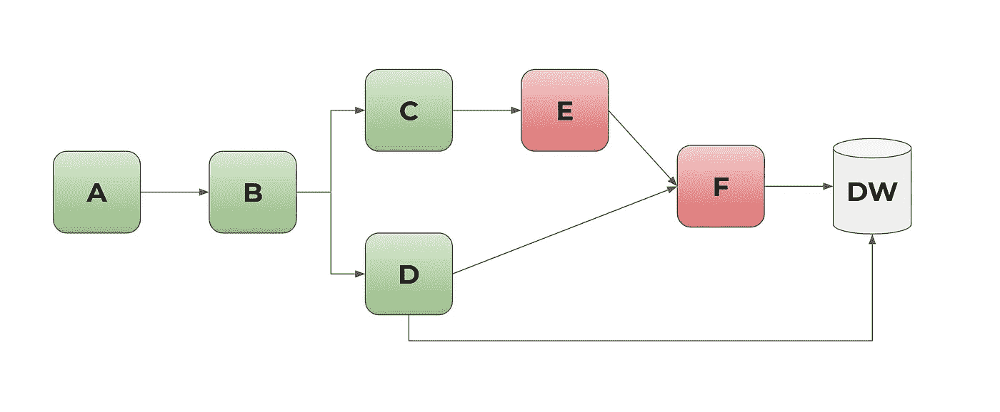

# 介绍可观察的、自我记录的 ELT

> 原文：<https://towardsdatascience.com/introducing-observable-self-documenting-elt-41aa8b124098?source=collection_archive---------26----------------------->

[Virevol ai](https://www.virevol.com) 是一款协同视觉购物 app。我们经营一个远程优先的精益团队，已经有 2 年多了。为了施展我们的魔法，我们带着大量的数据畅游。

我们每天从数百个数据源中获取数百万行数据，在这些数据上运行我们的模型，并以各种方式为它们提供服务。我们在谷歌堆栈上，有 GCP 云功能、服务、容器，你能想到的都有。它们触发关于文件丢弃、队列消息、挂钩和时间表的其他事件。一切都是基于事件的，只是及时供应(我们很吝啬)。

我们的头脑中有太多的数据路径需要保留。

有了可观察的 ELT，我们可以通过匹配日志、输入、涉及它的每个作业的版本，追踪数据的来源，直到每一行。我们可以用美元做 ELT 会计，这是大多数 CTO 的白日梦。这使我们能够返工花费更多的管道部分，而不是所有遗留代码。

这就是我们保持理智的方法。我们如何在保持数据质量的同时快速发货？

**数据如何移动**

ETL 是一系列批处理作业。当一个完成时，下一个被触发。有时是两个，有时是 Y 形连接成一个。

你会得到一个有向图。图表很简单。

图表从上到下排列(如果您愿意，也可以从左到右排列)。

照片由[马克·巴萨拉](https://unsplash.com/@ignitedit?utm_source=medium&utm_medium=referral)在 [Unsplash](https://unsplash.com?utm_source=medium&utm_medium=referral) 上拍摄

当中间的某个步骤中断或花费太长时间时，复杂性就产生了。想想鲁布·戈德堡机器。

或者更糟，如果什么都没发生。你会在理解数据的过程中发现错误。

为了管理这种复杂的管道协调，人们使用了各种各样的工具——Luigi、dbt、Airflow 等。

这是一种非常自上而下的乐器演奏方式。

最终用户只关心最后一步。如果报告需要在上午 9 点发出，而数据还没有准备好，你会接到电话。那是你的 SLA。

如果一项服务需要每 10 分钟为用户更新一次推荐，这就是您的 SLA。

遗憾的是，最终用户对 Dag 或花哨的工具不感兴趣。

当事情发生时，一个泪流满面的初级开发人员试图在凌晨 3 点调试“为什么”。她加入公司是为了涉足神经网络。但是被引诱，转而做 ETL。更糟糕的是，它被一些人称为“数据看门人的工作”，而不是它应该有的“数据 Lorax”。

她费力地翻阅一些本该发生的事情的文件。如果写这个的人还在那里工作，那就有点懈怠了。然后查看日志来搞清楚事情。如果她真的幸运的话，甚至可能会有一份关于这份工作的最新手册。她从 Pagerduty 跳到 JIRA，跳到 wiki，跳到 github，跳到日志。

鸟儿在远处歌唱，迎接黎明的到来。

**可观察的 ELT**

我们引入了一个新概念，叫做**全局跟踪标识符**，简称 tid。

每个将转换数据的函数、批处理作业或服务都需要获得一个特定运行的 tid。

它提供所有旧的 tid、其版本和实例变量(例如 X-AppEngine-QueueName、X-Appengine-Taskname)。这些记录在 service_tracker 表的 BigQuery 中。

下面是 python 中调用的样子

它必须用这个 tid 记录运行。

完成后，它必须将该行的 last_tid 列追加到这个。如果它是一个新行，它还必须将 tid 列填充到该行。向下滚动到“渐变尺寸”部分进行优化。

这是已经部署的 Google 功能，它可以满足我们的所有需求。

**它是如何工作的？**

让我们画一张图来概括这些情况:

这里 A，B，C，…F，都是不同的过程。各取一物，醒来，发一物，关机。但是我们不需要任何地方都有这样的记录图表。

那么我们如何产生它呢？

从插入到 D 末尾的表行的角度来看，我们有 A 的 tid，D 的 last_tid 跟踪到[B]，B 跟踪到[A]。

所以我们知道，A -> B -> D ->这一行。我们可以跟踪这里的每一行，以及生成它的代码版本。

我们来做一个更复杂的案例。

从插入到 F 末尾的表行的角度来看，我们有 A 的 tid 和 last_tid F，它们跟踪到[E，D]的 tid。我们可以追踪列表中提到的每一个 tid 来反转图表。

当有东西损坏(F)时，我们不会在数据仓库中为它获得一行。我们无畏的开发人员可以看看前面的运行，它将 F 引用为 prev_tid(它们有时间戳)。然后，她可以直接调试 F 运行的日志，并会在 e。

她可以做所有这些事情而不需要问任何人。你仍然需要服务 F 的操作手册，就在 github 里。

她从 pagerduty 转到 Google logging 和 github 寻找代码和问题。如果她发现服务有问题，她可以从那里更新并推送代码，这将触发 CI/CD 测试。

她可以用代码记录下来，并指出帮助她找到问题的 tid。该代码是最好的“当前”文档。该表是指向它的指针的时间序列。

我们还可以做更多的事情，我们可以审计每张桌子生产需要多长时间，以及生产链中的哪些工作导致了这种情况。我们可以计算出链何时改变(ML 作业 C 被插入到组合中)。

我们可以通过查看每个服务每次运行的成本来确定哪些遗留代码需要返工。这提供了一种新的优化方法。我们的优化不仅仅是通过“感觉”哪个代码最让我们厌烦，而是通过一个目标函数——成本。

把它想象成剖析一个程序，除了你看到的是函数和美元，而不是子程序计时。

我们来谈谈小而重要的细节，以获得更好的结果。

**ELT not ETL**

因为你的数据在云中，移动数据是你的账单中最大的份额。尽可能用 ELT 代替 ETL。数据将直接在服务器上转换并保存下来，只需要最少的传输。

因为另一个原因，它会更快。BigQuery 和大多数现代数据仓库正在它们的大型服务器集群上为您进行 map-reduce。您必须加快 k8s 实例的速度，才能在大负载下获得相同级别的性能。

为了获得最大的收益，请使用特定于数据库的 SQL，而不是抽象来转换数据。在这种情况下，编写 SQL 是合适的工具。克服它。

SQL 能有多复杂？作为一个练习，这里的是用 SQL 计算 tf-idf，只是为了好玩(实际上你可以使用类似 [spaCy](https://spacy.io/) 的东西，因为你可能需要更多的步骤)。您也可以从示例中获得使 SQL 令人愉快的样式技巧。

对于可观察的 ELT，使用 Google 函数获取 tid 并从字典中运行参数化的 SQL。

类似这样的事情，

如果可以在 SQL 中全部完成，那么直接使用 merge 语句会更快(参见示例)。

哦，确保你有测试用例来测试你现在所有的 SQL。

**渐变尺寸**

我们用另外三个细节来美化生活。

一种是将每个表包装在视图后面。所以一个名为‘学生’的表就变成了‘v _ 学生’。这使得重构变得容易。这是我在租跑道的时候发现的，并保存了下来。

二是用一个版本的 [SCD type 2](https://en.wikipedia.org/wiki/Slowly_changing_dimension#Type_2:_add_new_row) 。

对于大多数重要的表，每一行都只是被追加，并按时间分区。顶部的视图使用 added_ts 上的 rank()给出了该表的最新版本。

这可能看起来很浪费，但它让我们保持理智，存储成本也没有人们想象的那么高。当旧分区变得太大时，我们总是可以丢弃它。

最后，每份工作都可以重新开始。这通常是大多数成熟数据团队的标准，我就不赘述了。

对于可观察的 ELT，我们必须发明一些新工具，但是我们不需要任何其他外部工具来进行协调。它与 Google Cloud 任务队列、Pub/Sub 和 Apache Beam pipes 共存。

到目前为止，我们很开心。一旦我们有了一个稍微大一点的团队为 10 亿客户服务，我们会让你知道我们是否还在。

这些想法也可以扩展到日志记录。我们最近在日志记录上看到了这个主题，并且很高兴尝试一下。

如果这给了你任何关于你自己的 ETL 流程的想法，我们很乐意听到你的意见。这种分散的方法应该有助于您更快地发货。

如果你喜欢解决具有挑战性的问题，并且是非传统的思考者，请[联系](mailto:saurabh@virevol.com)。