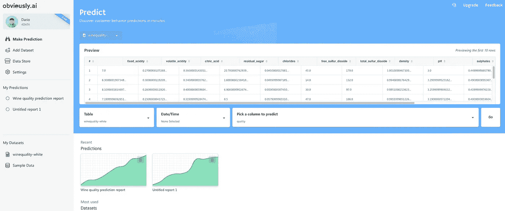
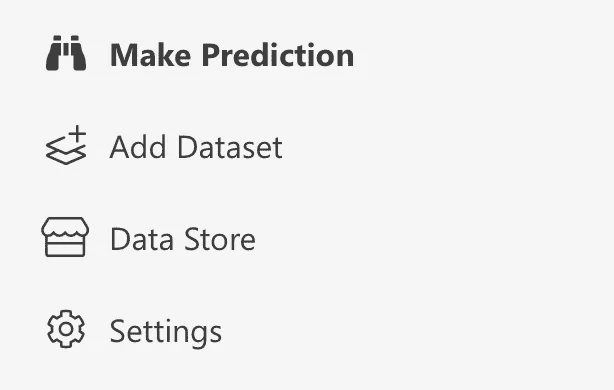
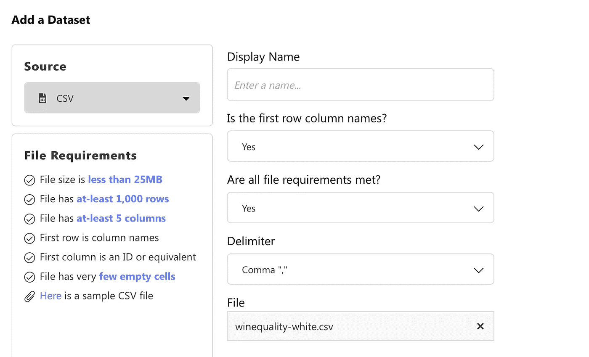
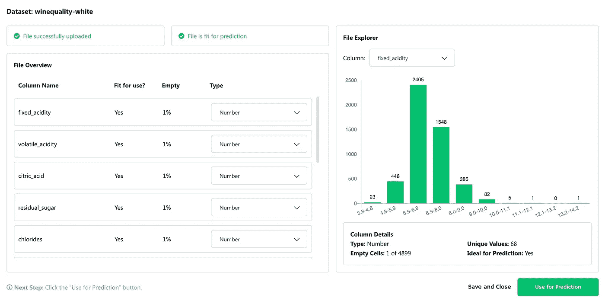
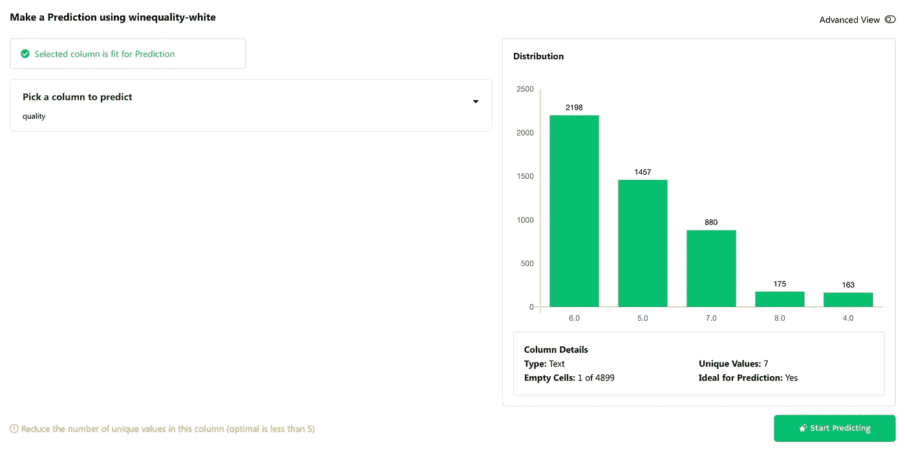
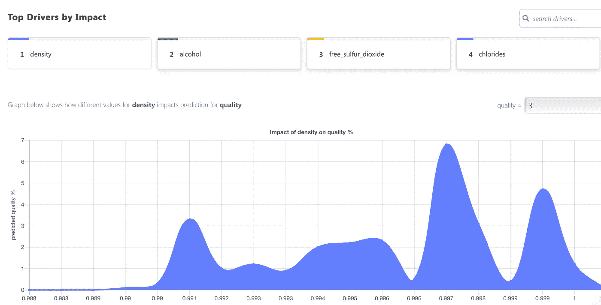
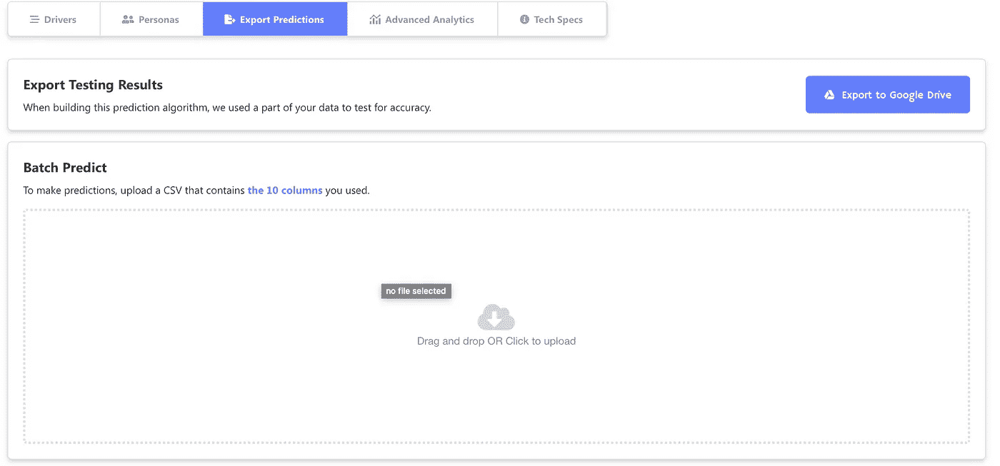
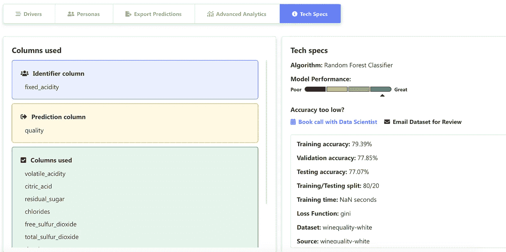

# 引入明显无代码的机器学习解决方案

> 原文：<https://towardsdatascience.com/introducing-obviouslyai-no-code-machine-learning-solution-da528c81071c?source=collection_archive---------34----------------------->

## 最佳数据科学自动化。

几天前，来自[apparent . ai](https://www.obviously.ai)的几个人联系我，介绍他们的服务——一个完全无代码的机器学习自动化工具。起初我有点怀疑，因为我总是对所谓的全自动解决方案持怀疑态度，但我决定试一试。我将在本文中分享我的想法，并讨论服务是否值得一试。

由[埃克托尔·j·里瓦斯](https://unsplash.com/@hjrc33?utm_source=medium&utm_medium=referral)在 [Unsplash](https://unsplash.com?utm_source=medium&utm_medium=referral) 上拍摄的照片

我发现很难看到像这样的工具自动化机器学习，并减少中小型公司对机器学习工程师的需求。原因有很多，但最大的原因是机器学习的目的是自动化其他职业，但我们已经成功地用机器学习自动化了机器学习。干得好。

这并不完全是一件坏事，因为我们现在可以专注于更重要的事情，而不是一个接一个地拟合算法，目的是挤压额外的 0.15%的精度。

*那么，什么是明显的 AI 呢？*

他们的[主页](https://www.obviously.ai)上的英雄部分解释得很好:

> 一次单击即可构建 ML 算法、解释结果和预测结果的整个过程。

在玩了一会儿之后，我必须说它确实有用。*那么，这里面有什么蹊跷？*好问题。在这个时代，我们已经习惯了昂贵的解决方案，显然 AI 也不例外。它有一个非常不错的免费计划，仅限于不超过 50，000 行的 CSV 文件。这对于基础探索来说绰绰有余了。

我目前在免费计划中，对我的需求来说已经足够了。我们现在将通过一个具体的例子，用这项服务训练一个机器学习模型，你会看到整个事情是多么愚蠢简单。

在我们开始之前，我想做一个简短的免责声明。尽管*的人显然要求我审查他们的服务，但我与他们没有任何关系，我也不会试图说服你转而使用付费账户。我说的一切纯粹基于免费版。*

# 注册和设置

就在这一步，第一件怪事发生了。我已经打开了注册页面，并被提示输入一个电子邮件。奇怪的是，我的个人 Gmail 账户没有资格注册。

一个商业电子邮件帐户是必须的。

我有一个公司的商业电子邮件账户，所以这不是问题，但对你们中的一些人来说可能是一个障碍。我无法证实其他电子邮件提供商是否发生了同样的事情，但 Gmail 目前无法工作。奇怪。

然而，我已经完成了注册过程并验证了电子邮件地址，然后我看到了一个漂亮的仪表板:

有一些内置的样本数据集，但我想这些工作完美无缺。我们不会将这些用于我们的机器学习任务，而是将使用一个众所周知的[葡萄酒数据集](http://archive.ics.uci.edu/ml/machine-learning-databases/wine-quality/winequality-white.csv)。让我们在下一部分建立一个模型。

# 建立模型

如前所述，这一步非常简单。首先要做的是上传数据集。我们将使用侧边栏上的*添加数据集*按钮来完成此操作:

单击后，应该会出现一个模态，我们可以在上面拖放(或单击以上传)数据集。记住这些**约束**(免费版):

*   文件大小必须小于 25MB
*   必须至少有 1000 行
*   必须至少有 5 列

我们的葡萄酒数据集通过了所有这些条件，所以我们可以上传它:

上传完成后，我们将进入这个展示良好的探索模式:

从这里开始，我们只需要按照说明。让我们点击*用于预测*按钮。我们几乎完成了准备工作。在下一个模态窗口中，我们只需要选择目标变量:

就是这样！服务抱怨我们应该减少目标变量中唯一值的数量，但是我们可以忽略这一点。要完成，只需点击*开始预测*按钮。你要做的就是这些。

模型被训练。完成了。就这么简单。

这并不意味着这个模型是好的，所以我们将在下一节探讨它的表现。

# 模型评估

一旦模型经过训练，我们就会看到报告仪表板。它由几个部分组成:

*   司机
*   人物角色
*   出口预测
*   高级分析
*   技术规格

我们将在这里探索其中的几个，第一个是*驱动*区域。

## 司机区

简单地说，这个区域告诉我们哪些变量对预测最重要，因此哪些变量的预测能力最强。在我们的例子中，变量`density`、`alcohol`和`free_sulfur_dioxide`是前 3 个:

格式美观，易于理解。我们继续吧。

## 导出预测区域

如果不对新的、以前看不见的数据进行预测，机器学习就没有意义。不幸的是，这正是免费版的不足之处。我们可以通过上传以前未见过的数据的 CSV 来进行预测——只有属性，没有目标变量。

免费版提供的就这些。对你来说可能已经足够了，但我期待看到更多。

付费版本得到的是 REST API 形式的模型的部署版本，这使得从任何编程语言进行预测都容易得多:

不幸的是，免费版不支持这个选项，但是你能责怪他们吗？

## 技术规格区

此区域显示有关模型的一些基本信息，例如使用了哪种算法，训练、测试和验证子集的准确度如何，等等:

这是一个很好的部分，可以让你对你的模型有一个基本的了解，但仅此而已。

显然，这篇介绍性文章到此就差不多了。让我们在下一部分总结一下。

# 在你走之前

简而言之，*显然很棒，也是一个值得推荐的简单服务。对于中小型企业，我甚至可以将它视为唯一的数据科学解决方案，由一个或多个软件开发人员维护，他们通过几次点击来训练模型，并通过 API 调用来进行预测。*

当然，数据科学团队可以提供更好的解决方案，但该团队可能每月花费数万美元，而该解决方案最昂贵的选项每月不到 200 美元。你算算。

从一开始就很明显，数据科学将成为软件工程的另一种风格，但正是像这样的服务改变了即使是最顽固的个人的想法。

*你有什么想法？你试过了吗？*欢迎在评论区留下你的想法。

*喜欢这篇文章吗？成为* [*中等会员*](https://medium.com/@radecicdario/membership) *继续无限制学习。如果你使用下面的链接，我会收到你的一部分会员费，不需要你额外付费。*

 [## 通过我的推荐链接加入 Medium-Dario rade ci

### 作为一个媒体会员，你的会员费的一部分会给你阅读的作家，你可以完全接触到每一个故事…

medium.com](https://medium.com/@radecicdario/membership) 

[**加入我的私人邮件列表，获取更多有用的见解。**](https://mailchi.mp/46a3d2989d9b/bdssubscribe)