# PyLathe 简介:使用 Julia 在 Python 中使用车床

> 原文：<https://towardsdatascience.com/introducing-pylathe-use-lathe-in-python-using-julia-6f67a7aaa6f9?source=collection_archive---------23----------------------->

## 什么是语言界限？

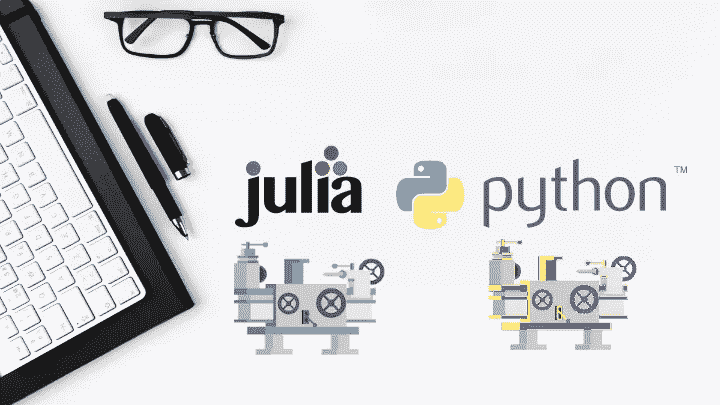

# 使用 PyLathe

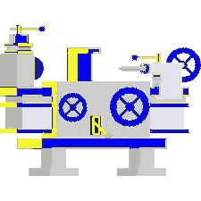

Py 车床 0.1.0 已经在 Github 和 Python 包索引(PyPi)中正式发布。)当然，PyLathe 通过它将车床的美妙舒适带入了 Python，但也有一些警告，希望这些问题能在模型的未来版本中得到解决。要安装 PyLathe，就像使用 Pip 一样简单:

```
sudo pip(3) install PyLathe
```

> 注意:这个模块与 Python 2 不兼容。

在 0.1.0 之前的几次迭代中，您必须实例化您的 Lathe 包，并包含一个用于将添加到您的环境中的 Lathe 源文件的目录。所有这些都使得安装非常复杂，谢天谢地，现在已经改变了。从模块中，我们将需要一个名为“ClassicEnvironment”的类，来自库“Runtime”。

## 环境

环境是 Python 和 Lathe 之间面向对象的桥梁。“ClassicEnvironment”是一个使用系统范围的 Julia 环境来实例化 Julia 包的环境。虽然目前没有其他可用的环境，但在未来，虚拟环境和多环境都将可用。虚拟环境将在后端为 Julia 运行时即时创建一个虚拟环境。另一方面，多环境将允许在虚拟环境之间切换，包括全局环境。

## 营造环境

创建我们的环境的第一步是确保我们有正确的包。PyLathe 唯一依赖的 Python 包是 julia.py，所以我们需要它。好消息是包管理器 Pip 应该为您处理所有这些事情。也就是说，基于 Debian/Ubuntu 的发行版中的 julia.py 包有一个已知的缺陷。由于我使用 Fedora，这不会影响我，通过一些实验，它可能会得到解决。该问题源于 Debian 上的 Apt 包管理器将 Julia 可执行文件放在了与预期不同的目录中。

当然，安装 Julia 也是至关重要的，最好安装了车床和数据框架(车床依赖于它)。好消息是，如果你不知道如何做，或者不想做这一步，你不必做！只要能够找到 Julia 可执行文件，该模块就应该可以加载，并且会在初始化时安装车床。所以让我们

> 来自车床。运行时导入经典环境

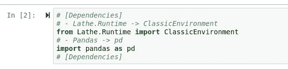

应该注意的是，在这个包的早期版本中，没有测试，也没有异常处理，这是使用这个包最大的潜在障碍。

现在，我们可以像构建其他变量一样构建我们的环境:

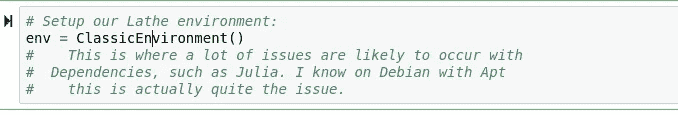

在加载和初始化方面，就是这样！我们的环境已经完全加载完毕，随时可以运行！

# 构建工具

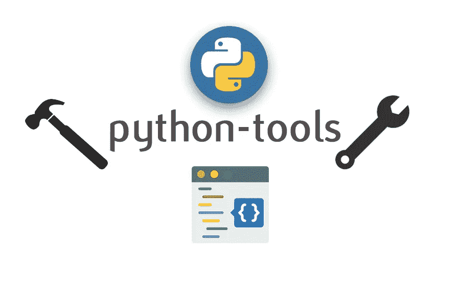

从这个环境中，我们现在可以通过首先为 Julia 构造一个包管理器(Pkg)来导入我们可能需要的任何 Julia 包。)这也很简单，代码如下:

```
pacman = env.pacman
```

然后我们可以像使用 Pkg 一样使用 pacman 变量，方法如下

> Pkg.add()

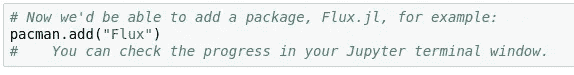

虽然这是一个基本的、原始的版本，但是这种通过 Python 访问 Julia 的面向对象的方法无疑是非常酷的，并且在未来的虚拟环境中具有很好的可伸缩性。

为了导入一个车床模块，我们可以使用 import__()功能:

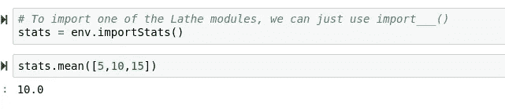

> 但是机器学习呢？

# 机器学习

## 处理数据

机器学习在 PyLathe 中的工作方式是完全正确的，很少有问题会危及这一点。这些问题中的一些可能会不时暴露出来，但在大多数情况下，并不是什么大不了的事情。关于使用 PyLathe 的好消息是现在**我们在 Python 中，**这带来了 Python 的巨大优势！

> 包装

> 这是一个正式的自由世界，因为现在我们不必自己写所有的东西。

所以我决定引进熊猫，并着手获取一个数据帧

```
df = pd.read_csv("path/to/my/csv")
```

如果你想使用这个数据集，或者像往常一样下载这个笔记本，这里有一个链接！

> [数据(直接)](https://storage.googleapis.com/kaggle-data-sets/634/1203/bundle/archive.zip?GoogleAccessId=web-data@kaggle-161607.iam.gserviceaccount.com&Expires=1580539189&Signature=IeEyF6qXl1ZFeB76YQ7VrdiZMAHxcR6vozK6yr48oo2s9iCq2QJVDW14gat8e2VA0w%2B7CQpKP2mpm%2BKdHe7AyriV5%2FCRBybNBJ%2BfByrArwMR5fHTQJE17GUr1n97EXtEFiQq5%2FKAtDcqJsh%2BvbVTXVowaJKsF8VhcdwYKRkXg9T4Bk2Jle%2FPEmsn4rxA9CDRItR%2B%2FdDvHADUHgVnaZpmWcwbnMYya3jPS2v%2FGdBQiX2GI4118bxVDEQ8BRvfwcDxK2NFJspGnEYfSVDfchCWfYguSZAgFZ3xjA3Sf9MmGEVqxc%2F1yecBuWeNFhKiBRmJ1yLuQffISH9YedKImk6%2FUg%3D%3D&response-content-disposition=attachment%3B+filename%3Dszeged-weather.zip)
> 
> [笔记本(Github)](https://github.com/emmettgb/Emmetts-DS-NoteBooks/blob/master/Python3/PyLathe-Example.ipynb)

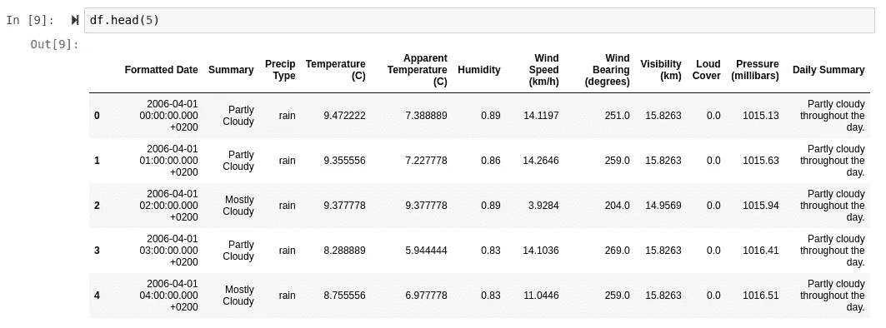

这就是熊猫更好的原因。

我喜欢在一个新的数据帧上做的第一件事，特别是像这样的快速拟合，是得到一个空计数。幸运的是，对于熊猫来说，这很容易:

> df.isnull()。总和()

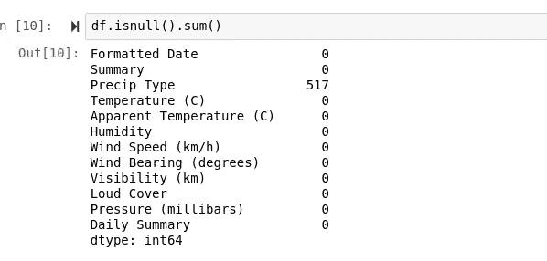

数据科学家的任务之一就是明智地处理未定义的值。考虑到这并不严重，我认为没有必要去填补这些缺失的值。幸运的是，眼尖的人可能已经意识到我的空值只在一列中。一部经典的新秀电影应该是

> df = df.dropna()

但是不要那么做。如果我们现在放弃未定义的值，我们将丢失 517 个观察值。相反，我们可以删除该列，如下所示:

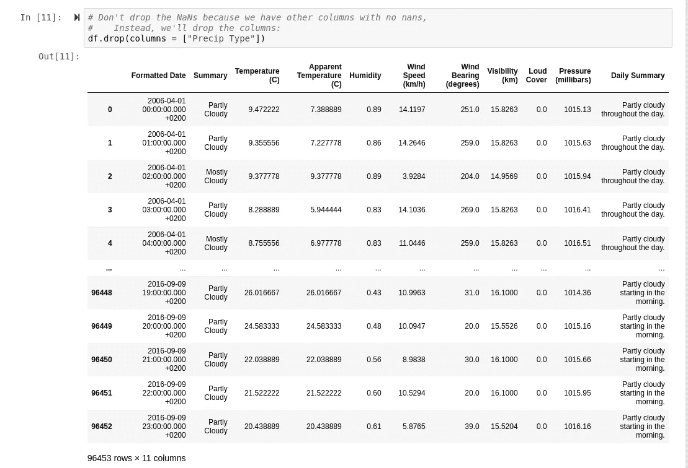

或者你可以像我一样，创建一个全新的数据框架:

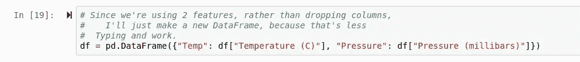

## 统计数据

我决定从 Lathe.stats 执行一个简单的 f 检验，只是为了看看我假设可能相关的两个特征是否确实相关。首先，我使用条件掩码根据温度中心分离数据，然后应用它:

```
# This will create a boolean mask that
#    we can use to apply a filter to our
#  df
lowtemp = df['Temperature (C)'] <= 0
# Now we filter our dataframe:
temp_test_df = df[lowtemp]
```

然后通过我的环境导入统计数据:

```
stats = env.importStats()
```

然后应用 f 检验，看看我们在处理什么样的显著性。

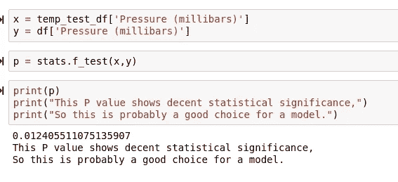

## 测试/训练分离

在没有任何信心的情况下，我尝试通过从环境中导入来使用来自 Lathe.preprocess 的 TestTrainSplit 函数，没有人会感到惊讶:

> 它不起作用


当然，这是因为熊猫数据帧是 Python 构造的对象，而不是数据。为了解决这个问题，我试着使用字典:

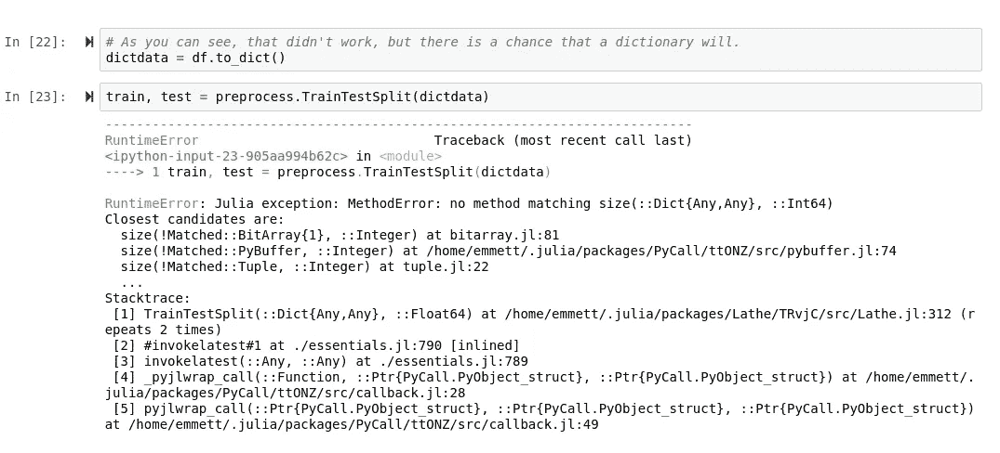

> 那也失败了

当然有办法解决这个问题，通过构造一个 Julia DataFrames.jl DataFrame，然后通过函数传递它，唯一的问题是它将返回两个 DataFrames.jl DataFrames，而不是两个 Pandas DataFrames。所以，有了路障，

> 还是用 Sklearn 吧！

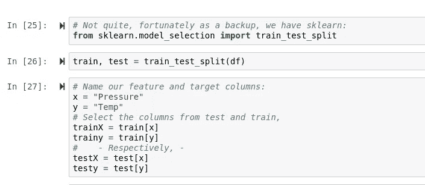

我还冒昧地设置了我们的 X 和 Y，这是很容易理解的(因为这对初学者来说不一定)。)我会说要小心数组形状，因为 Python 处理类型的方式可能有点不可靠，而车床是用 Julia 编写的，所以当然不遵守这一约束。例如，一个系列是一个列表(一个数组)，但是可能需要被重新整形为一维数组，以便为 Sklearn 工作。

> 不要这样对皮拉思。

## 模型拟合

为了适应模型，我们需要从我们的环境中导入车床模型。我们用和其他人一样的方法做这件事，

```
# Import models into our environment
models = env.importModels()
```

我决定应用 Z 分数归一化算法，也称为标准标量。我们可以用最简单明了的方式在 Python 的两个 X 上调用它:

```
# Let's apply a standard scaler from Lathe.preprocess, as well:
trainX = preprocess.StandardScalar(trainX)
# (To both X's)
testX = preprocess.StandardScalar(testX)
```

> 如果你已经知道车床，我想这将是非常自然的。

现在使用 Lathe.models: predict 和 Lathe.models: LinearRegression，我们可以将我们的模型构造为一个 Python 对象，然后在没有 yhat 的情况下将其插入预测方法。

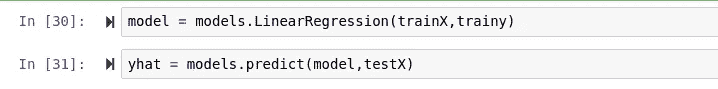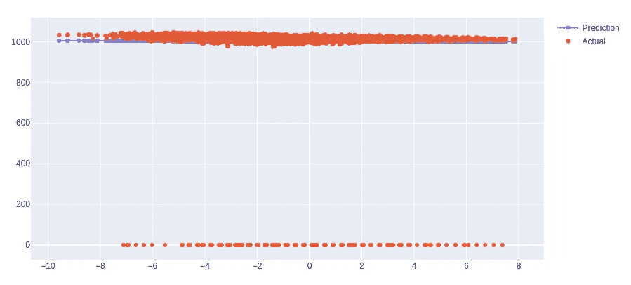

这个数据的方差看起来并没有那么高，但是这个模型确实是正确的。

# 最后的想法

首先，PyLathe——非常酷。虽然它还处于早期阶段，但是将不同的语言视为相同的语言绝对是非常棒的。我希望看到的未来改进包括:

*   虚拟环境！
*   速度——与运行本地 Julia 相比，调用 Julia 相当慢，这正是未来的计划。
*   灵活性——进一步使用包管理器来利用更多的包与车床一起使用。

总的来说，虽然将来会有改进，但我真的很喜欢 PyLathe。PyLathe 很棒，因为它完全由 Julia 模块版本本身维护，并且无论在什么情况下都可以使用 Julia 的模块版本。如果您想了解车床的所有“特色”，包括正在开发的 Lathe.lisp 和未来的车床。r 包，这些链接可以在车床内部找到。

[](https://github.com/emmettgb/Lathe.jl/tree/Unstable) [## emmettgb/Lathe.jl

### 有关发布画布的信息，请访问项目选项卡 Lathe.jl 是用于预测建模的一体化软件包…

github.com](https://github.com/emmettgb/Lathe.jl/tree/Unstable)