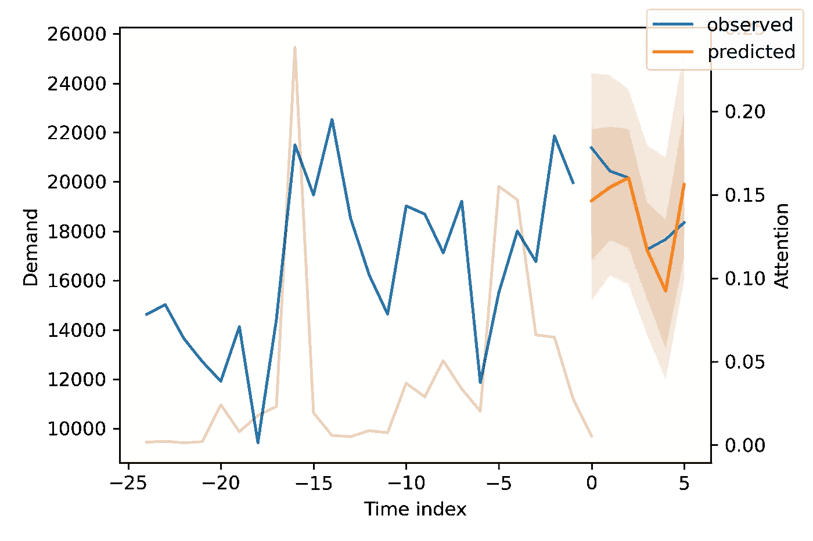
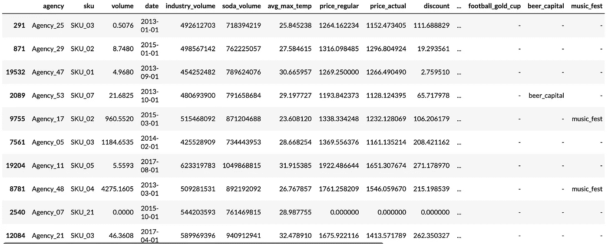
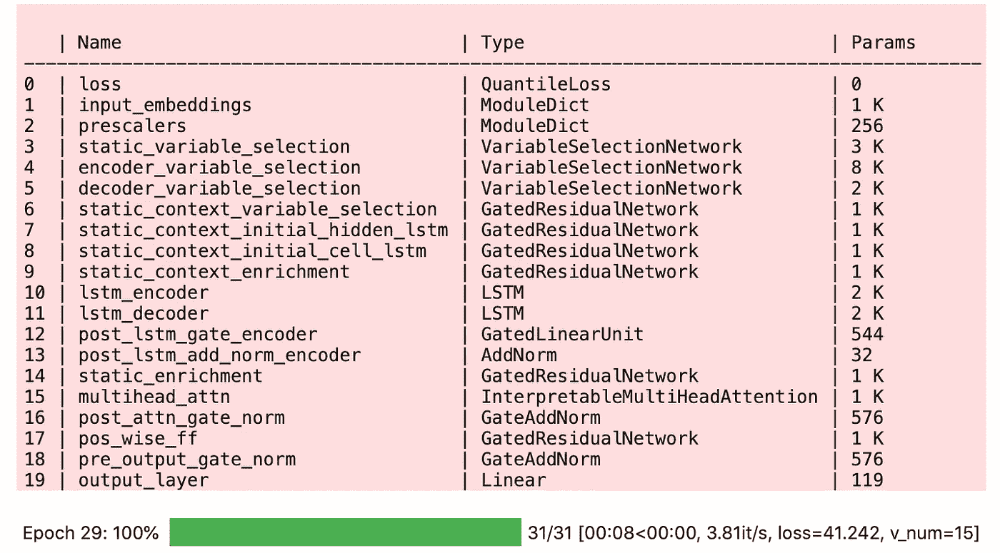
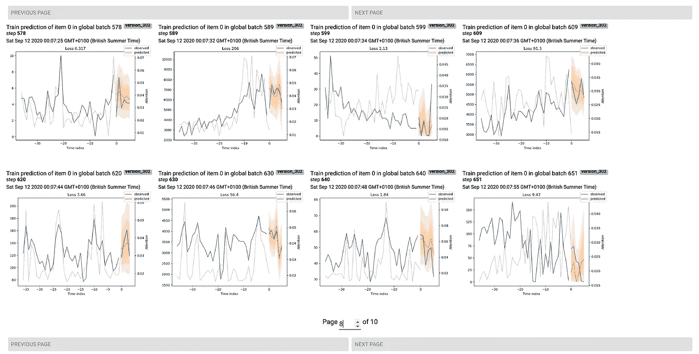
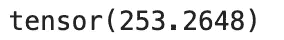

# PyTorch 预测简介

> 原文：<https://towardsdatascience.com/introducing-pytorch-forecasting-64de99b9ef46?source=collection_archive---------1----------------------->



PyTorch 预测示例

## **最先进的神经网络预测变得简单**

我很高兴地宣布开源 Python 包 [PyTorch 预测](https://pytorch-forecasting.readthedocs.io)。对于数据科学从业者和研究人员来说，它使得用神经网络进行时间序列预测变得简单。

# **为什么准确预测如此重要？**

预测时间序列在许多情况下都很重要，并且与机器学习实践者高度相关。举个例子，需求预测是许多用例的来源。几乎每个制造商都会受益于更好地了解对其产品的需求，从而优化生产数量。生产不足，你会损失收入，生产过度，你将被迫折价出售多余的产品。与此密切相关的是定价，它本质上是一种需求预测，特别关注价格弹性。定价几乎与所有公司都相关。

对于大量额外的机器学习应用，时间是至关重要的:预测性维护、风险评分、欺诈检测等。—你说吧。事件的顺序和它们之间的时间对于创建可靠的预测至关重要。

事实上，虽然时间序列预测可能不像图像识别或语言处理那样耀眼，但它在工业中更常见。这是因为图像识别和语言处理对该领域来说相对较新，通常用于推动新产品，而预测已经存在了几十年，是许多决策(支持)系统的核心。**采用高精度机器学习模型，如** [**PyTorch 预测**](https://pytorch-forecasting.readthedocs.io) **中的模型，可以更好地支持决策制定，甚至使其自动化，往往会直接带来数百万美元的额外利润。**

## 深度学习成为一种强大的预测工具

深度学习(神经网络)只是在最近才在时间序列预测方面超过传统方法，而且与图像和语言处理相比，差距较小。事实上，在预测纯时间序列(这意味着没有协变量，例如，价格对需求)时，[深度学习仅在两年前就已经超越了传统的统计方法](https://eng.uber.com/m4-forecasting-competition) [1]。然而，随着该领域的快速发展，与神经网络相关的**准确性优势变得显著**，这使得它们在时间序列预测中的应用越来越多。例如，最新的架构 [N-BEATS](https://openreview.net/forum?id=r1ecqn4YwB) 在 M4 竞赛数据集上显示，与下一个最好的非基于神经网络的方法(即统计方法的集合)相比，sMAPE 减少了 11%。这个网络也在 [PyTorch 预报](https://pytorch-forecasting.readthedocs.io/en/latest/api/pytorch_forecasting.models.nbeats.NBeats.html)中实现。

此外，即使与其他流行的机器学习算法(如梯度提升树)相比，深度学习也有两个优势。首先，**神经网络架构可以设计为具有对时间的固有理解**，即它们自动在时间上接近的数据点之间建立连接。因此，它们可以捕捉复杂的时间依赖关系。相反，传统的机器学习模型需要手动创建时间序列特征，例如过去 x 天的平均值。这削弱了这些传统机器学习算法对时间依赖性建模的能力。第二，大多数基于树的模型通过设计输出阶跃函数。因此，它们不能预测投入变化的边际影响，而且，众所周知，在域外预测中它们是不可靠的。例如，如果我们只观察到 30 欧元和 50 欧元的价格，则基于树的模型无法评估价格从 30 欧元变为 35 欧元对需求的影响。因此，它们通常不能直接用于优化投入。然而，这通常是创建机器学习模型的全部目的——价值在于协变量的优化。**与此同时，神经网络采用连续激活函数，尤其擅长高维空间的插值，即它们可用于优化输入，如价格。**

# **什么是 PyTorch 预测？**


[PyTorch Forecasting](https://pytorch-forecasting.readthedocs.io) 旨在通过神经网络简化现实世界案例和研究的时间序列预测。**它通过提供最先进的时间序列预测架构来做到这一点，这些架构可以通过** [**pandas**](https://pandas.pydata.org/) **数据框架轻松训练。**

*   这个高级 API 极大地减少了用户的工作量，因为不需要具体的知识来准备使用 PyTorch 进行训练的数据集。`TimeSeriesDataSet`类负责变量转换、缺失值、随机子采样、多历史长度等。您只需要提供 pandas 数据框架，并指定模型应该学习哪些变量。
*   `BaseModel`类提供了通用的可视化，比如显示预测与实际值和部分依赖图。培训进度以指标和示例的形式自动记录在 [tensorboard](https://www.tensorflow.org/tensorboard) 中。
*   国家的最先进的网络实施预测有和没有协变量。它们还带有专用的内置翻译功能。例如，[时态融合转换器](https://arxiv.org/pdf/1912.09363.pdf) [3]在基准测试中击败了亚马逊的 DeepAR 36–69 %,提供了变量和时间重要性测量。在下面的例子中可以看到更多。
*   存在许多多时段时间序列指标来评估多个预测时段的预测。
*   为了实现可扩展性，网络被设计为与 [PyTorch Lightning](https://pytorch-lightning.readthedocs.io) 一起工作，后者允许对 CPU 和单个及多个(分布式)GPU 进行开箱即用的培训。Ranger 优化器用于更快的模型训练。
*   为了便于实验和研究，增加网络是很简单的。代码是专门为 PyTorch 专家设计的。他们会发现即使是复杂的想法也很容易实现。事实上，为了立即启用日志和解释功能，只需从`BaseModel`类继承并遵循 forward 方法输入和输出的约定。

首先，文档展示了端到端工作流中的详细教程。我还将在本文后面讨论一个具体的例子。

# 我们为什么需要这个包？

[**PyTorch 预测**](https://pytorch-forecasting.readthedocs.io) **有助于克服深度学习用法的重要障碍。**虽然深度学习已经在图像和语言处理中占据主导地位，但在时间序列预测中却不那么重要。该领域仍由传统的统计方法(如 ARIMA)和机器学习算法(如梯度推进)占据主导地位，贝叶斯模型例外。深度学习尚未成为时间序列预测主流的原因有两个，所有这些都已经可以克服:

1.  训练神经网络几乎总是需要 GPU，而 GPU 并不总是容易获得。硬件需求通常是一个重要的障碍。然而，通过将计算转移到云中，这个障碍是可以克服的。
2.  神经网络比传统方法更难使用。时间序列预测尤其如此。缺少一个与流行框架协同工作的高级 API，如脸书的 PyTorch 或谷歌的 Tensorflow。对于传统的机器学习，sci-kit learn 生态系统的存在为从业者提供了一个标准化的界面。

这第三个障碍在深度学习社区被认为是至关重要的，因为它的用户友好性需要大量的软件工程。下面的推文总结了许多人的情绪:

深度学习实践者的典型观点

有些人甚至认为该声明微不足道:

**简单来说，** [**PyTorch 预测**](https://pytorch-forecasting.readthedocs.io) **旨在做**[**fast . ai**](https://www.fast.ai)**为图像识别和自然语言处理所做的事情。**这极大地促进了神经网络从学术界向现实世界的扩散。 [PyTorch Forecasting](https://pytorch-forecasting.readthedocs.io) 试图通过为 [PyTorch](https://pytorch.org) 提供一个可以直接使用 [pandas](https://pandas.pydata.org/) dataframes 的高级 API 来做时间序列预测的等效工作。为了便于学习，与 [fast.ai](https://www.fast.ai) 不同，该软件包没有创建一个全新的 API，而是建立在成熟的 [PyTorch](https://pytorch.org) 和[py torch Lightning](https://pytorch-lightning.readthedocs.io)API 的基础上。

# 如何使用 PyTorch 预测？

这个小例子展示了这个包的强大功能及其最重要的抽象。我们将

1.  创建训练和验证数据集，
2.  训练[时间融合变压器](https://arxiv.org/pdf/1912.09363.pdf)【2】。这是一个由牛津大学和谷歌开发的架构，在基准测试中击败了亚马逊的 DeepAR 36–69 %,
3.  检查验证集的结果并解释训练好的模型。

**注**:以下代码仅适用于 PyTorch 预报 0.4.1 版和 PyTorch 闪电 0.9.0 版。运行最新版本只需很少的修改。最新代码的完整教程可以在[这里](https://pytorch-forecasting.readthedocs.io/en/latest/tutorials/stallion.html)找到。

## 创建用于训练和验证的数据集

首先，我们需要将时间序列转换成 pandas 数据框架，其中每一行都可以用时间步长和时间序列来标识。幸运的是，大多数数据集已经是这种格式了。对于本教程，我们将使用来自 Kaggle 的 [Stallion 数据集来描述各种饮料的销售。我们的任务是对库存单位(SKU)的销售量进行六个月的预测，即由代理机构(即商店)销售的产品。大约有 21 000 个月的历史销售记录。除了历史销售额之外，我们还有销售价格、代理机构的位置、特殊日子(如节假日)以及整个行业的销售量等信息。](https://www.kaggle.com/utathya/future-volume-prediction)

```
from pytorch_forecasting.data.examples import get_stallion_datadata = get_stallion_data()  # load data as pandas dataframe
```

数据集的格式已经正确，但缺少一些重要的功能。最重要的是，我们需要添加一个时间索引，每个时间步长递增 1。此外，添加日期特性是有益的，在这种情况下，这意味着从日期记录中提取月份。

```
# add time index
data["time_idx"] = data["date"].dt.year * 12 + data["date"].dt.monthdata["time_idx"] -= data["time_idx"].min()# add additional features
# categories have to be strings
data["month"] = data.date.dt.month.astype(str).astype("category")
data**[**"log_volume"**]** **=** np**.**log**(**data**.**volume **+** **1e-8)**
data**[**"avg_volume_by_sku"**]** **=** (
    data
    **.**groupby**([**"time_idx"**,** "sku"**],** observed**=True)
    .**volume**.**transform**(**"mean"**)** )
data**[**"avg_volume_by_agency"**]** **=** (
    data
    **.**groupby**([**"time_idx"**,** "agency"**],** observed**=True)
    .**volume**.**transform**(**"mean"**)
)**# we want to encode special days as one variable and 
# thus need to first reverse one-hot encoding
special_days = [
    "easter_day", "good_friday", "new_year", "christmas",
    "labor_day", "independence_day", "revolution_day_memorial",
    "regional_games", "fifa_u_17_world_cup", "football_gold_cup",
    "beer_capital", "music_fest"
]data[special_days] = (
    data[special_days]
    .apply(lambda x: x.map({0: "-", 1: x.name}))
    .astype("category")
)# show sample data
data.sample(10, random_state=521)
```



来自数据帧的随机行样本

下一步是将数据框架转换成 [PyTorch 预测](https://pytorch-forecasting.readthedocs.io)数据集。除了告诉数据集哪些特征是分类的，哪些是连续的，哪些是静态的，哪些是随时间变化的，我们还必须决定如何归一化数据。这里，我们分别对每个时间序列进行标准标度，并指出值总是正的。

我们还选择使用过去六个月作为验证集。

```
from pytorch_forecasting.data import (
    TimeSeriesDataSet,
    GroupNormalizer
)max_prediction_length = 6  # forecast 6 months
max_encoder_length = 24  # use 24 months of history
training_cutoff = data["time_idx"].max() - max_prediction_lengthtraining = TimeSeriesDataSet(
    data[lambda x: x.time_idx <= training_cutoff],
    time_idx="time_idx",
    target="volume",
    group_ids=["agency", "sku"],
    min_encoder_length=0,  # allow predictions without history
    max_encoder_length=max_encoder_length,
    min_prediction_length=1,
    max_prediction_length=max_prediction_length,
    static_categoricals=["agency", "sku"],
    static_reals=[
        "avg_population_2017",
        "avg_yearly_household_income_2017"
    ],
    time_varying_known_categoricals=["special_days", "month"],
    # group of categorical variables can be treated as 
    # one variable
    variable_groups={"special_days": special_days},
    time_varying_known_reals=[
        "time_idx",
        "price_regular",
        "discount_in_percent"
    ],
    time_varying_unknown_categoricals=[],
    time_varying_unknown_reals=[
        "volume",
        "log_volume",
        "industry_volume",
        "soda_volume",
        "avg_max_temp",
        "avg_volume_by_agency",
        "avg_volume_by_sku",
    ],
    target_normalizer=GroupNormalizer(
        groups=["agency", "sku"], coerce_positive=1.0
    ),  # use softplus with beta=1.0 and normalize by group
    add_relative_time_idx=True,  # add as feature
    add_target_scales=True,  # add as feature
    add_encoder_length=True,  # add as feature
)# create validation set (predict=True) which means to predict the
# last max_prediction_length points in time for each series
validation = TimeSeriesDataSet.from_dataset(
    training, data, predict=True, stop_randomization=True
)# create dataloaders for model
batch_size = 128
train_dataloader = training.to_dataloader(
    train=True, batch_size=batch_size, num_workers=0
)
val_dataloader = validation.to_dataloader(
    train=False, batch_size=batch_size * 10, num_workers=0
)
```

## 训练时间融合转换器

现在是时候创建我们的模型了。我们用 PyTorch 闪电训练模型。在培训之前，您可以使用学习率查找器确定最佳学习率(参见[文档](https://pytorch-forecasting.readthedocs.io/en/latest/tutorials/stallion.html#Train-PyTorch-Forecasting-model)中的示例)。

```
import pytorch_lightning as pl
from pytorch_lightning.callbacks import (
    EarlyStopping,
    LearningRateLogger
)
from pytorch_lightning.loggers import TensorBoardLogger
from pytorch_forecasting.metrics import QuantileLoss
from pytorch_forecasting.models import TemporalFusionTransformer# stop training, when loss metric does not improve on validation set
early_stop_callback = EarlyStopping(
    monitor="val_loss",
    min_delta=1e-4,
    patience=10,
    verbose=False,
    mode="min"
)
lr_logger = LearningRateLogger()  # log the learning rate
logger = TensorBoardLogger("lightning_logs")  # log to tensorboard# create trainer
trainer = pl.Trainer(
    max_epochs=30,
    gpus=0,  # train on CPU, use gpus = [0] to run on GPU
    gradient_clip_val=0.1,
    early_stop_callback=early_stop_callback,
    limit_train_batches=30,  # running validation every 30 batches
    # fast_dev_run=True,  # comment in to quickly check for bugs
    callbacks=[lr_logger],
    logger=logger,
)# initialise model
tft = TemporalFusionTransformer.from_dataset(
    training,
    learning_rate=0.03,
    hidden_size=16,  # biggest influence network size
    attention_head_size=1,
    dropout=0.1,
    hidden_continuous_size=8,
    output_size=7,  # QuantileLoss has 7 quantiles by default
    loss=QuantileLoss(),
    log_interval=10,  # log example every 10 batches
    reduce_on_plateau_patience=4,  # reduce learning automatically
)
tft.size() # 29.6k parameters in model# fit network
trainer.fit(
    tft,
    train_dataloader=train_dataloader,
    val_dataloaders=val_dataloader
)
```



在我的 Macbook 上，训练大约需要三分钟，但对于更大的网络和数据集，可能需要几个小时。在训练过程中，我们可以监控[张量板](https://www.tensorflow.org/tensorboard)，它可以用`tensorboard --logdir=lightning_logs`旋转起来。例如，我们可以监控训练集和验证集上的示例预测。如下图所示，预测看起来相当准确。如果你想知道，灰线表示模型在进行预测时对不同时间点的关注程度。这是[时间融合转换器](https://arxiv.org/pdf/1912.09363.pdf)的一个特殊功能。



显示训练示例的 Tensorboard 面板

## 评估已训练的模型

训练之后，我们可以评估验证数据集和几个示例上的指标，以查看模型的表现如何。鉴于我们只对 21 000 个样本进行研究，结果非常令人放心，可以与梯度助推器的结果相媲美。

```
from pytorch_forecasting.metrics import MAE# load the best model according to the validation loss (given that
# we use early stopping, this is not necessarily the last epoch)
best_model_path = trainer.checkpoint_callback.best_model_path
best_tft = TemporalFusionTransformer.load_from_checkpoint(best_model_path)# calculate mean absolute error on validation set
actuals = torch.cat([y for x, y in iter(val_dataloader)])
predictions = best_tft.predict(val_dataloader)MAE(predictions, actuals)
```



从 sMAPE 的角度来看最差的表现，可以让我们了解模型在可靠预测方面的问题。这些例子可以为如何改进模型提供重要的指导。这种实际值与预测值的对比图适用于所有模型。

```
from pytorch_forecasting.metrics import SMAPE# calculate metric by which to display
predictions, x = best_tft.predict(val_dataloader)
mean_losses = SMAPE(reduction="none")(predictions, actuals).mean(1)
indices = mean_losses.argsort(descending=True)  # sort lossesraw_predictions, x = best_tft.predict(val_dataloader, mode="raw, return_x**=True)**# show only two examples for demonstration purposes
for idx in range(2):
    best_tft.plot_prediction(
        x,
        raw_predictions,
        idx=indices[idx],
        add_loss_to_title=SMAPE()
    )
```


验证集上两个最差的预测。白线表示变压器对给定时间点的关注程度。

类似地，我们也可以从我们的模型中看到随机的例子。PyTorch 预测的另一个特点是对训练好的模型进行解释。例如，所有的模型都允许我们容易地计算部分相关图。然而，为了简洁起见，我们将在这里展示时间融合转换器的一些内置解释功能。它通过设计神经网络来实现可变的重要性。

```
interpretation = best_tft.interpret_output(
    raw_predictions, reduction="sum"
)best_tft.plot_interpretation(interpretation)
```


不出所料，过去观察到的音量特征作为编码器中的首要变量和价格相关变量是解码器中的首要预测因素。也许更有趣的是，该机构在静态变量中仅排名第五。然而，考虑到第二个和第三个变量与位置有关，如果这两个变量不包括在模型中，我们可以预计代理机构的排名会高得多。

# 摘要

用 [PyTorch Forecasting](https://pytorch-forecasting.readthedocs.io) 训练一个模型并洞察其内部运作是非常容易的。作为从业者，您可以使用这个包来训练和解释开箱即用的最新模型。与 [PyTorch Lightning](https://pytorch-lightning.readthedocs.io) 集成训练和预测是可扩展的。作为一名研究人员，您可以利用该包为您的架构获得自动跟踪和自省功能，并将其无缝地应用于多个数据集。

# **代码、文档和如何投稿**

本教程的代码可以在本笔记本中找到:[https://github . com/jdb 78/py torch-forecasting/blob/master/docs/source/tutorials/stallion . ipynb](https://github.com/jdb78/pytorch-forecasting/blob/master/docs/source/tutorials/stallion.ipynb)

安装 [PyTorch 预测](https://pytorch-forecasting.readthedocs.io)和

```
pip install pytorch-forecasting
```

或者

```
conda install -c conda-forge pytorch-forecasting
```

GitHub 库:[https://github.com/jdb78/pytorch-forecasting](https://github.com/jdb78/pytorch-forecasting)

文档(包括教程):[https://py torch-forecasting . readthedocs . io](https://pytorch-forecasting.readthedocs.io)

该软件包在允许商业使用的 MIT 许可下是开源的。非常欢迎投稿！请提前阅读[投稿指南](https://pytorch-forecasting.readthedocs.io/en/latest/contribute.html)，以确保您的投稿被迅速合并。

# 相关著作

[亚马逊](https://gluon-ts.mxnet.io/)的 Gluon-TS 旨在提供类似的界面，但与 [PyTorch 预测](https://pytorch-forecasting.readthedocs.io)相比有两个明显的缺点。首先，该包的后端是 [MXNet](https://mxnet.apache.org/) ，一个受欢迎程度落后于 [PyTorch](https://pytorch.org/) 和 [Tensorflow](https://www.tensorflow.org) 的深度学习框架。第二，尽管它是一个强大的框架，但由于其复杂的对象继承结构和组件的紧密耦合，它可能很难掌握和修改。

# 参考

[1] [S. Smyl](https://eng.uber.com/author/slawek-smyl/) 、 [J .阮冈纳赞](https://eng.uber.com/author/jai-ranganathan/)和 [A .帕斯夸](https://eng.uber.com/author/andrea-pasqua/)、 [M4 预测赛:引入全新混合 ES-RNN 车型](https://eng.uber.com/m4-forecasting-competition) (2018)、[https://eng.uber.com/m4-forecasting-competition](https://eng.uber.com/m4-forecasting-competition)

[2] B. N. Oreshkin 等人，N-BEATS: [可解释时间序列预测的神经基础扩展分析](https://openreview.net/forum?id=r1ecqn4YwB) (2020)，学习表征国际会议

[3] B. Lim，S. O. Arik，N. Loeff 和 T. Pfister，[用于可解释的多时段时间序列预测的时间融合变换器](https://arxiv.org/abs/1912.09363) (2019)，arXiv:1912.09363