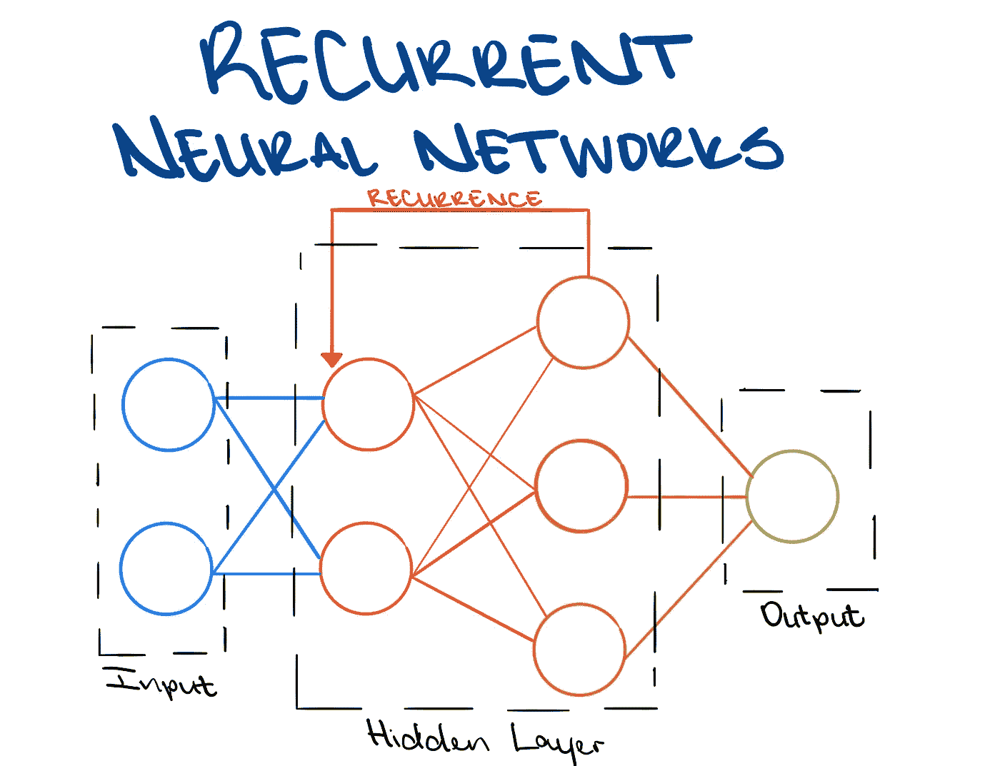
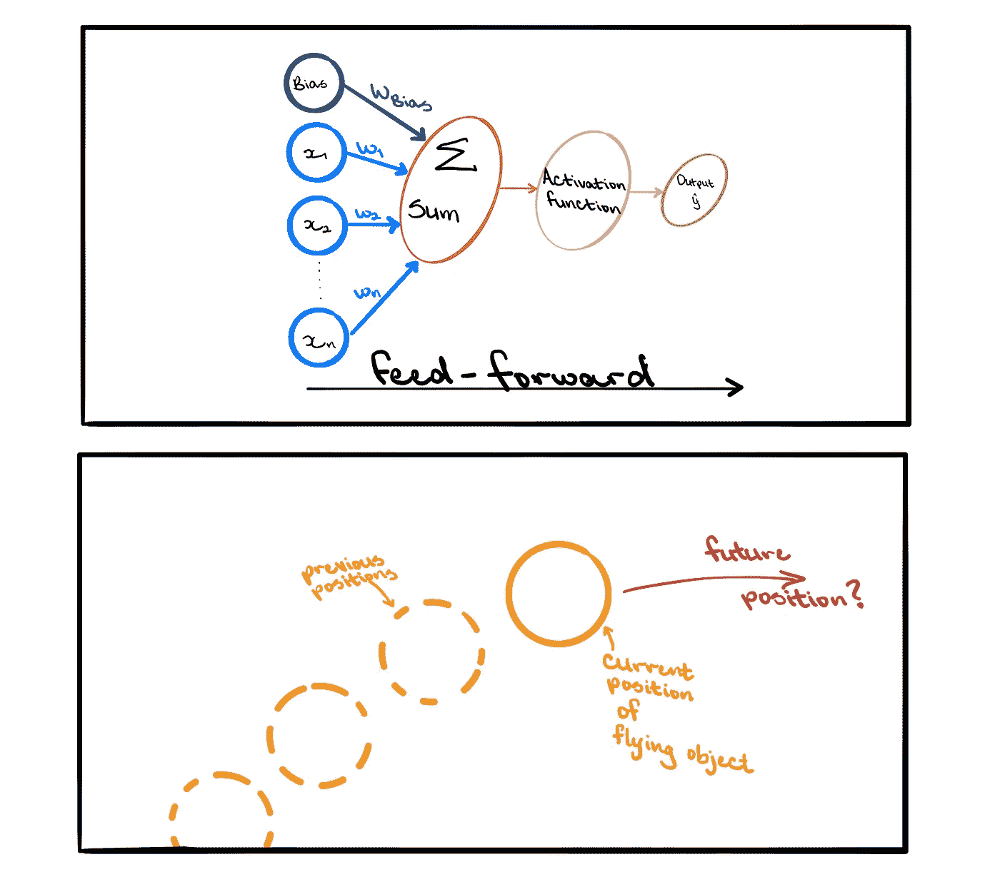
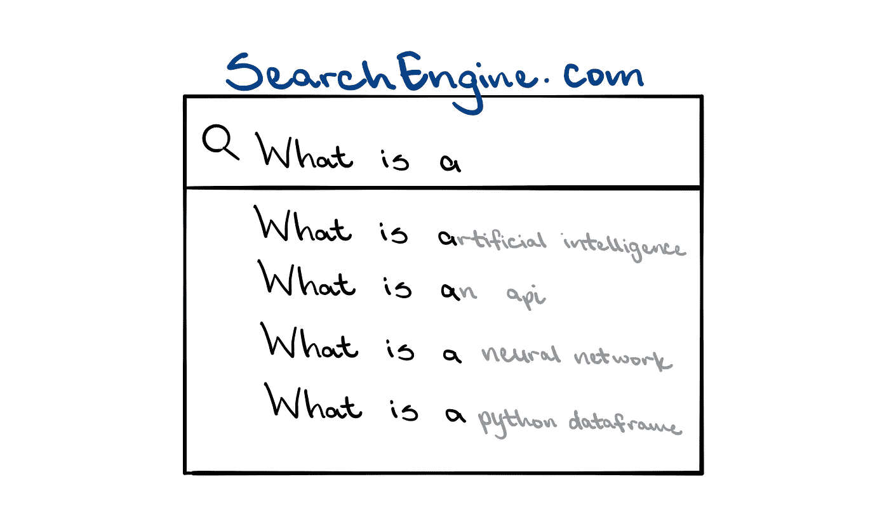
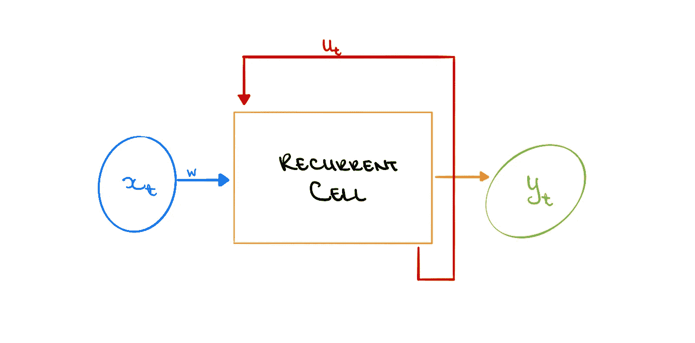
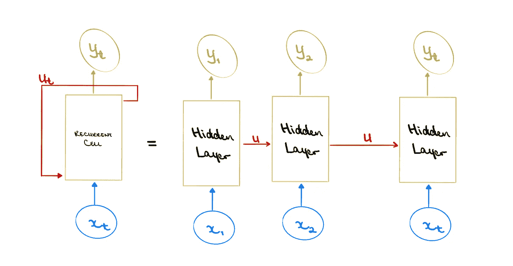
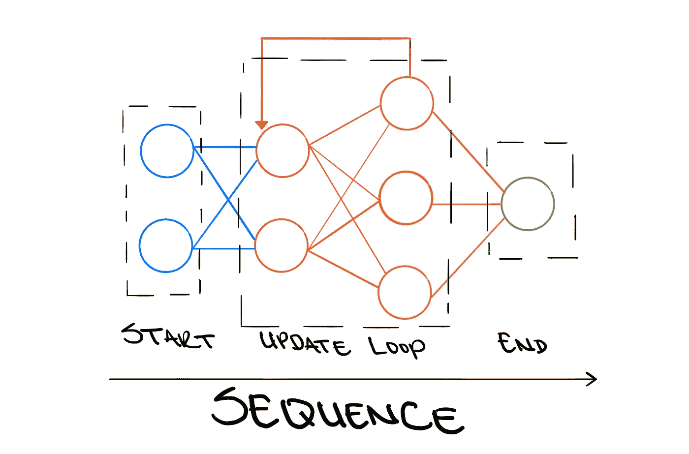

# 引入递归神经网络

> 原文：<https://towardsdatascience.com/introducing-recurrent-neural-networks-f359653d7020?source=collection_archive---------28----------------------->

## 堆叠感知器不适合顺序任务。而是使用 RNNs。

作者图片

人工智能(AI)正在弥合技术和人类之间的差距，让机器自动从数据中学习东西，变得更加‘像人’；因此，变得更加“聪明”。在这种情况下，智能可以被认为是处理信息的能力，这些信息可以用来为未来的决策提供信息。这是理想的，因为人类可以通过识别旧的模式、发展新的联系，并以新的视角感知他们所学的东西来开发新的有效的过程，从而自发地将信息整合在一起。当与机器的计算能力相结合时，可以获得巨大的成果。

自动学习和计算效率的结合可以用深度学习来最好地描述。这是人工智能和机器学习(ML)的一个子集，其中算法用于确定数据中的模式，并开发一个目标函数，该函数将输入变量 *x* 最佳映射到目标变量 *y* 。这里的目标是自动提取未来决策所需的最有用的信息。深度学习模型非常强大，可以用来解决各种各样的问题；从预测学生通过课程的可能性，到使用 Face ID 识别个人的面部来解锁他们的 iPhones。

作者图片

深度学习模型建立在“神经网络”的思想之上，这就是允许模型从原始数据中学习的东西。简单来说，深度神经网络是通过堆叠感知器创建的，感知器是单个神经元。通过具有一组输入 *x* ，信息通过该系统向前传播，并且每个输入具有相应的权重 *w* 。输入还应包括独立于 *x* 的“偏置项”。给定手边的问题，偏差项用于相应地移动所使用的函数。然后将每个对应的输入和权重相乘，并计算乘积之和。然后，该和通过非线性激活函数，并且产生输出 *y，*。

然而，这种“前馈”类型的模型并不总是适用的，并且它们的基本架构使得很难将它们应用于某些场景。例如，考虑一个模型，该模型被设计成在给定一个飞行物体的快照的情况下，预测该飞行物体接下来将去往何处。这是一个顺序问题，因为对象将随着时间的推移覆盖一段距离，并且对象的当前位置将取决于对象先前的位置。如果没有给出该物体之前位置的信息，那么预测该物体下一步的位置也不过是一个随机的猜测。

作者图片

让我们考虑另一个简单但重要的问题:预测下一个单词。这样做的模型现在很常见，因为它们被用在诸如自动填充和自动更正的应用程序中，并且它们通常被认为是理所当然的。这是一个连续的任务，因为最合适的“下一个单词”取决于之前的单词。前馈网络不适合这项任务，因为它需要一个具有特定长度的句子作为输入，然后预测下一个单词。但是，这是一个问题，因为我们不能保证每次输入的长度都相同，这样模型的性能就会受到负面影响。

解决这个问题的一个潜在方法是只查看这个输入句子的一个子部分，比如最后两个单词 maybe。这解决了可变长度输入的问题，因为不管总输入长度如何，模型将仅使用句子的最后两个单词来预测下一个单词。但这仍不理想，因为该模型现在无法考虑长期依赖关系。也就是说，考虑这样一句话“我在柏林长大，一年前才搬到纽约。我能说流利的……”。如果只考虑最后两个词，每种语言的可能性都是一样的。但是当考虑整个句子时，德语是最有可能的。

作者图片

克服这些问题的最好方法是拥有一个全新的网络结构；一个可以随时更新信息的系统。这是一个**递归神经网络** (RNN)。这类似于感知机，随着时间的推移，信息通过一组输入在系统中转发， *x* ，每个输入都有一个权重， *w* 。然后将每个相应的输入和权重相乘，并计算乘积的总和。该和然后通过非线性激活函数，并且产生输出 *y，*。

不同之处在于，除了输出，网络还产生内部状态更新， *u* 。然后在分析下一组输入信息时使用该更新，并提供也依赖于先前信息的不同输出。这很理想，因为信息会随着时间的推移在整个网络中持续存在。顾名思义，这个更新函数本质上是一个发生在顺序过程的每一步的递归关系，其中 *u* 是前一个 *u* 和当前输入 *x* 的函数。

作者图片

随着时间的推移，在 RNN 系统中循环的概念可能有点抽象，难以理解。另一种思考 RNN 的方式是随着时间的推移展开这个系统。也就是说，把 RNN 想象成一组奇异的前馈模型，其中每个模型通过内部状态更新链接在一起。像这样观察 RNN 可以真正提供一些关于为什么这种结构适合顺序任务的见解。在序列的每一步，都有一个输入、对该输入执行的某个过程和一个相关的输出。对于序列的下一步，前一步必须有一些影响不影响输入但影响相关输出。

如果我们回到飞行物体场景或单词预测场景，并使用展开的 RNN 来考虑它们，我们将能够更好地理解解决方案。在飞行物体的每个先前位置，我们可以预测一条可能的路径。预测路径随着模型接收到关于对象先前位置的更多信息而更新，并且该信息自我更新，然后馈入模型的未来序列。类似地，当句子场景中的每个新单词被输入到模型中时，就会生成新的可能单词组合。

作者图片

神经网络是人工智能和人工智能的重要组成部分，因为它们允许模型自动从数据中学习，并且它们将人类学习的一个版本与强大的计算能力相结合。然而，将非顺序结构应用于顺序任务将导致模型性能不佳，并且神经网络的真正能力将得不到利用。rnn 是人工学习系统，它基于以前的信息在内部更新自己，以便随着时间的推移预测最准确的结果。

**参考文献:**

[DSpace . MIT . edu/bitstream/handle/1721.1/113146/1018306404-MIT . pdf？序列=1](https://dspace.mit.edu/bitstream/handle/1721.1/113146/1018306404-MIT.pdf?sequence=1)

[Stanford . edu/~ sher vine/teaching/cs-230/cheat sheet-recurrent-neural-networks](https://stanford.edu/~shervine/teaching/cs-230/cheatsheet-recurrent-neural-networks)

[wild ml . com/2015/09/recurrent-neural-networks-tutorial-part-1-introduction-to-rnns/](http://www.wildml.com/2015/09/recurrent-neural-networks-tutorial-part-1-introduction-to-rnns/)

[karpathy.github.io/2015/05/21/rnn-effectiveness/](http://karpathy.github.io/2015/05/21/rnn-effectiveness/)

**其他有用的素材:**

[deeplearning.mit.edu/](https://deeplearning.mit.edu/)

[neuralnetworksanddeeplearning.com/](http://neuralnetworksanddeeplearning.com/)

towardsdatascience.com/what-is-deep-learning-adf5d4de9afc

[towards data science . com/the-mathematics-behind-deep-learning-f 6 c 35 a 0 Fe 077](/the-mathematics-behind-deep-learning-f6c35a0fe077)