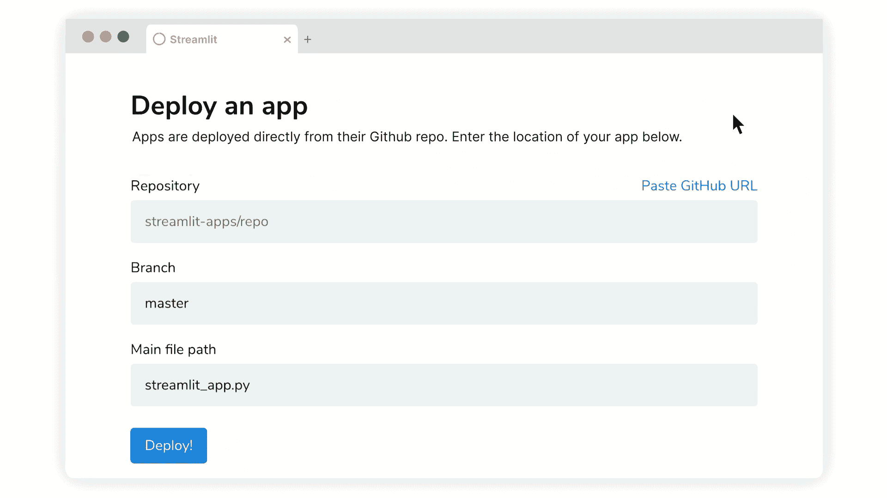
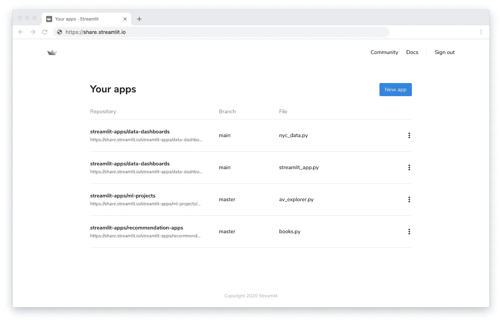
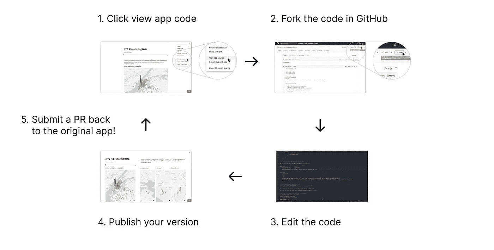

# 引入简化共享

> 原文：<https://towardsdatascience.com/introducing-streamlit-sharing-b4f520e3d95?source=collection_archive---------43----------------------->

## 免费部署、管理和共享您的 Streamlit 应用



机器学习和数据科学代码易于共享，但难以使用。GitHub 充斥着模型、算法和数据集。但是代码是静态的。你能和模特一起玩吗？看到算法了吗？与数据互动？这样做需要遵循复杂的指令、安装包或阅读密集的代码片段。对此感到沮丧，我们决定**我们需要一个简单的、可共享的“播放”按钮来播放机器学习代码。**

这里有两个挑战。第一个是**开发**应用，让数据科学和机器学习代码互动。第二是**分享**这些应用程序，这样世界就可以体验你的工作。

一年前，我们通过发布 Streamlit 解决了第一个挑战— **创建—** ，这是一个开源库，允许您将 Python 脚本转换为交互式应用。Streamlit 让您可以轻松演示算法、玩模型、操作数据，并将所有这些超能力结合到漂亮的应用程序中。反响是巨大的。我们刚刚完成了第一百万次下载。世界各地已经创建了成千上万的 Streamlit 应用程序。但是创建优秀的应用程序只能解决一半的问题。

# 轻松部署和共享您的简化应用

今天，我们通过宣布一个全新的 Streamlit 共享平台来应对第二个挑战— **共享**。Streamlit 共享让您可以部署、管理和共享您的应用程序，这一切都是免费的！如果你有一个在 GitHub 上公开托管的 Streamlit 应用程序，你现在只需点击一下就可以与全世界分享它。



# GitHub 和 Streamlit——一起更好

Streamlit 共享**结合了 Streamlit 的精华和 GitHub 的精华。从 Streamlit 你可以得到一个简单的框架来创建极其丰富和有用的应用程序。从 GitHub 你继承了一个不可思议的社会协作框架。将你的 GitHub 链接粘贴到 Streamlit 的共享平台上，几乎立刻你就有了一个实时应用。或者，点击任何 live app 的菜单，在 GitHub 上查看其源代码。只需分叉和编辑代码即可免费协作。这是全球性的、可共享的、可分叉的、协作的数据科学！**



# 无限的可能性

结合在一起，Streamlit 和 GitHub 实现了一个极其丰富多样的有用应用生态系统——从仪表盘到深度网络等等！(作为前卡耐基梅隆大学的学生，我们特别自豪的是，参加[互动数据科学](https://dig.cmu.edu/courses/2020-fall-interactive-ds.html)课程的学生现在使用 Streamlit 共享提交作业🤗)这里有一些很棒的共享 Streamlit 应用程序的例子，你现在就可以玩。

虽然这篇文章关注的是开源应用程序，但是 Streamlit 也被成千上万的公司用来构建复杂的内部数据工具。例如，优步在整个公司范围内部署了 Streamlit，使数据科学家能够在整个公司内共享他们的工作。 **Streamlit for Teams** 扩展 Streamlit 的共享平台，在您的企业中实现安全、无缝的应用部署、管理和协作*。如果你感兴趣，请[注册团队](https://streamlit.io/for-teams)的 Streamlit 测试版。*

# 获得简化共享的邀请

为了庆祝发布，我们将**发布 1，000 份 Streamlit 共享邀请** **—** 随着我们服务器容量的增长，会有更多的邀请。如果您的收件箱中还没有邀请，请[请求邀请](https://streamlit.io/sharing)，我们将很快为您发送邀请。


# Streamlit 播放按钮

这种新的共享能力完成了 Streamlit 循环——从创建到共享，然后再返回。所以创造吧！与世界分享！让别人看到你的工作，分叉，合并，促成知识创造的循环。本着这种精神，我们提供最后一件礼物:**这是我们的“播放”按钮。**

[](https://share.streamlit.io/streamlit/demo-uber-nyc-pickups/)

这个全新的徽章帮助其他人找到并使用您的 Streamlit 应用程序。将它嵌入到 GitHub `readme.md`中，如下所示:

```
[](https://share.streamlit.io/yourGitHubName/yourRepo/yourApp/)
```

谢谢你们用你们令人惊叹的创作激励了我们。我们很高兴看到你的建设和分享。🎈

*我们细流 it 的所有人非常感谢社区中的所有人，特别是细流 it 的创始人，*[*Ashish*](https://discuss.streamlit.io/u/ash2shukla/summary)*[*Charly*](https://discuss.streamlit.io/u/charly_wargnier/summary)*[*fani lo*](https://discuss.streamlit.io/u/andfanilo/summary)*[*jos*](https://discuss.streamlit.io/u/napoles3d/summary)*[*杰西*还要特别感谢所有 launch app 的创作者，Alex、Dan、Ines | Explosion，最后还有 Tyler，他不仅创作了**](https://discuss.streamlit.io/u/jesse_jcharis/summary)*[*Goodreads app*](https://share.streamlit.io/tylerjrichards/book_reco/master/books.py)*，还创作了一个很棒的分享教程。******