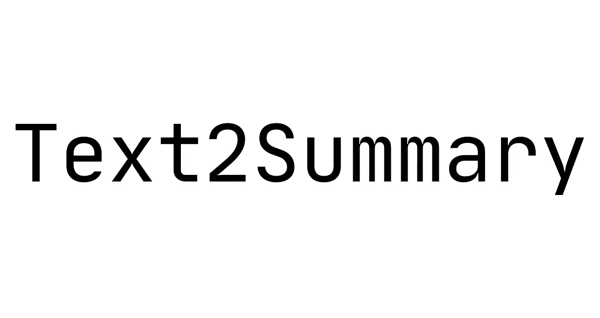

# 介绍 Text 2 summary:Android 上的文本摘要(使用 TF-IDF)

> 原文：<https://towardsdatascience.com/introducing-text2summary-text-summarization-on-android-674b62419019?source=collection_archive---------38----------------------->

## 📱[移动机器学习](https://equipintelligence.medium.com/list/stories-on-mobile-ml-with-kotlin-and-tf-lite-3ebee822c87b)

## 一个简单易用的库，用于在 Android 上生成文本摘要



[出处。](https://github.com/shubham0204/Text2Summary-Android)

互联网充斥着大量的数据。如果我们只谈论文本数据，这包括在线新闻、博客、故事和其他信息库。这里是**文本摘要**出现的地方。文本摘要模型的最终目标是以一种潜在的形式表现文本信息，这种潜在的形式损害了文本的语义。抱着这个想法，我开发了 [Text2Summary](https://github.com/shubham0204/Text2Summary-Android) ，一个 Android 应用的文本摘要器。

[](https://github.com/shubham0204/Text2Summary-Android) [## Shu bham 0204/text 2 summary-Android

### Text2Summary API 使用设备上的方法在 Android 应用程序上执行文本摘要。它使用摘录文本…

github.com](https://github.com/shubham0204/Text2Summary-Android) 

在这个故事中，我们讨论了 [Text2Summary](https://github.com/shubham0204/Text2Summary-Android) 的需求、安装和使用。

# Text2Summary 有什么特别之处？

如果你想总结应用程序用户选择的大量文本，你面前有两个选择。要么创建一个[抽象的](https://www.analyticsvidhya.com/blog/2019/06/comprehensive-guide-text-summarization-using-deep-learning-python/)文本摘要模型，要么创建一个[提取的](https://medium.com/sciforce/towards-automatic-text-summarization-extractive-methods-e8439cd54715)文本摘要模型。

> 在这里你可以理解上述方法[的区别。简单明了地说，抽象模型就像一个人阅读给定的内容，然后自己写摘要。一个精挑细选的模特是一个只配有荧光笔的人，他会突出重要的句子，并对它们进行总结。](https://www.quora.com/Natural-Language-Processing-What-is-the-difference-between-extractive-and-abstractive-summarization)

如果你有机器学习的背景，你可能想从 Seq2Seq NN 中创建一个抽象模型。如果你不是来自机器学习背景，Seq2Seq 可能会令人害怕。

**这里是 Text2Summary，**

Text2Summary 使用提取模型，这意味着它使用提供给它的文本的句子创建摘要。它使用一种 [TF-IDF 算法](https://www.onely.com/blog/what-is-tf-idf/)从文本中获取最有意义的句子。这个算法比上图简单，并且在计算能力有限的 Android 设备上高效运行(与那些 GPU/TPU 马相比！).

# 听起来很酷。如何在我的 Android 项目中添加 Text2Summary？

首先，我们进入项目级的`build.gradle`文件。添加下面的 [JitPack](https://jitpack.io/) 仓库，

```
allprojects {
    repositories {
        // Other dependencies
        maven { url 'https://jitpack.io' }
    }
}
```

注意到[最新发布的 Text2Summary](https://github.com/shubham0204/Text2Summary-Android/releases) 后，在你的 app 级`build.gradle`文件中添加依赖关系，

```
dependencies {
    // Other dependencies
    implementation 'com.github.shubham0204:Text2Summary-Android:alpha-02'
}
```

仅此而已。我们准备使用 Text2Summary！

# 如何在我的应用程序中使用 Text2Summary？

首先，获取您希望以`String`形式总结的文本。然后，使用`Text2Summary.summarize()`方法开始使用 API，

```
var summary = Text2Summary.summarize( text , compressionRate = 0.7 )
```

> **上面的** `**compressionRate**` **是什么？**
> 
> 它是文本的一部分，长度等于摘要长度。例如，如果您希望创建原始文本的 3/4 摘要，请使用 0.75 的压缩率。

您可能想从用户存储器上的`File`中读取文本，

```
val bufferedReader: BufferedReader = File( "poems.txt" ).bufferedReader()
val text = bufferedReader.use{ it.readText() }
val summary = Text2Summary.summarize( text , 0.7 )
```

从这里你应该能最大程度地了解 Text2Summary。但是等等。有没有遇到 UI 线程堵塞的情况？打`Text2Summary.summarize()`的时候活动是不是停了一会儿？

Text2Summary 需要执行各种操作，包括`ArrayList`和`Hashmap`。如果文本很大，UI 线程会停止一段时间。为了解决这个问题，使用`summarizeAsync()`执行文本摘要，

```
val callback = object : Text2Summary.SummaryCallback {
    override fun onSummaryProduced(summary: String) {
        // The summary is ready!
    }
}
Text2Summary.summarizeAsync( someLongText , 0.7f , callback  )
```

# 一些其他有用的资源

# 结束了

我希望你喜欢`Text2Summary.`在你的 Android 应用中使用它，并分享你的问题和建议。谢谢！