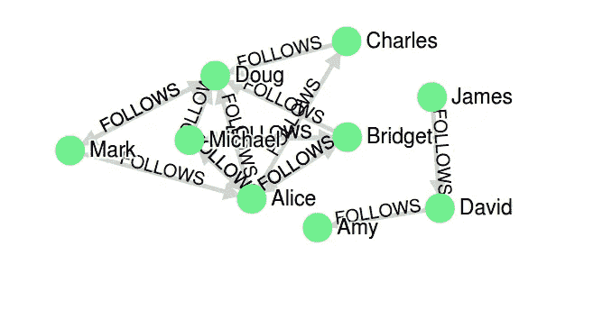

# Neo4j 图形数据科学插件的预览，包含“图形算法:Apache Spark 和 Neo4j 中的实用示例”一书中的示例

> 原文：<https://towardsdatascience.com/introducing-the-neo4j-graph-data-science-plugin-with-examples-from-the-graph-algorithms-19b831f66f2?source=collection_archive---------13----------------------->

在过去的几年里，数据科学领域获得了很大的发展。它已经成为商业和学术研究的重要组成部分。结合日益流行的图形和图形数据库， [Neo4j](https://neo4j.com/) 的人们决定发布[图形数据科学](https://github.com/neo4j/graph-data-science) (GDS)插件。它是[图形算法](https://github.com/neo4j-contrib/neo4j-graph-algorithms)插件的继承者，即将被弃用。然而，这仍然是 GDS 的预览版，正式发布将在未来几周内进行。

那些熟悉图形算法插件的人会注意到，为了更平滑的过渡，语法没有太大的变化。为了展示所发生的变化，我准备了迁移指南，形式为 [Apache Zeppelin](https://zeppelin.apache.org/) 笔记本，可以在 [GitHub](https://github.com/tomasonjo/zeppelin-graph-algo) 上找到。

Apache Zeppelin 的 Neo4j 连接器由 Andrea Santurbano 开发，他还设计了这个项目的漂亮主页笔记本，并帮助他出主意。在迁移指南中，我们使用了来自[图算法的例子:由](https://neo4j.com/graph-algorithms-book/) [Mark Needham](https://twitter.com/markhneedham) 和 [Amy Hodler](https://twitter.com/amyhodler) 撰写的 Apache Spark 和 Neo4j 书中的实际例子。由于这本书还演示了图算法的 Apache Spark 实现，我们决定也包括它们是合适的。在建立 Apache Spark 环境时，我遇到了与这本书的合著者相同的问题，他写了一篇关于这个问题的博文。大声喊马克！

以下是你可以从这个项目中期待的:

*   16 本单图算法笔记本，包含 Apache Spark 中的实现以及到 GDS 的迁移指南
*   《移植到 GDS》中的链接预测分析

*Neo4j 图形数据科学和图形算法插件不兼容，因此它们不会在 Neo4j 的单个实例上协同工作。在这个项目中，我们使用了两个 Neo4j 实例来演示新旧语法。*

为了更好地了解笔记本所提供的功能，我们现在将浏览 PageRank 示例笔记本。你将在这篇博文中看到的所有引文都是从上述书中摘录的。

# PageRank 算法简介

每个图形算法都有一个主笔记本，其中包括算法及其用例的简短介绍。以下是对 PageRank 算法的介绍:

> PageRank 是以谷歌联合创始人拉里·佩奇的名字命名的，他创建了 Page rank 来对谷歌搜索结果中的网站进行排名。基本的假设是，一个有更多传入和更有影响力的传入链接的页面更有可能是一个可信的来源。PageRank 测量节点的传入关系的数量和质量，以确定对该节点重要性的估计。在网络上具有更大影响力的节点被认为具有来自其他有影响力的节点的更多传入关系。

在主笔记本的底部，您会找到 Neo4j 和/或 Apache Spark 算法实现的链接。

# Neo4j 中的 PageRank 实现

在实际的笔记本中，你会发现图形算法和图形数据科学算法的例子。尽管如此，为了这篇博文的清晰，我决定只展示新的 GDS 语法。

## 加载示例图表:

GitHub 上的示例图是一个 CSV 文件，可以使用`LOAD CSV` cypher 语句轻松获取。

```
// import nodes
WITH “[https://raw.githubusercontent.com/neo4j-graph-analytics/book/master/data/social-nodes.csv](https://raw.githubusercontent.com/neo4j-graph-analytics/book/master/data/social-nodes.csv)"
AS uri
LOAD CSV WITH HEADERS FROM uri AS row
MERGE (:User {id: row.id});// import relationships
WITH “[https://raw.githubusercontent.com/neo4j-graph-analytics/book/master/data/social-relationships.csv](https://raw.githubusercontent.com/neo4j-graph-analytics/book/master/data/social-relationships.csv)"
AS uri
LOAD CSV WITH HEADERS FROM uri AS row
MATCH (source:User {id: row.src})
MATCH (destination:User {id: row.dst})
MERGE (source)-[:FOLLOWS]->(destination);
```

我们可以通过使用下面的 cypher 语句来可视化 Zeppelin 中的示例图:

```
MATCH p=(:User)-[:FOLLOWS]->(:User)
RETURN p;
```

结果



Apache Zeppelin 中可视化的示例图

# 图形数据科学插件

## 创建预加载的命名图

推荐使用 GDS 库的方法是预加载命名图。投影图可以存储在内存中，以后可以通过任何图形算法使用其名称进行检索。这允许更有效的图形分析管道，其中我们在同一个内存图形上按顺序运行许多图形算法。

一般语法是:

```
CALL gds.graph.create('nameOfGraph','NodeLabel','RelationshipType')
```

在本例中，我们将使用以下 cypher 语句将图形加载到内存中:

```
CALL gds.graph.create(‘pagerank_example’, ‘User’, ‘FOLLOWS’);
```

## 流式传输算法的结果

算法结果流的一般语法是:

```
CALL gds.<algorithm>.stream()
```

对于 PageRank 示例，cypher 过程如下所示:

```
CALL gds.pageRank.stream(‘pagerank_example’,
    {maxIterations: 20, dampingFactor: 0.85}) YIELD nodeId, score
RETURN gds.util.asNode(nodeId).id AS name, score
ORDER BY score DESC LIMIT 10
```

结果

Neo4j 页面排名结果

> 正如我们所料，Doug 拥有最高的 PageRank，因为在他的子图中，所有其他用户都跟随他。虽然马克只有一个追随者，这个追随者就是
> 道格，所以马克在这个图中也被认为是重要的。重要的不仅仅是关注者的数量，还有那些关注者的重要性。

## 写回算法的结果

有时候，我们想把算法的结果写回图中，而不是流出来。写回算法的一般语法是:

```
CALL gds.<algorithm>.write({writeProperty:'pagerank'})
```

其中如果您想写回结果，参数`writeProperty`是强制的。这是为了防止对图形进行任何不必要的写入。

在我们的 PageRank 示例中，我们使用:

```
CALL gds.pageRank.write(‘pagerank_example’,
    {maxIterations: 20, dampingFactor: 0.85,     
     writeProperty:’pageRank’})
```

## 从内存中释放加载的图形

完成图形分析后，我们想使用下面的 cypher 语句从内存中释放 GDS 图。

```
CALL gds.graph.drop(‘pagerank_example’);
```

# 用 Apache Spark 实现的 PageRank

如前所述，这本书还提供了 Apache Spark 中图形算法的实现，所以我只是将它们复制到笔记本上。

## 加载示例图表:

在这个例子中，我们使用 GraphFrames 库来加载图表并计算 PageRank 中心性。

```
def create_social_graph():
    nodes = spark.read.csv(“spark-warehouse/social-nodes.csv”, header=True)
    relationships = spark.read.csv(“spark-warehouse/social-relationships.csv”, header=True)
    return GraphFrame(nodes, relationships)g = create_social_graph()
```

## 迭代次数固定的 PageRank

> 让我们看一个固定迭代方法的例子。
> 注意在 Spark 中，阻尼因子更直观地被称为
> 重置概率，具有相反的值。换句话说，本例中 reset
> Probability=0.15 相当于 Neo4j 中的 dampingFactor:0.85。

```
results = g.pageRank(resetProbability=0.15, maxIter=20)
results.vertices.sort(“pagerank”, ascending=False).show()
```

结果

具有固定迭代次数的 Spark PageRank

结果类似于 Neo4j 的结果。

> PageRank 的实现各不相同，因此即使排序相同，它们也会产生不同的
> 得分。Neo4j 使用值 1 减去阻尼因子来初始化节点
> ，而 Spark 使用值 1 初始化
> 。在这种情况下，相对排名(Pag 的目标是
> eRank)是相同的，但是用于达到
> 这些结果的基础分值是不同的。

## PageRank 直到收敛

> 现在，让我们尝试运行 PageRank 的收敛实现，直到它在设定的容差范围内逼近一个解决方案:

```
results = g.pageRank(resetProbability=0.15, tol=0.01)
results.vertices.sort(“pagerank”, ascending=False).show()
```

结果

带收敛策略的 Spark PageRank

> 每个人的 PageRank 分数与固定迭代次数变量略有不同，但正如我们所料，他们的顺序保持不变。

# 个性化页面排名

> 我们可以通过传入 sourceId 参数来计算给定节点的个性化 PageRank 分数。以下代码计算道格的 PPR:

```
me = “Doug”
results = g.pageRank(resetProbability=0.15, maxIter=20, sourceId=me)
people_to_follow = results.vertices.sort(“pagerank”, ascending=False)already_follows = list(g.edges.filter(“src = ‘{me}’”).toPandas()[“dst”])
people_to_exclude = already_follows + [me]people_to_follow[~people_to_follow.id.isin(people_to_exclude)].show()
```

结果

Spark 个性化页面排名

> 这个查询的结果可以用来为道格应该关注的人提供建议。请注意，我们还确保从我们的最终结果中排除道格已经关注的人以及他自己。
> 
> 爱丽丝是道格应该追随的最佳人选，但我们也可以推荐迈克尔和布里奇特。

# 结论

再次感谢 Amy 和 Mark 编写了这本优秀的书，感谢 Neo4j 图表数据科学团队提供了如此出色的工具来帮助我们在图表中找到更多见解。正如我在这篇博文的介绍中提到的，目前这仍然是 GDS 插件的预览版，正式发布将在接下来的几周内进行。自己试试[图形数据科学](https://github.com/neo4j/graph-data-science)插件，请分享任何评论、反馈或建议。

一如既往，你可以在 [GitHub](https://github.com/tomasonjo/zeppelin-graph-algo) 上找到这些笔记本。