# 介绍“向后走”:一种预测未来的新方法

> 原文：<https://towardsdatascience.com/introducing-walk-backward-a-novel-approach-to-predicting-the-future-c7cf9e15e9e2?source=collection_archive---------28----------------------->

## 受够了及时验证！“向后走”使预测模型更加准确和可靠

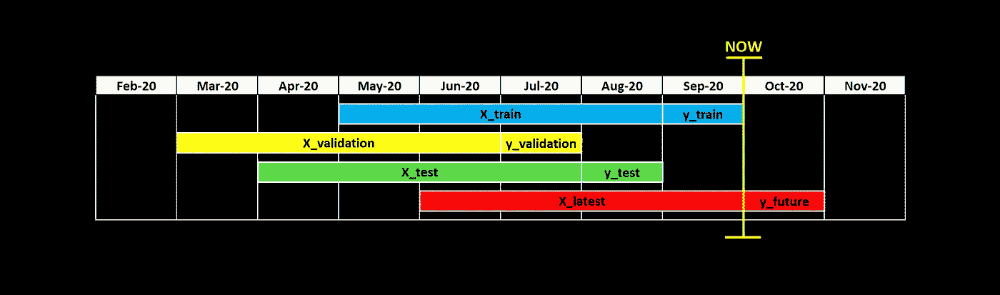

# "永远不要做预测，尤其是对未来的预测。"(k·k·斯坦克)

1.  这幅画描绘的是马还是车？
2.  该顾客在下周购买该商品的可能性有多大？
3.  这个人会在下一年无法偿还贷款吗？
4.  这句话怎么翻译成西班牙语？

这些问题或许可以用机器学习来回答。但是，问题 1 和问题 4 关注的是已经存在的事物(一张图片，一个句子)，而问题 2 和问题 3 关注的是未来的事件，即尚未发生的事件。这有关系吗？的确如此。

事实上，**我们都知道——首先作为人类，然后作为数据科学家——预测未来是很难的**。

从技术角度来看，这是由于[概念漂移](https://en.wikipedia.org/wiki/Concept_drift)，这是一个非常直观的概念:现象随着时间而变化。**由于我们想要预见的现象在不断变化，使用一个模型(基于过去的经验)来预测未来带来了额外的挑战**。

在这篇文章中，我将描述三种可能用于预测未来的机器学习方法，以及它们如何应对这些挑战。

1.  **及时**:最常采用的方式。就结构而言，它深受概念漂移之苦。
2.  **向前走**:在金融等一些领域常见，但在机器学习中还是不那么常见。它克服了及时的一些弱点，但代价是引入了其他缺点。
3.  **向后行走**:一种新颖的方法，结合了及时行走和向前行走的优点，同时减少了它们的缺点。我在真实的、庞大的、杂乱的数据上试了试，结果证明效果非常好。

在文章的第一部分，我们将介绍这三种方法。在第二部分中，我们将在数据上尝试它们，看看哪一个效果最好。

# 第一种方法:“及时”

假设今天是 2020 年 10 月 1 日，你想预测下一个月(即从今天到 10 月 31 日)你公司客户流失的概率。

下面是大多数数据科学项目如何解决这个问题:

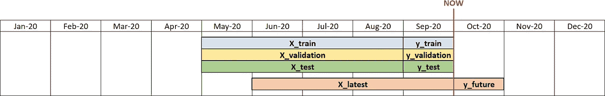

及时的方法。

> 注意:包含在 **X** 中的信息可以无限回溯(但是，在所有的图中，为了直观起见，只能回溯 4 个月)。

**这种方法被称为“实时”，因为所有数据集(训练、验证和测试)都来自同一个时间点**(在这种情况下，是 9 月)。通过培训、验证和测试，我们打算:

*   **Train set**(***X _ Train***和 ***y_train*** ):模型将要学习的数据。
*   **验证集**(***X _ Validation***和 ***y_validation*** ):用于提前停止的数据。在训练阶段，在每次迭代中，都会计算验证性能。当这种性能停止改善时，意味着模型已经开始过度拟合，因此训练停止。
*   **测试集** ( ***X_test*** 和 ***y_test*** ):训练阶段从未使用过的数据。仅用于评估您的模型在未来的实际表现。

现在您已经收集了数据，您可以在训练集(9 月)上拟合一个预测模型(假设是 Xgboost)。在测试集上的性能如下:准确率为 50%，召回率为 60%。既然您对这个结果感到满意，您决定将这个结果传达给利益相关者，并在 10 月份进行预测。

一个月后，你去检查你的模型在十月份的实际表现。一场噩梦。准确率 20%，召回率 25%。这怎么可能呢？你做的一切都是对的。你验证了你的模型。然后你测试了它。**为什么测试性能和观察性能相差如此之大？**

# 过时了

问题是及时方法完全忽略了概念漂移。事实上，这个假设是含蓄地提出的:

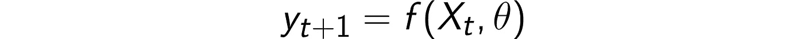

时间背后的本质:参数(θ)不随时间变化。

在这个框架中，当模型被训练时*实际上并不重要，因为 ***f(θ)*** 被假定为随时间恒定。不幸的是，现实中发生的事情是不同的。事实上，概念漂移使得 ***f(θ)*** 随着时间而变化。在公式中，这将转化为:*

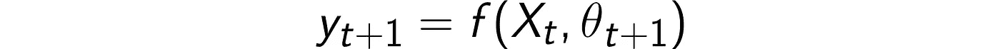

一个更一般(也更现实)的假设:参数取决于时间。

为了考虑这种影响，我们需要将我们的思维模式从及时转变为不及时。

# 第二种方法:“向前走”

超时的一种形式——主要用于金融——被称为“漫步”(阅读罗杰·斯坦的[这篇文章](http://www.rogermstein.com/wp-content/uploads/BenchmarkingDefaultPredictionModels_TR030124.pdf)以了解更多)。这个名字来源于这样一个事实，即模型是根据用于训练的数据在时间上向前验证和/或测试的。视觉上:

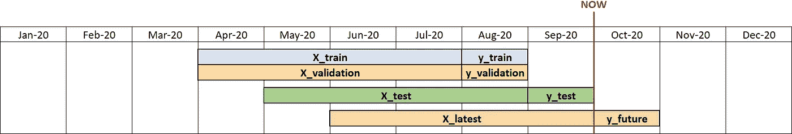

向前走的方法。

这种配置的优点是它模拟了模型的实际使用。其实模型是在***t***(8 月)进行训练，在***t+1***(9 月)进行评估。因此，这是 9 月份训练和 10 月份预测的一个很好的代理。

然而，当我在真实数据上尝试这种方法时，我注意到它有一些主要缺点:

1.  如果您使用 8 月份训练的模型来预测 10 月份的情况，您将使用一个 2 个月前的模型！因此，**十月份的性能会比使用 In-Time 时更差。实际上，这是因为最新的数据被“浪费”在测试**上。
2.  或者，**如果您在 9 月重新培训模型，您将再次陷入及时。而且，最后估计 10 月份车型的预期表现**也不会很容易。这样你就能回到起点。

总而言之，我喜欢超越时间的想法，但在我看来，步行前进是不值得的。

# 第三种方法:“向后走”

然后，这个想法出现在我的脑海中:有没有可能概念漂移在某种程度上随着时间的推移是“不变的”？换句话说，**预测 1 个月的未来或 1 个月的未来会导致相同的表现吗？**

如果是这样的话，我会一石二鸟(不，等等，三只鸟)。事实上，我会保留以下好处:

1.  **使用最新数据进行训练**(如及时发生的，但不是提前发生的)；
2.  **对模型在下个月的表现做出可靠的估计**(如在 Walk-Forward 中发生的，但不是在 In-Time 中)；
3.  **只训练一个模型**(在实时中发生，但在步行中不发生)。

简而言之，我会保留每种方法的优点，同时消除它们的缺点。这就是我如何得到以下配置的:

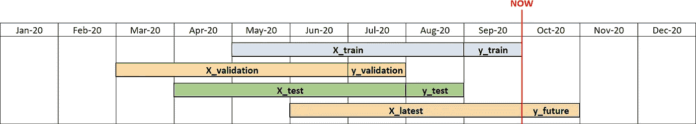

向后走的方法。*注:使用不同的时间窗口进行训练、测试和验证(即使是对相同的观测值)没有方法上的问题，只要预测窗口(在这种情况下，****y _ train****，****y _ validation****和****y _ test****)不重叠。*

我称之为“向后走”,因为它与向前走正好相反:训练基于最新的数据，而验证和测试基于以前的时间窗口。

我知道在 9 月份训练一个模型(并在 7 月份验证它)，然后在 8 月份检查它的表现，甚至期望这是对它在 10 月份表现的一个很好的估计，这可能看起来很疯狂！这可能看起来像是我们乘坐德罗宁在时间上来回穿梭，但我保证我有一个很好的解释。

# 如果你喜欢哲学…

…然后是为什么倒着走有意义的哲学解释。我们来分解一下。

1.  对于每组(训练、验证和测试)，最好使用不同预测窗口。这对于避免验证数据或测试数据对模型的表现给出过于乐观的估计是必要的。
2.  给定点 1。，**9 月训练模特( *t* )是唯一合理的选择。这是因为该模型应该“学习一个与我们想要预测的世界尽可能相似的世界”。九月的世界( *t* )可能比过去任何一个月( *t-1* 、 *t-2* 、…)更类似于十月的世界( *t+1* )。**
3.  在这一点上，我们有一个 9 月份训练的模型，并想知道它在 10 月份的表现如何。**应该选择哪个月作为测试集？八月是最佳选择。事实上，八月的世界( *t-1* )与九月的世界( *t* )是“不同的”，正如十月的世界( *t+1* )与九月的世界( *t* )** )是“不同的”。发生这种情况的原因很简单:十月和八月离九月同样遥远。
4.  给分 1。, 2.第三。，使用 July ( ***t-2*** )作为验证集是唯一的必然结果。

# 如果你不喜欢哲学…

…那么，也许，你喜欢数字。在这种情况下，我可以向您保证:我在一个真实的用例上尝试了这种方法，与及时和向前行走相比，向后行走获得了:

1.  预测精度更高***y _ future***；
2.  在 ***y_test*** 和 ***y_future*** 上的性能差异较小(即 8 月观察到的精度是对 10 月实际获得的精度的更可靠估计)；
3.  在 ***y_train*** 和 ***y_test*** 上的性能差异较小(即过拟合较少)。

基本上，数据科学家能要求的一切。

# “我还是不相信你！”

没关系，我也是个多疑的人！这就是为什么我们会在一些数据上尝试及时、向前和向后，看看哪一个表现最好。

为此，我们将使用模拟数据。模拟数据是“在实验室”重现概念漂移并使结果可复制的一种便捷方式。这样，就有可能在更普遍的情况下检验向后行走的优越性是否得到了证实。

# **在实验室重现概念漂移**

我们取 12 个时间点(2020 年 1 月到 2020 年 12 月的月度数据)。假设每个月有 50 个特征在 5000 个人身上被观察到。这意味着 12 个数据帧(***x1***，…，***x12***)，每个数据帧具有 5000 行和 50 列。为了简单起见，这些列是根据正态分布生成的:

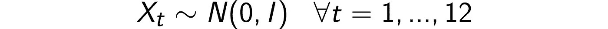

一旦 ***X*** 可用，我们就需要*(因变量，或目标变量)。出于简单起见， ***y*** 将是一个连续变量(但是结果可以很容易地扩展到 ***y*** 是离散的情况)。*

*假定 ***X*** 与 ***y*** 之间为线性关系:*

*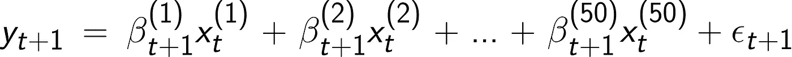*

****β* s 由 *t* 索引，因为参数随时间不断变化。这就是我们如何在简化版的世界中解释概念漂移的。***

*特别是 ***β*** s 根据 [ARMA 过程](https://en.wikipedia.org/wiki/Autoregressive%E2%80%93moving-average_model)变化。这意味着***【β(I)***的波动不是完全随机的:它们取决于***【β(I)***本身的过去值。*

*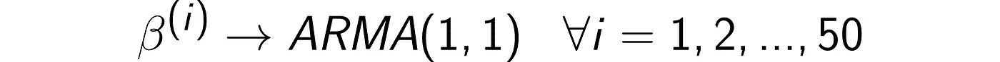*

*ARMA 系数(和误差)的选择是基于一个保守的假设，即月与月之间的波动不是很大(注意，一个更激进的假设会更倾向于过时的方法)。特别的，我们假设 ar 系数为-0.3，MA 系数为 0.3，误差的标准差为 0.5。这些是前 6 个(50 个中的) ***β*** 的结果轨迹。*

*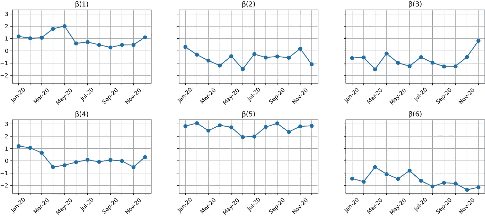*

*时间轨迹: ***β(1)*** *到****β(6)****。**

*这就是目标变量( ***y*** )的样子:*

*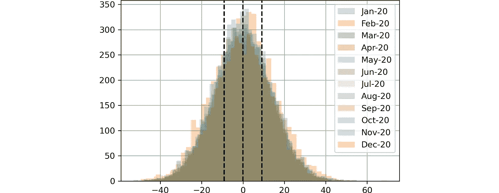*

***y** 的分布。虚线分别代表第 25、50 和 75 百分位。*

# *结果*

*现在我们有了数据，可以比较这三种方法。*

*由于这是一个回归问题( ***y*** 为连续变量)，所以选择了平均绝对误差(MAE)作为度量。*

*为了使结果更加可靠，每种方法都在所有时间点上执行(以“滑动窗口”的方式)。然后，对所有时间点的结果进行平均。*

*这是结果:*

*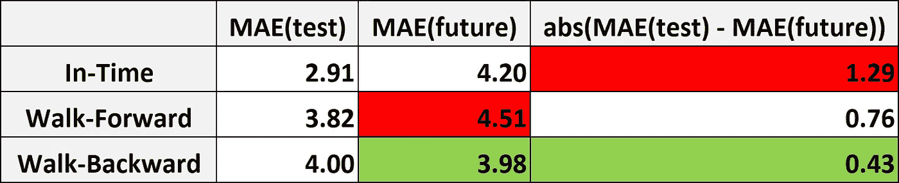*

*实验的结果。绿色:所选 KPI 的最佳结果。红色:所选 KPI 的最差结果。*

*通常，**预测模型好坏的最重要指标是在 *y_future* 观察到的性能。从这个角度来看，后退是最好的方法，因为它提供了最好的 MAE (3.98)** 。*

*但不止如此。看一下 In-Time: MAE( *测试*)平均 2.91，MAE( *未来*)4.20。因此，在现实世界的用例中，您将向涉众传达您期望您的模型交付 2.91 的 MAE。但是一个月后你会观察到的实际表现是平均 4.19。这是一个巨大的差异(和巨大的失望)！*

*实际上，**测试性能和未来性能之间的绝对差异，对于及时测试来说，平均是回溯测试的三倍(1.28 比 0.43)。因此，从这个角度来看，倒着走是目前为止最好的方法。***

*注意，**在现实世界的用例中，这个方面可能比性能本身更重要**。事实上，能够预测模型的实际性能——而不必等到下一阶段结束——对于分配资源和规划行动至关重要。*

> *结果完全可重复。Python 代码在[本笔记本](https://github.com/smazzanti/walk-backward)中有。*
> 
> *作者通过 [matplotlib](https://matplotlib.org/) (用于绘图)或 [codecogs](https://www.codecogs.com/latex/eqneditor.php) (用于乳胶配方)创建的所有图像。*

*感谢您的阅读！我希望这篇文章对你有用。*

*我感谢反馈和建设性的批评。如果你想谈论这篇文章或其他相关话题，你可以发短信给我[我的 Linkedin 联系人](https://www.linkedin.com/in/samuelemazzanti/)。*