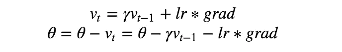
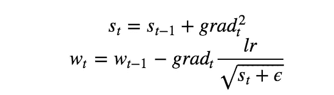
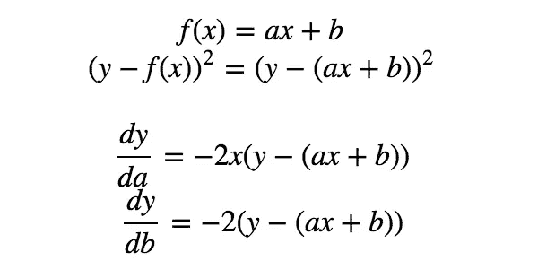
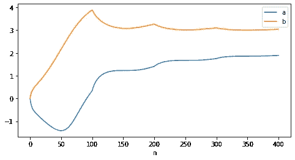
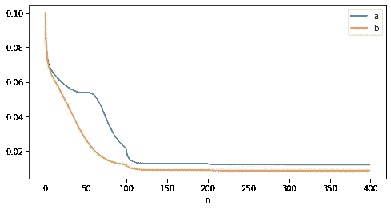
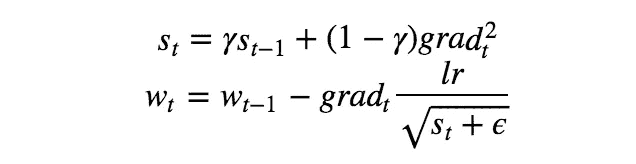
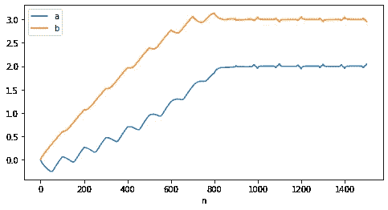
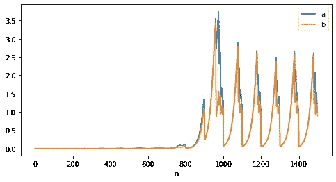

# Adagradient & RMSprop 的介绍与实现

> 原文：<https://towardsdatascience.com/introduction-and-implementation-of-adagradient-rmsprop-fad64fe4991?source=collection_archive---------28----------------------->

## 不同维度上的自适应学习率

在上一篇[文章](/stochastic-gradient-descent-momentum-explanation-8548a1cd264e)中，我们介绍了随机梯度下降和动量项，SGD 在传统梯度下降中增加了一些随机性，动量项有助于加速这一过程。然而，这两种方法都设定了固定的学习率:

上面显示了带有动量项的梯度下降，其中`lr`实际上对于不同维度上的所有参数都是固定的。对于频繁出现的参数，它可以很好地工作，这些参数也可以通过迭代频繁更新，但是对于与不频繁出现的特征相关联的参数，它将导致更新不足以达到最优。

> 与不经常出现的特征相关联的参数仅在这些特征出现时接收有意义的更新。给定一个递减的学习速率，我们可能会在这样一种情况下结束，其中共同特征的参数相当快地收敛到它们的最优值，而对于不频繁的特征，我们仍然不能在它们的最优值能够被确定之前足够频繁地观察它们。换句话说，对于频繁出现的特征，学习速率降低得太慢，或者对于不频繁出现的特征，学习速率降低得太慢。

# Adagradient

Adagradient 是为解决上述问题而开发的，它根据每个参数的梯度和频率以不同的速度更新不同的参数。让我们看看这个公式:

您可能已经注意到，关键的区别是这里添加了`s_t`术语。对于不常见的特征或梯度较小的特征，它们的`s_t`会很小，但`lr/sqrt(s_t + ϵ)`会很大，这导致更新的步长较大。这为不同的参数给出了不同的更新速度，解决了统一学习率带来的弊端。

现在让我们实现它并将其应用到一个实际问题中。

我们要解决的问题和我们之前说过的一样，

其中我们试图找到`a, b`的最佳值，以最小化`y`和`f(x)`之间的差异损失，并且上面计算了`a, b`的梯度。adagradient 的实现将是:

其中`X, Y`的输入值由下式得出:

实现应该是直接的，我们将`s_a, s_b`初始化为 0，为了绘制学习过程，我将中间值保存在列表中。

参数更新过程如下:

参数更新

学习率是这样的:

学习率更新

这里的`lr/sqrt(s + ϵ)`被认为是修正的学习率。

# RMSprop

adagrad 的一个问题是，随着梯度随着时间的推移而累积，项`s`可能会变得无限长，这可能会导致学习步骤的急剧减少，并导致参数最终几乎不变。

RMSprop 旨在通过简单地对术语进行标准化来解决这一问题:

注意这里过去的梯度`s_{t-1}`被一个额外的参数`γ`所限制，其中`γ`通常取值 0.9。

除了`s`的更新，实现与 adagrad 类似。更新过程将是这样的:

参数更新

学习率是这样的:

学习率更新

这里我们看到`a, b`的学习率是振荡的，而不是单调下降的(你可以在这里检查[的实现)。](https://github.com/MJeremy2017/Machine-Learning-Models/tree/master/Optimisation)

到目前为止，我们已经学习了几种在优化过程中应用的技术。接下来，让我们将它们集合起来，衍生出另一个强大的工具— [Adam](https://medium.com/@zhangyue9306/optimisation-algorithm-adaptive-moment-estimation-adam-92144d75e232) 。

**参考**:

*   [http://d2l.ai/chapter_optimization/rmsprop.html](http://d2l.ai/chapter_optimization/rmsprop.html)
*   [https://ruder . io/optimizing-gradient-descent/index . html # stochasticgradientdescence](https://ruder.io/optimizing-gradient-descent/index.html#stochasticgradientdescent)