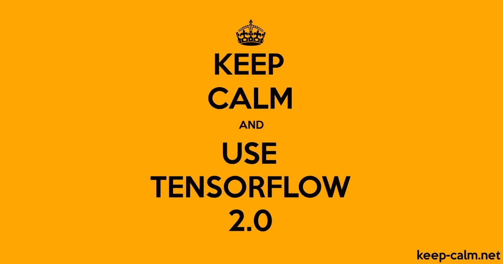
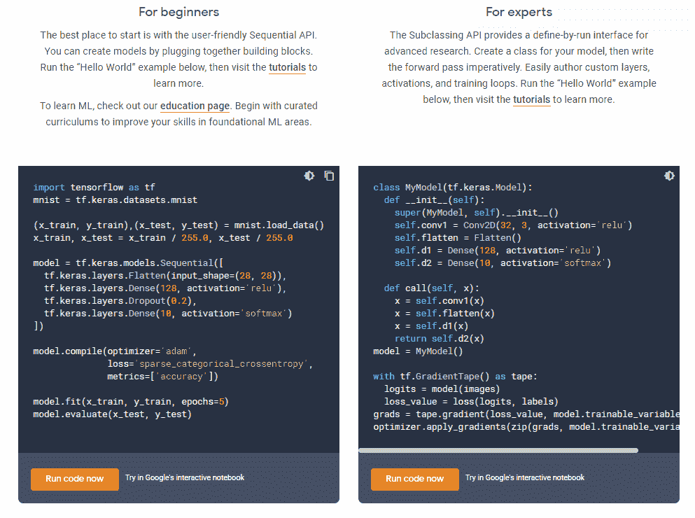
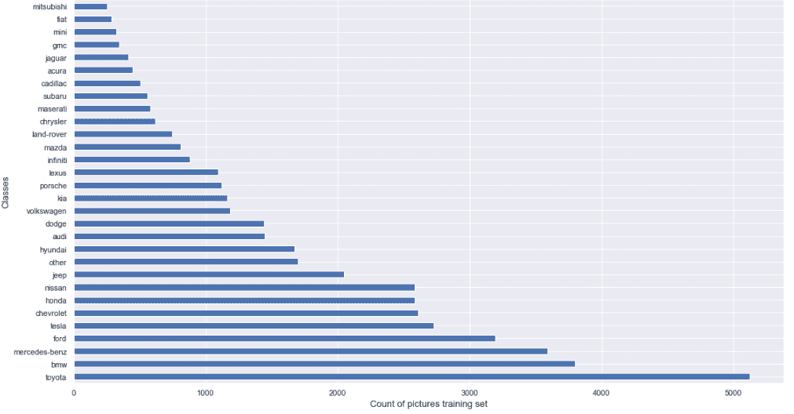
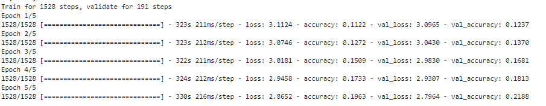
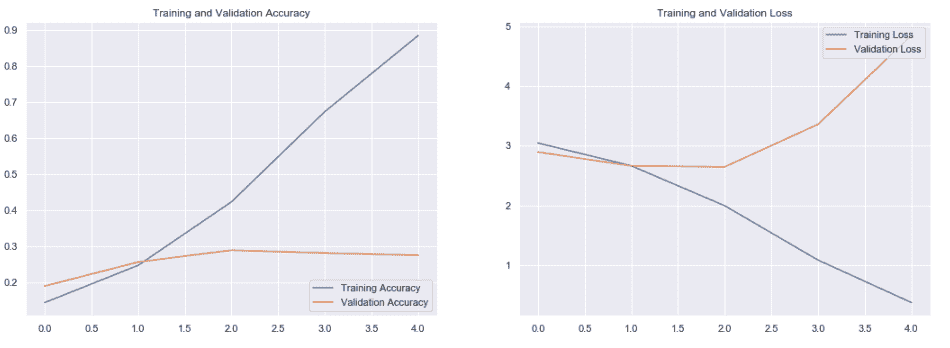
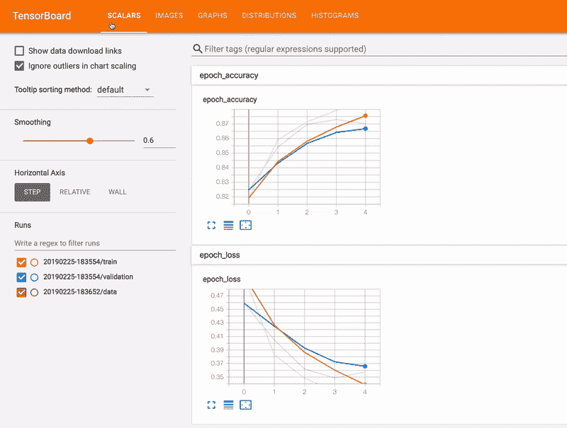
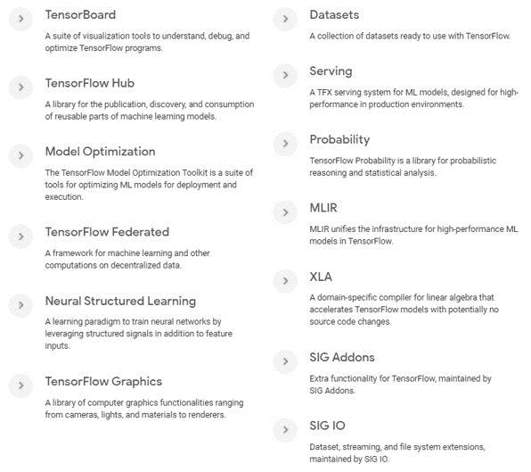

# TensorFlow 2.0 简介

> 原文：<https://towardsdatascience.com/introduction-on-tensorflow-2-0-bd99eebcdad5?source=collection_archive---------12----------------------->

## Tensorflow 2.0 的一些功能的软介绍



来源:Keep-calm.net

在这篇文章中，我将介绍我在探索 [TensorFlow](https://www.tensorflow.org/) 时的一些发现，这个想法将与 TensorFlow 一起围绕图像分类建立和监控 ML 模型，以及比我几周前建立的[汽车数据集](http://the-odd-dataguy.com/build-a-webscraper-with-beautifsoup-and-selenium/)更好的数据集。

# TensorFlow kezako？

TensorFlow 是 Google Brain 在 2011 年开始的一个研究项目，多年来在 Alphabet group 中非常受欢迎。该框架因其高度灵活的架构而在机器学习社区中广受欢迎，该架构可以利用不同类型的处理单元，如 [CPU](https://en.wikipedia.org/wiki/Central_processing_unit) 、 [GPU](https://en.wikipedia.org/wiki/Graphics_processing_unit) 或 [TPU](https://fr.wikipedia.org/wiki/Tensor_Processing_Unit) 来执行计算，而无需对运行代码进行大的修改。

该框架自 2015 年以来一直是开源的，似乎在世界各地都非常受欢迎，下载量超过 [76 00 万次](https://youtu.be/_lsjCH3fd00?t=90)。Google 提供了多种 API 来与框架交互，如 Python、Javascript、C++、Java 和 Go。

TensorFlow 拥有多种工具来开发机器学习系统:

*   [张量流](https://www.tensorflow.org/overview/) (dah)
*   [TensorFlow.js](https://www.tensorflow.org/js/)
*   [TensorFlow lite](https://www.tensorflow.org/lite/) 在嵌入式系统中部署机器学习模型
*   [TensorFlow 将](https://www.tensorflow.org/tfx/)扩展到产品化机器学习管道
*   [TensorFlow Quantum](https://www.tensorflow.org/quantum) 一个“混合量子经典 ML 模型快速原型库”

这套工具非常广泛，我真的建议你看一下上面的不同文档，这会给你一个很好的工具概述。

我只是想谈谈 TensorFlow，但我计划在几周内看看 Lite 和。js 工具(我订购了一个设备，在上面做了一些测试😉)

# TensorFlow，如何建立 ML 模型？

为了与 TensorFlow 进行交互，最流行的 API 之一是 Python API(老实说，这是我更喜欢的一个)，但是有两种途径可以与这个 API 进行交互:

*   初学者使用一个叫做 Keras 的用户友好的顺序 API
*   使用子类 API 的专家更加 pythonic 化

我附上你的两个 API 格式的例子快照



来源:[张量流概述](https://www.tensorflow.org/overview)

对我来说，我真的建议使用 Keras，对于非 python 专家来说，它可能更容易阅读。这个 API 最初在 TensorFlow 1.x 版本中不是本地 API(因为 2.0 是本地的)，必须单独安装才能访问它。

Keras 是一个 API，可以运行在各种 ml 框架之上，如 TensorFlow、CNTK 和 Theano，以帮助人们轻松地重用函数来构建层、求解器等，而无需深入 ML 框架(某种程度上是抽象层)。

让我们构建一些模型来测试这个框架。

# 模型构建

在这一部分中，我不打算解释我将要使用的模型的架构(可能在一篇特定的文章中)。要开始构建模型，我首先需要将框架与数据连接起来。

数据被划分到与训练集、验证集和测试集相关的文件夹中，在每个文件夹中，每个类别都有一个子文件夹，用于预测将用于该过程的所有图片。有一个图表来表示训练集中每类图片的分布。



验证和测试集中的类的重新划分与具有更少数据的训练集中的相同(训练 80%，验证 10%和测试 10%的完整数据集)。

为了使用模型中的数据，可以像在 TensorFlow 的[教程](https://www.tensorflow.org/tutorials/images/cnn)中一样使用数据生成器，这里有代码的快速快照。

该代码的想法是:

*   正常化图片(RGB 从 0–255 到 0–1 之间的值转换)
*   调整图片大小
*   为培训建立不同的批次

它需要应用于所有的文件夹，但在此之后，一切都准备好开始模型的训练。

在模型方面，我重用了 TensorFlow 教程的[模型设计](https://www.tensorflow.org/tutorials/images/cnn)，并应用到了其他一些资源上。这些模型可以在以下列表中找到:

*   TensorFlow 的 [CNN 教程](https://gist.github.com/jeanmidevacc/801171ec7c279526b968d67ca618eb83)
*   奥雷连·杰龙的 [MLP 在他的书](https://gist.github.com/jeanmidevacc/c96e13a3d5eeed0f0297f291128aec84)[的第十章中用 Scikit-Learn、Keras 和 TensorFlow](https://www.oreilly.com/library/view/hands-on-machine-learning/9781492032632/) 动手操作机器学习
*   Sebastian Raschka 和 Vahid Mirjalil 的 [CNN 在他们的书](https://gist.github.com/jeanmidevacc/4a4348ee94c625de0c905a2992d6fea5) [Python 机器学习](https://www.packtpub.com/data/python-machine-learning-third-edition)的第 15 章中

该模型的输入和输出已被修改以适应我的需要，但大部分代码来自所列的各种资源。再一次，这些模型只是用来测试框架的，它们对我的问题来说并不是最优的(还需要很多改进)。

通过执行数据生成和模型构建，几分钟后模型就准备好了。



现在让我们看看 TensorFlow 的监控组件。

# 模型监控

要监控您的模型，TensorFlow 有两种途径(对我而言):

*   使用模型拟合操作的历史来访问已经计算的各种度量(在这种情况下是损失和准确性)

```
acc = history.history['accuracy']
val_acc = history.history['val_accuracy']loss=history.history['loss']
val_loss=history.history['val_loss']
```

例如，使用 matplotlib，可以非常容易地使用历史的输出来绘制图形。



另一种方法是使用一个名为 [Tensorboard](https://www.tensorflow.org/tensorboard) 的组件，它是一个与 TensorFlow 相关的包，能够在跑步过程中实时收集各种指标，以构建模型(cf gif)，可视化架构和数据等。



来源: [Tensorboard 文档](http://Tensorboard.dev)

最近，谷歌宣布能够通过 [tensorboard.dev](https://blog.tensorflow.org/2019/12/introducing-tensorboarddev-new-way-to.html) 计划与每个人共享仪表盘，例如，你可以在这个[链接](https://blog.tensorflow.org/2019/12/introducing-tensorboarddev-new-way-to.html)中找到一个与我在这个项目中的一些跑步相关的 tensorboard。

Tensorboad 是一个有趣的计划，他们在上次 TensorFlow 开发峰会上宣布了许多新功能，但老实说，我不是一个非常有经验的深度学习实践者，所以我不太支持这个对我来说看起来很复杂的组件，但我认为它可能是与 [mlflow](https://mlflow.org/) 相关联的数据科学工具箱的一个非常好的工具。

最后，我想介绍另一个组件 TensorFlow hub。

# 与 TensorFlow hub 共享模型

TensorFlow hub 诞生于 Google 的一个简单情况是，我正在阅读一篇关于神经网络架构的非常好的文章，这篇文章看起来非常有前途，但在调查过程中可能会出现许多问题，例如:

*   如何才能重现这篇文章？
*   (以文中的回购为例)是模型的最后版本吗？
*   数据在哪里？
*   (以文中的回购为例)使用这段代码安全吗？

[TensorFlow hub](https://tfhub.dev/) 希望人们能够限制所有这些问题，并在 ML 开发上给予更多透明度。

TensorFlow hub 的一个非常有趣的功能是帮助人们用著名的健壮模型的组件来建立机器学习模型，这种方法是重用另一个模型的模型权重，它被称为[迁移学习](https://en.wikipedia.org/wiki/Transfer_learning)。

使用 TensorFlow hub，您可以非常容易地重用另一个模型的几行代码组件，在下面的要点中，有一个我构建的代码示例，用于重用一个名为 [Mobilenetv2](https://arxiv.org/pdf/1801.04381.pdf) 的模型的特征提取器，该模型在对象分类方面非常流行(主要受 [TensorFlow 教程](https://www.tensorflow.org/tutorials/images/transfer_learning_with_hub)的启发)。

现在让我们总结一下这个分析

# 反馈

这第一次动手 TensorFlow 非常好，我发现教程做得很好，很容易理解，你可以很容易地用框架的 Keras API 建立神经网络。有很多组件我还没有测试，就像在这张截图上看到的那样



来源:[张量流文档](https://www.tensorflow.org/guide)

我添加了一个机会来看看 TensorFlow Extended ( [TFX](https://www.tensorflow.org/tfx) )，这是谷歌建立机器学习管道的方法，我添加了一个 AWS EC2 实例的尝试，但该教程在某个点上崩溃了，但我邀请你观看罗伯特·克罗的精彩演讲，该演讲更详细地介绍了该工具。

这种方法看起来很有前景，我真的很好奇 TFX 和 [Kubeflow](https://www.kubeflow.org/) (谷歌基于 Kubernetes 的另一个 ML 管道)之间将会存在什么样的互动。

我对 TensorFlow 唯一的担心/疑问是处理单元的使用，在我的测试中，我在 CPU 和 GPU 之间交替使用，但我对处理的监控没有显示处理单元充分发挥潜力(但我可能只是个新手)。

增加 TensorFlow 效率的另一个路径是使用 [tfRecords](https://www.tensorflow.org/tutorials/load_data/tfrecord) ，但似乎数据管理仍然是一个热门话题(从我周围听到的)，我发现了一个真正有趣的 [Pydata 对话](https://www.youtube.com/watch?v=vbIwBNDIUPU)围绕着用 TensorFlow 管理 parquet 文件。

我围绕深度学习的下一个任务是:

*   对脸书的 Pytorch 做一个简单的介绍，它似乎是 TensorFlow 的克星，这个框架在研究领域赢得了很多关注
*   加速深度学习算法，以建立一个像样的汽车分类器
*   了解这些深度学习模型在生产中的部署(数据管理、服务等)