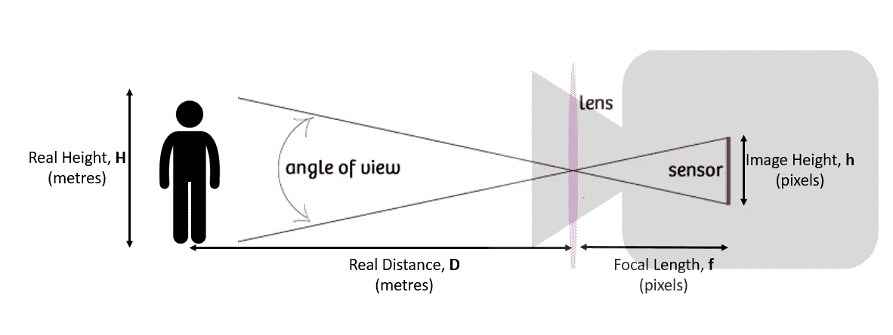
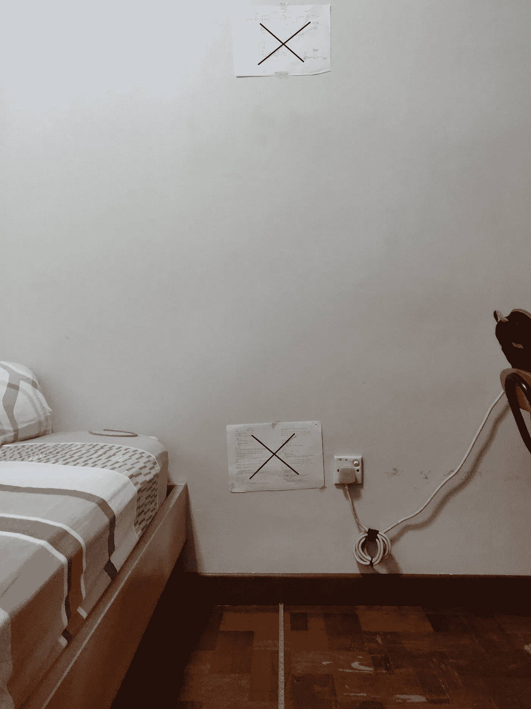
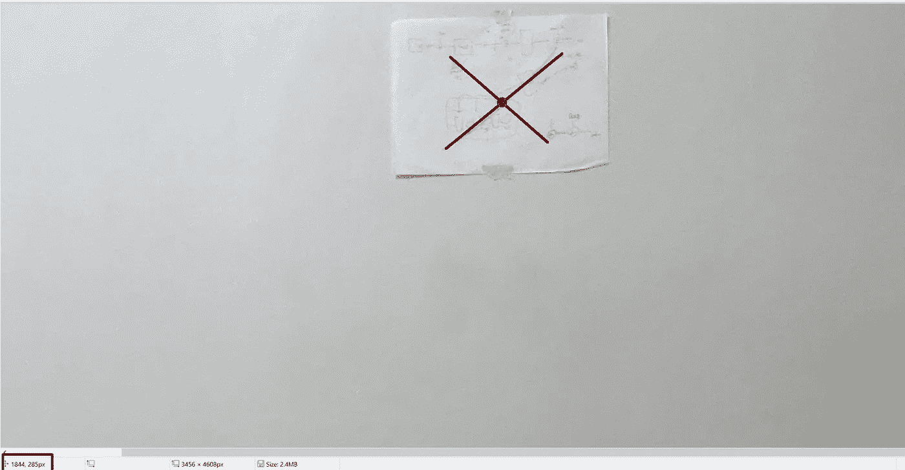

# 3D 视觉简介

> 原文：<https://towardsdatascience.com/introduction-to-3d-vision-d90f491207fc?source=collection_archive---------43----------------------->

## 找到你的智能手机的焦距(像素)

由 [Unsplash](https://unsplash.com?utm_source=medium&utm_medium=referral) 上 [ShareGrid](https://unsplash.com/@sharegrid?utm_source=medium&utm_medium=referral) 拍摄的照片

在计算机视觉(CV)的世界里，有很多有趣的概念。在过去十年中，深度卷积神经网络在很大程度上主导了许多 CV 任务。在某些领域，CNN 在图像分类、物体检测和图像分割等方面比人类表现得更好。CNN 的最大优势是它们可以大规模运行，因此可以很好地利用个人和公司收集的大量图像数据！最近，[变形金刚](https://openreview.net/forum?id=YicbFdNTTy)也在探索 CV 任务。然而，在这篇文章中，我们将关注计算机视觉的一个更“老派”的方面:3D 视觉。我确信 3D 视觉是我们在日常生活中遇到的东西——我的意思是，我们的眼睛基本上是利用这个原理工作的。本帖旨在介绍其背后的一些基本概念！

照片由[内森·杜姆劳](https://unsplash.com/@nate_dumlao?utm_source=medium&utm_medium=referral)在 [Unsplash](https://unsplash.com?utm_source=medium&utm_medium=referral) 上拍摄

3D 视觉的关键功能之一是捕捉深度信息。对于单个相机，我们只有关于特定场景的 2D 信息，因此至少需要 2 个相机！(例如我们的眼睛！).在这个系列中，我将演示如何用智能手机摄像头完成 3 个简单的任务:

*   找到你的智能手机相机的焦距
*   使用两张照片恢复物体的深度
*   从同一个地点拍摄同一场景的两张照片时，找出相机的旋转角度。

## 寻找焦距

相机的焦距如下图所示。这是照相机和镜头内部工作原理的简化。我们不难看出，通过测量一个物体的实高、实距和像高，就可以求出焦距。这些量通过以下公式相关联:

如果你记得你的高中物理课，这可能看起来很熟悉。现在，我们将比理论更进一步，尝试找出我们智能手机的焦距！可以按照步骤，自己尝试一下。

1.  找一个已知高度的物体， **H** 。利用你的朋友/家人，或者你可以利用墙上的两点来测量距离。
2.  从一定距离拍摄一张照片， **D** 远离物体。

我卧室的照片，墙上有两个画得很漂亮的十字架。

3.测量物体的图像高度， **h** 。你可以使用任何常见的图像编辑工具或图像浏览器，我在微软画图。用笔刷工具将鼠标悬停在十字上，我们可以得到下图左下方显示的图像坐标。

4.使用毕达哥拉斯定理从两点计算图像高度。对于我的照片，点是(1849，291)，(1782，2954)，计算的高度是 2664 像素。

5.使用上面的等式计算 *f* ！确保 **H** 和 **D** 的单位相同(我和世界上大多数人一样使用米)。

6.我用一加 6T 智能手机得到了 3566 像素的焦距。请在下面评论分享您的结果和手机型号！

## 结论/讨论

这是一个简短的帖子，描述了任何人如何通过抓拍照片来计算智能手机的焦距。这是一个很好的信息，因为我们可以交叉检查实际焦距与手机销售商/制造商给出的规格！此外，知道像素的焦距将允许我们做这个系列中的一些其他任务。

你也可以在不同的距离对不同的物体重复这个实验，拍多张照片。最后计算平均 *f* 值以减少误差。本系列的后续帖子将解释其他可以在智能手机上轻松完成的动手项目，敬请关注！