# 8 种基本数据结构介绍

> 原文：<https://towardsdatascience.com/introduction-to-8-essential-data-structures-7ef867bd1dd?source=collection_archive---------45----------------------->

## 数据结构

## 了解最常见的数据结构背后的基本概念

Patrick Robert Doyle 在 [Unsplash](/s/photos/blocks?utm_source=unsplash&utm_medium=referral&utm_content=creditCopyText) 上拍摄的背景照片

作为程序员，我们对数据结构的理解大多局限于在编程语言的更高抽象层次上使用它们。虽然我们知道如何使用特定的编程语言从不同的数据结构中存储和检索数据，但我们大多数人并不试图去解开这些数据结构的底层实现中发生了什么。

在大多数情况下，数据结构的表面知识足以以某种方式完成我们的工作。但是，在为给定任务选择最佳数据结构时，理解不同数据结构在较低级别的行为是至关重要的。在这篇文章中，我们将探究 8 种不同的数据结构，看看它们是如何处理数据的。

# 排列

数组数据结构存储固定数量的单一数据类型的数据。数组中的元素(项目)存储在一块连续的内存槽中。因此，数组中的元素被赋予连续的数字，从 0 或 1 开始，作为它们的“索引”。

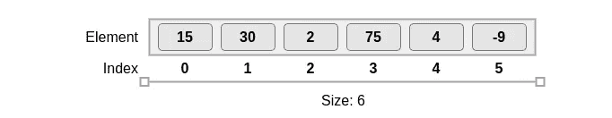

人们可以使用唯一的索引随机访问存储在数组中的单个元素。使用索引访问元素的时间复杂度为θ(1)。以这种方式可以容易地实现读取或更新数组元素。因为数组元素的位置是连续的，所以与大多数其他数据结构相比，数组遍历更快。

向数组中插入数据或从数组中删除数据是一项相当复杂和耗时的任务。插入时，当前数组中的所有元素都被复制到一个新创建的大小增加的数组中，新元素被添加到新数组的末尾。删除也以类似的方式实现，以减小数组大小。

# 应用:

数组可以是多维的(数组的数组)。这使得数组成为存储矩阵和向量的好选择。数组经常用于实现其他数据结构，如列表、堆、栈和队列。

# 长队

队列数据结构类似于我们日常生活中看到的队列:第一个进入队列的人是第一个获得下一个退出队列机会的人。在编程世界版本的队列中，添加到队列中的每个新数据元素都存储在后端，从队列中移除的每个元素都从前端取出——基于先进先出的原则。

# 队列操作

*   入队:将元素插入到队列的末尾。新添加的元素成为队列的最后一个元素。

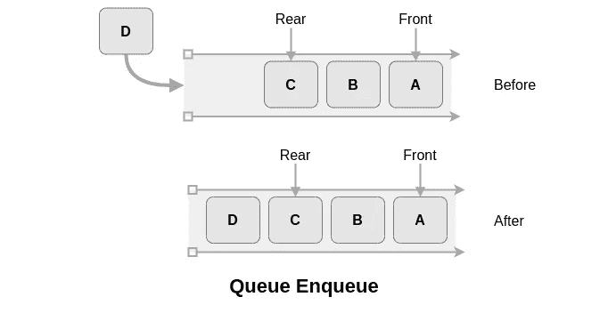

*   出列:从队列的前面删除一个元素。入队和出队操作的时间复杂度都是θ(1)。

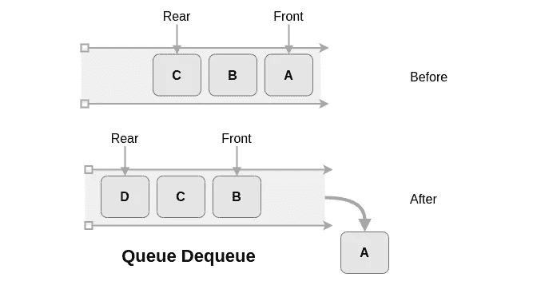

*   Peek:读取队列前面的元素，而不删除或修改它。

# 应用程序

队列用于实现缓冲区。多线程使用队列来管理等待线程执行的任务。

# 堆

堆栈与队列非常相似，但是它们是基于后进先出而不是先进先出来实现的。想象一堆菜，其中最后添加的菜是第一个要移除的菜。

# 堆栈操作

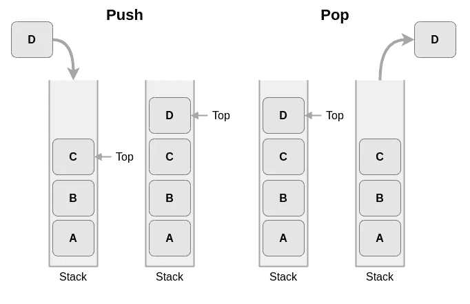

*   Push:在栈顶插入一个新元素。新添加的元素成为新的顶部元素。
*   从栈顶移除一个元素。推送和弹出操作的时间复杂度均为θ(1)。
*   Peek:读取堆栈顶部的元素，而不删除或修改它。

# 应用程序

堆栈用于处理和评估数学表达式。它们也用于使用回溯过程的算法中。在递归编程中处理递归函数调用是另一个应用。

# 链表

链表是一种动态数据结构。这意味着存储在链表中的数据项的数量可以很容易地增加或减少。与固定大小的数组相比，这给了链表更多的灵活性。链表通过将每个项目存储为一个单独的对象来实现这种动态特性。

链表中的元素不必存储在连续的内存槽中，相反，每个元素(称为节点)存储一个指向下一个节点位置的指针。这些指针维护着与链表中独立节点的连接。除了指向下一个节点的指针，一个节点还存储一个数据字段。

链表中有两个重要的节点:头和尾。

*   Head:链表的第一个节点。
*   Tail:链表的最后一个节点。Tail 的指针值被设置为 null。

当向链表中插入新元素时，新的数据字段存储在内存中的特定位置，并且更新前一个节点中的指针以指向新节点。新节点存储先前存储在前一节点中的指针。

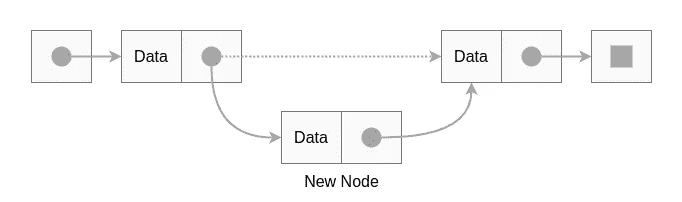

删除节点时，被删除节点之前的节点被赋予先前存储在被删除节点中的指针。

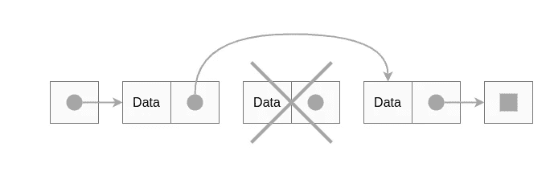

然而，对于链表，如果不从头开始遍历链表，就不能直接访问单个数据项。这使得访问操作的时间复杂度为θ(n)。

# 链接列表类型

*   单链表:上面例子中显示的链表都是单链表。一个节点只包含一个指向下一个节点的指针。
*   双向链表:双向链表中的节点包含指向给定节点前后节点的指针。可以在向前和向后两个方向上遍历列表。
*   循环链表:尾部的指针指向头部而不是空。本质上，循环链表没有尾巴，只有一个头。

# 应用程序

链表用于实现数据结构，如堆栈、队列和图形。当执行多项式代数运算时，链表用于存储常数。

# 图表

一个图由有限数量的数据项组成，称为**顶点(V)** 。这些顶点中的一些对通过**边(E)** 相互链接。由一条边连接的两个顶点是彼此相邻的**。**

可以使用不同的属性对图形进行分类。其中一种分类是**有向图**和**无向图**。

*   在有向图中，连接两个顶点的边有一个起点和一个终点。当遍历图时，只能从起始顶点到结束顶点穿过边。

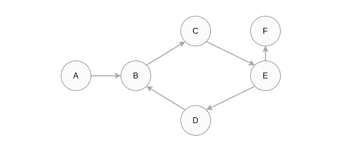

*   在无向图中，一条边可以在两个方向上无限制地遍历。

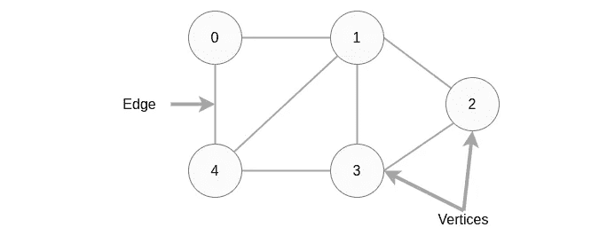

# 应用

像脸书这样的社交媒体应用程序使用图表来表示用户的顶点和他们的友谊的边。谷歌页面排名算法使用图形来表示网页和连接它们的链接。谷歌地图使用图表来表示其交通系统中的道路网络。

# 二叉树

二叉树与有向图有一些相似之处。两者的区别在于，在二叉树中，数据存储在分层结构中，上层节点称为父节点，下层节点称为子节点。二叉树中的一个节点只能有一个父节点和最多两个子节点。

让我们来看几个与二叉树相关的术语。

*   根:树顶部的节点。它没有父节点。
*   叶子:树底部的一个节点。它没有子节点。
*   Key:存储在节点中的数据值。
*   子树:由一个节点的所有后代组成的树

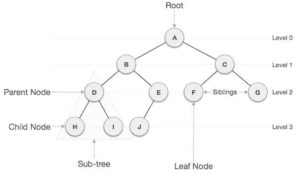

有许多特殊的二叉树，如二叉查找树树、Treap 树、二叉树和堆树。

# 二叉查找树

二叉查找树按排序顺序存储数据值。二叉查找树中节点左侧子节点的值必须小于父节点，右侧子节点的值必须大于父节点。

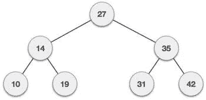

顾名思义，BST 的主要优点是能够快速搜索存储的数据。在 BST 中搜索存储元素的时间复杂度是 O(log n)。

# 应用程序

*   二分搜索法树用于在编程语言中实现地图和集合对象
*   二进制尝试用于存储路由表。
*   Treaps 用于无线网络。

# 许多

堆是二叉树的另一个特例。在堆中，根的键与其子的键进行比较，以特定的方式排列它们。有两种类型的堆。

*   最大堆:父项的键大于或等于子项的键。根节点存储给定数据集中的最大值。
*   最小堆:父级的键小于或等于子级的键。根节点存储给定数据集中的最小值。

假设我们得到了整数值(33，24，45，12，90，78，23，53)作为数据集。我们可以从这些数据中构造一个单独的最大堆和最小堆。

# 最小堆

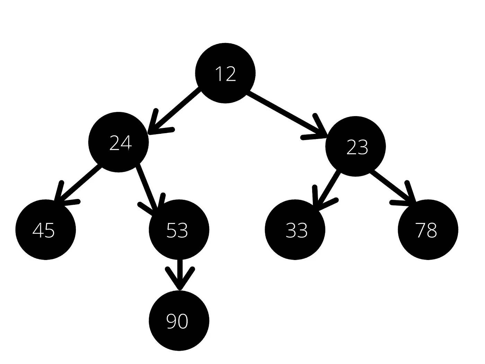

# 最大堆

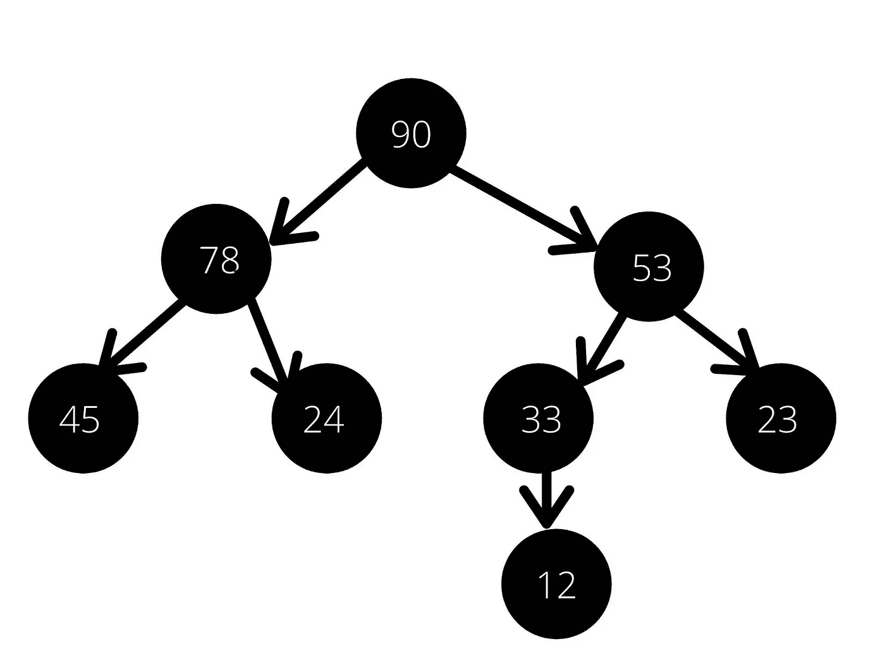

在堆中插入、删除和提取最大(或最小)函数的时间复杂度为 O(log n)。但是求最大值(或最小值)只有 O(1)的时间复杂度。

# 应用程序

堆用于实现堆排序算法。堆也用于实现优先级队列，因为堆的第一个元素总是存储具有最高(或最低)优先级的值。

# 哈希表

当我们希望保持在大型数据集上搜索和插入操作的速度时，哈希表是我们可以使用的最有效的数据结构之一。存储在哈希表中的每个数据值都与一个键相关联，如果我们知道这个键，就可以快速访问存储的值。设想一个学生注册系统，其中每个学生都有一个唯一的学号，可以用它作为一个键将他们的数据存储在一个散列表中。

哈希表使用数组来存储数据值。该键用于在存储值的数组中查找索引。但是哈希表如何将这些键和它们的值映射起来呢？

可以使用的方法之一是**直接寻址**。它使用一对一的映射:每个键指向其数据存储的确切位置。但是这种方法不能有效地使用内存，特别是当键-值对的数量增加并且键变得更大时。因此，哈希表使用哈希函数。

# 散列函数

哈希表使用哈希函数将数据值映射到它们的键。它将一定范围的键值转换为一定范围的数组索引。将密钥传递给哈希函数所生成的索引或值称为哈希值。下面是一个哈希函数的例子。

`h(k) = k % m`

*   **h** 是哈希函数
*   **h(k)** 是密钥 k 对应的哈希值
*   k 是关键
*   **m** 是哈希表的大小。对于 m 来说，一个好的选择是一个不接近 2 的幂的质数。

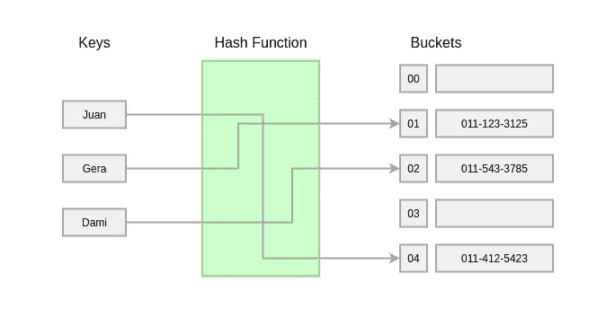

让我们考虑几个键的哈希值。考虑 m=20。

*   k=1001，h(k) = 1001%20 = 1
*   k=1055，h(k) = 1055%20 = 15
*   k=20123，h(k) = 20123%20 = 3

对于 k 值 1001、1055 和 20123，它们的关联值分别存储在哈希表中的索引 1、15 和 3 处。

考虑密钥 2021 的散列值，它是 1。我们之前看到，与键 1001 相关联的值存储在哈希表中的索引 1 处。当两个键生成的哈希值相似时，我们称之为**碰撞**。哈希表使用链接和开放寻址等技术来解决这种冲突问题。

哈希表的搜索和插入时间复杂度为 O(1)。

# 应用程序

哈希表用于实现数据库索引。编译器使用哈希表来识别编程语言中的关键字。计算机使用哈希表来链接文件名和它们的路径。

# 结论

本文提供了对我们作为程序员每天都要接触的 8 种数据结构的底层逻辑的基本介绍。了解了不同数据结构的独特属性后，从今天起，您在为您的编程任务选择最合适的数据结构时就可以更加小心了。但是记住，这只是一个基本的介绍。关于数据结构，你还可以做更多的事情，你也应该学习。