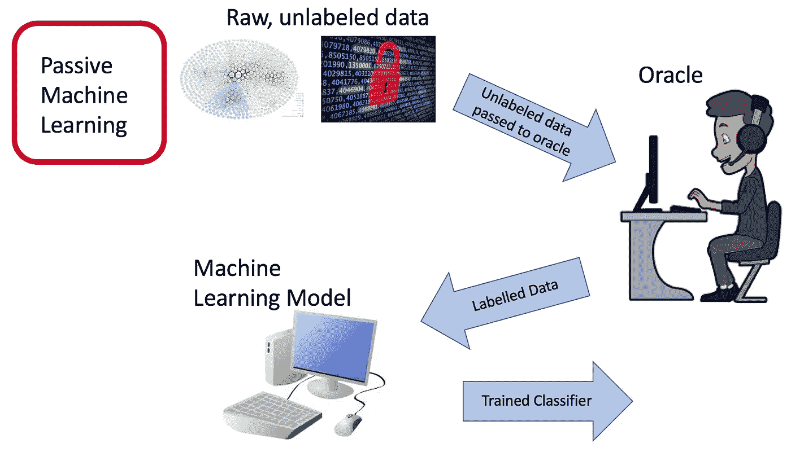
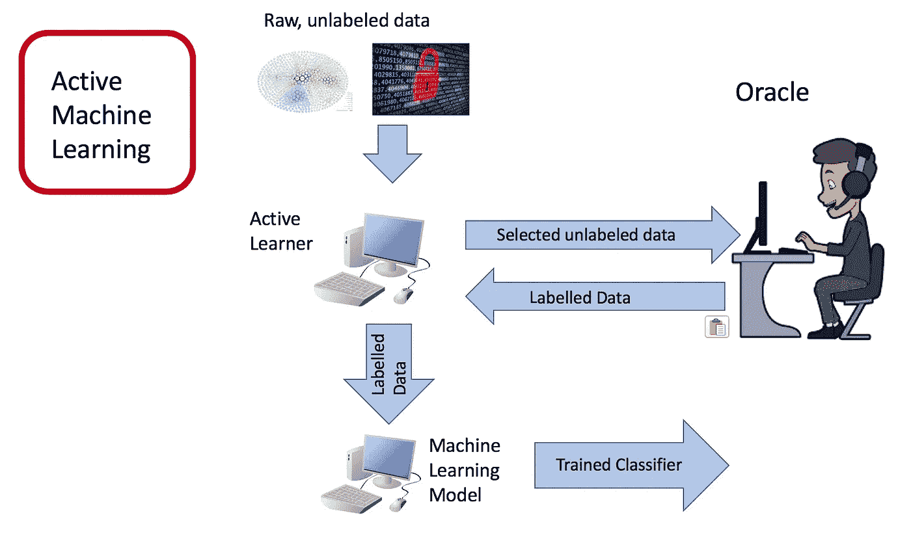
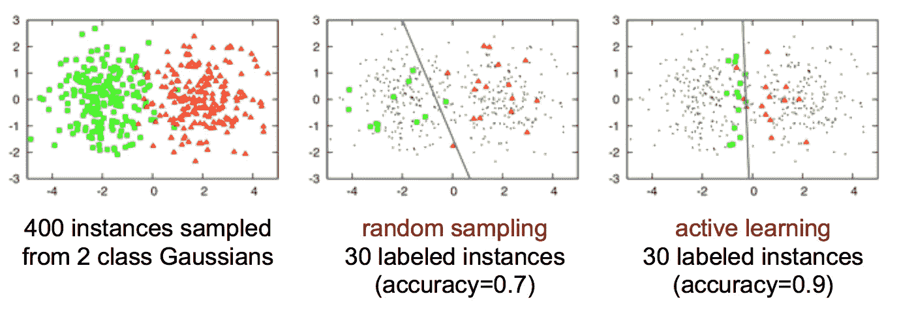
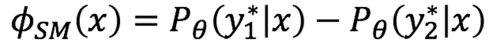
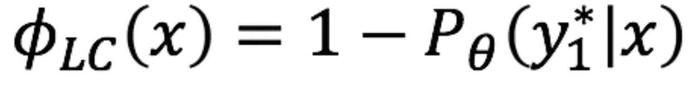
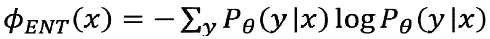
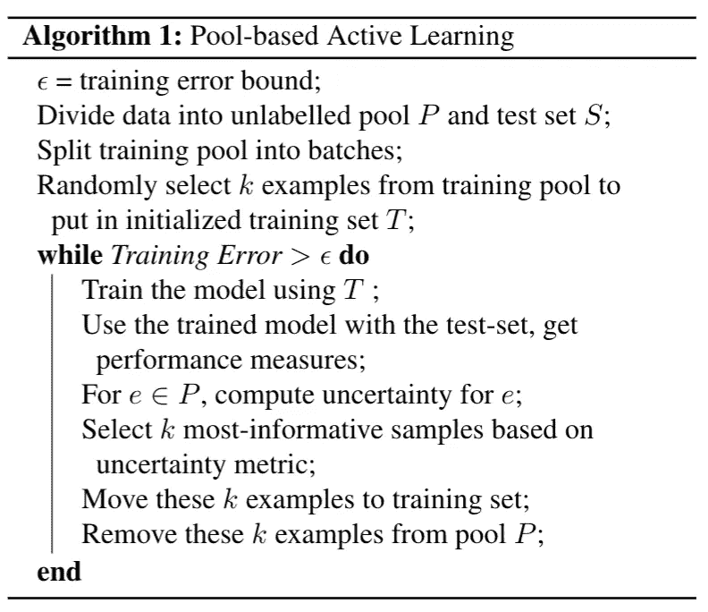

# 主动学习导论

> 原文：<https://towardsdatascience.com/introduction-to-active-learning-117e0740d7cc?source=collection_archive---------12----------------------->

## **什么是主动学习？**

这篇文章的目标是帮助揭开主动学习的神秘面纱，并展示它与标准的监督机器学习有何不同。

一、什么是主动学习？主动学习是一种机器学习框架，其中学习算法可以交互式地询问用户(教师或 oracle)以用真正的标签标记新的数据点。主动学习的过程也称为最优实验设计。

主动学习的动机是我们拥有大量未标记数据的场景。考虑训练一个图像分类模型来区分猫和狗的问题。每一个都有数百万张图片，但并不是所有的图片都需要用来训练一个好的模型。一些图像可能比其他图像提供更多的清晰度和信息。另一个类似的应用是对 Youtube 视频的内容进行分类，其中的数据本来就很密集，而且存在很多。

被动学习是一种标准框架，其中大量标记数据被传递给算法，这需要在标记整个数据集方面付出大量努力。

被动机器学习。

通过使用主动学习，我们可以有选择地利用像众包这样的系统，让人类专家有选择地标记数据集中的一些项目，但不必标记全部。**该算法基于某种价值度量迭代地选择信息最丰富的示例，并将这些未标记的示例发送给标记 oracle，Oracle 将这些查询到的示例的真实标签返回给算法。**

主动机器学习。鸣谢:受张懿主动学习的启发[幻灯片](https://www.cs.cmu.edu/~tom/10701_sp11/recitations/Recitation_13.pdf)

在某些情况下，主动学习比随机抽样表现得更好。下图展示了主动学习相对于随机选择的一个激励性的例子。整组数据点(红色三角形和绿色圆圈的集合)不是线性可分的。

鸣谢:图片来自 Burr Settles 主动学习[幻灯片](http://www.cs.cmu.edu/~tom/10709_fall09/slides/settles.active.pdf)。

主动学习的动机是理解到并非所有标记的例子都同样重要。通过对所有示例进行统一的随机采样，学习到的模型并不完全代表类别之间的划分。然而，主动学习选择靠近类边界的例子，并且能够找到更有代表性的分类器。先前的研究还表明，对于多类图像分类等任务，主动学习比标准随机选择有所改进[1，2，3，4]。

主动学习框架将数据的选择简化为确定数据集中哪些数据点信息量最大的问题。在主动学习中，信息量最大的数据点通常是模型最不确定的数据点。这需要各种度量来量化和比较示例的不确定性。

# **不同的主动学习框架**

主动学习被认为是一种半监督学习方法，介于无监督使用 0%的学习样本和完全监督使用 100%的样本之间。通过迭代地增加我们的标记训练集的大小，我们可以实现更好的性能，接近完全监督的性能，而使用所有数据进行训练的成本或时间只有一小部分。

## **基于池的主动学习**

在基于池的采样中，训练样本是从大量未标记的数据中选择的。从该库中选择的训练样本由 oracle 标记。

## 基于流的主动学习

在基于流的主动学习中，所有训练样本的集合作为流呈现给算法。每个示例都被单独发送给算法进行考虑。该算法必须立即决定是否标记该示例。从该池中选择的训练样本被 oracle 标记，并且在显示下一个样本以供考虑之前，该标签被算法立即接收。

# 不确定性度量

选择信息量最大的数据点的决定取决于选择中使用的不确定性度量。在基于池的采样中，主动学习算法选择信息最丰富的样本添加到不断增长的训练集中。

**信息量最大的例子是分类器最不确定的例子。**

这里的直觉是，模型最不确定的例子可能是最困难的例子——特别是位于类边界附近的例子。学习算法将通过观察困难的例子获得关于类边界的最多信息。

下面是在主动学习中使用的四种常见的不确定性测量方法，用于选择最有信息量的例子。

## 1.最小边际不确定性

最小边际不确定性是最佳与次佳不确定性的比较。最小边缘不确定性(SMU)是最可能类别的分类概率减去第二可能类别的分类概率[1]。这种度量背后的直觉是，如果最可能的类的概率明显大于第二最可能的类的概率，那么分类器对该示例的类成员关系更加确定。同样，如果最有可能的类的概率不比第二个最有可能的类的概率大多少，则分类器对该示例的类成员关系不太确定。主动学习算法将选择具有最小 SMU 值的例子。

## 2.最小置信不确定性

最小置信不确定性(LCU)是选择分类器对所选类别最不确定的例子。LCU 选择只查看最可能的类别，并选择分配给该类别的概率最低的示例。

## 3.熵减少

熵是随机变量不确定性的度量。在这个实验中，我们使用香农熵。香农熵具有几个基本性质，包括(1)均匀分布具有最大不确定性，(2)不确定性对于独立事件是可加性的，(3)添加零概率的结果没有影响，以及(4)具有特定结果的事件没有影响[6，7]。将类别预测视为结果，我们可以测量预测类别概率的香农熵。

熵值越高，表明概率分布的不确定性越大[1]。在每个主动学习步骤中，对于训练集中的每个未标记的示例，主动学习算法计算预测类概率的熵，并选择具有最高熵的示例。具有最高熵的例子是分类器对其类成员关系最不确定的例子。

## 4.最大边际不确定性

最大边际不确定性是最佳与最差不确定性的比较[5]。最大边缘不确定性(LMU)是最可能类别的分类概率减去最不可能类别的分类概率。这种度量背后的直觉是，如果最可能的类的概率明显大于最不可能的类的概率，那么分类器对该示例的类成员关系更加确定。同样，如果最可能类的概率不比最不可能类的概率大多少，那么分类器对该示例的类成员关系就不太确定。主动学习算法将选择具有最小 LMU 值的例子。

# 算法

下面的算法是一个基于池的主动学习[8]。基于流的主动学习可以类似地编写。

大规模分类任务中的一个主要瓶颈是训练分类器所需的大量训练样本。使用主动学习，我们可以通过有策略地选择特定的例子来减少教授分类器所需的训练例子的数量。

## 参考

[1] A. J. Joshi，F. Porikli 和 N. Papanikolopoulos，“用于图像分类的多类主动学习”， *2009 年 IEEE 计算机视觉和模式识别会议*，佛罗里达州迈阿密，2009 年，第 2372–2379 页。

[2]郭，冼，雍睿，唐金辉，，“二维主动学习在图像分类中的应用”， *2008 年 IEEE 计算机视觉与模式识别会议*，美国阿拉斯加州安克雷奇，2008，第 1-8 页。

[3]张怡园、汤绍清、吴国光和张振聪。“基于支持向量机概念的图像检索主动学习”， *IEEE 多媒体汇刊*，2005。

[4] A. Kapoor，K. Grauman，R. Urtasun 和 T. Darrell，“使用高斯过程进行对象分类的主动学习”， *2007 年 IEEE 第 11 届国际计算机视觉会议*，里约热内卢，2007 年，第 1–8 页。

[5][https://becoming human . ai/accelerate-machine-learning-with-active-learning-96 ce a4 b 72 fdb](https://becominghuman.ai/accelerate-machine-learning-with-active-learning-96cea4b72fdb)

[6][https://towards data science . com/entropy-is-a-measure-of-an-determinance-e2c 000301 C2C](/entropy-is-a-measure-of-uncertainty-e2c000301c2c)

[7] L. M. Tiwari，S. Agrawal，S. Kapoor 和 A. Chauhan，“熵作为排队系统中不确定性的度量”， *2011 年全国研究生会议*，吉隆坡，2011 年，第 1–4 页。

[8][https://towards data science . com/active-learning-tutorial-57c 3398 e34d](/active-learning-tutorial-57c3398e34d)