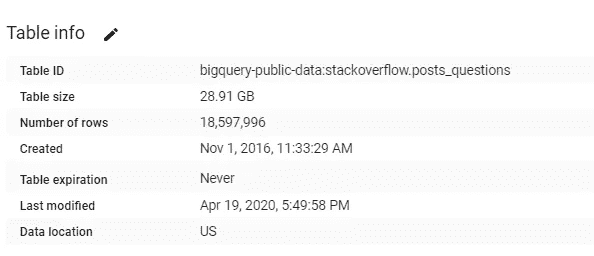
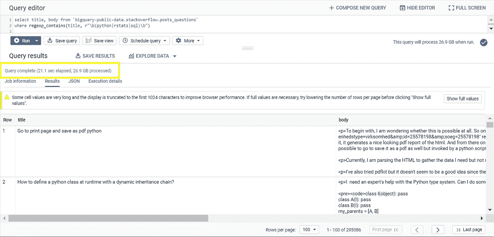
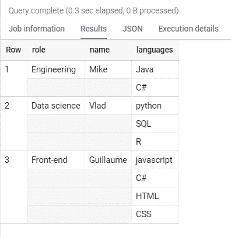
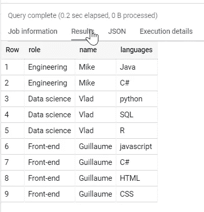
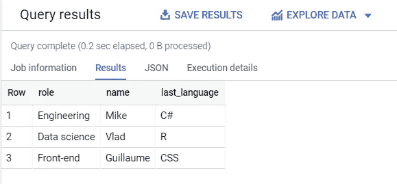
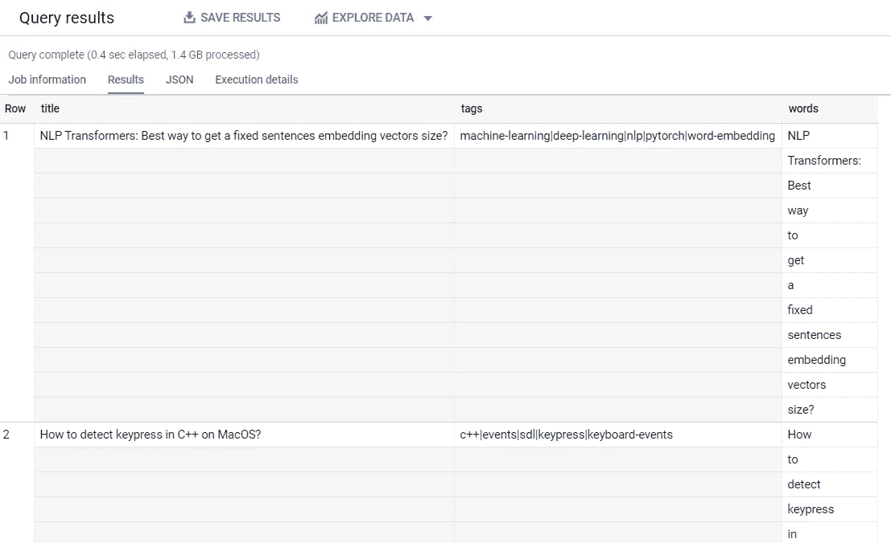
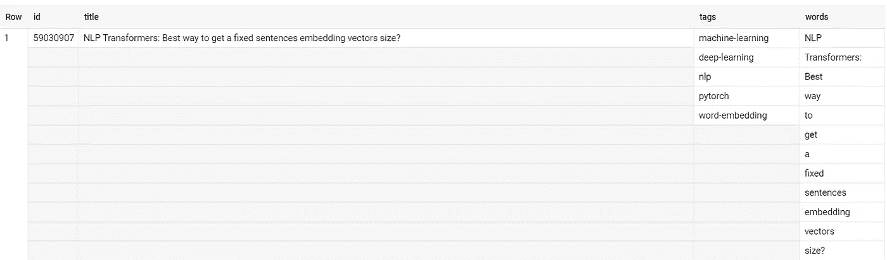
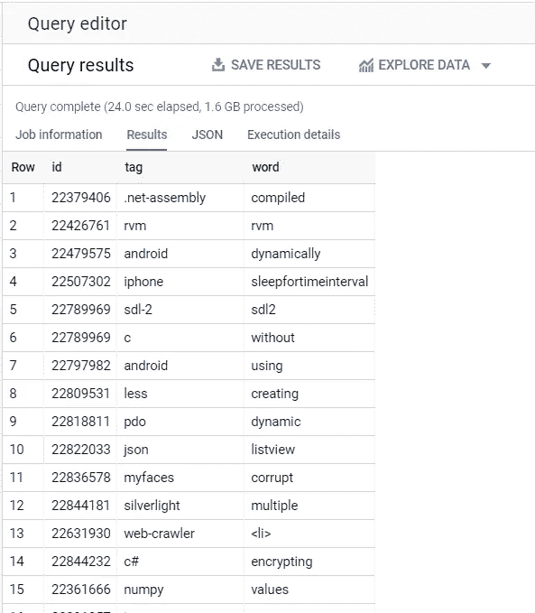
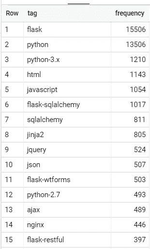

# BigQuery 中数组的介绍

> 原文：<https://towardsdatascience.com/introduction-to-arrays-in-bigquery-d9f6bd84ce54?source=collection_archive---------25----------------------->

## 实际用例:字数统计


[Joshua Sortino](https://unsplash.com/@sortino?utm_source=medium&utm_medium=referral) 在 [Unsplash](https://unsplash.com?utm_source=medium&utm_medium=referral) 上的照片

我每天都在使用 BigQuery，不得不说它的速度和易用性令人惊叹。

我为什么喜欢 BigQuery？三个原因:

1.  它无需服务器，完全受管理。除了我的疑问，我什么都不用想。
2.  由于高效的压缩柱状存储，它的速度非常快。
3.  它有一个现代化的用户界面:我可以从浏览器做任何事情，没有笨重的安装。

为了举例说明性能，这里有一个 18.5M 行的表:



让我们对它运行一个简单的正则表达式查询，提取所有问题的标题和正文，其中标题提到了以下编程语言之一:`python`、`rstats`、`sql`:

```
select title, body 
from `bigquery-public-data.stackoverflow.posts_questions` 
where regexp_contains(title, r"\b(python|rstats|sql)\b")
```

以下是输出结果:



我不知道你，但 **21 秒处理 26.9 GB**…我印象深刻。想知道那要花多少钱吗？BigQuery 每处理一 TB 收费 5 美元，因此查询成本为 26.9 / 1000 * 5 = 0.1345 美元。

至此，让我们直接开始使用 BigQuery 中的数组。

# 在 BigQuery 中使用数组

现在你可能已经猜到了，我们将会统计 StackOverflow 问题中出现的单词。但是在我们开始实际的例子之前，我想先介绍一下在 BigQuery 中使用数组的基础知识。

## 1.创建数组

在原型开发阶段，创建小的数组会很有用。例如:

```
select 
'Engineering' as role, 'Mike' as name, ['Java', 'C#'] as languages union all select 'Data science' as role, 'Vlad' as name, ['python', 'SQL', 'R'] as languages union all select 'Front-end' as role, 'Guillaume' as name, ['javascript', 'C#', 'HTML', 'CSS'] as languages
```

这为我们提供了以下输出:



注意数组是如何垂直嵌套在每行中的。

## 2.展平数组

如果我们想把这个嵌套结构变成一个普通的平面表，我们需要**取消嵌套**数组:

```
with T0 as 
(select 'Engineering' as role, 'Mike' as name, ['Java', 'C#'] as languages union all select 'Data science' as role, 'Vlad' as name, ['python', 'SQL', 'R'] as languages union all select 'Front-end' as role, 'Guillaume' as name, ['javascript', 'C#', 'HTML', 'CSS'] as languages) SELECT role, name, languages 
from T0 
CROSS JOIN UNNEST(T0.languages) as languages
```

`CROSS JOIN UNNEST`代码执行所谓的关联连接，这意味着它跟踪每个数组与哪一行相关联，这样就不会不必要地执行完全的交叉连接。

我们现在得到了更熟悉的扁平和重复结构:



## 3.索引数组

假设我们想知道每个程序员最后的语言是什么。BigQuery 中数组的索引有两种方式:基于 0 的索引(python 风格)用`OFFSET`或者基于 1 的索引(R 风格)用`ORDINAL`。

我们将以`ORDINAL`为例，和`ARRAY_LENGTH`一起检索每个数组的长度。使用与上面相同的 T0 定义:

```
SELECT role, name, languages[ORDINAL(ARRAY_LENGTH(languages))] as last_language from T0
```



# 使用 BigQuery 统计单词

基础知识讲完了，让我们进入一个具体的数组用例。

我们希望有一种方法来统计问题标题中每个单词的频率，如果可能的话，还有一种方法来捕捉单词和问题标签之间的相关性。

将字符串转换成单词数组的一个关键函数是`split`函数。这里有一个例子:

```
select title, tags, split(title, ' ') as words 
from `bigquery-public-data.stackoverflow.posts_questions` limit 10
```



有趣的是，我们在上图中看到我们有一串标签。让我们把它也变成一个数组:

```
select 
title, 
split(tags, '|') as tags, 
split(title, ' ') as words 
from `bigquery-public-data.stackoverflow.posts_questions` limit 10
```

所以每行包含两个数组:



现在我们将**交叉连接/取消嵌套两个数组**，并过滤掉不感兴趣的单词，即长度小于 2 个字符的单词和一些常见的停用词:

```
with t0 as (select 
id, 
title, 
split(tags, '|') as tags, 
split(title, ' ') as words 
from `bigquery-public-data.stackoverflow.posts_questions`) select 
id, 
tag, 
word 
from t0 
cross join unnest(t0.words) as word 
cross join unnest(t0.tags) as tag 
where length(word) > 1 
and lower(word) not in ('me', 'my', 'myself', 'we', 'our', 'ours', 'ourselves', 'you', 'your', 'yours', 'yourself', 'yourselves', 'he', 'him', 'his', 'himself', 'she', 'her', 'hers', 'herself', 'it', "it's", 'its', 'itself', 'they', 'them', 'their', 'theirs', 'themselves', 'what', 'which', 'who', 'whom', 'this', 'that', 'these', 'those', 'am', 'is', "isn't", 'are', 'was','were', "aren't", "wasn't", "weren't", 'be', 'been', 'being', 'have', 'has', 'had', 'having', 'do', 'does', 'did', 'doing', 'an', 'the', 'and', 'but', 'if', 'or', 'because', 'as', 'until', 'while', 'of', 'at', 'by', 'for', 'with', 'about', 'against', 'between', 'into', 'through', 'during', 'before', 'after', 'above', 'below', 'to', 'from', 'up', 'down', 'in', 'out', 'on', 'off', 'over', 'under', 'again', 'further', 'then', 'once', 'here', 'there', 'when', 'where', 'why', 'how', 'all', 'any', 'both', 'each', 'few', 'more', 'most', 'other', 'some', 'such', 'no', 'nor', 'not', 'only', 'own', 'same', 'so', 'than', 'too', 'very', 'can', "can't", 'will', "won't", 'just', "don't", 'should', "shouldn't", 'now', 'get')
```

这个查询运行了 24 秒，就这样，我们获得了所有相关标签和单词的笛卡尔积:



现在我们可以很容易地问，对于一个给定的标签，例如`python`(假设上一步的输出已经保存在表`so`中，在数据集`temp`内)，哪些单词最能被表示出来:

```
select 
word, 
count(*) as frequency 
from `temp.so` where tag='python' 
group by word order by frequency desc
```

这是我们得到的结果:


或者我们可以反过来问什么标签与一个特定的单词相关联，例如`flask`:

```
select 
tag, 
count(*) as frequency 
from temp.so 
where word = 'flask' 
group by tag order by frequency desc
```

我们得到了:



# 更进一步

在这里，tf-idf 分析将有助于挑选出 python 相对于其他标记真正特有的内容。虽然超出了本文的范围，但这将是一个很好的副业。

数组构成了 BigQuery 的一个重要特性，我还期待着写一些其他的好东西。在我看来，BigQuery 是最令人印象深刻的大数据分析工具之一！