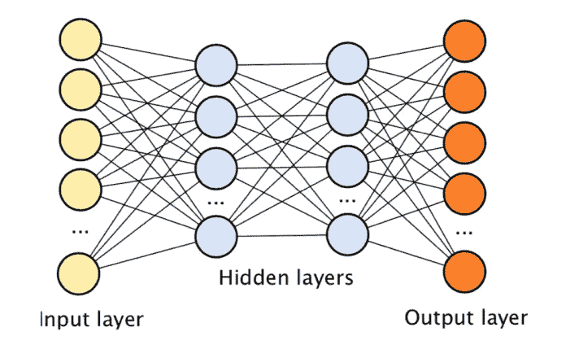

# 人工神经网络导论

> 原文：<https://towardsdatascience.com/introduction-to-artificial-neural-networks-ac338f4154e5?source=collection_archive---------41----------------------->

莫里茨·金德勒在 [Unsplash](https://unsplash.com/s/photos/neural-network?utm_source=unsplash&utm_medium=referral&utm_content=creditCopyText) 上拍摄的照片

人工智能，顾名思义，就是通过让机器像人一样思考或行动，让机器具备人工智能。它正在快速前进，深度学习是其中的主要贡献者之一。

# 深度学习

它是机器学习的一个子领域，处理受大脑结构和功能启发的算法，称为人工神经网络。这些类似于中枢神经系统的结构，其中每个神经元相互连接。

图片来源:geospatialworld.net

英国数学家、乐购俱乐部卡的设计者克莱夫·亨比创造了一个短语**数据是新的石油。**如果数据是新的石油，数据库和仓库被认为是将数据推入互联网的石油钻塔，那么你可以想象深度学习是将原油转化为所有有用产品的炼油厂。我们不会耗尽数据，因为在互联网上做任何事情都会产生数据。

吴恩达幻灯片，版权所有

深度学习的一些应用包括:

*   人脸检测和识别
*   自动驾驶汽车
*   语言翻译
*   虚拟助手

# 履行

它是使用人工神经网络实现的。让我们详细探讨一下神经网络。

这是一种计算模型，其灵感来自人脑中生物神经网络处理信息的方式。深度神经网络的示例如下所示:

图片来源:sciencedirect.com

## 输入层

输入层由独立变量的输入组成。这些输入可以从外部源加载，如 web 服务或 CSV 文件。简单来说，这些变量被称为特征，例如，卧室的数量，房子的面积，离城市的距离被认为是你在购买房子时的特征。我们随机初始化接近零但不为零的权重。

## 砝码

权重在神经网络中起着重要的作用，每个节点/神经元都有一定的权重。神经网络通过权重进行学习，通过调整权重，神经网络决定某些特征是否重要。

## 隐蔽层

它们位于输入层和输出层之间。在这一层，神经元接受一组加权输入，并在激活函数的帮助下产生一个输出。

**第一步:**在这一步中，输入值和权重相乘，加上偏差，并一起求和。

**步骤 2:** 在该步骤中，我们应用激活函数，激活函数用于向神经网络引入非线性。这些神经元对输入数据应用不同的变换。深度学习中使用了许多激活函数，其中一些包括 ReLU、阈值函数、Sigmoid 和整流器函数。

**第三步:**在这一步中，它通过所有的隐藏层，然后传递到输出层。

## **输出层**

这是神经网络的最后一层，从隐藏层的最后一个节点接收输入。该层可以是

*   连续(股票价格)
*   二进制(0 或 1)
*   分类(猫、狗或鸭)

# 神经网络是如何工作的？

有两种方法可以让程序做你想做的事情

1.  一种是硬编码，你告诉程序一些特定的规则和你想要的结果。
2.  第二个是神经网络，你为程序或算法创建一个设施，使其能够理解自己需要做什么。

神经网络循环有两个阶段，一个是训练阶段，一个是预测阶段。寻找权重和偏差值的过程发生在**训练阶段**。神经网络处理我们的输入以产生预测的过程属于**预测阶段。**

我们可以认为神经网络的学习过程是一个传递和返回的迭代过程。传递是信息向前传播的过程，返回是信息向后传播的过程。

图片来源:slideshare.net

在前向传播中，网络暴露给数据。给定一些数据，我们计算输入值与指定权重的点积，然后将所有这些值相加，并将激活函数应用于隐藏层中的结果。

我们应用激活函数将非线性引入到网络中，以便它可以容易地映射数据。该节点充当下一层的输入层。如此重复，直到我们得到最终的输出向量 ***y*** ，它被认为是神经网络的预测。

获得的输出值称为预测值。为了了解模型的表现，我们将预测值与实际值进行比较，我们得到的差异称为误差，即成本函数。

损失函数与精度成反比，代价函数越少，精度越高，我们的目标是使损失函数最小。损失函数的公式可以描述如下

价值函数

计算损失函数后，我们将该信息反馈给神经网络，在神经网络中，该信息通过权重返回，权重被更新，这种方法被称为**反向传播**。这个过程重复几次，以便机器理解数据，并且将根据偏好分配特征的权重，最后，我们将处于通过最小化成本函数来实现我们的预测的阶段。

图片来源:slideshare.net

# 梯度下降

它是一种优化技术，用于通过最小化成本函数来改进基于神经网络的模型。这个过程发生在反向传播步骤中。它允许我们调整特征的权重以达到全局最小值。

图片来源:quantaneo.com

一些梯度下降算法是

*   批量梯度下降
*   随机梯度下降
*   小批量梯度下降

总结整个概念

*   我们需要初始化随机接近零但不是零的权重。
*   将第一次观察输入到输入层。
*   在这里，前向传播发生在神经元被激活的地方，并且向作为输出层的预测传播。
*   我们使用损失函数比较实际值和预测值，误差值再次反馈给神经网络
*   反向传播发生在误差值被反馈并反向传递的情况下，并且权重被更新以便最小化损失函数，这导致更好的预测。
*   对数据集中的所有观测值重复上述步骤，或者在一批观测值之后进行更新。
*   当整个数据集通过神经网络时，产生一个时期，执行更多的时期。

这就是现在，希望你喜欢阅读关于神经网络。在我的下一篇博客中，我将向你解释卷积神经网络。