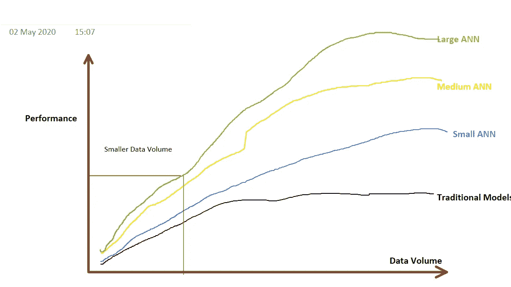
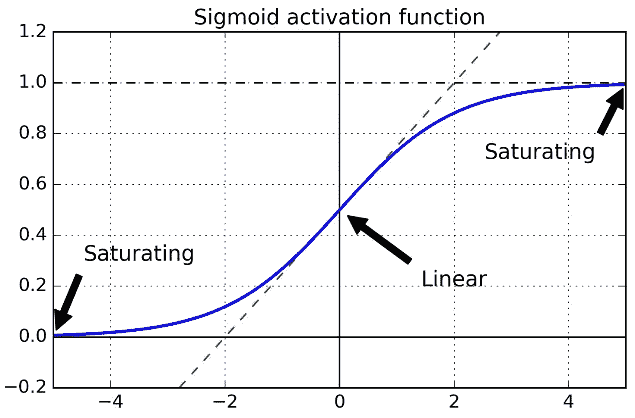
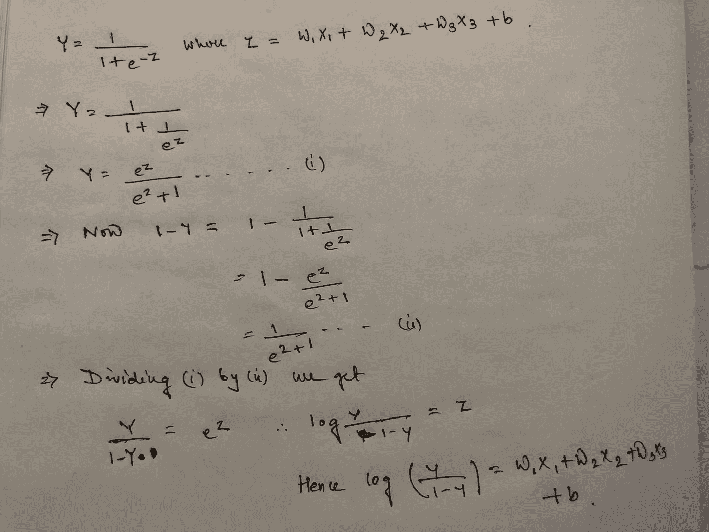
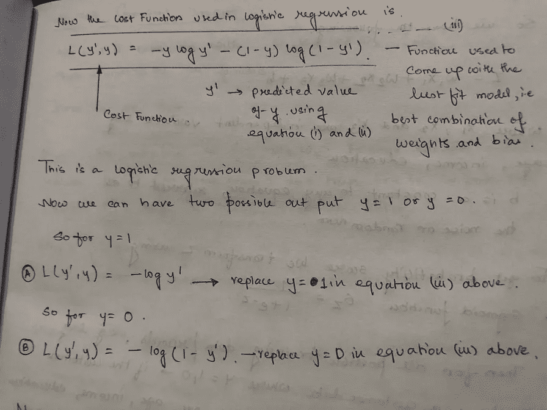
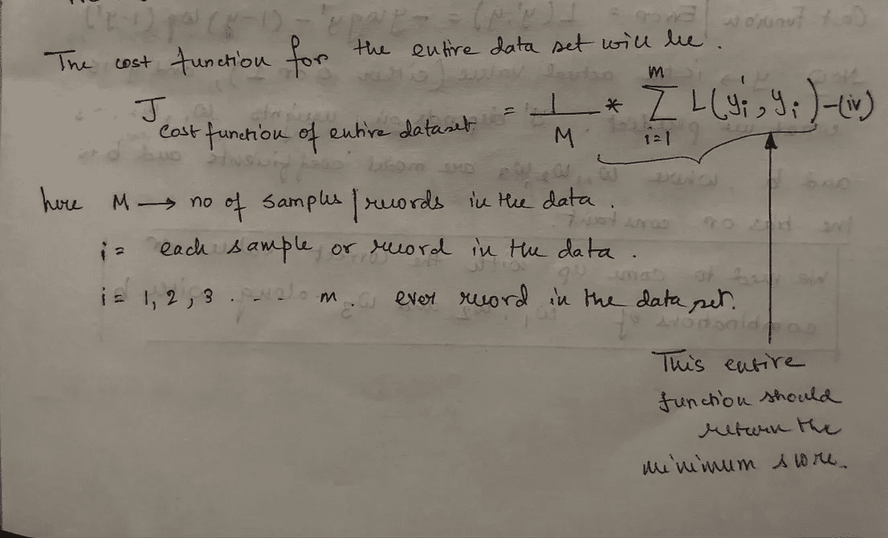
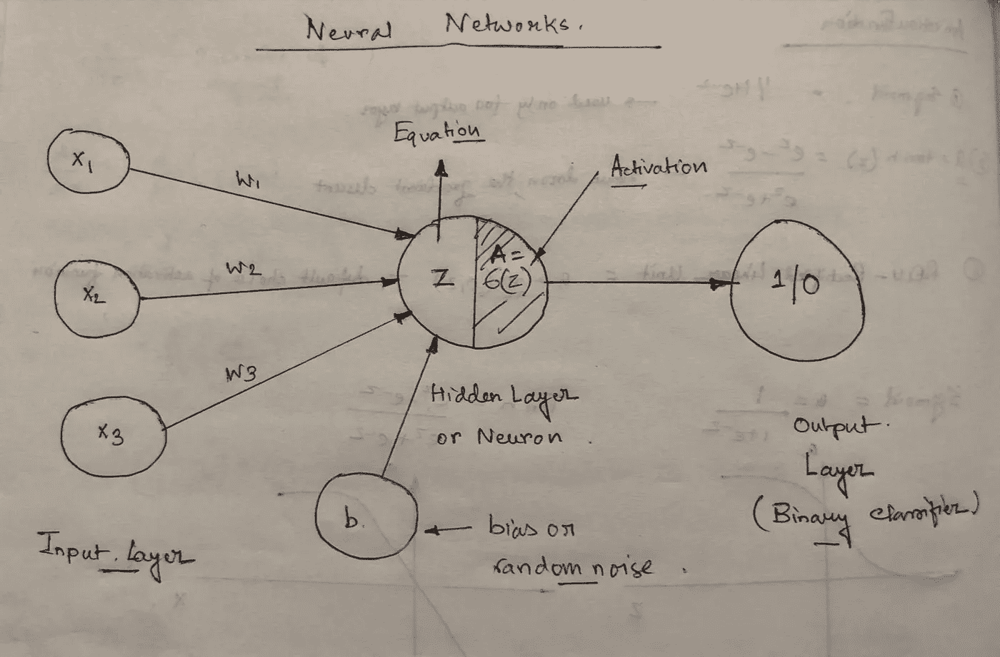
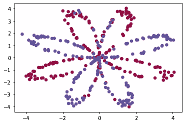
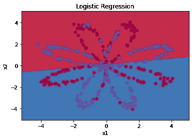
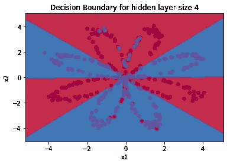
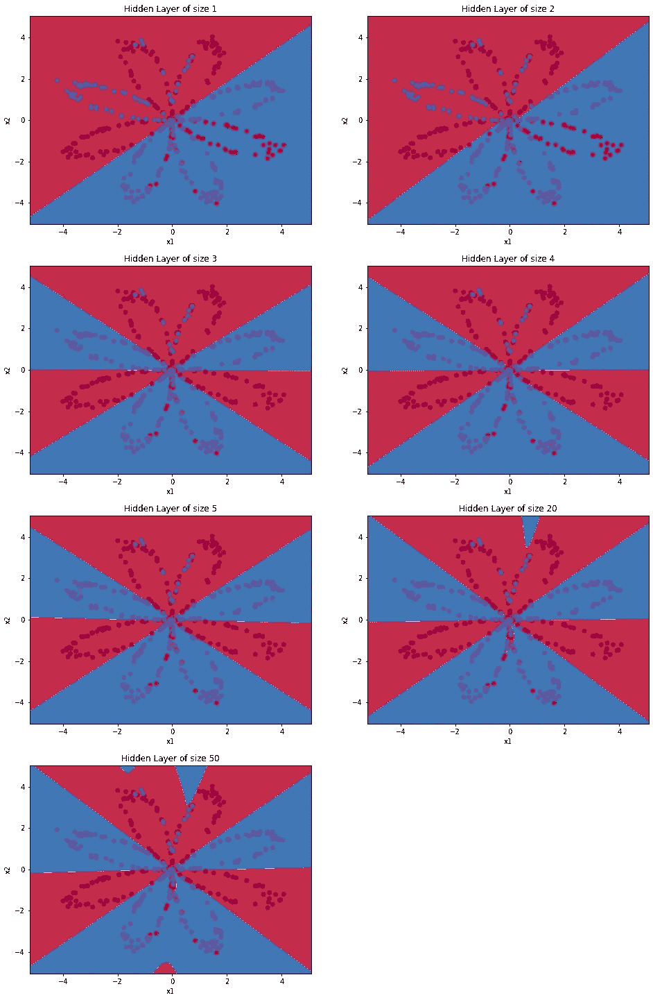

# 面向初学者的人工神经网络介绍

> 原文：<https://towardsdatascience.com/introduction-to-artificial-neural-networks-for-beginners-2d92a2fb9984?source=collection_archive---------17----------------------->

## 理解神经网络的概念

塞尔吉奥·索萨在 [Unsplash](https://unsplash.com?utm_source=medium&utm_medium=referral) 上的照片

# 介绍

ann(人工神经网络)是深度学习的核心，是机器学习技术的高级版本。人工神经网络具有通用性、适应性和可扩展性，使其适合处理大型数据集和高度复杂的机器学习任务，如图像分类(如谷歌图像)、语音识别(如苹果的 Siri)、视频推荐(如 YouTube)或分析客户情绪(如 Twitter 情绪分析器)。

神经生理学家沃伦·麦卡洛克和数学家沃尔特·皮茨在 1943 年首次介绍了人工神经网络。然而，安有它的起伏。1960 年后，随着支持向量机和其他强大的机器学习技术的进步，研究人员对神经网络的兴趣和兴奋程度有所下降，这些技术产生了更好的准确性，并具有更强的理论基础。神经网络很复杂，需要巨大的计算能力和时间来训练。然而，1990 年后，计算领域的进步(参考摩尔定律)以及随后强大的 GPU 卡的生产带来了一些兴趣。

图一。展示了随着数据量的增加，性能的变化。大多数算法对较小的数据集产生类似的性能测量，然而，一旦数据量扩展超过某个阈值，神经网络工作得最好。(图片由作者使用一个笔记开发)

# 分类算法

让我们尝试使用分类案例研究来分析一个神经网络。假设我们使用三个独立变量 X1、X2 和 X3，X1 代表贷款金额，X2 代表贷款期限，X3 代表婚姻状况。我们希望开发一种分类算法，该模型可以预测客户是否会违约(二元分类)。因此，这种情况下的等式将是 Z=X1*w1 + X2*w2 + X3*w3 + b，其中 w1、w2 和 w3 是与独立变量相关的权重，b 是偏差项，通常称为噪声/随机噪声。如果你熟悉 sigmoid 函数(用于逻辑回归),你会知道我们尝试对我们的数据建模，使其遵循下面概述的曲线。

图二。逻辑回归问题中使用的 sigmoid 曲线的图示。(图片由作者使用 Excel 和 Power Point 开发)

Y=1/(1+e^-Z).给出了 Sigmoid 函数 y 假设 Z=X1*w1 + X2*w2 + X3*w3 + b，并求解 Y，我们将得到 log(Y/(1-Y))= X1 * w1+X2 * w2+X3 * w3+b，其中我们试图计算每个客户的概率得分。计算如下所示。

图 3。使用 sigmoid 函数推导逻辑回归方程。(图片由作者开发)

一旦模型开始训练，我们需要优化成本函数，即减少实际值和预测值之间的误差。由于上述示例讨论了二元分类问题，这里的一般思想是对于被标记为违约者(比如标签 1)的客户，概率值应该尽可能地接近 1，类似地，对于被标记为非违约者(比如标签 0)的客户，预测的概率得分应该尽可能地接近 0。逻辑回归方程的成本函数和平均成本函数使用以下公式计算。

图 4。成本函数用于寻找逻辑回归的最佳参数估计。(图片由作者开发)

# 神经网络体系结构

为了使用神经网络实现相同的问题空间，我们需要创建基于神经元的结构。在进入架构之前，让我们看一下神经网络的一些组件。

1.  **输入层** —代表输入变量加上偏差项。因此，如果有 n 个输入变量，则输入层的大小为 n + 1，其中+ 1 是偏置项
2.  **隐藏的一层/多层**——这些表示所有数学计算都在其中完成的神经元。注给定的神经网络可以在一个隐藏层或多个隐藏层中有多个神经元
3.  **激活功能** —在将信息传递给连续层之前，转换给定层的输出。**激活函数**是确定给定**神经网络**输出的数学方程。是**隐层**中每个**神经元**的一部分，决定与预测相关的输出
4.  **输出层**——网络的最终“输出预测”
5.  **正向传播** —计算从输入层到输出层的每次迭代的输出
6.  **反向传播**-通过分析用于优化模型输出的成本函数的导数，计算每次正向传播后的修正权重(w1、w2、w3 和 b1)
7.  **学习率** —确定每次反向传播后归因于每个权重和偏差项的百分比变化，即控制模型学习数据信息的速度

图 5。用于当前分类问题的单层神经网络的结构。(图片由作者开发)

# 那么在神经网络中会发生什么呢？

ANN 算法的思想是确定权重和偏差项的最佳值，使得误差函数尽可能最小。因此

*   **步骤 1** —权重 w1、w2、w3 和 b1 用一些随机值初始化
*   **步骤 2** —隐藏层使用给定的权重和输入变量计算概率得分。如果适用，应用激活函数(例如，sigmoid)
*   **步骤 3** —使用成本函数，并重复梯度下降算法来计算更新的权重。更新的权重被确定为权重(w)= w-α*(dJ/dw)，其中α是学习率，dJ/dw 是权重变化时成本函数的变化。类似地，bias (b) = b-alpha*(dJ/db)
*   **步骤 4** —重复步骤 2 和 3，直到成本函数最小

图 6。具有多个隐藏层的人工神经网络(图片来自 GIPHY)。

 [## 张量流-神经网络游乐场

### 这是一种构建从数据中学习的计算机程序的技术。它非常松散地基于我们如何思考…

playground.tensorflow.org](https://playground.tensorflow.org/#activation=sigmoid&batchSize=10&dataset=circle&regDataset=reg-plane&learningRate=0.03&regularizationRate=0&noise=0&networkShape=1&seed=0.54304&showTestData=false&discretize=false&percTrainData=70&x=true&y=true&xTimesY=false&xSquared=false&ySquared=false&cosX=false&sinX=false&cosY=false&sinY=false&collectStats=false&problem=classification&initZero=false&hideText=false) 

# 为什么我们需要人工神经网络？

利用 Tensorflow 神经网络操场将提供对神经网络优于集成技术、逻辑回归或支持向量机的优势的更好理解。

图 7。使用 flower 数据集将数据点分类为各自的颜色。(图片由作者使用 Jupyter 笔记本开发)

在试图将不同的坐标(比如说 x 和 y)分类时，在二维空间中显示的代表花的图像变成它们各自的颜色。逻辑回归和神经网络用于将坐标分类成特定的颜色。逻辑回归处理决策边界，因此要理解逻辑回归在识别点的颜色方面的影响，识别决策边界是很重要的。逻辑回归的输出清楚地表明，该算法使用线性决策边界来将点分类到它们各自的颜色，因此最终错误地分类了许多数据点。具有一个隐藏层的神经网络产生改进的决策边界，从而导致更高的准确性。

图 8。说明了多个神经元对最终输出的影响。神经元数量越多，分类精度越好。(图片由作者使用 Jupyter 笔记本开发)

*关于作者:高级分析专家和管理顾问，帮助公司通过对组织数据的商业、技术和数学的组合找到各种问题的解决方案。一个数据科学爱好者，在这里分享、学习、贡献；你可以在* [*LinkedIn*](https://www.linkedin.com/in/angel-das-9532bb12a/) *和*[*Twitter*](https://twitter.com/dasangel07_andy)*上和我联系。*