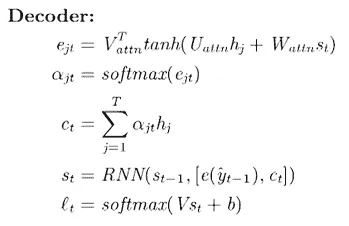

# 深度学习中的注意机制介绍——Eli 5 Way

> 原文：<https://towardsdatascience.com/introduction-to-attention-mechanism-in-deep-learning-eli5-way-d6c2d799ef18?source=collection_archive---------30----------------------->

## ELI5 项目机器学习

乔希·拉科瓦尔在 [Unsplash](https://unsplash.com?utm_source=medium&utm_medium=referral) 上的照片

在这篇文章中，我们将讨论作为注意力机制发展动力的编码器-解码器模型的一些局限性。之后，我们将讨论注意模型的概念及其在机器翻译中的应用。

> **注意:**注意机制是一个稍微高级的话题，需要理解编码器-解码器和长短期记忆模型。请参考我以前关于[编解码器型号](/introduction-to-encoder-decoder-models-eli5-way-2eef9bbf79cb?source=friends_link&sk=920ca789dc31a1dad72ef334a918c237)和 [LSTM](/long-short-term-memory-and-gated-recurrent-units-explained-eli5-way-eff3d44f50dd?source=friends_link&sk=d6fcecd91f04e0c6403181f1ea56d64b) 的文章

在我们讨论注意力模型的概念之前，我们先来回顾一下使用编码器-解码器模型的机器翻译任务。

> **引用说明:**本文的内容和结构是基于我对四分之一实验室深度学习讲座的理解——[pad hai](https://padhai.onefourthlabs.in/)。

# 机器翻译—概述

让我们以使用 seq2seq 模型将文本从印地语翻译成英语为例，该模型使用编码器-解码器架构。编码器-解码器架构中的底层模型可以是从 RNN 到 LSTM 的任何东西。

在高层次上，encoder 只读取整个句子一次，并将来自先前隐藏的表示和先前输入的所有信息编码到一个编码向量中。然后，解码器在每个时间步长使用这种嵌入来产生新的单词。

这种方法的问题是，编码器只读取整个句子一次，它必须记住所有内容，并将句子转换为编码向量。对于较长的句子，编码器将无法记住序列的开始部分，从而导致信息丢失。

> 人类就是这样翻译一句话的吗？

你认为整个输入序列(或句子)在编码过程中的每个时间点都很重要吗？。我们可以特别强调某些单词而不是同等重视所有的单词吗？。注意力机制就是为了应对这些挑战而发展起来的。

我们人类试图通过只关注输入中的某些单词来翻译输出中的每个单词。在每个时间步，我们只从长句中提取相关信息，然后翻译特定的单词。 ***理想情况下，在每个时间步，我们应该只将相关信息(相关信息的编码)提供给解码器进行翻译。***

# 注意机制—甲骨文

我们如何知道哪些词是重要的，或者我们需要给予更多的关注？。现在，假设我们有一个神谕来告诉我们在给定的时间步长 *t* 应该关注哪些单词。在神谕的帮助下，我们能否设计出更好的架构，以便将相关信息反馈给解码器？。

因此，对于每个输入单词，我们分配一个权重 **α** (范围在 0-1 之间)，表示该单词在时间步长' **t'** 对输出的重要性。例如， **α** 12 表示第一个输入字在第二时间步对输出字的重要性。概括地说，表示法 **α** jt 表示在 tᵗʰ时间步长与 jᵗʰ输入字相关联的权重。

注意时间-步骤 2

例如，在时间步长 2，我们可以只对相应的单词表示以及权重 **α** jt 进行加权平均，并将其送入解码器。在这种情况下，我们不是将完整的编码矢量输入解码器，而是输入单词的加权表示。实际上，我们根据甲骨文给出的权重，对重要的词给予了更多的重视或关注。(感谢甲骨文！)

直觉上，这种方法应该比编码器-解码器架构的普通版本更好，因为我们没有用不相关的信息使解码器过载。

# 注意力模型

别被骗了，现实中，没有神谕。如果没有神谕，那我们怎么知道重量呢？。

> **符号:**从现在开始，我们将 tᵗʰ时间步的解码器状态称为 **St** ，将 jᵗʰ时间步的编码器状态称为 **hⱼ** 。

必须从数据中学习参数 **α** jt。为了实现这一点，我们定义了一个函数，

注意力功能

计算中间参数的函数( **e** jt)有两个参数。让我们讨论一下这些参数是什么。在 tᵗʰ时间步长，我们试图找出 jᵗʰ字有多重要，因此计算权重的函数应该取决于字本身的矢量表示(即……hⱼ)和直到该特定时间步长的解码器状态(i.e…St-₁).

权重 **e** jt 捕捉 jᵗʰ输入字对于解码 tᵗʰ输出字的重要性。使用 softmax 函数，我们可以归一化这些权重，以获得我们的参数 **α** jt(范围在 0-1 之间)。

参数 **α** jt 表示聚焦在 jᵗʰ字上以产生 tᵗʰ输出字的概率。

# 注意力功能

在上一节中，我们已经讨论了如何使用一个高级函数来学习参数 **α** jt，该函数带有两个参数——tᵗʰ时间步长之前的解码器状态(St-₁)和单词的矢量表示(hⱼ).使用 softmax 对该函数的输出进行归一化，以获得 **α** jt。

在本节中，我们将定义 **e** jt 的参数形式，以便我们能够从数据中学习该参数。计算 **e** jt 最常用的参数形式或函数如下:

注意参数函数

为了学习参数 **e** jt，我们引入了额外的参数 Vₐₜₜ、Uₐₜₜ和 Wₐₜₜ.其中 Uₐₜₜ表示与编码器输入相关的权重，Wₐₜₜ表示与解码器隐藏状态相关的权重，Vₐₜₜ表示与解码器输出相关的权重。这些参数也将与编码器-解码器模型的其他参数一起被学习。

# 机器翻译——注意力机制

在上一节中，我们能够定义参数函数来学习权重( **e** jt，在规范化之前)以给予特定单词更多的关注。在本节中，我们将讨论使用注意机制的端到端机器翻译任务。

机器翻译—注意

在这项任务中，我们将输入内容从印地语翻译成英语。为简单起见，我们假设 RNN 的被用作编码器和解码器模型。但是你也可以用 LSTM 或者 GRU 的任何变体。

## 编码器

*   当我们不加注意地将其与编码器-解码器架构的普通版本进行比较时，编码器的操作没有太大变化。
*   在每个时间步长，每个字的表示被计算为前一个时间步长的输出和当前输入以及偏置的函数。
*   最终隐藏状态 vector(sₜ)包含来自先前隐藏表示和先前输入的所有编码信息。
*   RNN 被用作编码器。

## 解码器

*   在编码器-解码器模型的普通版本中，我们将整个编码向量传递到输出层，输出层解码成下一个可能单词的概率分布。
*   我们不需要传递整个编码向量，而是需要使用我们在上一节中讨论的寻找 **e** jt 的有趣等式来寻找注意力权重。然后使用 softmax 函数归一化 **e** jt 权重，得到 **α** jt。
*   一旦我们有了输入解码器的所有输入和与之相关的权重(感谢这个奇妙的等式！)，我们将计算所有输入和权重的加权组合，以获得合成向量 Ct。
*   我们将把加权组合向量 Ct 馈送给解码器 RNN，该解码器解码成下一个可能单词的概率分布。这种解码操作适用于输入中出现的所有时间步长。
*   输出层是一个 softmax 函数，它将隐藏状态表示和与之关联的权重以及偏差作为输入。

不是吓人的功能。真的！！

这些模型被称为**编码-出席-解码模型**或也称为 **Seq2Seq 与注意**。

*推荐阅读—***ELI5 项目机器学习**

 [## 编码器-解码器模型简介— ELI5 路

### 讨论编码器-解码器模型的基本概念及其在一些任务中的应用，如语言建模…

towardsdatascience.com](/introduction-to-encoder-decoder-models-eli5-way-2eef9bbf79cb)  [## 长短期记忆和门控循环单位的解释——Eli 5 方式

### 在这篇文章中，我们将学习 LSTM 和格鲁工作背后的直觉

towardsdatascience.com](/long-short-term-memory-and-gated-recurrent-units-explained-eli5-way-eff3d44f50dd) 

# 结论

在这篇文章中，我们讨论了机器翻译中编码器-解码器模型的普通版本的一些限制。对于较长的句子，编码器将无法记住序列的开始部分，从而导致信息丢失。之后，我们研究了如何只将相关信息提供给解码器，或者将更多注意力放在有助于在较长序列中保留信息的重要单词上。

从那里，我们讨论了参数函数，以了解在解码过程中给予某些单词更多重要性所需的注意力权重。最后，我们使用注意机制研究了端到端的机器翻译任务。

在我的下一篇文章中，我们将讨论使用 Pytorch 实现注意力机制。所以确保你在媒体上跟随着我，一旦它掉下来，你就会得到通知。

直到那时，和平:)

NK。

# 作者简介

[Niranjan Kumar](https://medium.com/@niranjankumarc) 是好事达印度公司的高级数据科学顾问。他对深度学习和人工智能充满热情。除了在媒体上写作，他还作为自由数据科学作家为 Marktechpost.com 写作。点击查看他的文章[。](https://www.marktechpost.com/author/niranjan-kumar/)

你可以在 [LinkedIn](https://www.linkedin.com/in/niranjankumar-c/) 上与他联系，或者在 [Twitter](https://twitter.com/Nkumar_283) 上关注他，了解关于深度学习和机器学习的最新文章。

## 参考资料:

*   [深度学习(CS7015): Lec 15.3 注意机制](https://www.youtube.com/watch?v=yInilk6x-OY&list=PLyqSpQzTE6M9gCgajvQbc68Hk_JKGBAYT&index=115)