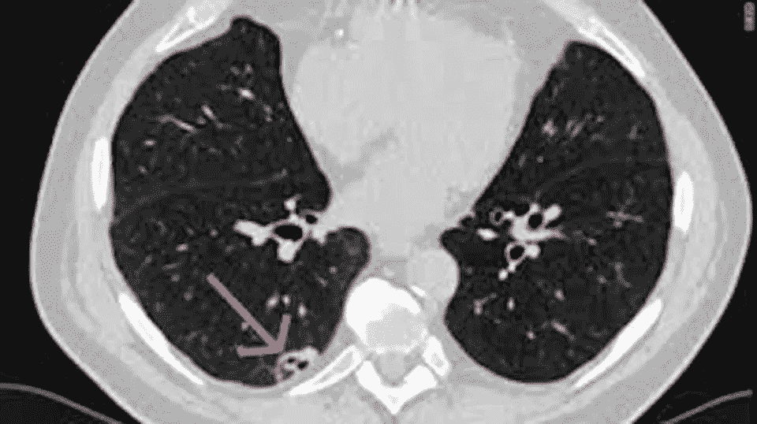
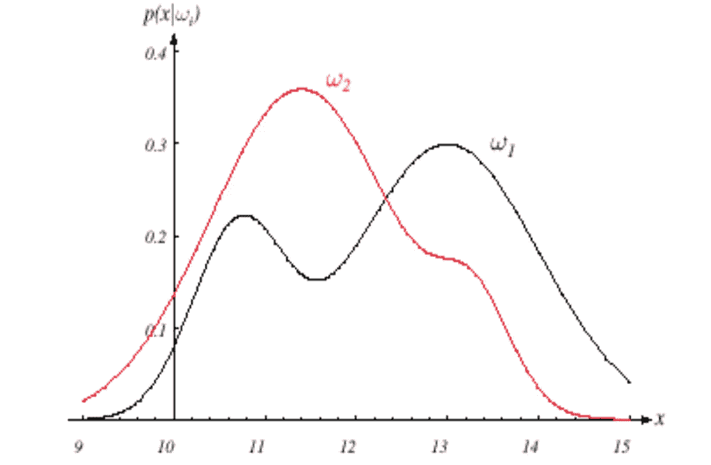
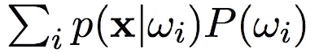

# 贝叶斯决策理论简介

> 原文：<https://towardsdatascience.com/introduction-to-bayesian-decision-theory-1532376ef986?source=collection_archive---------6----------------------->

图片来自 Seo et。阿尔(2006 年)

## 机器学习的统计方法

# 介绍

无论你是在建立机器学习模型还是在日常生活中做决策，我们总是选择风险最小的路径。作为人类，我们天生会采取任何有助于生存的行动；然而，机器学习模型最初并不是基于这种理解建立的。这些算法需要训练和优化，以选择风险最小的最佳选项。此外，重要的是要知道，一些风险决策如果不正确，可能会导致严重的后果。

图片由[福布斯](https://www.forbes.com/sites/robertglatter/2015/02/16/medicare-to-cover-low-dose-ct-scanning-for-those-at-high-risk-for-lung-cancer/#1b34636e7897)

考虑癌症检测的问题。根据患者的计算机断层扫描(CT)扫描，放射科医师可以确定肿瘤的存在吗？如果他们认为患者体内有肿瘤，那么医生需要判断肿瘤是良性还是恶性，以确定适当的治疗方法。因为这篇文章的目的是描述做出这些决定的统计方法，所以我将只专注于分解问题的第一部分:是否有肿瘤，是还是不是？

# 贝叶斯定理

在统计和概率的世界中，最著名的等式之一是贝叶斯定理(见下面的公式)。基本的直觉是，给定某个特征(即属性)，某个类或事件发生的概率是基于特征值的可能性和关于感兴趣的类或事件的任何先验信息来计算的。这看起来有很多要消化，所以我将为你分解一下。首先，癌症检测是两类问题。第一类ω1 代表肿瘤存在的事件，ω2 代表肿瘤不存在的事件。

## 在先的；在前的

贝叶斯定理有四个部分:先验、证据、可能性和后验。先验(P(ω1)，P(ω2))定义事件ω1 或ω2 在自然界发生的可能性。重要的是要认识到先验视情况而定。由于目标是检测癌症，可以有把握地说肿瘤存在的概率非常低:P(ω1)

## 可能性

从高层次来看，CT 扫描是指 x 射线以圆周运动的方式进行扫描。产生的关键指标之一是衰减，这是对 x 射线吸收的一种测量。密度越高的物体衰减越大，反之亦然。因此，与肺组织相比，肿瘤更可能具有高衰减。

假设您只查看衰减值，以帮助您在ω1 和ω2 之间做出决定。每个类别都有一个类别条件概率密度 p(x|ω1)和 p(x|ω2)，称为似然性。下图显示了 p(x|ω)的假设类条件概率密度。这些分布是通过分析你的训练数据提取出来的；然而，让领域专家来检查数据的有效性总是好的。

照片来自杜达、哈特和斯托克公司的模式识别

## 证据

描述证据 p(x)的最佳方式是通过全概率法则。该定律指出，如果有互斥事件(例如ω1 和ω2)，其发生概率总和为 1，则某个特征(例如衰减)的概率是所有互斥事件的概率乘以先验总和。

## 在后面的

使用贝叶斯定理的结果称为后验 P(ω1|x)和 P(ω2|x)。后验概率表示在给定测量值 x(例如衰减)的情况下，观察值属于ω1 或ω2 类(即肿瘤是否存在)的概率。每一次观察都得到每一类的后验概率，所有的后验概率总和必须为 1。关于我们试图解决的癌症检测问题，有两种后验概率。下图是后验值如何根据测量值 x 变化的假设场景。除了似然性和后验之间的联系，后验值还会受到先验 P(ω)的严重影响。

# 决策规则

现在，我们对贝叶斯定理有了很好的理解，是时候看看我们如何使用它来确定我们两个类之间的决策边界了。有两种方法可以确定患者是否存在肿瘤。第一种是基本方法，仅使用先验概率值来做出决策。第二种方法利用后验概率，它利用了先验和类条件概率分布。

## 利用先验知识

假设我们只根据自然的先验概率做出决策。这意味着我们忘记了贝叶斯定理中的所有其他因素。由于有肿瘤的概率 P(ω1)远小于没有一个 P(ω2)，所以我们的模型/系统将总是决定每个患者没有肿瘤。即使模型/系统在大多数情况下是正确的，它也不会识别出实际上患有肿瘤并且需要适当医疗护理的患者。

## 利用后验概率

现在让我们通过使用后验概率 P(ω1|x)和 P(ω2|x)来采取更全面的方法。由于后验概率是贝叶斯定理的结果，先验的影响通过类条件概率密度 p(x|ω1)和 p(x|ω2)来减轻。如果我们的模型/系统正在寻找比普通组织具有更高衰减的区域，那么尽管存在自然的先验概率，肿瘤存在的概率也会增加。让我们假设一个特定区域有 75%的机会包含肿瘤，那么这意味着有 25%的机会根本没有肿瘤。这 25%的概率就是我们出错的概率，也就是风险。

# 结论

您刚刚学到的是贝叶斯决策理论的一个简单的单变量应用，通过使用多变量高斯分布代替证据和可能性，可以将其扩展到更大的特征空间。虽然这篇文章的重点是解决癌症检测的问题，但是贝叶斯定理在很多领域都有应用，包括投资、营销和系统工程。

# 资源

[1]徐英宇。(2006).针对内部人员非法机密访问的成本敏感访问控制。IEEE 情报与安全信息学会议录:2006 年 5 月 23-24 日。3975.117–128.10.1007/11760146_11.

[2]杜达，R. O .，哈特，P. E .，施托克，D. G. (2001 年)。*模式分类*。纽约:威利。国际标准书号:978–0–471–05669–0

[3] Glatter，r .,“覆盖肺癌高危人群低剂量 CT 扫描的医疗保险”，《福布斯》(2015 年)