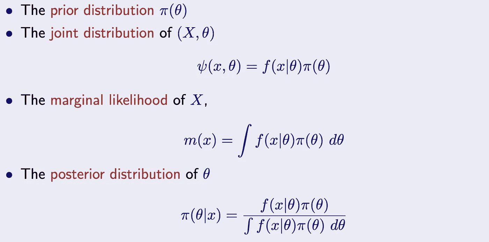

# 贝叶斯推理简介

> 原文：<https://towardsdatascience.com/introduction-to-bayesian-inference-18e55311a261?source=collection_archive---------33----------------------->

## 用一些理论和一步一步的例子来说明基础——疾病的诊断和参数估计

# 动机

想象一下下面的场景:你开着救护车去医院，必须在路线 A 和 b 之间做出选择，为了救你的病人，你需要在 15 分钟内到达。如果我们估算 A 路线需要 12 分钟，B 路线需要 10 分钟，你会选择哪个？B 路线似乎更快，为什么不呢？

目前提供的信息包括路线 A 和 B 的点估计。现在，让我们添加关于每个预测的不确定性的信息:路线 A 需要 12 分钟 1 分钟，而路线 B 需要 10 分钟 6 分钟。

现在看来，路线 B 的预测明显更加不确定，最终可能会超过 15 分钟的限制。在这里加入关于不确定性的信息，可以让我们改变决策，从走 B 路线到走 a 路线。

马克·克鲁兹在 [Unsplash](https://unsplash.com?utm_source=medium&utm_medium=referral) 上的照片

*鸣谢:之前的例子是根据我在哥伦比亚大学****Tamara Broderick****的* [*教程中的记忆。与这个例子相关的工作可以在[1]中找到。*](http://statisticalml.stat.columbia.edu/event/sampling-variational-inference-and-related-topics/)

更广泛地说，考虑以下情况:

*   我们想要估计一个没有固定值的量，相反，它可以在不同的值之间变化
*   不管真实值是否固定，我们都想知道我们估计的不确定性

救护车的例子旨在说明第二种情况。对于第一种情况，我们可以快速浏览一下诺贝尔经济学奖得主克里斯托弗·西姆斯的工作。我将简单地引用他的学生**渡边俊昭** :

> 我曾经问过克里斯，为什么他喜欢贝叶斯方法。他以卢卡斯评论作为回答，该评论认为，当政府和央行政策改变时，模型参数也会改变，因此它们不应被视为常数，而应被视为随机变量。

对于这两种情况，贝叶斯推理可以用来将我们感兴趣的变量建模为一个整体分布，而不是一个唯一的值或点估计。

# 介绍

贝叶斯推理的核心是贝叶斯法则:

贝叶斯法则

给定条件概率的定义，这个规则可能看起来非常明显并且几乎是多余的，尽管它的使用不是立即清楚的:

条件概率定义

贝叶斯规则的推导

**朱迪亚·珀尔**是这样描述的，在*的《何以见得》*【2】:

> (……)贝叶斯规则在形式上是他的条件概率定义的基本结果。但从认识论上来说，它远非初等。事实上，它作为一种规范性规则，根据证据更新信念。

的确，这个看似简单的概念受到了极大的关注。它的一些实际结果在于允许反转条件概率[从 P(B|A)到 P(A|B)]，并且随着我们观察 B 的更多样本，更新我们对 A 可以取的值(即它的分布)的信念。

在我们深入例子之前，让我们先给贝叶斯法则的组成部分命名:

又是贝叶斯法则

让我们简单讨论一下每个组件的含义。希望下一节中的例子能让这些定义更加清晰。

假设我们有兴趣了解 A，但只能观察 B:

*   之前的*是我们在观察 b 的任何值之前，对“A 取每个可能值的可能性”的信念。换句话说，我们必须选择一个分布而不是 A，我们有机会结合专家知识(我们有先验的*)，或者如果我们一无所知，可以简单地选择均匀分布。**
*   *****似然*** 表示“对于 A 的每个可能值，B 可以取的所有值的分布是什么”。于是我们定义了 B 上的一组分布，一个分布对应 A 的每个值，更具体地说，每个分布 P(B|A= *a* )是我们假设 A 等于某个值 *a* 后 B 的条件分布。**
*   *****证据*** 是我们观察到的东西的总体概率(我们观察到 B，可以看作 A 的证据)。一旦我们有了先验和似然性，就可以通过对 A 的所有可能值求和来计算，如下所示。这个量可能很难计算，需要近似计算技术，如蒙特卡罗或变分推断。**

****

**证据的计算(使用全概率法则)。如果 A 是连续的，求和就被一个积分代替。**

*   *****后验*** ，这是我们在考虑了新观察到的证据 b 之后，对 A 的分布的新信念[通常与我们先前的信念 P(A)不同]。**

**此外，我们可以将分数*似然* / *证据*表示为**似然比**。**

**注意，我们可以认为*先验*和*似然函数*都是固定的，即它们是在我们开始观察 b 的样本之前选择的假设。在这种情况下，*证据*和*后验*是我们的假设+观察的结果。**

**下面两个例子对我了解这些概念是如何实现的非常重要。**

# **示例 1 —疾病和测试**

***功劳:下面这个例子的灵感来源于* ***朱迪亚珍珠*** *的《何以见得》*【2】*。***

**假设我们想要估计患疾病 D 的概率，给定我们的测试 t 的结果。如果我们知道 10%的人口患有 D，我们可以将其纳入我们的**先验**(如果我们知道患者的详细信息，我们可以使用更好地代表她的人口子集):**

*   **P(D=1)=0.1**
*   **P(D=0)=0.9**

**注意，D 只能取两个值(0 或 1——健康或生病),但是在其他问题中，我们的变量可以接受更多的离散值，甚至是连续值。**

**从历史数据中，我们还知道测试的可靠性——我们知道当患者患有糖尿病时测试失败的可能性，以及当患者没有糖尿病时。这将构成我们的**可能性函数:****

*   **p(T = 1 | D = 1)= 0.75；P(T=0|D=1)=0.25**
*   **p(T = 1 | D = 0)= 0.2；P(T=0|D=0)=0.8**

**这样，对于 d 的每个值，我们在 T 上有一个条件分布。**

**正如您所看到的，我们假设已知疾病的真实情况，知道测试正确的概率— P(T|D)，但是我们感兴趣的是相反的情况[已知测试结果，患疾病的概率— P(D|T)]。这说明了能够反转条件概率的重要性，贝叶斯法则允许:**

****

**疾病/测试示例中的贝叶斯规则**

**假设我们做了一个测试，给出了一个肯定的结果 T=1。我们现在希望计算**后验概率**，即给定新信息后我们患病的更新概率。我们可以先计算一下**证据**:**

*   **P(T = 1)= P(T = 1 | D = 1)* P(D = 1)+P(T = 1 | D = 0)* P(D = 0)= 0.75 * 0.1+0.2 * 0.9 = 0.255**

**为了输出 D 上的更新分布，现在让我们计算 D 可以假设的每个值:**

*   **P(D = 1 | T = 1)= P(T = 1 | D = 1)* P(D = 1)/P(T = 1)= 0.75 * 0.1/0.255 = 0.29**
*   **P(D = 0 | T = 1)= P(T = 1 | D = 0)* P(D = 0)/P(T = 1)= 0.2 * 0.9/0.255 = 0.71**

**自然，第二步在这里是多余的，但是在其他设置中，D 可以取 2 个以上的值。我们更新的分布表明，在得到阳性测试后，P(D=1)从 10%增加到 29%。如果我们要进行第二次测试，我们可以使用这个新的分布作为输入，而不是原来的先验 P(D)。如果新的测试再次为正(T=1)，我们可以重复这个计算，进一步将 P(D=1)增加到 60%:**

*   **P(T=1)=0.75*0.29+0.2*0.71=0.36**
*   **P(D = 1 | T = 1)= P(T = 1 | D = 1)* P(D = 1)/P(T = 1)= 0.75 * 0.29/0.36 = 0.6**

**现在观察前面提到的*似然比* ( *似然* / *证据*)的含义也很有意思。这是我们之前的信念会增加或减少的比例。**

**希望这有助于理解更新信念时贝叶斯规则的机制。然而，对我来说，当谈论一个模型的参数时(例如克里斯托弗·西姆斯(Christopher Sims)对经济建模的研究，或许多机器学习应用)，理解会发生什么似乎还不够。**

# **示例 2 —二项式建模**

**转到一个更抽象的领域，贝叶斯规则可以用来估计模型参数的分布。例如，克里斯托弗·西姆斯(Christopher Sims)利用贝叶斯法则建立了一个政府和政策会发生变化的经济模型。在这种情况下，如果我们用一个分布来描述一个模型参数，我们可以比使用一个单一的值更精确地解释这种变化。**

***鸣谢:下面这个例子部分灵感来自于****Antonio salmerón****在* [*的概率讲座。艾暑期学校*](https://probabilistic.ai/) *(* [*幻灯片*](https://github.com/probabilisticai/probai-2019/blob/master/day1/introduction_to_probabilistic_modelling.pdf) *，* [*视频*](https://www.youtube.com/watch?v=rvB-VVgot2A) *)***

**我们有一个二项式分布，代表 20 个二元实验的结果，每个实验都有成功的概率 *p* (比如说，20 次有偏硬币的投掷)。正如你可能猜到的，我们感兴趣的是从观测值 *x* 中估计参数 *p* (用 *p* 表示硬币有多偏向)。在这种情况下，我们考虑对 *x* 的一次观察，它告诉我们 20 次独立实验中有多少次观察成功——我们从掷硬币中得到了多少次反面。**

**对 *x* 的一次观察可以有 0 到 20 次成功之间的任何值。使用二项式分布的定义，我们可以构建 21 个不同的*似然函数* P( *x* | *p* )，每个函数对应一个 *x:* 的值**

****

**给定 x=2，4，10 或 15，参数 p 的似然函数。用 [2020 Wolfram Mathematica](https://www.wolfram.com/mathematica/) 生成**

**每条曲线的面积总和不需要等于 1，就像前面的例子 P(T = 1 | D = 1)+P(T = 1 | D = 0)= 0.75+0.2≠1 一样。这些曲线不是概率分布，因为对于 P( *x* |p)，我们固定 *x* 并改变 *p* 。如果我们固定 *p* (例如 *p* =0.3)而改变 *x* ，那么这些值的总和必须为 1:**

****

**变量 x 的概率函数，给定 p=0.3。你可以在[这个链接](https://www.wolframalpha.com/input/?i=DiscretePlot%5Bcombination%2820%2Cx%29*%280.3%29%5Ex*%281-0.3%29%5E%2820-x%29%2C+x%2C+0%2C+20%5D)中更改剧情。2020 Wolfram Alpha LLC**

**为了提供额外的直觉，让我们把函数 P( *x* | *p* )看作有两个输入参数: *x* 和 *p* 。如果我们允许两者同时变化，它看起来是这样的:**

****

**P(x|p)对于 x 和 P 的所有值。在橙色中，我们看到 P(x|p)与平面 p=0.3 的交点。用 [2020 Wolfram Mathematica](https://www.wolfram.com/mathematica/) 生成**

**如果我们将 *x* 固定为一个观察值，我们就有了一个似然函数(我们沿着 *x* 轴对这个 3D 图进行切片，获得 1 条蓝色曲线)，如果我们固定 *p* 我们就有了一个概率分布(我们沿着 *p* 轴对其进行切片，获得一条类似橙色的曲线)。在我们观察到 *x* 之后，我们固定该值，并获得相应的似然函数，以便与贝叶斯规则一起使用。**

**好了，在观察了 *x* 之后，我们几乎拥有了更新我们对 *p* 值的信念所需的一切！继续之前，请注意以下几点:**

*   **使用频率方法，我们现在可以通过简单地选择最大化被观察的 *x* 的似然函数的 *p* 来获得 *p* 的一个点估计。**
*   **这个例子可能比前一个更复杂。原因是我们的未观察变量从离散的(疾病=健康或患病)变成了连续的(p =到 1 之间的任何值)。出于这个原因，我们不能像我们在前面的例子中所做的那样[对于 D 的每个值，P(T =正| D)]枚举出 P*P*的每个可能值的可能性。我们可以得到 *p* 的任何特定值的可能性，但不能列出它们，因为在 0 和 1 之间有无限可能的值！**
*   **在完成一个推断步骤后，我们也无法枚举所有 *p* 的后验概率，原因相同【以前 P(D | T =正)表示 D =健康，D =患病，但现在 *p* 在后验 P( *p* | *x* )中取很多值】。**
*   **我们观察到的变量仍然是离散的，但它从两个可能的值(测试结果 T = 0 或 1)增加到 21 个(观察到的成功数 *x* = 0，1，2，…，20)。这也使得观想有点困难。在其他设置中， *x* 甚至可以是连续的。**
*   **关于*可能性*这个词的一个随机事实是:拉丁语使用一个更加精确的术语——葡萄牙语中的*verosimilhana*。它的唯一含义是“某物与真理多么相似”。在每一种语言中，所选择的术语都避免使用*概率*，因为其值的总和可能不是 1。**

**最后，如果我们假设对于 *p* 在 0–1 之间的均匀先验，在观察到新的样本 *x* 后，我们就拥有了更新我们对 *p* 的信念所需的一切。**

****

**贝叶斯法则的组成部分，当对系统的参数θ建模时给定观测值 *x [* [*安东尼奥·萨尔梅龙*](https://github.com/probabilisticai/probai-2019/blob/master/day1/introduction_to_probabilistic_modelling.pdf)**

***在这种特殊情况下(*二项式似然*与*均匀先验*)后验*很容易计算，从而得到快速准确的结果。然而，如果我们假设其他种类的*似然函数*和*先验*，我们可能需要借助其他技术来计算我们的*后验*，例如变分推断。****

**关于这个例子的一些最后说明:**

*   **如果我们只想从贝叶斯规则中获得点估计，我们可以忽略分母的计算(*证据*)而不改变结果——我们可以简单地最大化分子。这叫做**最大后验概率(MAP)** 。**
*   **除了忽略分母，我们在寻找点估计时也可以忽略前面的*。这可以改变结果(与 MAP 相比)，并且对应于频率主义方法— **最大似然估计(MLE)** 。***

***在这篇文章中，我试图激发贝叶斯推理的使用，并阐明它的基本思想。对我来说，最令人困惑的部分是理解什么是必须先验提供的。除了在之前的*之外，必须事先提供*似然函数*，但是这可能意味着非常不同的事情，比较起来很有趣:****

*   **在疾病/测试示例中，当评估各种患者(患病/健康)时，我们使用测试失败的固定概率作为可能性函数。这个概率以前是已知的(可能来自历史数据)。**
*   **在二项式示例中，先前的知识相当于假设可能性表现为 20 个独立实验的二项式。21 个可能的似然函数中的每一个(类似于 2 种病人)都可以基于这一假设导出。**

**[1] D. Woodard，G. Nogin，P. Koch，D. Racz，M. Goldszmidt 和 E. Horvitz，使用移动电话 GPS 数据预测旅行时间可靠性(2017)，运输研究 C 部分:新兴技术**

**[2] J. Pearl 和 D. Mackenzie，《为什么之书》(2018)，基础图书公司。**