# 贝叶斯逻辑回归简介

> 原文：<https://towardsdatascience.com/introduction-to-bayesian-logistic-regression-7e39a0bae691?source=collection_archive---------5----------------------->

## 使用 Python 和 PyJAGS 进行贝叶斯分类方法的实践演示。

本文介绍了开始贝叶斯数据分析所需的一切。我们提供了如何使用 Python 使贝叶斯逻辑模型适合数据的分步指南。你将能够在不涉及数学的情况下理解贝叶斯分类的基本原理。

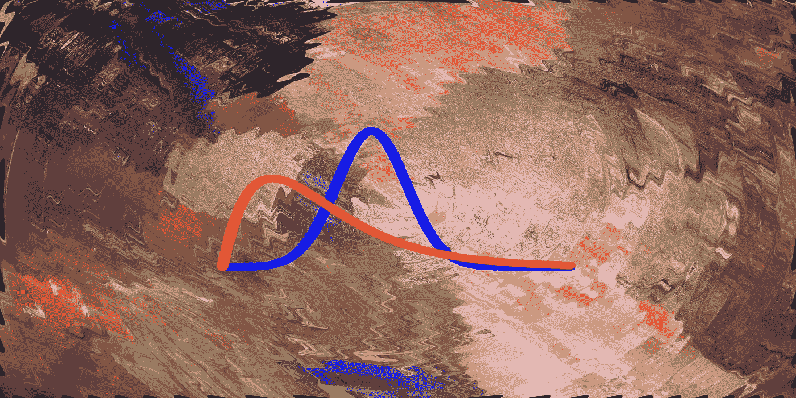

信用:苏菲·玛德琳

让我们通过一个简单的分类模型来回顾贝叶斯统计分析的基本概念。

# 数据

数据来自 1988 年孟加拉国生育调查，其中 1934 项观察来自城市和农村地区的妇女。该数据集的作者 Mn 和 Cleland 旨在确定生育率的趋势和原因，以及生育率和儿童死亡率的差异。

我们将使用这些数据来训练一个贝叶斯逻辑回归模型，该模型可以预测给定妇女是否使用避孕措施。

该数据集非常适合贝叶斯逻辑回归，因为在分析生育率时能够量化不确定性是决定人口规模、结构和组成的人口动态的主要组成部分([来源 1](https://www.ncbi.nlm.nih.gov/pmc/articles/PMC5640927/) 、[来源 2](https://www.researchgate.net/publication/299436950_Using_Machine_Learning_to_predict_fertility_rates_based_on_economic_indicators) )。

原始数据的副本可以在[这里](https://gist.github.com/michelkana/a61484add9111dab3498824829259ac8)找到。每个妇女有四个属性，还有一个标签表明她是否使用避孕药。这些属性包括:

*   **区**:女方所在区的识别码，
*   **城市**:居住区域类型，
*   **存活子女**:存活子女数，
*   **年龄平均值**:女性的年龄(以年为单位，以平均值为中心)。

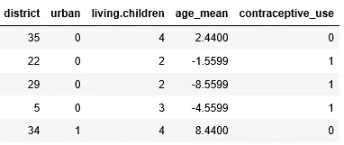

这些妇女被分成 60 个区。

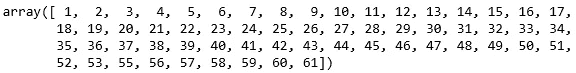

需要一点预处理。我们将地区号码 61 映射到号码 54，这样地区就有序了，如下图所示。

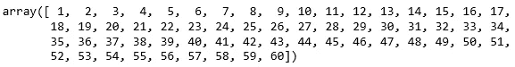

# 逻辑回归

预测一个给定的妇女是否使用避孕药具是二元分类问题的一个例子。如果我们用 *X* 表示妇女的属性，用 *Y* 表示结果，那么使用避孕药具的可能性*，P(Y=1)* ，将遵循下面的逻辑函数。

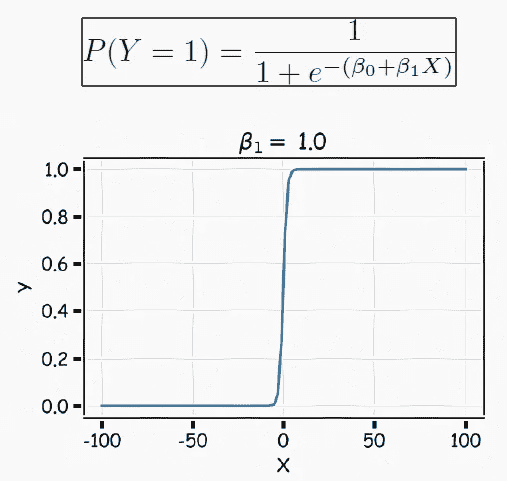

来源:P. Protopapas，哈佛大学

结果取决于两个参数 *β0* (截距)和 *β1* (斜率)。截距使曲线向左或向右移动，而斜率控制 S 形曲线的陡度。如果𝛽 *1* 为正，则预测的𝑃 *(Y=1)* 从𝑋的小值的零变为𝑋的大值的一，并且如果𝛽 *1* 为负，则具有 *𝑃(Y=1)* 相反关联。

例如，如果𝛽 *1* 对于*年龄*预测值为阳性，这意味着老年妇女比年轻妇女更有可能使用避孕药具。*年龄*开始增加避孕药使用率的临界值将由 *β0 决定。*小数值的 *β0* 表示避孕措施在人群中广泛使用。

理解逻辑函数对于推动贝叶斯方法非常重要。你可以在下面的文章中了解更多关于经典逻辑回归的知识。

 [## 深度学习为什么有效:解决一个农民的问题

### 在开始是神经元:梯度下降，反向传播，回归，自动编码器，细胞神经网络…

towardsdatascience.com](/why-deep-learning-works-289f17cab01a) 

# 贝叶斯方法

通过将我们的数据拟合到逻辑方程，我们将能够估计出 *β0* 和 *𝛽1.的固定值然而，我们不知道我们对这些估计有多少信心。*

此外，在现实生活中，𝛽0 通常会因地区而异。β0 在一些地区可能很小，但在另一些地区却很大。经典的逻辑回归模型仍将为所有区域提供单一值，这可能导致错误的结论。

在我们过去的一篇文章中，我们强调了机器学习中的不确定性问题，并介绍了贝叶斯方法的基本特征。我们温和地解释了概率在基于统计数据分析的推理中量化不确定性的明确使用。

 [## 贝叶斯噩梦。解决了！

### 通过 Python PyMC3 中的示例和代码对贝叶斯数据分析进行了温和的介绍。

towardsdatascience.com](/bayesian-nightmare-how-to-start-loving-bayes-1622741fa960) 

按照贝叶斯理论，理想情况下，我们希望在构建预测避孕药使用的模型时考虑先验信息。如果我们只使用逻辑方程，就没有直接的方法来包含我们对正在估计的那些参数的先验信念。

*贝叶斯方法允许我们基于我们现实生活中的领域知识和常识，对截距和斜率*做出事先的良好猜测。例如，我们可以说，根据经验，截距是从均值 *μ* =2、标准差 *σ* =1 的正态分布中得出的。我们还可以假设预测值*城市*、*生活子女*和*年龄平均值*的斜率分别为 4、-3 和-2。这个先前的信念总结如下。

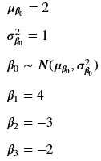

给定上述描述我们先前信念的分布，我们可以使用所谓的**生成模型**生成模拟数据，如下图所示。

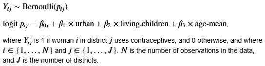

在这种情况下，生成模型是具有参数 *p* 的伯努利分布，这是妇女使用避孕药具的概率。 *p* 是上一节介绍的逻辑函数。

为了更好地理解生成模型的概念，让我们模拟二进制响应数据 *Y* 。我们通过使用先前的参数值和数据来做到这一点。

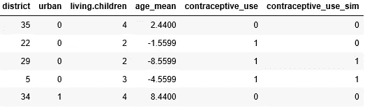

# 避孕药具的使用因地区而异吗？

为了对贝叶斯方法进行更多的实验，我们现在将指定一个变截距逻辑回归模型，其中截距因地区而异，我们将使其适合模拟避孕数据。

我们在 *β0、β1、𝛽2* 和 *𝛽3、*上设置了信息性先验分布，这与我们用来生成模拟避孕数据的先验分布明显不同。我们的目标是估计用于模拟响应变量 *Y* 的真实参数值。

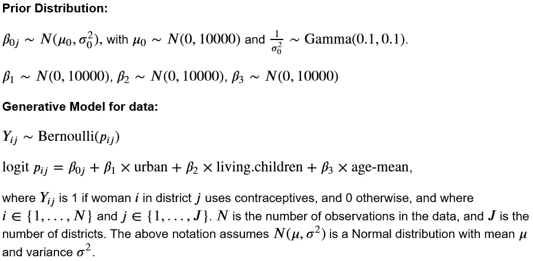

当我们有数据、先验和生成模型时，我们可以根据预测值(*地区、城市、居住儿童、年龄平均值*)和响应( *Y* )应用贝叶斯定理计算模型参数的**后验概率分布**。

*马尔可夫链蒙特卡罗* ( *MCMC* )是一类流行的算法，用于寻找模型参数的后验分布。由于有了库 [PyJAGS](https://pypi.org/project/pyjags/) ，用 Python 运行这样的算法变得非常简单。该过程从定义分布和先验开始，PyJAGS 从这些分布和先验开始执行采样，使用马尔可夫链将该过程导向我们手头的模拟数据。您可以在下面的代码中看到 MCMC 是如何工作的。

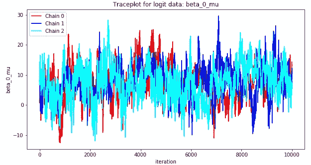

一个好的做法是绘制 MCMC 采样器的参数轨迹图。上面的轨迹图表明采样器确实收敛了。3 个马尔可夫链的平均值看起来大致相同。虽然链内有一点徘徊，但没有发散链的迹象。

现在，我们可以绘制参数的后验分布直方图。作为示例，我们仅显示了 *β0* 和第 10 区的曲线图。

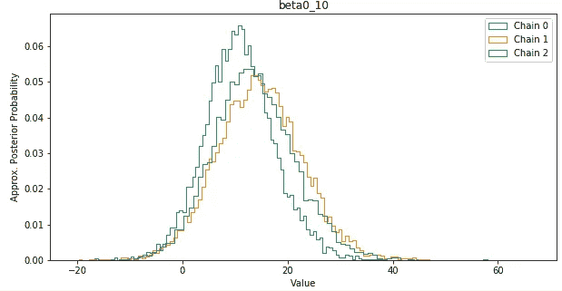

我们记得用于生成模拟数据的 *β0* 的真实分布如下。

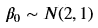

正如你在上面的图中看到的，10 区的真实 *β0* 参数包含在我们模型的后验分布中。事实上，这也是所有剩余参数的情况，这里没有显示。这一发现表明贝叶斯方法工作良好，我们现在可以继续将变截距模型拟合到实际的训练数据。

# **哪个区的女性最有可能使用避孕药具？**

下面，我们再次运行 MCMC 采样器，这次使用训练数据。我们通过检查轨迹图来检查收敛性，就像我们对模拟数据所做的那样。看来采样器也聚集在这里。没有一条链看起来是发散的，因为它们看起来不相关，是独立随机抽样的。

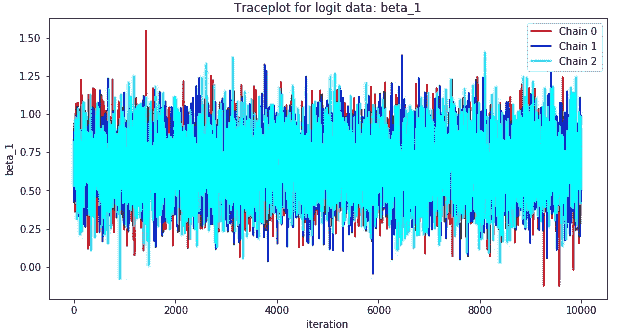

现在可以为所有区域绘制模型参数 *β0* 的后验分布，如下所示。

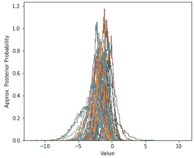

我们知道， *𝛽0* 的正值与相应地区的妇女最有可能使用避孕药具的概率增加有关。看上面的图，只有几个区的𝛽0 值为正。

负值与属于相应地区的妇女最有可能使用避孕药具的概率降低有关。大多数地区都属于这一类。

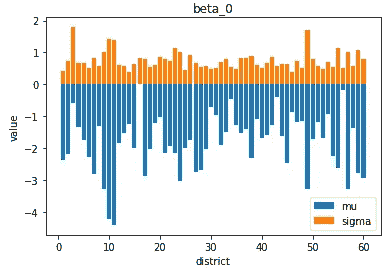

后验分布允许我们计算每个地区的 *𝛽0* 值的平均值和标准偏差，如上图所示。基于这些结果，我们可以得出结论，𝛽0 后验概率在各地区之间并不是均匀分布的。这一证据支持变截距模型，并导致以下发现:

> 属于第 16 区的妇女最有可能使用避孕药具。
> 属于第 11 区的妇女最有可能不使用避孕药具。

# 结论

贝叶斯逻辑回归的好处是，它给我们一个后验分布，而不是像经典的单点估计，也称为频率方法。

当结合先前的信念时，我们能够量化每个地区避孕药具使用点估计的不确定性。在本文中，我们还提供了一些关于 PyJAGS 的信息，PyJAGS 是一个用于贝叶斯推理的易于使用的 Python 库。

这一领域为未来的工作打开了一扇大门，特别是因为贝叶斯统计分析是从医疗诊断到选举预测等几项技术的核心。由[内特·西尔弗](https://en.wikipedia.org/wiki/Nate_Silver)于 2012 年出版的《信号与噪音》是将概率和统计应用于现实世界的艺术杰作。