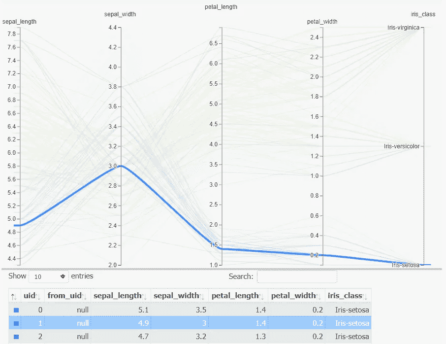

# 最佳并行绘图 Python 库介绍:“HiPlot”

> 原文：<https://towardsdatascience.com/introduction-to-best-parallel-plot-python-library-hiplot-8387f5786d97?source=collection_archive---------30----------------------->

## 作为 EDA 的首选工具，我们都应该重视的四个关键特征。

HiPlot 是脸书的 Python 库，支持高维数据表的可视化，于今年一月发布。它以复杂的互动[平行剧情](https://en.wikipedia.org/wiki/Parallel_coordinates)而闻名。

在此之前，先看看[他们引人注目的演示视频](https://ai.facebook.com/blog/hiplot-high-dimensional-interactive-plots-made-easy#u_0_1v)。这解释了它的交互性有多高，这是我们做 EDA 时会很欣赏的。


快照来自他们的视频([https://ai . Facebook . com/blog/hip lot-高维-互动-情节-制作-简易#u_0_1v](https://ai.facebook.com/blog/hiplot-high-dimensional-interactive-plots-made-easy#u_0_1v) )。我们可以通过选择轴上的范围来限制数据子集中的图形。

，并在这里 用样本数据 [**玩转他们的演示 app。不要忘记选择轴上的范围，按住并移动以检查交互性。**](https://facebookresearch.github.io/hiplot/_static/demo/ml1.csv.html?hip.filters=%5B%5D&hip.color_by=%22dropout%22&hip.PARALLEL_PLOT.order=%5B%22dropout%22%2C%22embedding_size%22%2C%22epoch%22%2C%22lr%22%2C%22train+f1%22%2C%22valid+ppl%22%5D)

HiPlot 不仅好看，而且有以下四个值得欣赏的特点:

*   *非常容易实现*

使用他们的 *hiplot* 模块实现并行绘图实际上只需要一行代码，而且几乎不需要动脑筋。

*   *高度互动*

从上面的演示视频可以看出，剧情互动性很强。点击几下鼠标，你就可以深入到数据的任何子集。

*   *跑得快*

尽管看起来如此，但将大型数据集可视化为并行图的运行时间很短。让我们过会儿看这个。

*   *原生 HTML 渲染功能*

他们准备了一个原生函数，把并行的情节变成 HTML 代码(万岁！！)制作的 HTML 页面可以下载为。html 文件或从 Flask 部署，几乎不需要额外的渲染工作。在下面的练习中，我试图通过 Flask 在 heroku 上运行它。

得益于这些优势，我相信 HiPlot 是数据分析项目中 EDA 的首选工具集之一，然后才是其他耗时的可视化工具。

让我们一个接一个地看看每一个好处。

# 虹膜数据入门

让我们看看使用[著名的虹膜数据集](https://archive.ics.uci.edu/ml/datasets/iris)让你开始使用 HiPlot 有多容易。


虹膜数据中的样本记录(【https://archive.ics.uci.edu/ml/datasets/iris】T4)

HiPlot 的安装和普通模块一样简单。只需使用 pip:

```
pip install -U hiplot
```

要使用外部 csv 文件，你甚至不必使用熊猫数据帧。他们准备了一个本地方法，直接从 csv 文件运行并行绘图`Experiment.from_csv()`。当需要使用 DataFrame 时，用`Experiment.from_dataframe()`代替。而且用 Jupyter 笔记本完全没问题。

```
import hiplot as hip
iris_hiplot = hip.Experiment.from_csv('iris.csv')
iris_hiplot.display()
```

这里是你将会看到的:


虹膜数据 HiPlot

# HiPlot 是高度交互性的

一旦你开始玩，你会爱上 HiPlot 的。

正如你已经在上面的演示影片中看到的，这里有一些使用交互式图表的例子。


灰色矩形是我在每个变量中选择范围的地方。我们也可以通过按住并移动来移动范围。



用鼠标指向感兴趣的记录会立即在图表中突出显示该记录。

# HiPlot 跑得快

为了测试运行时间以显示更大数据的并行图，我使用了 [Kaggle FIFA 19 完整玩家数据集](https://www.kaggle.com/karangadiya/fifa19)。这是一个来自视频游戏“FIFA 19”的数据集，顾名思义，这是一个足球游戏(或者你可以称之为 football)，在这个游戏中，你可以作为一个真实的足球队的球队经理或者一个真实的足球运动员来玩。数据集包含了所有可玩角色的技能等级列表(例如，他们擅长头球、任意球等等。)行数为 18，207，列数为 89。第一排是来自阿根廷的梅西。

为了进行性能测试，我有意将数据大小增大 10 倍。我将 FAFA 19 数据集连接了 10 次，最终得到了 182，070 行。通常，可视化大型数据集需要时间来运行，并在图表显示后导致巨大的延迟。互动性？忘记并重新运行脚本！HiPlot 呢？

我在 182，070 行 x 89 列的数据集上运行 HiPlot，没有进行任何编辑。处理时间为 81 秒，显示图表需要额外的 5 分钟。我认为就它的大小来说，它够短了。

```
fifa = pd.read_csv('fifa19_data.csv',index_col='Unnamed: 0')
fifa_extended = pd.concat([fifa,fifa,fifa,fifa,fifa,fifa,fifa,fifa,fifa,fifa],axis=0,ignore_index=True,sort=False)
fifa_hiplot = hip.Experiment.from_dataframe(fifa_extended)
fifa_hiplot.display()
```


顺便说一下，这看起来有多乱…

HiPlot 更棒的一点是，数据大小不会对它的交互性造成太大损害。选择轴上的范围后，它试图只显示属于该范围的图。这一变化几乎在一秒钟内重新渲染了图形，与其他可视化工具相比，这是惊人的快。


测试选择范围。

# 本机 HTML 呈现功能

当我们想和其他人分享这个图时，我们可以在 notebook 上运行代码，然后复制并粘贴这个图，但是这样做去掉了图形的交互性。

HiPlot 有自己的原生 HTML 渲染函数`Experience.to_html()`，它返回 HTML 文件，其中只嵌入了一行代码。

为了简单起见，让我使用 FIFA 19 数据集中的原始行和较少的列。

```
fifa = pd.read_csv('fifa19_data.csv',index_col='Unnamed: 0')
fifa_small = fifa[['Age','Nationality','Value','Height', 'Weight', 'Crossing', 'Finishing', 'HeadingAccuracy', 'ShortPassing', 'Volleys', 'Dribbling', 'Curve', 'FKAccuracy', 'LongPassing', 'BallControl', 'Acceleration']]
fifa_hiplot = hip.Experiment.from_dataframe(fifa_small)
fifa_hiplot.display()
```

这段代码将生成一个新的。html 文件在您的本地与绘图。

```
_ = fifa_hiplot.to_html("fifa_hiplot.html")
```

现在您可以共享。html 文件直接与您的团队成员，让他们发挥周围的情节。


呈现为“fifa_hiplot.html

由于`Experience.to_html()`返回 html 代码，它甚至可以轻松地连接到 web 服务器并在外部部署绘图。

让我用弗拉斯克和赫罗库试试。正如我在这里解释了很多一样，我需要将四个文件推送到 GitHub 库，以便与 Heroku 应用程序同步。

*   *fifa19_data.csv* : FIFA19 数据集文件。
*   *hiplot_fifa.py* :运行和启动 Flask app 的 Python 代码。

```
import hiplot as hip
import pandas as pd
from flask import Flaskapp = Flask(__name__)[@app](http://twitter.com/app).route('/')
def fifa_experiment():
    fifa = pd.read_csv('fifa19_data.csv',index_col='Unnamed: 0')
    fifa_hiplot = hip.Experiment.from_dataframe(fifa[['Age','Nationality','Value','Height', 'Weight', 'Crossing','Finishing', 'HeadingAccuracy', 'ShortPassing', 'Volleys', 'Dribbling', 'Curve', 'FKAccuracy', 'LongPassing', 'BallControl', 'Acceleration']])

    return fifa_hiplot.to_html()if __name__ == "__main__":
    app.run()
```

*   *requirements . txt*:Heroku 安装必要模块的需求文件。

```
gunicorn==19.9.0
pandas==0.24.2
hiplot==0.1.12
Flask==1.1.1
```

*   *proc file*:Heroku 启动 app 时运行的启动命令。

```
web: gunicorn hiplot_fifa:app
```

同步代码文件并在 Heroku 上进行设置。打开 web 应用程序会显示以下 HiPlot 图表页面，可通过域名进行全球访问。


通过 Flask 部署 HiPlot 地块，由 Heroku 提供服务。

# 结尾注释

在这篇文章中，我介绍了 HiPlot(并行绘图的当前最佳选项)来启动 EDA，以了解变量交互概述。

它易于运行，交互性强，速度快，并且可以通过 HTML 文件或代码共享。

虽然数据科学项目肯定需要进一步的调查，如查看值的分布形状、输入缺失值等，但 HiPlot 将有助于开始数据预处理和理解。