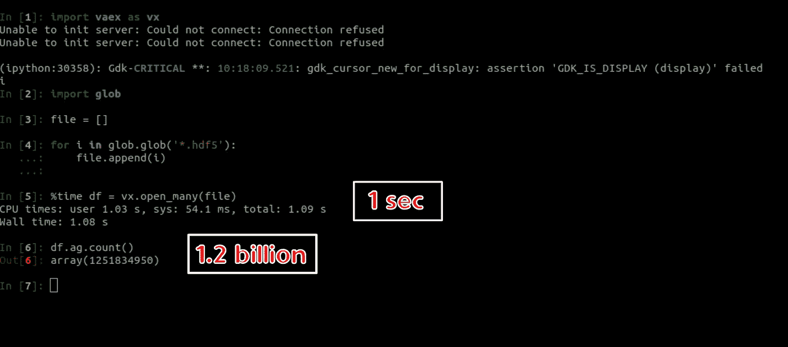
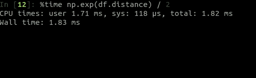
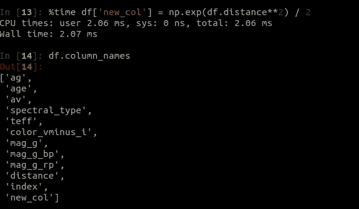
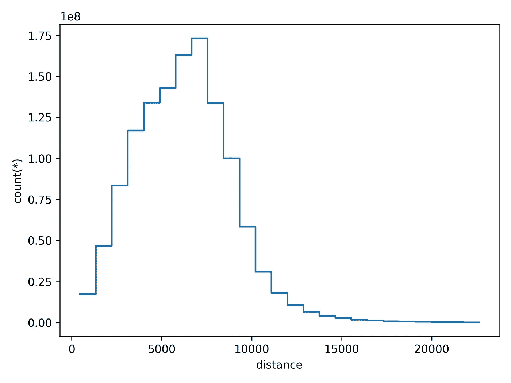
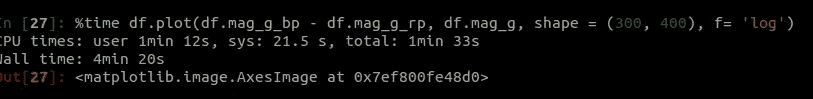
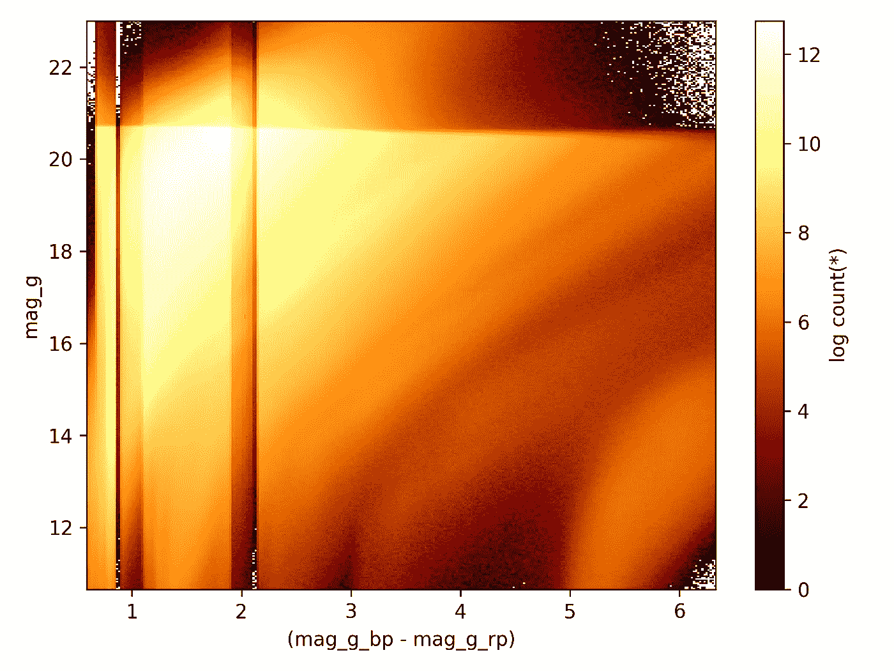

# Vaex 大数据简介—读取 12.5 亿行的简单代码

> 原文：<https://towardsdatascience.com/introduction-to-big-data-a-simple-code-to-read-1-25-billion-rows-c02f3f166ec9?source=collection_archive---------39----------------------->



## [理解大数据](https://towardsdatascience.com/tagged/making-sense-of-big-data)

## 用 Python 高效读取和可视化 12.5 亿行星系模拟数据

如今，我们正在进入各种各样的时代。有人说，我们正处于颠覆时代。为了理解它，我们可以使用 Schwartz (1999)在他的书*中的一个术语，数字达尔文主义*。这个术语描述了我们正在进入一个时代，在这个时代，企业无法适应技术和科学的发展。数字平台和全球化改变了客户的范式，改变了他们的需求。

另一方面，有人说我们正在进入大数据时代。几乎所有学科都经历过数据激增。其中之一是天文学。全世界的天文学家意识到他们需要建造越来越大的望远镜或天文台来收集更多的数据。例如，在 2000 年初，一项名为 2 微米全天巡天( [2MASS](https://iopscience.iop.org/article/10.1086/498708) )的全天巡天收集了大约 4.7 亿个天体。2016 年年中，天基望远镜 [Gaia](https://www.aanda.org/articles/aa/pdf/2016/11/aa29272-16.pdf) 发布了由约 17 亿个天体组成的第二次数据发布。天文学家是如何处理的？

在本文中，我们将讨论如何实际处理大数据。我们将使用来自盖亚宇宙模型快照的星系模拟数据( [GUMS](https://www.aanda.org/articles/aa/abs/2012/07/aa18646-11/aa18646-11.html) )。它有大约 35 亿个物体。你可以在这里访问它[。例如，我们将只读取 12.5 亿行。](https://gaia.obspm.fr/tap-server/tap)

**使用 Vaex 读取 10 亿行数据**

首先，我必须感谢 [Maarten Breddels](https://towardsdatascience.com/@maartenbreddels) 构建了 Vaex，一个读取和可视化大数据的 python 模块。它可以在一秒钟内读取 10 亿行。你可以在这里阅读文档[。](https://vaex.readthedocs.io/)

Vaex 将有效地读取 hdf5 和 arrow 格式的文件。这里，我们将使用一些 hdf5 文件。要在 Vaex 中读取文件，可以使用下面的代码

```
import vaex as vxdf = vx.open('filename.hdf5')
```

但是，如果您想同时读取一些 hdf5 文件，请使用以下代码

```
df = vx.open_many(['file1.hdf5', 'file2.hdf5'])
```

可以分析下图。


读取 12 亿行数据

变量**文件**是工作目录中所有 hdf5 文件的数组。你可以在 1 秒钟内查看阅读所有文件所需的时间。在下一行，我检查行的总数。是 12.5 亿行。

**Vaex 中的算术运算和虚拟列**

你也可以快速地对所有的行做一些算术运算。这是一个例子



Vaex ( *图像由 autho* r)中的算术运算

Vaex 可以毫秒级进行算术运算，将其应用于所有行(12.5 亿)。如果要在 Vaex 数据框中分配一列，可以使用此代码

```
df['col_names'] = someoperations
```

这是一个例子



Vaex ( *Image by autho* r)中的算术运算

仔细看的话，代码和熊猫 API 差不多。Yups，据我所知，Vaex 和熊猫用的是同一个 API。您还可以像在 Pandas 中一样选择列，如下所示

```
df_selected = df[df.ag, df.age, df.distance]
```

回到上图，在第 14 行，添加了名为“new_col”的新列，这大约需要 2.07 毫秒。

**1D 和 2D 宁滨**

您是否需要将宁滨统计数据快速应用到您的大数据中？Vaex 也会是答案。要做一个 1D 宁滨并绘制它，您可以使用下面的代码

```
df.plot1d(x-axis, shape=(number_of_bin))
```

这是我们数据的例子


1D·宁滨与 Vaex ( *图片由 autho* r 提供)

我们在 1D(直方图)中绘制列**距离**的面元数为 25。它会产生这样一个图形。Vaex 需要大约 2 秒钟来可视化 1D 图。



Vaex 中的 1D 图(直方图)

要应用 2D·宁滨并将其可视化，您可以使用以下代码

```
df.plot(x-axis, y-axis, shape(shape_x, shape_y))
```

以下是我们数据中要应用的示例



2D·宁滨和 Vaex

可视化一个 2D 图大约需要 4 分钟。这是非常可以接受的。你可以想象另一个模块在 2D 图的密度中可视化 12 亿行需要多长时间。它会给你一个这样的数字。



Vaex 中的 2D 密度图

## 结论

未来在这里，大数据时代已经到来。我们必须准备好所有需要的技术。准备工作之一是构建一个能够有效读取和可视化大数据的 Python 库。Vaex 将作为它的解决方案推出。它声称 Vaex 一秒钟可以读取 10 亿行。我希望你能学会这个故事中提到的例子，并详细阐述到你的数据中。

## 如果你喜欢这篇文章，这里有一些你可能喜欢的其他文章:

[](/visualizations-with-matplotlib-part-1-c9651008b6b8) [## 使用 Matplotlib 实现 Python 数据可视化—第 1 部分

### 完成了从基础到高级的 Python 绘图的 Matplotlib 教程，包含 90 多个示例

towardsdatascience.com](/visualizations-with-matplotlib-part-1-c9651008b6b8) [](/5-powerful-tricks-to-visualize-your-data-with-matplotlib-16bc33747e05) [## 使用 Matplotlib 可视化数据的 5 个强大技巧

### 如何使用 LaTeX 字体，创建缩放效果，发件箱图例，连续错误，以及调整框填充边距

towardsdatascience.com](/5-powerful-tricks-to-visualize-your-data-with-matplotlib-16bc33747e05) [](/matplotlib-styles-for-scientific-plotting-d023f74515b4) [## 用于科学绘图的 Matplotlib 样式

### 为您的科学数据可视化定制 Matplotlib

towardsdatascience.com](/matplotlib-styles-for-scientific-plotting-d023f74515b4) [](/creating-colormaps-in-matplotlib-4d4de78a04b8) [## 在 Matplotlib 中创建色彩映射表

### 从颜色列表中创建和定制自己的色彩映射表的指南

towardsdatascience.com](/creating-colormaps-in-matplotlib-4d4de78a04b8) [](/customizing-multiple-subplots-in-matplotlib-a3e1c2e099bc) [## 在 Matplotlib 中自定义多个子情节

### 使用 subplot、add_subplot 和 GridSpec 在 Matplotlib 中创建复杂 subplot 的指南

towardsdatascience.com](/customizing-multiple-subplots-in-matplotlib-a3e1c2e099bc) 

仅此而已。感谢您阅读这个故事。喜欢就评论分享。我还建议您关注我的帐户，以便在我发布新故事时收到通知。

**参考文献:**

[1]施瓦茨，E. I .，[数字达尔文主义](https://www.amazon.com/Digital-Darwinism-Evan-Schwartz-1999-06-08/dp/B01K13QB8A) (1999)，百老汇图书公司

[2]张，赵，【大数据时代的天文学】 (2015)，数据科学杂志

[3] Skrutskie，M. F .等人，[两微米全天巡天(2MASS)](https://iopscience.iop.org/article/10.1086/498708) (2006 年)，《天文杂志》，131:1163–1183

[4]盖亚合作组织(Gaia Collaboration)，T. Prusti 等人，[盖亚任务](https://www.aanda.org/articles/aa/pdf/2016/11/aa29272-16.pdf) (2016)天文学和天体物理学 595，A1

[5] Robin，A. C .等人，[盖亚宇宙模型快照](https://www.aanda.org/articles/aa/abs/2012/07/aa18646-11/aa18646-11.html) (2012)天文学和天体物理学 543，A100