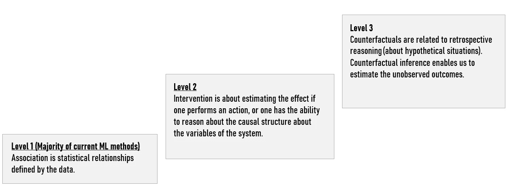
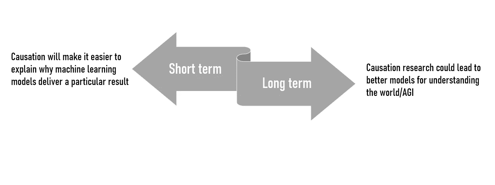
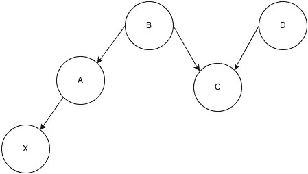

# 机器学习中的因果关系介绍

> 原文：<https://towardsdatascience.com/introduction-to-causality-in-machine-learning-4cee9467f06f?source=collection_archive---------1----------------------->

## 为什么我们需要机器学习中的因果关系(从商业角度)

马丁·亚当斯在 [Unsplash](https://unsplash.com/s/photos/process?utm_source=unsplash&utm_medium=referral&utm_content=creditCopyText) 上的照片

尽管围绕人工智能进行了大肆宣传，但大多数基于机器学习(ML)的项目都专注于预测结果，而不是理解因果关系。事实上，在几个人工智能项目之后，我意识到 ML 非常擅长在数据中寻找相关性，但不是因果关系。在我们的项目中，我们尽量不陷入将相关性等同于因果关系的陷阱。

这个问题极大地限制了我们依靠 ML 进行决策的能力。从商业角度来看，我们需要能够理解数据之间因果关系的工具，并创建能够很好概括的 ML 解决方案。

在这篇文章中，我将介绍作为一家已经使用机器学习算法的公司，我们目前面临的问题，以及为什么从商业角度来看因果关系很重要。

# 机器学习的问题

基于机器学习的解决方案存在不同的问题。如您所知，ML 算法在当前状态下可能会有偏差，相对缺乏可解释性，并且在针对多种应用的训练数据集中归纳模式的能力方面受到限制。**提高概括能力变得很重要。**

> **泛化:**模型适当适应新的、以前未见过的数据的能力，这些数据来自与用于创建模型的分布相同的分布。( [1](https://analystnotes.com/study_los.php?id=2061) )

此外，当前的机器学习方法倾向于过度拟合数据。事实上，他们试图完美地学习过去，而不是揭示真实的/因果关系，这种关系将随着时间的推移继续存在。

在我所在的行业(医疗保健)，我们的模型只是支持在疾病出现时出现症状，而疾病在症状出现时出现。

截至今天，更成功的人工智能系统是深度学习模型，利用更大的数据集和更多不同可能情况的例子。简单地依赖更多数据(大数据)可能很诱人，但这将是一个错误。

> **即使我们能观察到相关性，也不能证明因果关系。**

朱迪亚·珀尔和达纳·麦肯齐的 [*原因之书。新的因果科学*](http://bayes.cs.ucla.edu/WHY/) 凸显了当前机器学习解决方案的主要局限性和因果推理挑战。他们指出，大数据将解决我们面临的许多重大挑战的宣传是错误的。

因为深度学习(DL)过于关注没有因果关系的相关性，当问题离开非常狭窄的情况时，数据不会回答问题。实际上，许多真实世界的数据并不是以与我们用来训练人工智能模型的数据相同的方式产生的。**换句话说，深度学习擅长发现数据方面的模式，但无法解释它们是如何联系在一起的。**

> 大多数解决方案都无法超越数据集中的示例领域。

对于越来越多的商业应用，ML 发现相关性的能力已经足够了(例如:价格预测、对象分类、更好的定位等。).事实上，ML 系统擅长学习输入数据和输出预测之间的联系，但缺乏对因果关系或环境变化的推理**。能够捕捉因果关系的 ML 模型将更具普遍性。**

> **因果关系:**一个事件、过程或状态(原因)促成另一个事件、过程或状态(结果)产生的影响，其中原因对结果负有部分责任，结果部分取决于原因。( [2](https://en.wikipedia.org/wiki/Causality)

揭示复杂系统中不同现象的原因和影响的能力将有助于我们在医疗保健、司法和农业等不同领域建立更好的解决方案。**事实上，当相关性被误认为因果关系时，这些领域不应承担风险。**

# 因果推理和用例

首先，更好地定义这个术语是关键。作为人类，我们经常根据因果来思考——如果我们理解了事情发生的原因，我们就可以改变我们的行为来改善未来的结果。

换句话说，我们的目标是试图从数据中学习因果关系(什么是原因，什么是结果)。如前所述，**在许多用例中，相关性已经足够了**。然而，因果推理将使我们能够更进一步，并弄清楚如果我们决定改变我们模型中的一些基本假设会发生什么。

理解因果关系将使现有的人工智能系统更加智能和高效。例如，“想象一下，一个机器人知道掉落的东西会导致它们破碎，就不需要把几十个花瓶扔在地上，看看它们会发生什么事情了”。

此外，理解因果关系的能力将有助于我们创建商业模式以及专门帮助公司更好地理解其数据的新创业公司。例如，我们最近开始了一个项目，试图使用不同的来源来识别线索。我们相信因果关系会帮助我们根据我们从未想过的因素识别新的线索。

因果关系的层次/基于朱迪亚·珀尔的工作

**从业务角度来看，我们正在考虑以下问题/场景:**

**#1:** 在电子商务环境中，我们可以确定哪个特定因素对购买产品的决定影响最大。有了这些信息，我们可以更好地分配资源来改进特定的 KPI。我们还可以对不同因素对购买决策的影响进行排序。我们可以确定，如果给定的客户在过去两年中没有购买其他产品，他/她是否会购买特定的产品。

**#2:** 从更广泛的意义上来说，我们可以发现给定的商业策略如何避免负面影响，以及避免了哪些负面影响？我们还可以通过对我们的业务开发人员实施特定的培训计划来确定我们的销售额应该增长多少。特定培训计划的影响

在农业领域，我们经常试图预测今年农民的作物产量是否会降低。然而，使用偶然的推论，它将变得更好地理解我们应该采取什么步骤来增加收获。

在这些潜在的用例之外，机器学习中更多因果关系的发展是建立更像人类的机器智能(可能是人工通用智能)的必要步骤。

# 当前和未来的解决方案

迄今为止，确实存在一些解决方案。然而，当前的解决方案(例如:蒙特卡罗模拟、马尔可夫链分析、朴素贝叶斯、随机建模和一些开源包，如 [DAGitty](http://dagitty.net/) )在业务应用方面并没有达到我们的预期。

**元学习因果结构** 2019 年，Yoshua Bengio 和他的团队发布了一篇[研究论文](https://arxiv.org/abs/1901.10912)概述了一种方法。事实上，他们似乎正在研究一种能够识别简单因果关系的深度学习版本。他们使用了一个数据集，该数据集根据概率绘制了现实世界现象之间的因果关系，如吸烟和肺癌。**他们还生成了因果关系的合成数据集。**

换句话说，“产生的算法本质上形成了一个关于哪些变量有因果关系的假设，然后测试不同变量的变化如何符合理论”。( [4](https://cacm.acm.org/news/239999-an-ai-pioneer-wants-his-algorithms-to-understand-the-why/fulltext) )

**结构方程建模** 另一种值得一提的方法叫做结构方程建模。在不涉及太多细节的情况下，“Judea Pearl 建立的基础数学和图形模型的快速发展有助于因果关系工具的使用”( [5](https://mobilemonitoringsolutions.com/causality-the-next-most-important-thing-in-ai-ml/) )。

**因果贝叶斯网络** 这种方法估计一个数据集中所有变量之间的关系，可以认为是一种真正的发现方法。它能够同时发现多种因果关系。

基本上，它会产生一个直观的可视化地图，显示哪些变量相互影响，以及它们的影响程度。事实上，因果图模型使得同时模拟许多可能的干预成为可能。

> 因果贝叶斯网络需要大量数据来捕捉所有可能的变量。

要记住的另一个重要因素是，因果人工智能不是在黑盒中运行的。研究人员可以检查模型的推理，减少偏差的风险。

[来源](https://stats.stackexchange.com/questions/74093/understanding-d-separation-theory-in-causal-bayesian-networks)

从业务的角度来看，这种方法允许结合专家知识来应对纯数据驱动方法的可能限制。**商业专家可以帮忙:**

*   对模型设置条件以提高其准确性，
*   确定哪些变量应该进入模型
*   帮助理解违反直觉的结果。

## 强化学习与因果关系

最后，我想提一下强化学习(RL)。如你所知，强化学习是一种利用与环境的互动进行渐进式学习的方法。

人工智能社区中的一些领军人物认为，RL 本质上是因果的，从这个意义上说，代理人用不同的动作进行实验，并通过试错来了解它们如何影响性能。这种类型的学习被称为“无模型”,因为它可以学习有效的行为，而不必学习世界如何工作的显式模型。

> 在**强化学习**中，**无模型算法**是一种不使用与马尔可夫决策过程相关的转移概率分布(和奖励函数)的算法，在 RL 中，它代表要解决的问题。( [6](https://en.wikipedia.org/wiki/Model-free_(reinforcement_learning)) )

然而，它只是学习行动和表现之间的因果关系，而不是行动如何直接影响世界。例如，这可能包括学习翻转火上的满水桶来灭火，而不理解水和火之间的关系。

正如[乔治·劳顿](https://searchenterpriseai.techtarget.com/feature/Causal-deep-learning-teaches-AI-to-ask-why)所提到的，“如果给代理一根软管而不是一桶水，它不从头学习就不知道该拿它怎么办，因为它没有学习到水和火之间的因果关系”。**我认为 RL 更多的是测试一种信念，以在搜索空间中找到某个最佳点。**

## 要了解更多信息，我推荐以下链接:

*   [关于因果关系和结构方程模型的八个神话](https://ftp.cs.ucla.edu/pub/stat_ser/r393.pdf)
*   [深度学习可以揭示为什么世界是这样运转的](https://www.technologyreview.com/2019/05/08/135454/deep-learning-could-reveal-why-the-world-works-the-way-it-does/)
*   [要建造真正智能的机器，教他们因果关系](https://www.quantamagazine.org/to-build-truly-intelligent-machines-teach-them-cause-and-effect-20180515/)
*   [机器学习中的因果推理](http://www.homepages.ucl.ac.uk/~ucgtrbd/talks/imperial_causality.pdf)
*   [因果贝叶斯网络:实现更公平机器学习的灵活工具](https://deepmind.com/blog/article/Causal_Bayesian_Networks)
*   [机器学习中的因果关系](http://www.unofficialgoogledatascience.com/2017/01/causality-in-machine-learning.html)
*   [贝叶斯网络和因果关系搜索](http://www.homepages.ucl.ac.uk/~ucgtrbd/talks/bayesnetmeetup_causality.pdf)
*   [此案为因果艾](https://ssir.org/articles/entry/the_case_for_causal_ai)
*   [因果深度学习教 AI 问为什么](https://searchenterpriseai.techtarget.com/feature/Causal-deep-learning-teaches-AI-to-ask-why)