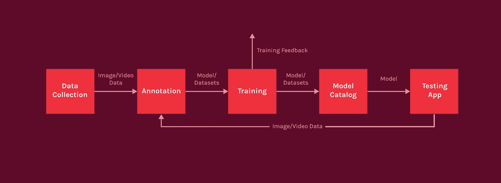
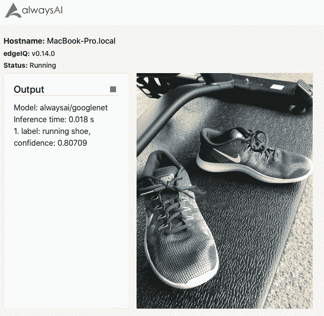
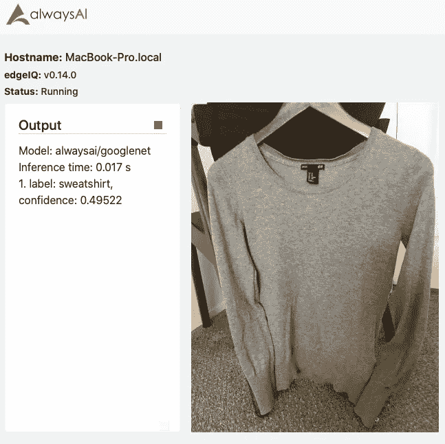
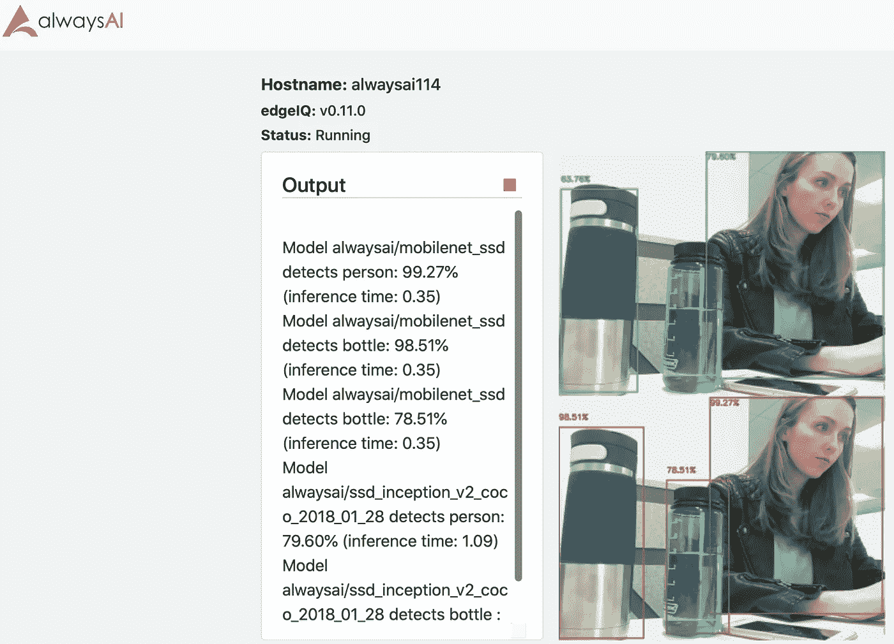
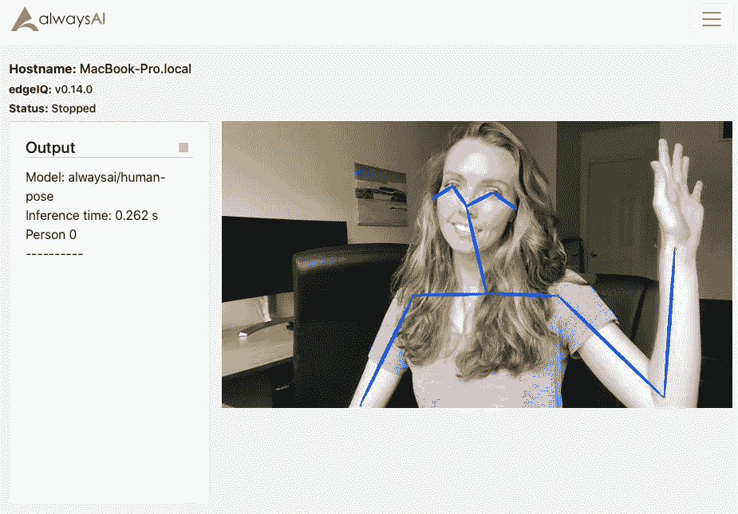
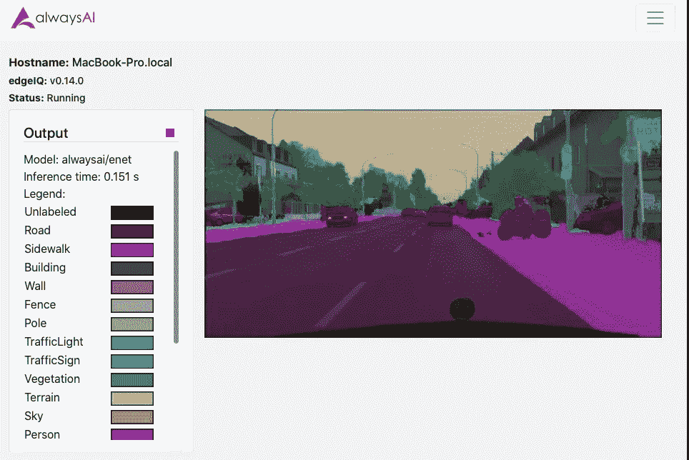
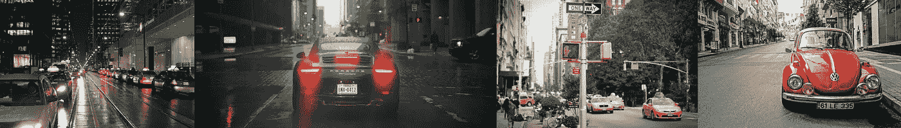
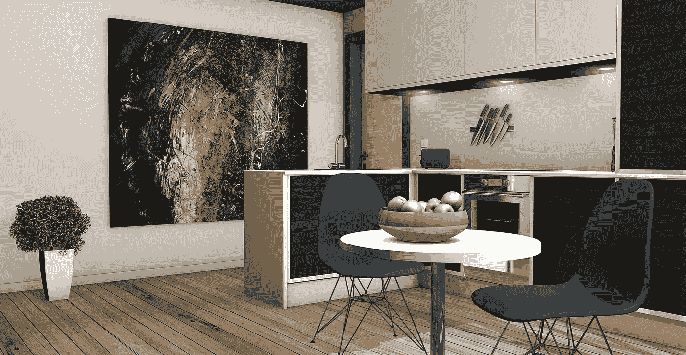
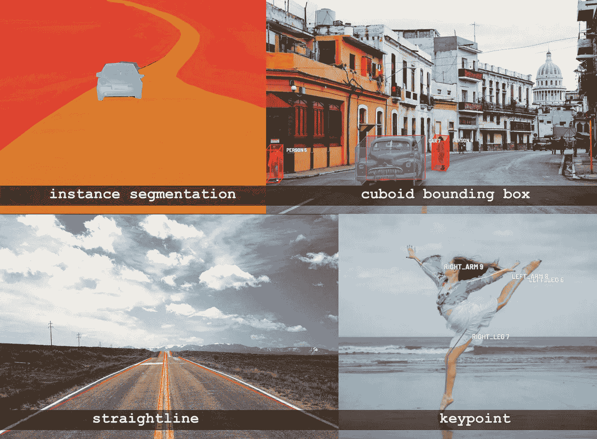

# 计算机视觉模型训练导论

> 原文：<https://towardsdatascience.com/introduction-to-computer-vision-model-training-c8d22a9af22b?source=collection_archive---------25----------------------->

训练一个计算机视觉模型是一项复杂且反复进行的任务的一部分，这项任务通常看起来令人望而生畏。在 alwaysAI，我们希望让流程变得简单易懂。为了让你开始，我们汇编了一个用于计算机视觉应用的深度神经网络(DNNs)训练过程的概述。在本概述中，我们将重点关注监督学习，它使用带标签的训练数据来教导模型期望的输出是什么。本文介绍了模型训练过程的每一个组成部分，并将成为以后更深入的文章的上下文基础。

模特培训周期。

# 概观

本文涵盖了以下几个部分:

*   模型的类型
*   数据集生成
*   数据集标注
*   模特培训
*   测试和使用

# 模型的类型

不同的计算机视觉模型帮助我们回答关于图像的问题。图像中有哪些对象？图像中的那些物体在哪里？物体上的关键点在哪里？每个对象属于哪些像素？我们可以通过构建不同类型的 dnn 来回答这些问题。然后，这些 dnn 可以用于解决一些问题，如确定图像中有多少辆汽车，一个人是坐着还是站着，或者照片中的动物是猫还是狗。我们在下面概述了一些最常见的计算机视觉模型及其用例。

*注意:通常，计算机视觉模型输出由标签和置信度或分数组成，置信度或分数是对正确标记对象的可能性的一些估计。这个定义是有意模糊的，因为对于不同类型的模型,“信心”意味着非常不同的东西。*

在描述不同类型的模型和它们的用例时，我们将概述一个虚拟衣柜的示例用例:一个让用户在购买之前虚拟试穿不同衣服的应用程序。

## 图像分类

[图像分类](https://learn.alwaysai.co/identify-objects-image-classification-alwaysai?&utm_campaign=Open%20Beta&utm_source=medium&utm_content=general_making_cv_models)试图识别图像中最重要的对象类别；在计算机视觉中，我们将每个类称为一个标签。例如，我们可以使用一个通用的分类模型，如' **alwaysai/googlenet 【T3 ' '，来识别服装项目，如'跑鞋'或'运动衫'，如下所示。该模型将图像作为输入，并且它将输出标签以及与其他标签相比该模型对于特定标签的置信度。此外，用于图像分类任务的 dnn 不提供图像中对象的位置，因此对于我们需要该信息的用例，例如为了跟踪或计数对象，我们需要使用对象检测模型，这是下一个描述的模型。**

用于对服装项目进行分类的通用分类模型示例，包括跑鞋。

用于对毛衣分类的服装项目进行分类的通用分类模型示例。

## 目标检测

当目标的位置很重要时，通常使用[目标检测](https://learn.alwaysai.co/build-real-time-object-dectector-starter-application?&utm_campaign=Open%20Beta&utm_source=medium&utm_content=general_making_cv_models)n dnn。这些网络返回一组坐标，称为边界框，指定包含对象的输入图像区域，以及该边界框和标签的置信度值。对于我们的“虚拟衣柜”应用程序，我们需要一个想要试穿虚拟衣服的人的输入图像，然后我们需要找到图像中的人。为此，我们可以使用一个[对象检测模型进行人物检测](https://learn.alwaysai.co/detect-people-using-alwaysai?&utm_campaign=Open%20Beta&utm_source=medium&utm_content=general_making_cv_models)，如“ **alwaysai/mobilenet_ssd** ”，它将返回一个包围图像中每个人物的边界框，以及一个标签“人物”和一个输出的置信度值。可以区分人的对象检测模型的示例如下所示。

注意:知道物体在一帧中的位置可以让我们推断出图像的某些信息。例如，我们可以计算高速公路上有多少辆车来绘制交通模式。我们还可以通过将 [*分类模型搭载到*](https://learn.alwaysai.co/using-an-object-detection-model-with-a-classifier?&utm_campaign=Open%20Beta&utm_source=medium&utm_content=general_making_cv_models) *对象检测模型上来扩展应用程序的功能。例如，我们可以将图像中与检测模型中的边界框相对应的部分输入到分类模型中，这样我们就可以计算图像中有多少辆卡车和轿车。*

两种检测模型的输出示例。在这种情况下，我们可以看到两个模型都可以检测到人，但一个模型能够检测到两种类型的水瓶，而另一个模型只发现了一个。

现在，我们已经看到了如何将衣服分类，例如鞋子或运动衫，我们可以检测图像中的人，但我们仍然需要能够让用户试穿衣服。这需要能够区分属于检测对象的像素和图像其余部分的像素，在这种情况下，我们需要使用分割，这将在接下来讨论。

## 图象分割法

如上所述，在一些任务中，理解物体的精确形状是很重要的。这需要为每个对象生成像素级边界，这是通过图像分割实现的。用于图像分割的 DNNs 通过对象类型(在语义分割的情况下)或单个对象(在实例分割的情况下)对图像中的每个像素进行分类。

*注:目前 alwaysAI 平台支持语义切分。我们一直在寻求平台的增长，并在增加新的模型，包括执行实例分段的模型。*

对于我们的虚拟衣柜应用程序，我们可以使用语义分割来区分属于人、毛衣或鞋子的像素。然后，我们可以用一个对象中的像素替换另一个对象中的像素，比如用用户想要试穿的新毛衣中的像素替换原始图像中的人穿着的毛衣。

*注意:语义分割的一个流行用例是用于远程会议软件(如 Zoom 或微软团队)的* [*虚拟背景*](https://learn.alwaysai.co/create-your-own-virtual-green-screen?&utm_campaign=Open%20Beta&utm_source=medium&utm_content=general_making_cv_models) *:属于一个人的像素与图像的其余部分区分开来，并从背景中分割出来。*

在我们的人的图像分割应用的例子中，我们看到图像分割使我们能够区分哪些像素属于图像中的每个对象。然而，图像分割并不能让我们推断出图像中物体的相对位置，例如人的手在哪里，或者汽车的尾灯和保险杠在哪里。为此，我们需要关于一个人特定区域的信息，比如说一个人的手和他们的头相比在哪里。这需要跟踪目标地标，这是我们将在这里讨论的最后一种模型类型。

## 目标标志检测

物体标志检测是对图像中捕捉物体重要特征的某些“关键点”的标记。对于我们的虚拟衣柜，我们可以使用一个姿势估计模型，如'**alwaysai/human-pose【T1]'，它可以识别身体的关键点，如臀部、肩膀和肘部，类似于下图所示，以帮助我们的用户进行装饰。我们可以使用眼睛关键点给虚拟衣柜中的人戴上眼镜或帽子，或者使用“脖子”关键点让他们试穿围巾。**

*注意:使用关键点的另一个有用的应用程序是在练习和运动中检查正确的形式。*

使用“always ai/人类姿势”检测到身体关键点。

## 一般模型应用

计算机视觉模型可以应用于各种各样的应用。您可以建立一个分类模型来对狗展中的狗进行分类，或者建立一个检测模型来发现活检切片中的癌细胞。保护生物学家可以使用一个模型来检测特定科或属的存在，然后将输出输入到分类模型来确定物种，然后汇总这些数据来跟踪保护工作。[语义分割](https://learn.alwaysai.co/how-to-detect-pedestrians-and-bicyclists-in-a-cityscape-video?&utm_campaign=Open%20Beta&utm_source=medium&utm_content=general_making_cv_models)用于自动驾驶汽车技术。对象检测模型可用于计算商品数量并生成杂货店的库存。计算机视觉应用的可能性是广泛的！

入门应用程序“semantic _ segmentation _ cityscape”的输出示例。

# 数据集生成

计算机视觉模型训练从组装高质量数据集开始。俗话说，“垃圾进来，垃圾出去”。但是什么构成了计算机视觉数据集的“垃圾”？在计算机视觉中，“推理”是我们用来将训练好的模型应用于输入以推断结果的术语。我们喜欢说**“按你的意愿训练推理”。**因此，对于高质量的计算机视觉数据集，一个很好的经验法则是它与将输入到训练模型中的真实世界数据相似。为了确保这一点，请考虑图像的角度、照明和天气、所需对象是否被遮挡、所需目标有多远、图像的分辨率和比例以及背景和前景。

## 数据集生成的类型

根据您的时间表和所需的用例，有几种不同的方法来生成数据集。如果您想要一个通用的检测模型立即适应原型应用程序，您可能想要尝试找到一个带有注释的现有数据集。相反，如果您想要一个能够很好地完成某项特定任务的模型，您可能需要收集自己的图像，这些图像要与该模型将要使用的环境更加相似。举例来说，如果你只是想要一个模型来检测一般的鸟类，你可能会使用一个预先存在的包含不同环境中鸟类的图像数据集；但是，如果您是我们前面描述的保护生物学家，并且您想要一个模型，该模型将用于从您设置的特定摄像机持续检测出现在饲料中的鸟类，您应该从该摄像机的视角收集图像来训练该模型。我们将在下面描述这两个选项，以及其他几个选项。我们还将讨论数据扩充，您可以使用它来增加任何数据集的大小。

## 使用现有的注释数据集

根据您希望模型检测的内容，可能会有免费的带注释的数据集供您使用，这可以大大减少训练和部署所需模型的时间。但是，通过这种方式，您对数据质量的控制会少得多，因为定型数据可能不像您将用作模型输入的数据那样接近，因此，您的模型的性能可能会受到影响。因此，这种方法可能最适合概念验证项目，并且您可能需要在以后根据您的特定应用程序生成您自己的特定数据集。

一些流行的现有数据集包括上下文中的公共对象(COCO)、PASCAL 可视对象类(VOC)、ImageNet 和 Google 的开放图像数据集 V6。一些公共数据集拥有非商业许可，因此请记住始终检查您使用的任何现有数据集的许可。

## 使用现有数据或收集您自己的数据

您可以通过录制视频、拍摄照片或在线搜索免费提供的视频和图像来编译自己的数据集。与从现有带注释的数据集中提取数据不同，您需要对收集的图像进行注释，然后才能将它们用于训练。有许多收集照片的流行网站，包括 Unsplash、Pixabay、Pexels 而且后两者还提供视频。在收集数据时，请记住前面概述的数据收集原则，并尝试使数据集尽可能接近您的推理环境，记住“环境”包括输入图像的所有方面:照明、角度、对象等。

考虑下面的图像来构建一个检测车牌的模型。虽然每张图片都包括一辆带牌照的汽车，但它们的内容却大不相同。第一个描绘了多辆汽车的夜间场景；第二张图片显示了一个较暗的场景，但仍然是白天，有雨；第三个有不止一辆车，包括人，更加像素化；第四个和另外两个的盘子风格不同。这些都是选择图像时需要考虑的变量的例子。

汽车和车牌的环境例子。

*注意:由于大量几乎相同的图像不会增强您的模型，如果您的视频中每秒有许多帧，请对您的进行采样，以选择最适合您数据集需求的帧。*

## 使用数字生成的数据集

生成数据集的另一种方法是使用合成数据，即计算机生成的数据。如果您自己无法收集足够的数据，可以使用这种技术。通过使用合成数据，尤其是在训练异常情况时，您可以生成比从现实世界中收集的数据集大得多的数据集，从而获得更好的性能。

合成图像。

## 数据扩充

最后，一项可用于增强当前数据集的技术是数据扩充。这包括获取现有的数据集图像并翻转、旋转、裁剪、填充或以其他方式修改它们，以创建足够不同的图像来构成新的数据点；这可以增加训练数据的多样性，并有助于避免过度拟合。许多深度学习框架(下面讨论)包括数据增强功能。

# 数据集标注

通常，注释是选择图像的一部分并将标签分配给该区域的过程。在图像分类的情况下，注释是通过将单个标签分配给整个图像而不是特定区域来完成的。注释数据是通过监督学习进行模型训练的输入。在基础图像中有许多注释和足够的变化的情况下，模型训练识别图像的区别特征，并学习检测感兴趣的对象、分类图像等。，这取决于被训练的模型的类型。

不同注释类型的示例。左上角高速公路上两辆汽车的实例分割；右上角的 3D 长方体盒子。公路示例中的直线标注显示在左下角，关键点标注显示在右下角。

注释的示例包括:绘制边界框或 3D 长方体框并为对象分配标签以用于对象检测，使用多边形轮廓跟踪对象以用于语义和实例分割，识别关键点和界标并为对象界标检测分配标签，以及识别直线，例如在车道检测中使用的直线。对于图像分类，图像按组放置，每组对应一个标签。

# 模特培训

## 概述

在数据被收集和注释之后，它们被用作模型训练的输入。数据被送入 DNN，然后输出预测:用于图像分类的标签，用于对象检测的标签和边界框，用于图像分割的标签图，以及用于地标检测的关键点集，所有这些都伴随着置信度。该模型将预测与注释进行比较，并对 DNN 进行调整以产生更好的预测。根据特定于每个培训课程或模型类型的各种指标，重复该过程，直到您有良好的表现。要为您的应用程序构建自己的计算机视觉模型，您可以从头开始构建自己的模型架构，也可以使用现有的架构。

## 转移学习和再培训

迁移学习利用在一般数据集上训练模型所获得的知识，并将其应用于其他可能更具体的场景。您可以采用已在大型通用数据集或与您的数据集相似的数据集上训练的现有模型，并在特定于您的用例的新标签上重新训练。例如，如果您正在构建一个检测垃圾的模型，您可以采用一个通用的对象检测模型，并在与您的用例相关的特定标签上对其进行训练，例如罐子、瓶子和卫生纸卷筒。后来，您意识到您希望能够检测外卖容器和餐具。然后，您可以收集并注释包含这些新对象的其他图像，将它们添加到原始数据集中，并使用这些附加标签训练模型。这有效地更新了模型，因此它可以应用于其他用例。

*注意:模型重新训练有一个额外的优点，即需要的训练数据更少！*

# 测试应用程序

最后，一旦你用你的训练数据建立了你的模型，你可以通过输入新的、未标注的图像来测试它，看看这个模型是否分类、检测等等。你期望的。例如，继续构建一个模型来检测外部摄像机输入的鸟类，您可以从摄像机收集一些新的视频素材，可能是一天中或不同天气期间的素材汇编，并实时检查模型的输出。虽然这不是一个自动化或量化的测试，但它使您能够快速识别模型表现不佳的任何缺点或边缘情况，例如在黎明和黄昏，或者下雨的时候。然后，您可以使用来自描述这些边缘情况的图像的注释来重新训练您的模型，或者至少了解模型表现最佳的特定环境。

# 在 AlwaysAI 上使用您的模型

AlwaysAI 使用户能够快速轻松地启动并运行计算机视觉模型，并将其部署到边缘。我们已经描述了 alwaysAI 模型目录中存在的一些模型，这些模型可用于构建我们在本文中作为示例强调的应用程序；你可以在这里看到目录[中所有型号的描述。](https://alwaysai.co/model-catalog?&utm_campaign=Open%20Beta&utm_source=medium&utm_content=general_making_cv_models)

我们的 API， [edge IQ](https://alwaysai.co/docs/edgeiq_api/image_classification.html?&utm_campaign=Open%20Beta&utm_source=medium&utm_content=general_making_cv_models) ，使您能够在您的应用中使用这些模型，而不依赖于硬件选择，并快速开发原型。通过使用相同的标准库，您可以按特定标签过滤、用预测标记图像、更改标记颜色、添加文本、交换媒体输入和输出、更改引擎或加速器等等。

使用 alwaysAI，您还可以将自定义模型上传到模型目录中，并将其添加到您的测试应用程序中，或者您可以简单地交换本地初学者应用程序中的培训输出文件，以快速测试您的新模型。

前往 alwaysai.co，注册使用我们的平台，今天就开始学习计算机视觉！

Andres Ulloa、Todd Gleed、Eric VanBuhler、谷嘉诚和 Vikram Gupta 对本文有贡献