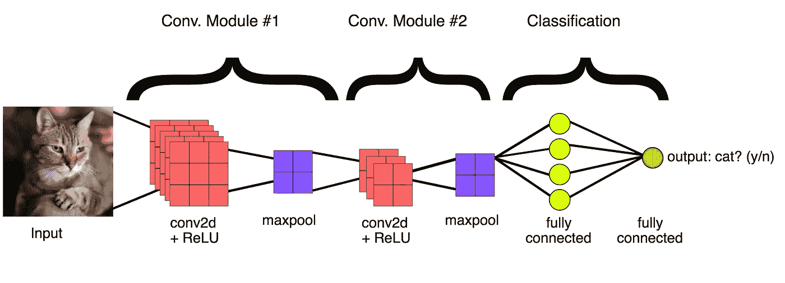
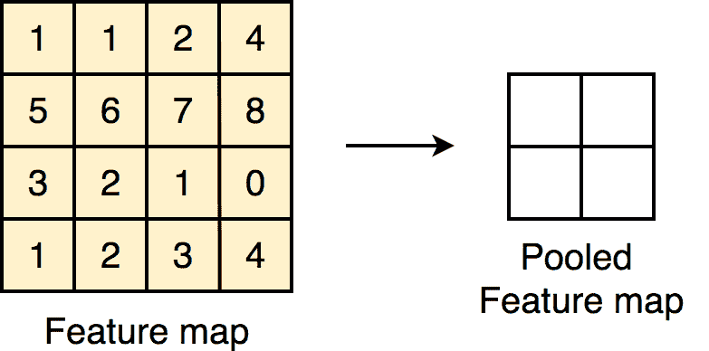
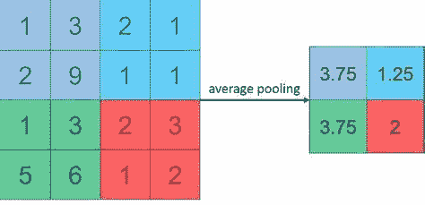
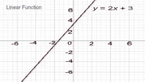
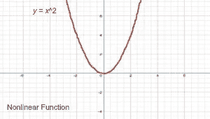
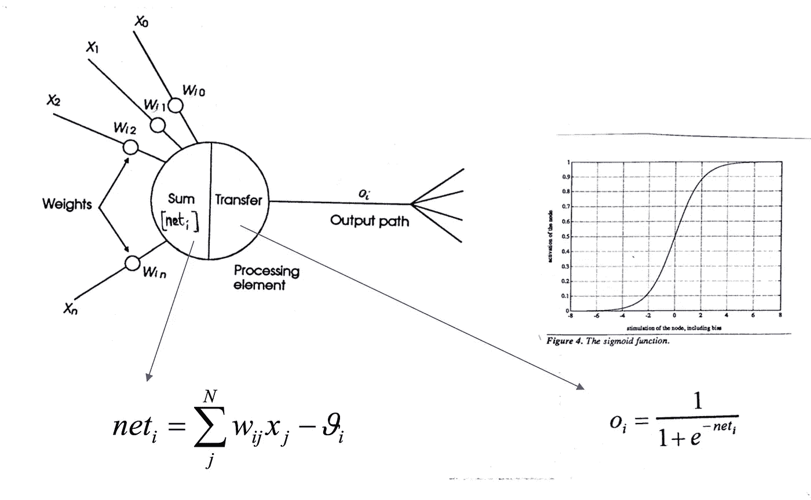

# 用张量流介绍卷积神经网络(CNN)

> 原文：<https://towardsdatascience.com/introduction-to-convolutional-neural-network-cnn-de73f69c5b83?source=collection_archive---------2----------------------->



本页面的部分内容转载自 Google 创建和共享的作品，并根据知识共享 4.0 归属许可中描述的条款使用。[来源](https://developers.google.com/machine-learning/practica/image-classification/images/cnn_architecture.svg)

几乎每一种行业都在使用机器学习。它帮助人们最大限度地减少他们的工作量，因为机器能够高性能地执行大多数人工任务。机器可以进行预测分析，如分类和回归(预测数值)，以及驾驶汽车等需要某种智能的任务。

机器学习是人工智能的一部分，其中我们向机器提供数据，以便它可以 ***从数据*** 中学习模式，并且它将能够预测未来类似问题的解决方案。**神经网络(NN)** 灵感来自人脑的神经网络。**计算机视觉**是人工智能的一个领域，专注于与图像相关的问题。CNN 结合计算机视觉能够执行复杂的操作，从对图像进行分类到解决天文学的科学问题和建造自动驾驶汽车。。

> 杰弗里·辛顿(Geoffrey Hinton)说，“我认为人们需要明白，深度学习正在幕后使许多事情变得更好。”

所以问题是，这些机器如何学习处理图像？

它使用卷积神经网络来有效地完成这项任务。我们先来了解一下什么是卷积神经网络，又名 **CNN** 。

众所周知，图像是二维像素阵列。任何图像都可以根据其特征进行分类。SVM、决策树、随机森林等科学学习算法擅长解决分类问题，但无法从图像中提取合适的特征。

这就是卷积神经网络发挥作用的地方。CNN 是卷积层和神经网络的结合。

基本上任何用于图像处理的*神经网络*都包括以下层

*   输入层，卷积层，汇集层，密集层。

卷积只不过是应用于图像*以从中提取特征*的过滤器。我们将使用这种不同的卷积来从图像中提取不同的特征，如边缘、高光图案。


卷积如何作用于图像。[来源](https://mlnotebook.github.io/post/CNN1/)

这个卷积的作用是创建一个一定大小的过滤器(默认大小为 3X3)。创建过滤器后，它从图像的左上角开始执行元素乘法。逐元素乘法意味着将具有相同索引的元素相乘。将这些计算值相加以获得像素值，并将其存储在新矩阵中。我们将使用这个新生成的矩阵进行进一步处理。

```
Conv2D(32, 3, activation='relu') 
# 32 filters or convolutions of size 3 X 3, with *relu* as activation function. 
```

当我们继续在获得的矩阵上应用过滤器时，矩阵的大小减小。

> *新矩阵的大小=(旧矩阵的大小-滤波器大小)+1*

当我们说卷积层大小是 32 时。这意味着将对图像应用 32 个随机生成的滤波器，从而为该图像输出 32 个特征矩阵。这些特征矩阵作为输入传递到下一层。

在应用卷积之后，还有一个概念叫做**池**。池用于减小图像的大小。有两种类型的池:

1.  **最大池:**从指定大小的矩阵中选择最大值(默认大小为 2 X 2)。这种方法有助于提取图像中具有高重要性或高亮显示的特征。

高亮度特征是具有高像素值的图像的一部分。



最大池大小为 2 X 2。[来源](https://cdn-images-1.medium.com/max/1000/1*lRVHY6UXH7K5sfr9L_YVvg.gif)

```
MaxPooling2D() # method for Max-pooling layer 
               # default size of matrix is 2 X 2
```

2.**平均池**:与最大池不同，平均池取池层矩阵(默认大小为 2 X 2)所有像素值的平均值。



平均池。[来源](http://static.zybuluo.com/mShuaiZhao/85xogdnxjl4hqd6hm3magreb/average_pooling.png)

在上面的例子中，图像大小是 4 X 4，池大小是 2 X 2。从左上角像素开始。它将计算 2 X 2 块矩阵的平均值。对于第一个 2 X 2 块，输出值计算为(1+3+2+9)/4 = 15/4 =***3.75***。以类似的方式，将计算所有其他值。

```
AveragePooling2D()  # method for Average pooling layer
                    # default size of matrix is 2 X 2
```

在大多数情况下，使用最大池是因为它的性能比平均池好得多。

在任何一个*神经网络*中，第一层是输入层，最后一层是输出层。输入层包含所有的输入，这里图像是输入。这些图像作为输入被提供给第一卷积层。第一层的输出将作为第二层的输入，依此类推&。这个过程将持续到最后一层。

在定义*神经网络*时，第一卷积层需要作为输入传递给它的图像的形状。在传递图像之后，通过所有卷积层和池层，输出将被传递到密集层。

我们不能将卷积层的输出直接传递给密集层，因为卷积层的输出是多维形状的，而**密集层需要一维** **形状**即一维数组的输入。

所以我们将在卷积层和密集层之间使用 Flatten()方法。Flatten()方法将多维矩阵转换为一维矩阵。在*神经网络*中，非线性函数被用作*激活函数*。



线性函数图。[来源](https://study.com/cimages/multimages/16/nonlinear_functions_graph_1.jpg)

**线性函数**是最高指数为 1 的表达式。线性函数的图形是直线。

例如:Y= 2X +3。



非线性函数图。[来源](https://study.com/cimages/multimages/16/nonlinear_functions_graph_2.jpg)

而**非线性函数**是最高指数大于 1 的表达式。非线性函数的图形不是直线，而是曲线。

例如:Y= X

密集层是神经元的简单层，其中每个神经元接收来自前一层所有神经元的输入，因此称为*密集*。密集层用于根据卷积层的输出对图像进行分类。



单个神经元的工作。一层包含多个这样的神经元。[来源](https://i.stack.imgur.com/wXL9A.png)

*神经网络*中的每一层都包含神经元，这些神经元计算其输入的**加权平均值，并且这个加权平均值通过一个非线性函数传递，这个非线性函数被称为一个“ ***激活函数”*** 。该激活函数结果被视为神经元的输出。以类似的方式，对所有层的所有神经元执行该过程。**

最后一层的输出将被视为该图像的输出。

```
#sample code for creating Convolutional Neural Networkmodel = models.Sequential()
model.add(layers.Conv2D(32, (3, 3), activation='relu', input_shape=(32, 32, 3)))
model.add(layers.MaxPooling2D())
model.add(layers.Conv2D(64, (3, 3), activation='relu'))
model.add(layers.MaxPooling2D())
model.add(layers.Conv2D(64, (3, 3), activation='relu'))model.add(layers.Flatten()) 
model.add(layers.Dense(64, activation='relu'))
model.add(layers.Dense(10, activation='softmax'))
```

这里，输出层有 10 个神经元具有 **softmax** 激活功能。 **Softmax** 激活功能在我们有 2 个或 2 个以上的类时使用。如果我们总共有 10 个类，那么输出层中的神经元数量将是 10。**每个神经元代表一个类。**

所有 10 个神经元将返回各自类别的输入图像的概率。*具有最高概率的类别将被认为是该图像*的输出。

同样，我们将所有图像传递到卷积层，然后传递到*神经网络*，它将为这些图像产生相应的输出。

```
model.summary()
```

summary()方法将显示模型的架构。

```
Model: "sequential"
_________________________________________________________________
Layer (type)                 Output Shape              Param #   
=================================================================
conv2d (Conv2D)              (None, 30, 30, 32)        896       
_________________________________________________________________
max_pooling2d (MaxPooling2D) (None, 15, 15, 32)        0         
_________________________________________________________________
conv2d_1 (Conv2D)            (None, 13, 13, 64)        18496     
_________________________________________________________________
max_pooling2d_1 (MaxPooling2 (None, 6, 6, 64)          0         
_________________________________________________________________
conv2d_2 (Conv2D)            (None, 4, 4, 64)          36928     
_________________________________________________________________
flatten (Flatten)            (None, 1024)              0         
_________________________________________________________________
dense (Dense)                (None, 64)                65600     
_________________________________________________________________
dense_1 (Dense)              (None, 10)                650       
=================================================================
Total params: 122,570
Trainable params: 122,570
Non-trainable params: 0
_________________________________________________________________
```

**参数** (params)是*权重和偏差*，将用于 CNN 所有神经元的*计算*。

当我们在一些图像上训练任何模型时，它将为所有参数(即权重和偏差)确定一些特定值，这些值用于处理图像和预测该图像的输出。

卷积神经网络主要用于二元和多类、多标签分类。有一些 p *重新训练的模型*像 *Inception、VGG16、VGG19、mobilenet* 等，它们是一些研究人员在数百万张图像上训练它们以将图像分类到多个类别后创建的。这些模型已经学习了对图像进行分类的模式。如果你计划建立一个图像分类器，那么你也可以使用这些模型中的一个作为基础层，并在最后添加一些你选择的密集层。密集图层的数量将根据您的要求和输出类的数量而变化。

在本文中，我们做了卷积神经网络的基础知识，这是非常重要的建立图像分类模型的演练。在下一篇文章中，让我们看看如何使用预先训练的模型来构建一个图像分类器。

如果想查看更多关于卷积神经网络的内容，可以参考 Tensorflow 官网，[此处](https://www.tensorflow.org/tutorials/images/cnn)。

感谢阅读。😊