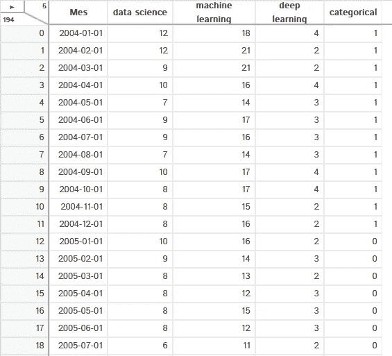
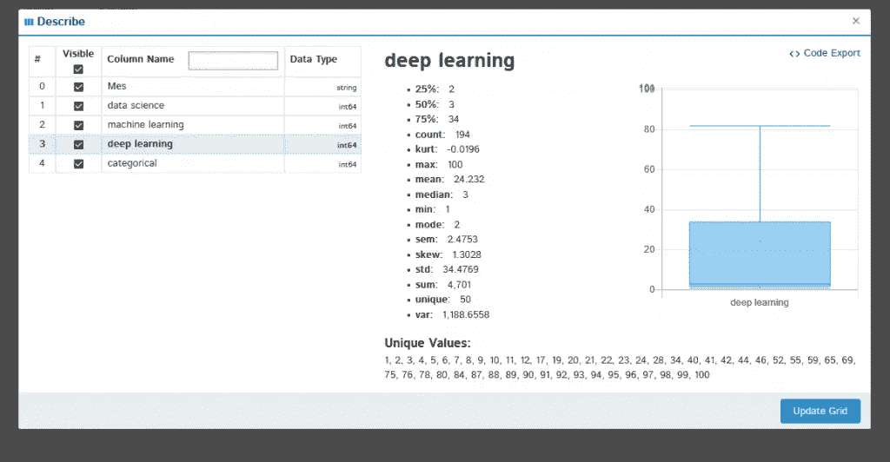

# D-Tale 简介

> 原文：<https://towardsdatascience.com/introduction-to-d-tale-5eddd81abe3f?source=collection_archive---------5----------------------->

## 用于交互式数据探索的 D-Tale 简介


D-Tale 是一个最近创建的图书馆(2020 年 2 月底),它允许我们可视化熊猫的数据框架。D-Tale 所做的是生成一个交互式图形界面，在这个界面中我们可以定义我们想要的数据外观，并按照我们的喜好对数据进行探索性分析。

你可以在[这个链接](http://andrewschonfeld.pythonanywhere.com/dtale/main/1)看到 D-Tale 是如何工作的。本文中的图片是使用那个例子和我们自己的数据生成的，你可以在这里下载。

# 怎么跑？

首先，您必须使用以下命令安装它:

```
pip install --upgrade dtale
```

我们需要一个开放的 Python 实例来运行它，所以我们不能像使用[熊猫档案](/exploratory-data-analysis-with-pandas-profiling-de3aae2ddff3)那样轻松地共享它，我们将永远需要一个开放的 Python 解释器来使用它。由于它是一个非常新的库，这可能会随着以后的版本而改变，我们将能够从任何现代的网络浏览器导出一个 html 文件。

这是在本地启动 D-Tale 交互式应用程序的代码:

```
import dtale
import pandas as pd
df = pd.read_csv(‘data.csv’)
d = dtale.show(df)
d.open_browser()
```

就这样，用这个工具显示一个数据集只需要 5 行代码。现在让我们从它的图形界面来看看 D-Tale 能为我们做些什么。先考虑到是刚出的库(2020 年 2 月底)，大概再过几个月就会有新的有趣功能。

# D-Tale 特征

首先，D-Tale 向我们展示数据的方式和熊猫一样。唯一的区别是左上角的菜单，它允许我们对数据做很多事情，我们稍后会看到。有趣的一点是，在那个菜单旁边，它向我们显示了数据集的列数和行数。



单击任何列标题都会打开一个下拉菜单，为我们提供对数据进行排序的选项，并按照我们想要的方式显示数据。我建议您亲自尝试一下每个按钮是如何工作的。


在这个菜单中我们可以找到的最有趣的选项是*描述*，它向我们显示所选列的统计分析，以及*列分析*，它向我们显示所选列的直方图。



使用选项*格式*，我们可以定义数字的显示方式(小数位数、千位分隔符、红色负数……)


最后，我们可以使用最后一个选项过滤每一列的数据，我们可以只显示大于或小于某个数字的值，只显示某个范围内的值，或者只显示该列具有某个值的行。


在 D-Tale 主菜单中，您可以找到 D-Tale 中的所有选项。这就是 D-Tale 的魅力所在。


让我们看看每个菜单项的作用。先从*来形容*吧。这与我们可以从列标题中访问的选项相同，可以查看每个列的统计分析。

使用*过滤器*选项，我们可以过滤数据，只显示那些符合我们想要的特定条件的行。对于简单的过滤操作，使用上述的列过滤更容易。对于更复杂的过滤操作，我们可以使用这个工具。我们必须根据右边定义的代码编写过滤规则。


使用 *Build Column* 我们可以生成新列，例如我们定义一个新列，它是另外两个列的总和。


通过*相关性*它将向我们展示变量之间的相关性。


在*图表*选项中，我们可以在可用的图表(线形、条形、散点图、圆形、文字云、热图、3D 散点图和表面)中生成我们想要的图形。


我们可以定义我们希望在每个图表中显示哪些变量，以及每个图表的几个更具体的参数，例如我们希望显示的最大值和最小值。

最后，最有趣的选项之一是*热图*。它根据每个单元格的值向我们显示数据表中的颜色。


我们在这里完成了这篇文章。我们将拭目以待这个库如何发展，以及它是否会在数据科学社区中流行起来。它肯定有一个充满希望的未来。