# R 中的数据帧介绍

> 原文：<https://towardsdatascience.com/introduction-to-data-frames-in-r-b9a6302d9a56?source=collection_archive---------37----------------------->

## 许多数据集存储为数据框。了解如何创建数据框、选择数据框中感兴趣的部分以及根据特定变量对数据框进行排序。


# 什么是数据框？

回想一下，对于 [**矩阵**](/introduction-to-matrices-in-r-dc009e3cdbb3) 来说，所有元素必须是相同的数据类型。然而，在做市场调查时，你经常会有这样的问题:

*   “你结婚了吗”或其他“是/否”的问题
*   “你多大了，”(`numeric`)
*   你对这种产品有什么看法？或者其他‘开放式’问题(`character`)

输出，即回答者对上述问题的回答，是不同数据类型的数据集。处理包含不同数据类型而不是一种数据类型的数据集是很常见的。

数据框将数据集的变量作为列，将观察值作为行。

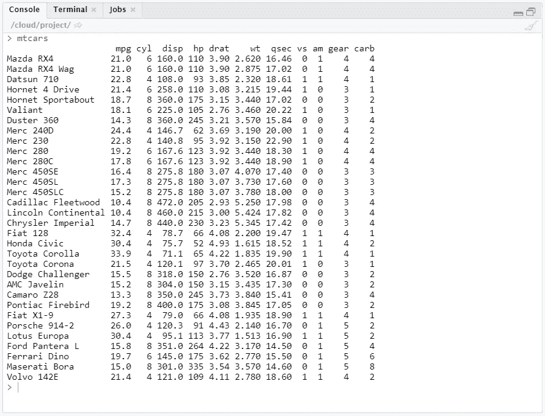

下面是一个 r 中内置数据帧的例子。

# 看一看数据集

处理大型数据集并不少见。当处理(极其)大的数据集和数据框时，您必须首先对数据集的结构和主要元素有一个清晰的了解。因此，只显示整个数据集的一小部分通常是有用的。

要在 R 中做到这一点，您可以使用函数`[head()](https://www.rdocumentation.org/packages/utils/versions/3.6.2/topics/head)`或`[tail()](https://www.rdocumentation.org/packages/utils/versions/3.6.2/topics/head)`。`head()`功能显示数据帧的第一部分。`tail()`功能显示最后一部分。这两个函数都打印一个名为“header”的顶行，其中包含数据集中不同变量的名称。

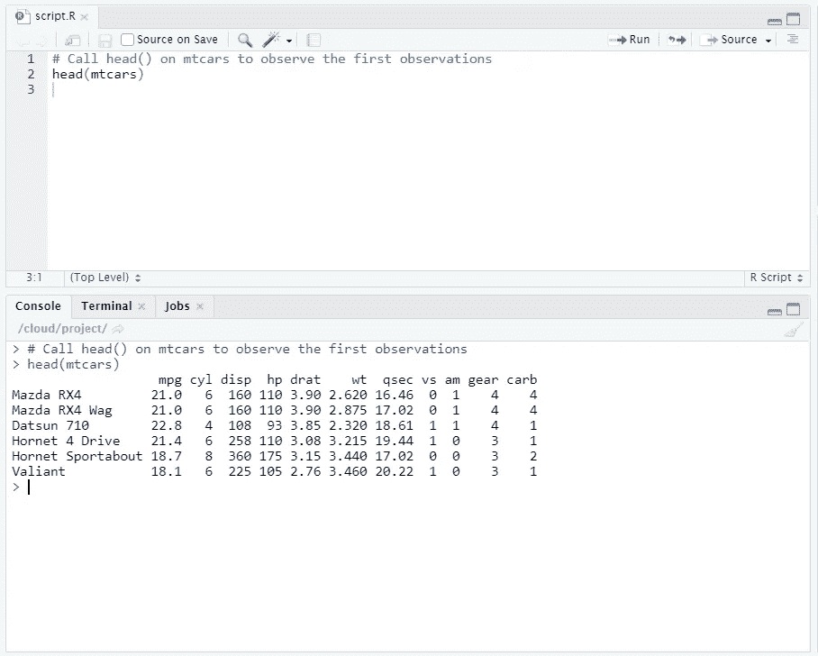

# 看一看结构

另一种快速查看数据的方法是`[str()](https://www.rdocumentation.org/packages/utils/versions/3.6.2/topics/str)`函数。`str()`功能显示数据集的结构。对于数据框，它提供以下信息:

*   观察总数(例如 32 种车型)
*   变量的总数(例如 11 个汽车特征)
*   变量名的完整列表(例如`mpg`、`cy1` …)。)
*   每个变量的数据类型(如`num`)
*   第一次观察

当您接收到一个新的数据集或数据帧时，应用`str()`功能通常是第一步。在进行更深入的分析之前，这是更深入了解数据集的好方法。

为了研究`[mtcars](https://www.rdocumentation.org/packages/datasets/versions/3.6.2/topics/mtcars)`的结构，使用`str()`函数。

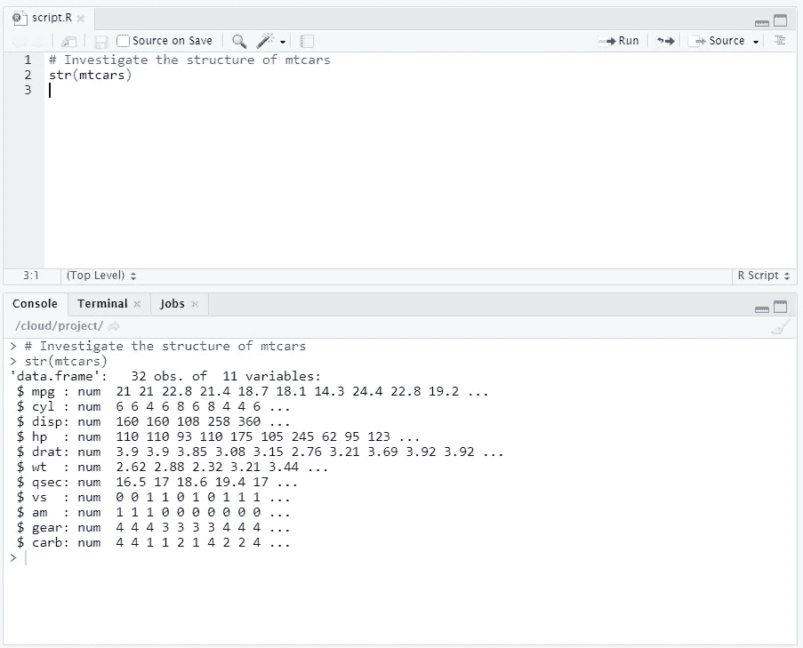

# 创建数据框

让我们构建一个描述太阳系八大行星主要特征的数据框架。假设一颗行星的主要特征是:

*   行星的类型(类地行星还是气态巨行星)
*   行星的直径相对于地球的直径。
*   行星相对于地球自转的总和。
*   行星是否有环(对或错)。

一些[研究](https://en.wikipedia.org/wiki/Planet)表明，以下几个向量是必要的:`name`、`type`、`diameter`、`rotation`和`rings`。每个向量中的第一个元素对应于第一次观察。

```
# Definition of vectors
name <- c("Mercury", "Venus", "Earth", "Mars", "Jupiter", "Saturn", "Uranus", "Neptune")
type <- c("Terrestrial planet", "Terrestrial planet", "Terrestrial planet", 
          "Terrestrial planet", "Gas giant", "Gas giant", "Gas giant", "Gas giant")
diameter <- c(0.382, 0.949, 1, 0.532, 11.209, 9.449, 4.007, 3.883)
rotation <- c(58.64, -243.02, 1, 1.03, 0.41, 0.43, -0.72, 0.67)
rings <- c(FALSE, FALSE, FALSE, FALSE, TRUE, TRUE, TRUE, TRUE)
```

要构建数据框，使用`[data.frame()](https://www.rdocumentation.org/packages/base/versions/3.6.2/topics/data.frame)`功能。作为参数，必须传递前面的向量:它们将成为数据帧的不同列。因为每一列都有相同的长度，所以传递的向量也应该有相同的长度。请记住，它们可能包含不同类型的数据。

为了构建行星数据框架，我们将使用`data.frame()`函数并传递向量`name`、`type`、`diameter`、`rotation`和`rings as arguments.`

```
# Create a data frame from the vectors
planets_df <- data.frame(name, type, diameter, rotation, rings)
```

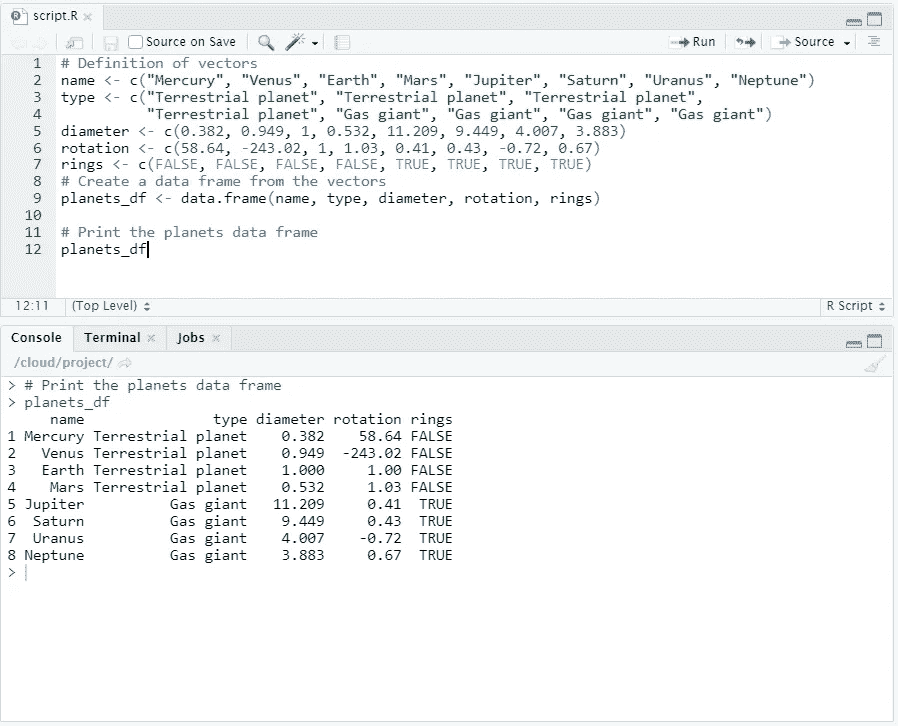

数据框有 8 个观察值和 5 个变量。

让我们研究一下新数据框的结构。回想一下，我们可以使用`str()`函数来实现这一点。

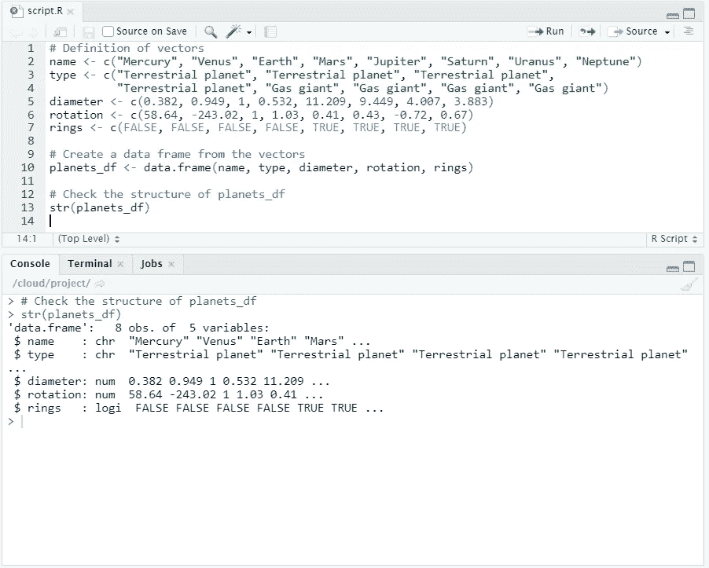

# 数据框元素的选择

与向量和矩阵类似，您可以使用方括号`[]`从数据框中选择元素。通过使用逗号，您可以分别指示从行和列中选择什么。例如:

*   `my_df[1,2]`选择`my_df`中第一行第二列的值。
*   `my_df[1:3, 2:4]`选择`my_df`中的第 1 至 3 行和第 2 至 4 列。

选择一行或一列的所有元素与选择矩阵完全相同。例如，`my_df[1,]`选择第一行的所有元素。

## 让你试试

从`planets_df` 数据框中选择水星的直径(这与我们之前使用的数据框相同)。这是第一行第三列的值。接下来，选择火星上的所有数据(第四行)。

```
# Definition of vectors
name <- c("Mercury", "Venus", "Earth", "Mars", "Jupiter", "Saturn", "Uranus", "Neptune")
type <- c("Terrestrial planet", "Terrestrial planet", "Terrestrial planet", 
          "Terrestrial planet", "Gas giant", "Gas giant", "Gas giant", "Gas giant")
diameter <- c(0.382, 0.949, 1, 0.532, 11.209, 9.449, 4.007, 3.883)
rotation <- c(58.64, -243.02, 1, 1.03, 0.41, 0.43, -0.72, 0.67)
rings <- c(FALSE, FALSE, FALSE, FALSE, TRUE, TRUE, TRUE, TRUE)# Create a data frame from the vectors
planets_df <- data.frame(name, type, diameter, rotation, rings)
```

## 解决办法

```
# Print out diameter of Mercury (row 1, column 3)
planets_df[1,3]# Print out data for Mars (entire fourth row)
planets_df[4,]
```

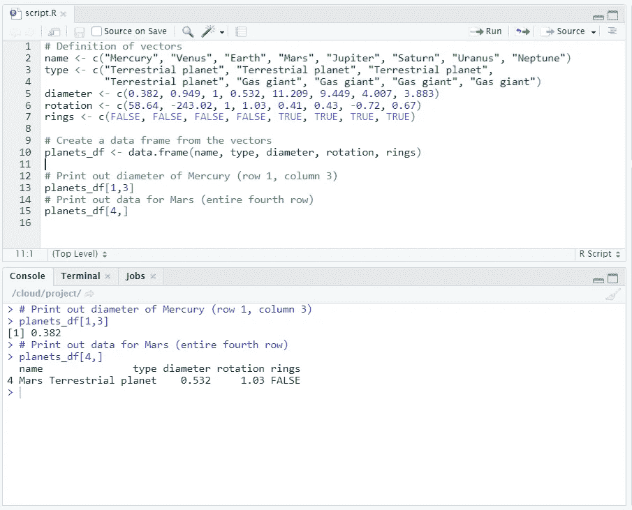

# 数据框元素的选择(2)

除了使用数字来选择数据框的元素，还可以使用变量名来选择数据框的列。

例如，假设您想要选择`type`列的前三个元素。使用第一种方法，您将使用

```
planets_df[1:3,2]
```

这种方法的一个可能的缺点是，您必须知道(或查找)列号`type`，如果有很多变量，这可能会变得很困难。因此，使用变量名通常更容易:

```
plantes_df[1:3, "type"]
```

## 让你试试

选择并打印出`planets_df`的`"diameter"`栏中的前 5 个值。

```
# Definition of vectors
name <- c("Mercury", "Venus", "Earth", "Mars", "Jupiter", "Saturn", "Uranus", "Neptune")
type <- c("Terrestrial planet", "Terrestrial planet", "Terrestrial planet", 
          "Terrestrial planet", "Gas giant", "Gas giant", "Gas giant", "Gas giant")
diameter <- c(0.382, 0.949, 1, 0.532, 11.209, 9.449, 4.007, 3.883)
rotation <- c(58.64, -243.02, 1, 1.03, 0.41, 0.43, -0.72, 0.67)
rings <- c(FALSE, FALSE, FALSE, FALSE, TRUE, TRUE, TRUE, TRUE)# Create a data frame from the vectors
planets_df <- data.frame(name, type, diameter, rotation, rings)
```

## 解决办法

```
# Select first 5 values of diameter column
planets_df[1:5, "diameter"]
```

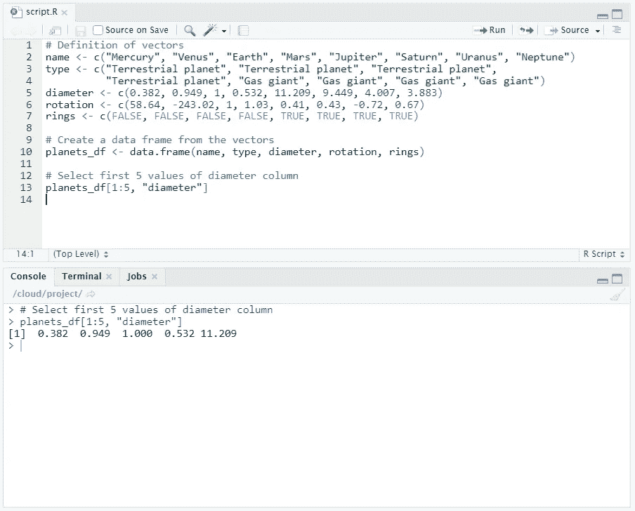

# 只有带环的行星

通常，从数据框中选择特定变量会很有帮助。为此，您需要选择一整列。假设您想要选择第三个变量`diameter`的所有元素。您可以使用以下命令之一:

```
planets_df[,3]
planets_df[,"diameter"]
```

然而，有一条捷径。如果您的列有名称，您可以使用`$`符号:

```
planets_df$diameter
```

## 让你试试

从我们之前创建的`planets_df`数据框中选择`rings`变量，并将结果存储为`rings_vector`。打印出`rings_vector`看看你是否做对了。

```
# Definition of vectors
name <- c("Mercury", "Venus", "Earth", "Mars", "Jupiter", "Saturn", "Uranus", "Neptune")
type <- c("Terrestrial planet", "Terrestrial planet", "Terrestrial planet", 
          "Terrestrial planet", "Gas giant", "Gas giant", "Gas giant", "Gas giant")
diameter <- c(0.382, 0.949, 1, 0.532, 11.209, 9.449, 4.007, 3.883)
rotation <- c(58.64, -243.02, 1, 1.03, 0.41, 0.43, -0.72, 0.67)
rings <- c(FALSE, FALSE, FALSE, FALSE, TRUE, TRUE, TRUE, TRUE)# Create a data frame from the vectors
planets_df <- data.frame(name, type, diameter, rotation, rings)
```

## 解决办法

```
# Select the rings variable from planets_df
rings_vector <- planets_df$rings

# Print out rings_vector
rings_vector
```

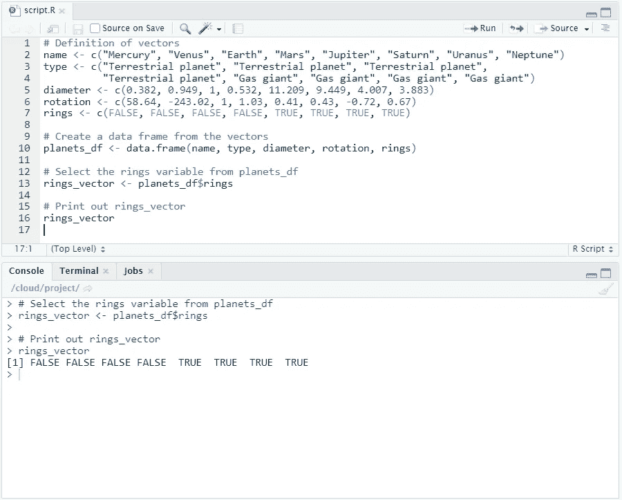

# 只有带环的行星(2)

假设你想用 R 来帮助你得到太阳系中有环的行星的数据。在上面，我们创建了包含以下内容的`rings_vector`:

```
> rings_vector
[1] FALSE FALSE FALSE FALSE  TRUE  TRUE  TRUE  TRUE
```

我们看到前四个观测值(或行星)没有环(`FALSE`)，剩下的四个有(`TRUE`)。

为了更好地了解这些行星的名称、直径等，我们将使用`rings_vector`来选择四颗有环行星的数据。

```
# Select all columns for planets with rings
planets_df[rings_vector,]
```

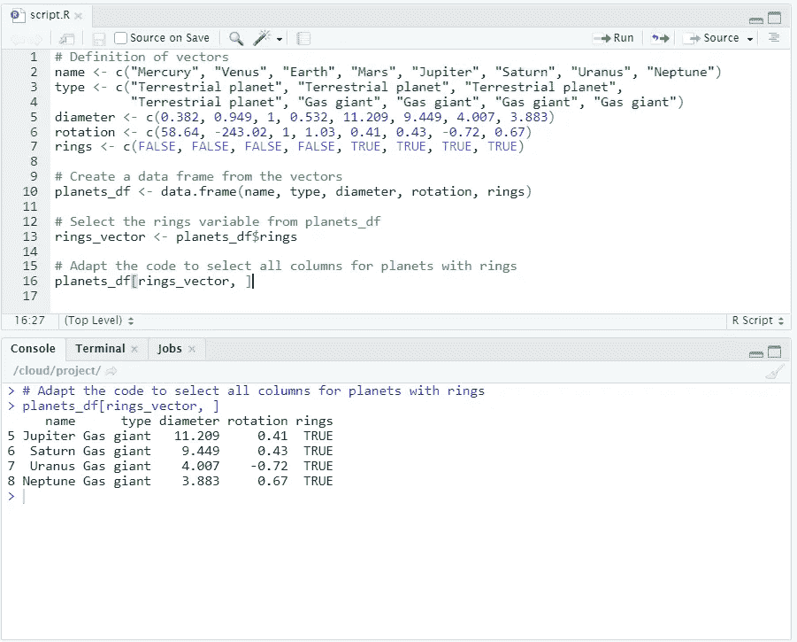

在这里，我们学习了如何根据某个条件是否为真(有环或无环)，从日期框架(`planets_df`)中选择一个子集，提取所有相关数据。

# 只有有环但更短的行星

通过使用`[**subset()**](http://www.rdocumentation.org/packages/base/functions/subset)` 函数作为快捷方式，我们可以做与上面完全相同的事情。subset 函数返回满足条件的向量、矩阵或数据帧的子集。

```
subset(my_df, subset = some_condition)
```

subset 函数接受几个参数。第一个参数`my_df`指定要添加子集的数据集。第二个参数是一个逻辑表达式，指示要保留的元素或行:缺少的值被视为 false。通过添加第二个参数，您为 R 提供了选择正确子集的必要信息和条件。

以前，为了得到有环行星的子集，我们使用了`rings_vector`。

```
# Select the rings variable from planets_df
rings_vector <- planets_df$rings# Select all columns for planets with rings
planets_df[rings_vector,]
```

通过使用`subset()`函数，我们可以在不需要`rings_vector`的情况下得到完全相同的结果。

```
subset(planets_df, subset = rings)
```

## 让你试试

从`planets_df`中选择直径小于地球的行星子集。你需要使用`subset()`功能。**提示:**因为`diameter`变量是行星直径相对于地球的相对度量，所以你的条件是`diameter < 1`。

```
# Definition of vectors
name <- c("Mercury", "Venus", "Earth", "Mars", "Jupiter", "Saturn", "Uranus", "Neptune")
type <- c("Terrestrial planet", "Terrestrial planet", "Terrestrial planet", 
          "Terrestrial planet", "Gas giant", "Gas giant", "Gas giant", "Gas giant")
diameter <- c(0.382, 0.949, 1, 0.532, 11.209, 9.449, 4.007, 3.883)
rotation <- c(58.64, -243.02, 1, 1.03, 0.41, 0.43, -0.72, 0.67)
rings <- c(FALSE, FALSE, FALSE, FALSE, TRUE, TRUE, TRUE, TRUE)# Create a data frame from the vectors
planets_df <- data.frame(name, type, diameter, rotation, rings)
```

## 解决办法

```
# Select planets with diameter < 1
subset(planets_df, subset = diameter < 1)
```

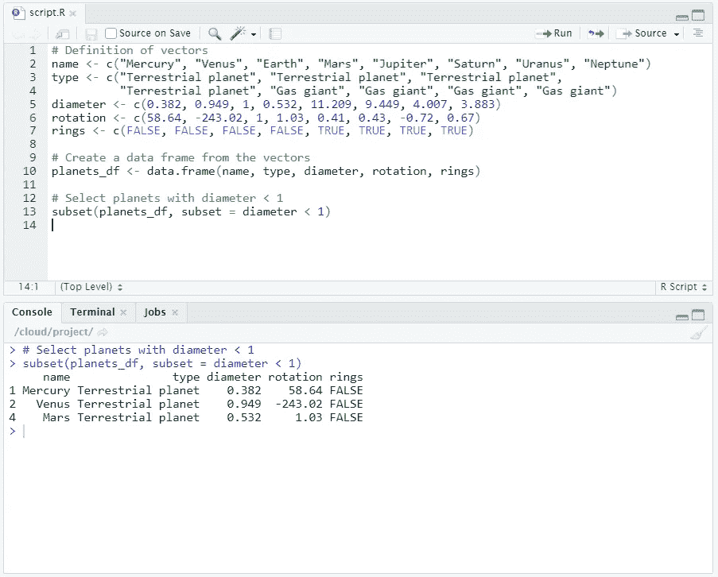

根据我们的输出，我们可以分析并确定三颗行星的直径小于地球。它们是水星、金星和火星。

# 整理

在数据分析中，根据数据集中的某个变量对数据进行排序通常很有帮助。这可以借助 r 中的函数`[**order()**](http://www.rdocumentation.org/packages/base/functions/order)`来完成。

该函数返回应用于变量(如向量)时每个元素的排序位置。例如:

```
> a <- c(100, 10, 1000)
> order(a)
[1] 2 1 3
```

在这个例子中，`a`中的第二个元素 10 是最小的元素，所以在`order(a)`的输出中 2 排在第一位。100 是`a`中的第一个元素，是第二小的元素，所以 1 在`order(a)`的输出中排在第二位。然后，`a`中的第三个也是最后一个元素 1000 是最大的元素，所以 3 在`order(a)`的输出中排在最后。

有了`order(a)`的输出，我们可以重组`a`，这样我们就可以得到一个排序后的输出:

```
> a[order(a)]
[1]   10  100 1000
```

# 对数据框进行排序

我们可以用`order()`函数做的一件有用的事情是排序我们的数据帧。假设我们想通过`diameter`对数据帧进行排序。也就是说，重新排列数据框，使其从最小的行星开始，以最大的行星结束。

我们首先必须使用`planets_df`的`diameter`栏上的`order()`功能。让我们将结果存储为`positions`。

```
# Use order() to create positions.
positions <- order(planets_df$diameter)
```

接下来，我们将使用方括号内的`positions`向量作为行索引来重新排列`planets_df`。我们将保留所有列。

```
# Use positions to sort planets_df
planets_df[positions, ]
```

瞧，我们现在有了一个基于直径的分类数据框。

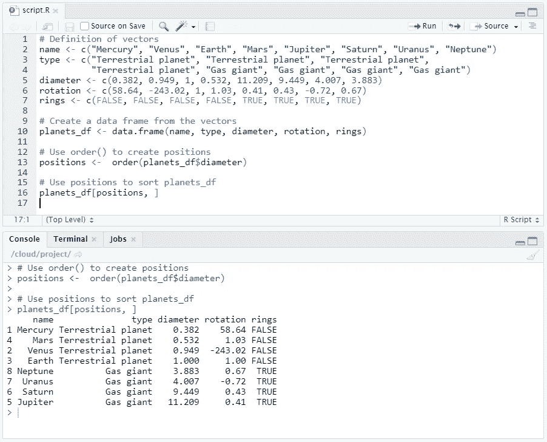

# 笔记

所有图片，除非特别注明，均归作者所有。横幅图像是使用 [Canva](https://www.canva.com/) 创建的。