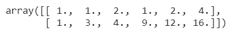

# 每位数据科学家的数据预处理指南

> 原文：<https://towardsdatascience.com/introduction-to-data-preprocessing-67a67c42a036?source=collection_archive---------36----------------------->


(图片由[作者](https://medium.com/@beginningofthefuture)提供)

## 终极数据科学指南

## 理解数据预处理的概念，并使用 scikit 学习库实现它们

数据是以无组织或有组织的形式收集的事实和数字、观察结果或对事物的描述。数据可以以图像、文字、数字、字符、视频、音频等形式存在。

## 什么是数据预处理

为了分析我们的数据并从中提取洞察力，在我们开始建立我们的机器学习模型之前，有必要处理数据，即我们需要将我们的数据转换为我们的模型可以理解的形式。因为机器不能理解图像、音频等形式的数据。

> **数据以算法可以轻松解释的形式(一种高效的格式)进行处理，并准确产生所需的输出。**

我们在现实世界中使用的数据并不完美，它是不完整的、不一致的(有异常值和噪声值)，并且是一种非结构化的形式。预处理原始数据有助于组织、缩放、清理(移除异常值)、标准化，即简化它以将数据馈送给机器学习算法。

**数据预处理的过程包括几个步骤:**

*   **数据清洗:**我们使用的数据可能会有一些遗漏点(比如不包含任何值的行或列)或者有噪声数据(机器难以解释的无关数据)。为了解决上述问题，我们可以删除空的行和列，或者用其他值填充它们，并且我们可以使用像回归和聚类这样的方法来处理有噪声的数据。
*   **数据转换:**将原始数据转换成适合模型的格式的过程。它可能包括分类编码、缩放、归一化、标准化等步骤。
*   **数据缩减:**这有助于减少我们正在处理的数据的大小(便于分析)，同时保持原始数据的完整性。

## sci kit-用于数据预处理的学习库

Scikit-learn 是一个流行的开源机器学习库。这个库为我们提供了各种基本工具，包括用于随机森林、分类、回归的算法，当然还有用于数据预处理的算法。这个库是建立在 NumPy 和 SciPy 之上的，很容易学习和理解。

我们可以使用以下代码将库导入到工作区中:

```
import sklearn
```

为了包含预处理功能，我们可以使用以下代码:

```
from **sklearn** import **preprocessing**
```

> 在本文中，我们将重点介绍一些基本的数据预处理功能，如**标准化、规范化、分类编码、离散化、缺失值插补、生成多项式功能、**和**自定义转换器。**

那么，现在让我们开始使用这些功能吧！

## 标准化

标准化是一种用于缩放数据的技术，使得数据的平均值为零，标准偏差为一。这里的值不限于特定的范围。当输入数据集的特征在其范围之间存在较大差异时，我们可以使用标准化。


(图片由[作者](https://medium.com/@beginningofthefuture)提供)数据标准化的公式

让我们考虑下面的例子:

```
from sklearn import preprocessing
import numpy as np
x = np.array([[1, 2, 3],
[ 4,  5,  6],
[ 7,  8, 9]])
y_scaled = **preprocessing.scale**(x)
print(y_scaled)
```

这里我们有一个 3x3 维的输入数组，它的值在 1 到 9 之间。使用`preprocessing`中可用的`scale`功能，我们可以快速缩放我们的数据。


(图片由[作者](https://medium.com/@beginningofthefuture)提供)缩放数据

这个库中还有另一个可用的函数`StandardScaler`，它帮助我们计算训练数据集的均值和标准差，并通过实现`Transformer API`对训练数据集重新应用相同的变换。

如果我们想在给定范围内缩放我们的特征，我们可以使用`MinMaxScaler`(使用参数`feature_range=(min,max)`)或`MinAbsScaler`(不同之处在于每个特征的最大绝对值在`MinAbsScaler`中被缩放到单位大小)

```
from sklearn.preprocessing import MinMaxScaler
import numpy as np
x = **MinMaxScaler(feature_range=(0,8))**
y = np.array([[1, 2, 3],
[ 4,  -5,  -6],
[ 7,  8, 9]])
scale = x.**fit_transform**(y)
scale
```

这里，3x3 维数组的值在给定的`(0,8)`范围内缩放，我们使用了`.fit_transform()`函数，它将帮助我们稍后对另一个数据集应用相同的转换。


(图片由[作者](https://medium.com/@beginningofthefuture)提供)指定范围内的缩放数据

## 正常化

标准化是在 **-1，1** 的范围内对数值进行缩放的过程，即将数值转换成一个通用的比例。这确保了数据集中的大值不会影响学习过程，并且对模型的学习过程具有类似的影响。当我们想要量化任何一对样本(如点积)的相似性时，可以使用归一化。

```
from sklearn import preprocessing
import numpy as np
X = [[1,2,3],
[4,-5,-6],
[7,8,9]]
y = preprocessing.normalize(X)
y
```


(图片由[作者](https://medium.com/@beginningofthefuture)提供)归一化数据

这个模块也为我们提供了一个`Transformer API`的替代方案，通过使用实现相同操作的`Normalizer`函数。

## 编码分类特征

很多时候，我们使用的数据可能不具有连续形式的特征值，而是具有文本标签的类别形式。为了让机器学习模型处理这些数据，有必要将这些分类特征转换成机器可理解的形式。

该模块中有两个可用的函数，通过它们我们可以对我们的分类特征进行编码:

*   **OrdinalEncoder:** 这是将分类特征转换为整数值，以便该函数将每个分类特征转换为整数的一个新特征(0 到 n_categories — 1)。

```
import sklearn.preprocessing
import numpy as np
enc = **preprocessing.OrdinalEncoder**()
X = [['a','b','c','d'], ['e', 'f', 'g', 'h'],['i','j','k','l']]
enc.fit(X)
enc.transform([['a', 'f', 'g','l']])
```

这里，三个类别被编码为`0,1,2`，上述输入的输出结果是:


(图片由[作者](https://medium.com/@beginningofthefuture)编码的数据)

*   **OneHotEncode:** 该编码器功能将每个具有`n_categories`可能值的分类特征转换为`n_categories`二进制特征，其中一个为 1，所有其他为 0。为了更好的理解，请看下面的例子。

```
import sklearn.preprocessing
import numpy as np
enc = **preprocessing.OneHotEncoder**()
X = [['a','b','c','d'], ['e', 'f', 'g', 'h'],['i','j','k','l']]
enc.fit(X)
enc.transform([['a', 'f', 'g','l']]).toarray().reshape(4,3)
```


(图片由[作者](https://medium.com/@beginningofthefuture)编码的数据)

## [数]离散化

离散化过程有助于我们将数据的连续特征分离成离散值(也称为宁滨或量化)。这类似于使用连续数据创建直方图(其中离散化侧重于将特征值分配给这些箱)。在某些情况下，离散化可以帮助我们在线性模型中引入非线性。

```
import sklearn.preprocessing 
import numpy as np
X = np.array([[ 1,2,3],
              [-4,-5,6],
              [7,8,9]])
dis = preprocessing.KBinsDiscretizer(n_bins=[3, 2, 2], encode='ordinal')
dis.fit_transform(X)
```

使用`KBinsDiscretizer()`，该功能将特征离散到`k`箱中。默认情况下，输出是一键编码的，我们可以用`encode`参数来改变。


(图片由[作者](https://medium.com/@beginningofthefuture)提供)数据离散化

## 缺失值的插补

此过程用于处理数据中的缺失值(nan、空白等)，方法是为它们赋值(基于数据集的已知部分进行输入),以便模型可以处理数据。让我们用一个例子来理解这一点:

```
from sklearn.impute import SimpleImputer
import numpy as np
impute = **SimpleImputer(missing_values=np.nan, strategy='mean')**
X = [[np.nan, 1,2], [3,4, np.nan], [5, np.nan, 6]]
impute.fit_transform(X)
```

这里，我们使用了`SimpleImputer()`函数来输入缺失值。该函数中使用的参数是`missing_values`来指定要估算的缺失值，`strategy`来指定我们希望如何估算该值，就像在上面的示例中我们使用了`mean`，这意味着缺失值将被列值的平均值替换。我们可以为`strategy`使用其他参数，如中位数、众数、`most_frequent`(基于列中特定值出现的频率)，或者`constant`(一个常量)。


(图片由[作者](https://medium.com/@beginningofthefuture)提供)输入缺失值

## 生成多项式要素

为了在我们的机器学习模型的结果中获得更大的准确性，有时在模型中引入复杂性(通过添加非线性)是好的。我们可以通过使用函数`PolynomialFeatures()`简单地实现这一点。

```
import numpy as np
from sklearn.preprocessing import PolynomialFeatures
x = **np.array([[1,2],
              [3,4]])**
nonl = **PolynomialFeatures(2)**
nonl.fit_transform(x)
```



(图片由[作者](https://medium.com/@beginningofthefuture))生成多项式特征

在上面的例子中，我们已经在`PolynomialFeatures()`函数中指定了`2`所需的非线性模型的阶数。输入数组的特征值从 **(X1，X2)转换到(1，X1，X2，X1，X1*X2，X2)。**

## 定制变压器

如果出于数据处理或清理等任何目的，需要使用特定的函数(python 中已有的)来转换整个数据，我们可以通过实现函数`FunctionTransformer()`并传递所需的函数来创建一个定制的转换器。

```
import sklearn.preprocessing 
import numpy as np
transformer = **preprocessing.FunctionTransformer**(np.log1p, validate=True)
X = np.array([[1,2,3],
              [4,5,6],
              [7,8,9]])
transformer.transform(X)
```

在本例中，我们使用了 log 函数来转换数据集值。


(图片来自[作者](https://medium.com/@beginningofthefuture))实现定制变压器

## 结论

我希望通过这篇文章，你能够理解机器学习模型中数据预处理的概念和需求，并且能够将这些概念应用到真实的数据集中。

为了更好地理解这些概念，我建议您尝试在 once 上实现这些概念。继续探索，我相信你会发现新的特性。

如果你有任何问题或意见，请发表在评论区。

> 查看完整的数据可视化指南和 NumPy 的基本功能:

[](/data-visualization-with-python-8bc988e44f22) [## 用 Python 实现数据可视化

### Master python 的数据可视化库

towardsdatascience.com](/data-visualization-with-python-8bc988e44f22) [](/numpy-cheatsheet-for-essential-functions-python-2e7d8618d688) [## NumPy 的备忘单:基本功能和鲜为人知的功能

### 学习你可能不知道的 NumPy 的各种基本功能(用代码)

towardsdatascience.com](/numpy-cheatsheet-for-essential-functions-python-2e7d8618d688) 

***最初发表于:***[***【www.patataeater.blogspot.com】***](http://www.patataeater.blogspot.com/)

```
Resources:
[https://scikit-learn.org/stable/modules/preprocessing.html#](https://scikit-learn.org/stable/modules/preprocessing.html#)
```