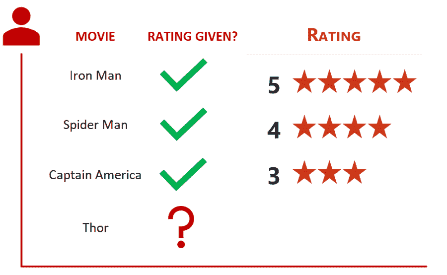
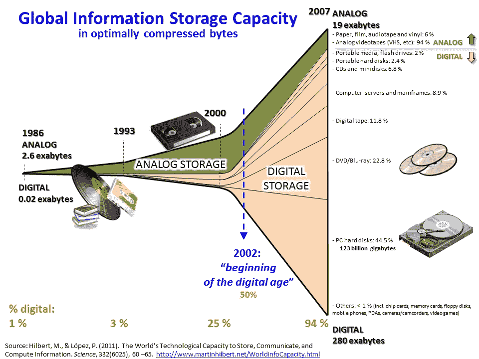

# 数据科学导论

> 原文：<https://towardsdatascience.com/introduction-to-data-science-eb2498d1c5c7?source=collection_archive---------56----------------------->

亨特·哈里特在 [Unsplash](https://unsplash.com/s/photos/data?utm_source=unsplash&utm_medium=referral&utm_content=creditCopyText) 上的照片

> [*数据科学家——21 世纪最性感的工作*](https://hbr.org/2012/10/data-scientist-the-sexiest-job-of-the-21st-century)

**我相信你已经听过这句话，即使你不是像我一样的数据头脑。这是来自[哈佛商业评论](https://hbr.org/)的主要出版物，作者是 [Thomas H. Davenport](https://www.linkedin.com/in/davenporttom/) 和 [DJ Patil](https://www.linkedin.com/in/dpatil/) ，他们谈到随着专注于大数据的技术的出现，数据变得越来越容易访问和驯服。如今，每一家大公司都在制定数据科学战略并改善他们的服务——亚马逊推出了推荐引擎，脸书推出了 feed 排名，谷歌推出了全套产品，还有许多其他公司。为了理解所有这些很酷的东西，让我们先浏览一下数据科学的基础知识，试着分解一下你在谷歌上搜索“数据科学”时会看到的大术语…**

# **什么算是数据？**

**让我们从定义这一切的症结开始— *数据*:**

> ***数据是信息的集合，通常由不同格式的片段组成***

**让我们以一个非常非常受欢迎的服务为例——网飞。人们都爱看电影，但每个人都有偏好。例如，假设我们正试图建立一个系统，根据人们的口味向他们推荐电影。有些喜欢动作片，有些喜欢惊悚片，有些可能是恐怖片、科幻片或喜剧片。这使得问题变得非常有趣，你希望你的系统能够正确处理这个问题——当我现在喜欢动作片的时候，你不会想推荐给我一部言情片吧！**

**现在，即使对一个人来说，让我们说让你给我推荐一部电影，你也会想知道我的品味，我的偏好，我的喜欢和不喜欢。所以你会问我问题:“你喜欢这个吗……..或者…..你喜欢这样吗？对此你怎么看？…我明白了…你喜欢有有趣故事情节的电影，当然还有动作片。基于此，我会建议你去看这些电影……”。**

**显而易见，在向我提出建议之前，你会先询问我的偏好，通过这个练习，你正在收集数据。**

****

**推荐引擎评级**

**同样对于推荐系统，我们将利用我们收集的关于个人电影品味的数据来训练它。这将类似于每当推荐系统看到某个模式时就指示推荐系统推荐哪种类型的电影。例如，它看到了钢铁侠、蜘蛛侠和美国队长——雷神可能是一个好建议，你觉得呢？**

# **什么是大数据？**

**对于任何数据科学问题，我们能够收集大量相关数据是至关重要的。**

**当我们谈论大数据时，它通常涉及以上述方式形成的数据集，但其数量如此之大，以至于使用常用软件和工具管理和建模所需的时间和计算能力超过了可容忍的极限，因此增加了术语“大”。
当我们处理大数据时，数据的大小并没有真正的限制，数据量从兆兆字节到许许多多兆兆字节不等。它可以是结构化的，也可以是非结构化的，并且很难使用传统的数据库和软件技术进行处理。**

****

**信息存储容量时间表(*EN.WIKIPEDIA.ORG***

## **大数据的特征**

**有几种方法可以根据大数据的特征来定义大数据，其中最常见的是使用流行的大数据 4v。**

****体积** 这就是数据的数量——加上‘大’的正当性。这决定了可以从数据中提取多少信息和见解。对于强大的系统，必须使用大量的数据来训练模型，以便模型能够表现得非常好。虽然拥有如此大量的数据令人惊叹，但你应该始终坚持的是，数据足够丰富。因此，虽然拥有一个人多年的电影数据总体来说是好的，但如果这些数据来自这个人的童年，它可能就没那么有用了。当我们想向成年人推荐电影时，我们也会包括儿童电影！**

****多样性** 这个属性与我们正在处理的数据的性质和类型有关。我们可能会处理文本、图像、音频、视频或者可能带有时间戳的事件—结构化、非结构化、半结构化甚至复杂结构的数据。我们得出和实施的分析、见解和流程高度依赖于数据的多样性。这是因为拥有多种多样的数据需要同样多种多样的方法来存储和处理这些数据。**

****准确性** 传入的数据虽然如上所述规模巨大，但如果不相关就没多大用处。我们接收到的数据质量极大地影响了我们的直觉和洞察力，以及我们的分析结果。例如，让我们回到电影推荐引擎。包含在分析中的数据必须是正确的，所以它不应该将电视节目作为我们最终数据集的一部分。我们正在向一个人推荐电影，而让电视节目成为我们对那个人的记录的一部分不仅是不必要的，而且是不正确的。虽然电视节目可以按类型分类，但这正是与电影相似之处的所在。他们有一个完全不同的结构——可能是 20 分钟或更长的剧集在连续的几季中组合在一起。**

****速度** 数据生成和输入分析系统的速度在很大程度上决定了我们处理数据的方式。大数据通常是实时可用的，这种生成频率以及处理这种海量数据的频率是推动分析的两个最重要的因素。我们需要最新的数据来训练我们的推荐系统，我们希望尽快给出建议！**

# **数据科学**

**根据维基百科，**

> ***科学是以可检验的解释和关于宇宙的* [*预言*](https://en.wikipedia.org/wiki/Predictions) *的形式构建和组织* [*知识*](https://en.wikipedia.org/wiki/Knowledge) *的系统事业。***

**我相信你一定看过各种不同的主题，比如数据分析、[机器学习](https://thedatascienceportal.com/so-what-is-machine-learning/)、人工智能、自然语言处理等等。等等..数据科学可以被称为所有这些领域的总称——所有这些领域都涉及必须首先经过[数据预处理管道](https://thedatascienceportal.com/data-preprocessing/)的数据。数据被转换成一种现在适合我们运行分析模型的格式。如果你想了解更多，可以看看这篇文章:[数据预处理](https://thedatascienceportal.com/data-preprocessing/)。**

** [## 数据预处理

### 标签:当我们谈论数据时，我们通常会想到一些包含大量行和列的大型数据集。而那个…

thedatascienceportal.com](https://thedatascienceportal.com/data-preprocessing/) 

**你为什么问科学？**
当解决数据科学中的任何问题时，所发生的是人们试图利用统计学、机器学习、数据分析和其他相关领域，以便使用相关数据分析和理解实际现象，然后将其呈现给世界，就像实际科学实验所发生的那样。首先观察问题，然后提出适当的假设，并反复试验以改进假设并得到更好的结果。任何结果的正确性都是由我们试图解决的问题类型决定的——根据特定问题的度量和 KPI。这正是在数据科学实验中发生的事情——在框定问题、进行实验以产生理解并将理解传达给世界其他地方方面，存在巨大的可能性。** 

***原载于 2020 年 4 月 25 日 https://thedatascienceportal.com***。更多此类内容请访问数据科学门户网站！****

*** [## 数据科学门户

### 大家好，欢迎来到数据科学门户。这个空间致力于学习和理解所有令人兴奋的…

thedatascienceportal.com](https://thedatascienceportal.com/)***