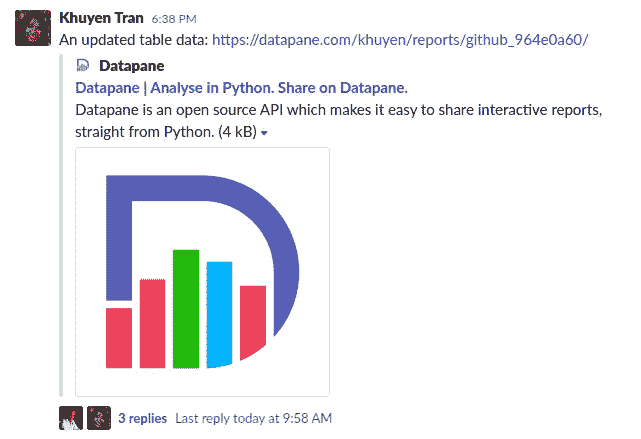
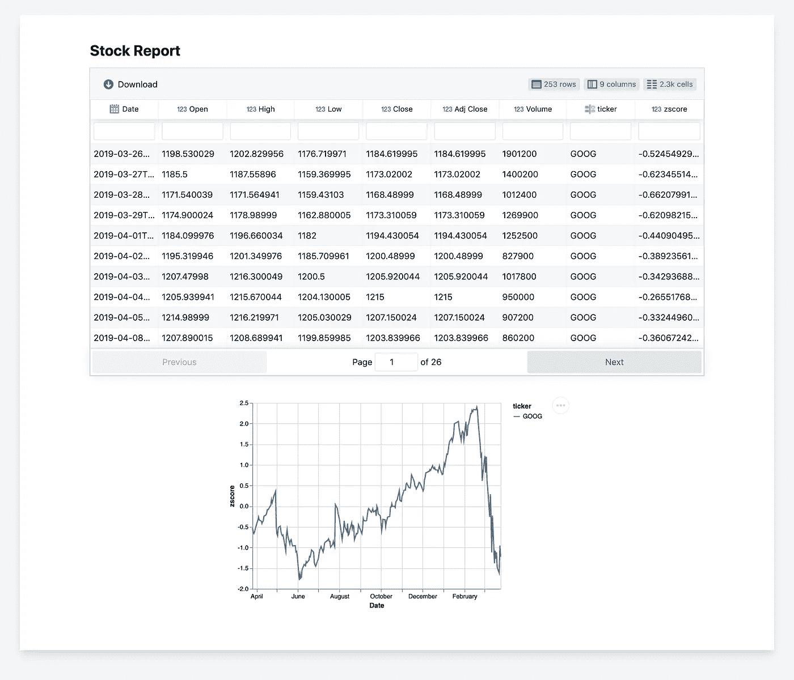
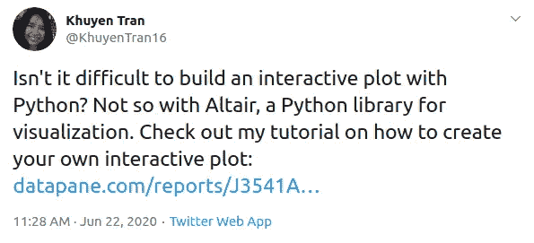

# Datapane 简介:构建交互式报表的 Python 库

> 原文：<https://towardsdatascience.com/introduction-to-datapane-a-python-library-to-build-interactive-reports-4593fd3cb9c8?source=collection_archive---------6----------------------->

## 创建精美报告并与您的团队分享分析结果的简单框架


[克莱班克斯](https://unsplash.com/@claybanks?utm_source=medium&utm_medium=referral)在 [Unsplash](https://unsplash.com?utm_source=medium&utm_medium=referral) 拍摄的照片

# 动机

对于许多 Python 数据分析，有时您希望与其他人共享您的发现。展示您的工作将有助于您的团队和经理了解您的最新进展，并在您的网络中树立您作为数据科学家的声誉。我在这篇文章中提到了分享我的工作如何影响了我的职业生涯:

[](/how-to-learn-data-science-when-life-does-not-give-you-a-break-a26a6ea328fd) [## 当生活不给你喘息的机会，如何学习数据科学

### 我努力为数据科学贡献时间。但是发现新的策略使我能够提高我的学习速度和…

towardsdatascience.com](/how-to-learn-data-science-when-life-does-not-give-you-a-break-a26a6ea328fd) 

但是仅仅分享是不够的。比方说，在清理完数据并创建了一些用于分析的图表后，您希望与他人分享您的发现。**您最不想做的事情**是与非技术人员(如您的利益相关者)分享整个代码或笔记本，并要求他们**安装 Jupyter 笔记本和所需的环境，以查看您的发现**，如下所示:

“就是这个。ipynb 文件。要查看这个文件，你需要`pip install`这些包。然后在 Jupyter 笔记本的命令行上键入。一旦你看到笔记本，运行所有的细胞，你应该能够看到数据和可视化”。

作为一种替代方法，您可以拍摄可视化效果的图片并将其放在一个面板中，但是查看者将无法对可视化效果进行太多的控制-他们将无法以交互方式使用它、浏览任何数据或更改输入参数。此外，每次他们需要更改时，您都必须手动创建另一个报告。

最佳策略是**共享特定的面向用户的部分，而不设置环境**。如果你能给他们发一个类似于 [this](https://datapane.com/khuyen/reports/financial_report_c5d5ffb4/) 的链接给你的队友或利益相关者，那不是很好吗



在一个地方查看您的所有调查结果？



这时你需要一个像 Datapane 这样的 Python 框架。

# 什么是 Datapane？

[Datapane](https://datapane.com/) 是一个 API **，面向用 Python 分析数据并需要一种方式来共享他们的结果的人**。它提供了一种通过组件以编程方式创建报告的方法，这些组件包装了分析中的通用对象，例如:

*   [熊猫数据帧](https://pandas.pydata.org/)
*   来自 Python 可视化库的绘图，如 [Plotly](https://plotly.com/python/) 、 [Bokeh](https://bokeh.org/) 、 [Altai](https://altair-viz.github.io/) r、[leave](https://python-visualization.github.io/folium/quickstart.html)
*   降价

创建后，报告可以发布到 web 上，在云中动态生成，或者嵌入到您自己的应用程序中，在那里可以浏览数据，并可以交互地使用可视化

Datapane 还允许您部署您的 Python 脚本和笔记本，以便其他人可以从他们的浏览器运行它们来生成报告，而不用担心代码、笔记本或设置 Python 环境。

# 我们来试试吧！

假设你有一个这样的脚本，有熊猫数据帧和牛郎星图

要创建报告，只需遵循以下步骤

*   安装数据面板

```
pip3 install datapane
```

*   在 [Datapane](https://datapane.com/) 上注册以获得您自己的令牌，并使用该令牌在您的终端上登录 Datapane

```
datapane login --server=https://datapane.com/ --token=yourtoken
```

*   然后只需在您现有的分析中添加几行代码！

*   运行脚本，瞧！一份关于 Datapane.com 的报告将自动为您创建！

[https://datapane.com/khuyen/reports/stock_report_9eddadcd/](https://datapane.com/khuyen/reports/stock_report_9eddadcd/)

就是这样！现在你需要做的就是把这个链接分享给你的队友或经理


或者在社交媒体上分享



# 我还可以用 Datapane 做什么？

## 允许观众输入新参数

你不仅想让观众看到你的报告，你可能还想让他们能够与图表互动，并插入不同的参数，如[和](https://datapane.com/leo/scripts/startup_calculator/)

有了 Datapane，其他人可以生成您的报告，而不用担心代码、笔记本或设置 Python 环境。他们可以**输入他们想要指定的参数**作为输入，并且每次将接收到一个**动态报告**。

要部署名为`stock_report.py`的脚本，创建如上所示的脚本，然后使用 Datapane 的 CLI:

```
datapane script deploy --script=stock_report.py --name=stock_report
```

关于如何部署脚本[的更多说明，请参见这里的](https://docs.datapane.com/tutorials/tut-deploying-a-script)。

## 在社交平台中嵌入报告

如果你是一个像我一样的中型作家或博客作者，你可能想嵌入一个表格或一个如下的图:

有了 Datapane，你可以通过简单地复制和粘贴 Datapane 上发布的 url 来将你的图表嵌入到 Medium 中。你也可以把它们嵌入到 Reddit、Confluence、opinion 或者你自己的网站中。

## 将文件和对象存储在数据面板上，以便在多个脚本中使用

Datapane 提供了一个 Blob API，允许您从任何 Python 或 CLI 环境中上传文件，并在您的脚本中或通过 CLI 访问它们。

假设您可以使用`dp.Blob` 将数据帧、文件或对象保存在`blob.py`中，使用

然后，如果您想在另一个脚本中加载它们，请使用

## 从报告中下载表格和图表

如果您的查看者想要下载您的表格或图表，他们可以通过报表中的 download 按钮轻松完成。

# 结论

恭喜你！您刚刚学习了一个新工具，它将与您喜欢的其他 Python 库一起添加到您的数据科学工作流中。

我希望这篇文章为您试用 Datapane 提供了一个良好的开端。你可以在这里了解更多关于数据面板[的信息。如果您对这个工具有任何疑问，请在下面评论或在](https://datapane.com/) [LinkedIn](https://www.linkedin.com/in/khuyen-tran-1401/) 上给我发消息。

我喜欢写一些基本的数据科学概念，并尝试不同的算法和数据科学工具。你可以在 LinkedIn 和 Twitter 上与我联系。

如果你想查看我写的所有文章的代码，请点击这里。在 Medium 上关注我，了解我的最新数据科学文章，例如:

[](/how-to-create-interactive-and-elegant-plot-with-altair-8dd87a890f2a) [## 如何用 Altair 创建交互式剧情

### 在 5 行简单的 Python 代码中利用您的数据分析

towardsdatascience.com](/how-to-create-interactive-and-elegant-plot-with-altair-8dd87a890f2a) [](/how-to-create-an-interactive-startup-growth-calculator-with-python-d224816f29d5) [## 如何用 Python 创建一个交互式创业成长计算器

### 使用 Python 为您的创业构建实用的度量

towardsdatascience.com](/how-to-create-an-interactive-startup-growth-calculator-with-python-d224816f29d5) [](/how-to-find-the-nearest-hospital-with-voronoi-diagram-63bd6d0b7b75) [## 如何用 Voronoi 图找到最近的医院

### 给定一个美国医院的大数据集，我们如何快速找到最近的医院？

towardsdatascience.com](/how-to-find-the-nearest-hospital-with-voronoi-diagram-63bd6d0b7b75) [](/how-to-organize-your-data-science-articles-with-github-b5b9427dad37) [## 如何用 Github 组织你的数据科学文章

### 被新信息淹没？现在，您可以轻松地跟踪文章并为其创建自定义注释

towardsdatascience.com](/how-to-organize-your-data-science-articles-with-github-b5b9427dad37)