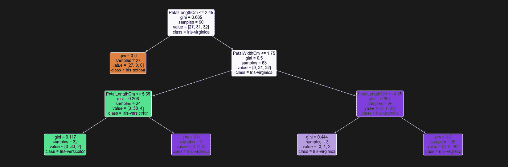
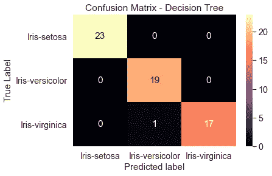

# scikit-learn 决策树分类器简介

> 原文：<https://towardsdatascience.com/introduction-to-decision-tree-classifiers-from-scikit-learn-32cd5d23f4d?source=collection_archive---------5----------------------->

## 将决策树分类器应用于虹膜数据集


照片由[内特·格兰特](https://unsplash.com/@nateggrant?utm_source=medium&utm_medium=referral)在 [Unsplash](https://unsplash.com?utm_source=medium&utm_medium=referral) 拍摄

有很多文章解释了什么是决策树以及决策树的作用:

[](https://medium.com/swlh/decision-tree-classification-de64fc4d5aac) [## 决策树分类

### 决策树是对例子进行分类的简单表示。这是一种受监督的机器学习，其中数据…

medium.com](https://medium.com/swlh/decision-tree-classification-de64fc4d5aac) [](/the-basics-decision-tree-classifiers-b0d20394eaeb) [## 基础知识:决策树分类器

### 对决策树如何工作和构建的直觉

towardsdatascience.com](/the-basics-decision-tree-classifiers-b0d20394eaeb) [](https://medium.com/@borcandumitrumarius/decision-tree-classifiers-explained-e47a5b68477a) [## 决策树分类器解释

### 决策树分类器是一种简单的机器学习模型，用于分类问题。这是一个…

medium.com](https://medium.com/@borcandumitrumarius/decision-tree-classifiers-explained-e47a5b68477a) 

因此，在这里，我将重点介绍如何在 iris 数据集上使用 python 中的 scikit-learn 库实现决策树，以及一些有助于分析算法性能的功能。

**什么是量词？**

分类器算法用于通过决策规则将输入数据映射到目标变量，并可用于预测和理解与特定类别或目标相关联的特征。这意味着这是一种受监督的机器学习算法，因为我们已经有了最终的标签，我们只是想知道如何预测它们。为了我们的目的，我们可以使用决策树分类器来基于以下特征预测我们所拥有的鸢尾花的类型:花瓣长度、花瓣宽度、萼片长度和萼片宽度。

**什么是决策树？**

决策树是一种树状结构，其中内部节点代表属性，分支代表决策规则，叶节点代表结果。这是通过根据属性选择度量将数据分成单独的分区来实现的，在这种情况下，属性选择度量是基尼指数(尽管如果我们愿意，我们可以将其更改为信息增益)。这实质上意味着我们每个分裂都旨在减少基尼不纯，基尼不纯根据错误分类的结果来测量节点的不纯程度。

**实施决策树**

我们首先希望将数据转换成正确的格式，以便创建决策树。这里，我们将使用来自`sklearn` datasets 数据库的 iris 数据集，它非常简单，是如何实现决策树分类器的展示。

来自`scikit-learn`的决策树分类器的好处是目标变量可以是分类的或数字的。为了清楚起见，给定 iris 数据集，我更喜欢保持花的分类性质，因为稍后解释起来更简单，尽管如果需要的话，标签可以稍后引入。因此，以下代码可用于在此导入数据集:

```
import pandas as pd
import numpy as np
from sklearn.datasets import load_iris#load in the data
data = load_iris()
#convert to a dataframe
df = pd.DataFrame(data.data, columns = data.feature_names)
#create the species column
df['Species'] = data.target#replace this with the actual names
target = np.unique(data.target)
target_names = np.unique(data.target_names)
targets = dict(zip(target, target_names))
df['Species'] = df['Species'].replace(targets)
```

接下来我们要做的是提取我们的训练和测试数据集。这样做的目的是确保模型不是在所有可用的数据上进行训练，以便我们可以测试它在看不见的数据上的表现。如果我们使用所有数据作为训练数据，那么我们可能会过度拟合模型，这意味着它可能会在看不见的数据上表现不佳。

```
#extract features and target variables
x = df.drop(columns="Species")
y = df["Species"]#save the feature name and target variables
feature_names = x.columns
labels = y.unique()#split the dataset
from sklearn.model_selection import train_test_split
X_train, test_x, y_train, test_lab = train_test_split(x,y,
                                                 test_size = 0.4,
                                                 random_state = 42)
```

现在我们有了正确格式的数据，我们可以开始创建决策树，这样我们就可以尝试预测不同花的分类。为此，首先要做的是从`sklearn`包中导入`DecisionTreeClassifier`。更多信息可在找到[。](https://scikit-learn.org/stable/modules/generated/sklearn.tree.DecisionTreeClassifier.html)

```
from sklearn.tree import DecisionTreeClassifier
```

接下来要做的是将它应用于训练数据。为此，将分类器分配给`clf`，并设置`max_depth = 3`和`random_state = 42`。这里，`max_depth`参数是树的最大深度，我们控制它以确保没有过度拟合，并且我们可以容易地跟踪最终结果是如何实现的。`random_state`参数确保结果可以在进一步的分析中重复。

然后，我们将算法用于训练数据:

```
clf = DecisionTreeClassifier(max_depth =3, random_state = 42)
clf.fit(X_train, y_train)
```

我们希望能够理解算法是如何表现的，使用决策树分类器的一个好处是输出直观易懂，易于可视化。

这可以通过两种方式实现:

1.  作为树形图:

```
#import relevant packages
from sklearn import tree
import matplotlib.pyplot as plt#plt the figure, setting a black background
plt.figure(figsize=(30,10), facecolor ='k')#create the tree plot
a = tree.plot_tree(clf,
                   #use the feature names stored
                   feature_names = feature_names,
                   #use the class names stored
                   class_names = labels,
                   rounded = True,
                   filled = True,
                   fontsize=14)#show the plot
plt.show()
```



图片来自作者

2)作为基于文本的图表

```
#import relevant functions
from sklearn.tree import export_text#export the decision rules
tree_rules = export_text(clf,
                        feature_names = list(feature_names))#print the result
print(tree_rules)#out:
|--- PetalLengthCm <= 2.45
|   |--- class: Iris-setosa
|--- PetalLengthCm >  2.45
|   |--- PetalWidthCm <= 1.75
|   |   |--- PetalLengthCm <= 5.35
|   |   |   |--- class: Iris-versicolor
|   |   |--- PetalLengthCm >  5.35
|   |   |   |--- class: Iris-virginica
|   |--- PetalWidthCm >  1.75
|   |   |--- PetalLengthCm <= 4.85
|   |   |   |--- class: Iris-virginica
|   |   |--- PetalLengthCm >  4.85
|   |   |   |--- class: Iris-virginica
```

它清楚地显示了算法的表现。在这里，第一次分裂是基于花瓣长度，小于 2.45 厘米的被识别为鸢尾-刚毛鸢尾，而大于 2.45 厘米的被分类为鸢尾-海滨鸢尾。然而，对于花瓣长度大于 2.45 的那些，会发生进一步的分裂，其中两个进一步的分裂以更精确的最终分类结束。

当然，我们不仅对它在训练数据上的表现感兴趣，还对它在看不见的测试数据上的表现感兴趣。这意味着我们必须使用它从测试值中预测类，这是使用`predict()`方法完成的。

```
test_pred_decision_tree = clf.predict(test_x)
```

我们感兴趣的是它在真阳性(预测为真，实际为真)、假阳性(预测为真，但实际为假)、假阴性(预测为假，但实际为真)和真阴性(预测为假，实际为假)方面的表现。

一种方法是在混淆矩阵中检查结果。混淆矩阵通过在一个轴上显示预测值，在另一个轴上显示实际值，让我们直观地看到预测标签和真实标签是如何匹配的。这有助于确定我们在哪里可能得到假阳性或假阴性，从而确定算法的执行情况。

```
#import the relevant packages
from sklearn import metrics
import seaborn as sns
import matplotlib.pyplot as plt#get the confusion matrix
confusion_matrix = metrics.confusion_matrix(test_lab,  
                                            test_pred_decision_tree)#turn this into a dataframe
matrix_df = pd.DataFrame(confusion_matrix)#plot the result
ax = plt.axes()
sns.set(font_scale=1.3)
plt.figure(figsize=(10,7))
sns.heatmap(matrix_df, annot=True, fmt="g", ax=ax, cmap="magma")#set axis titles
ax.set_title('Confusion Matrix - Decision Tree')
ax.set_xlabel("Predicted label", fontsize =15)
ax.set_xticklabels(['']+labels)
ax.set_ylabel("True Label", fontsize=15)
ax.set_yticklabels(list(labels), rotation = 0)plt.show()
```



正如这里可以看到的，从看不见的数据中，只有一个值未能从 Iris-versicolor 类中预测出来，这表明总体上该算法在预测看不见的数据方面做得很好。

## **测量性能**

然而，为了测量性能，可以产生几个度量标准。

**准确度**

准确度分数是真阳性和真阴性占分配的标签总数的分数，计算如下:

> sum(混淆矩阵中的对角线)/ sum(混淆矩阵中的所有方框)

```
metrics.accuracy_score(test_lab, test_pred_decision_tree)#out: 
0.9833333333333333
```

**精密**

这告诉我们有多少我们预测在某个类中的值实际上在那个类中。本质上，这告诉我们如何在假阳性方面表现。其计算方法如下:

> 真阳性(对角线上的数字)/所有阳性(列和)

```
#get the precision score
precision = metrics.precision_score(test_lab,
                                   test_pred_decision_tree, 
                                   average=None)#turn it into a dataframe
precision_results = pd.DataFrame(precision, index=labels)#rename the results column
precision_results.rename(columns={0:'precision'}, inplace =True)precision_results#out:                   **Precision**
    Iris-setosa        1.00
Iris-versicolor        0.95
 Iris-Virginica        1.00
```

**召回**

这告诉我们每个类中有多少值被赋予了正确的标签，从而告诉 use 它相对于假阴性的表现如何。其计算方法如下:

> 真正数(对角线上的数字)/所有赋值(行和)

```
recall = metrics.recall_score(test_lab, test_pred_decision_tree, 
                              average =None)
recall_results = pd.DataFrame(recall, index= labels)recall_results.rename(columns ={0:'Recall'}, inplace =True)
recall_results#out: **Recall**
    Iris-setosa        1.00
Iris-versicolor        1.00
 Iris-Virginica        0.94
```

**f1**

这是一个精度和召回规模的加权平均值，1 为最好，0 为最差。这使用了调和平均值，因此该值更接近较小的数字，并防止在一个参数高而另一个参数低的情况下高估模型的性能。其计算方法如下:

> 2 *(精度*召回)/(精度+召回)

```
f1 = metrics.f1_score(test_lab, test_pred_decision_tree, average=None)
f1_results = pd.DataFrame(f1, index=labels) f1_results.rename(columns={0:'f1'}, inplace=True)
f1_results#out: **f1**
    Iris-setosa        1.00
Iris-versicolor        0.97
 Iris-Virginica        0.97
```

当然，我们可以通过下面这段代码在一个输出中获得所有这些指标:

```
print(metrics.classification_report(test_lab,
                                    test_pred_decision_tree))#out: precision    recall  f1-score   support

    Iris-setosa       1.00      1.00      1.00        23
Iris-versicolor       0.95      1.00      0.97        19
 Iris-virginica       1.00      0.94      0.97        18

       accuracy                           0.98        60
      macro avg       0.98      0.98      0.98        60
   weighted avg       0.98      0.98      0.98        60
```

其中对每个类的支持仅仅是测试标签中每个类中出现的次数。

**特征重要性**

另一个有用的特性是计算最终树输出中每个特性的重要性。这是基尼指数或熵指数(在我们的例子中是基尼)由于给定特征的分割而降低的总量。这可以从以下方面获得:

```
#extract importance
importance = pd.DataFrame({'feature': X_train.columns, 
'importance' : np.round(clf.feature_importances_, 3)})importance.sort_values('importance', ascending=False, inplace = True)print(importance)#out: feature  importance
2  PetalLengthCm       0.589
3   PetalWidthCm       0.411
0  SepalLengthCm       0.000
1   SepalWidthCm       0.000
```

这表明花瓣长度是最重要的，因为第一次划分就是以此为基础的。但是，由于只运行了一个决策树，这并不意味着其他功能不重要，只是在此决策树中不需要它们。对于一个真实的视角，决策树必须运行多次(就像在一个随机的森林中一样)并且结果是聚合的。然后，可以将它与随机变量进行比较，或者基于某个标准删除特征。

**改进模型**

我们可以通过改变所使用的特征来尝试改进模型，但是我们也可以通过使用 GridSearchCV 来查看它如何响应超参数的变化。这通过对训练集的集合的多次运行执行算法来对模型执行交叉验证，并告诉我们模型如何响应。

出于我们的目的，我们可以改变`max_depth`和`min_samples_split`参数，它们控制树的深度，以及分割内部节点所需的样本数。

```
from sklearn.model_selection import GridSearchCVtuned_parameters = [{'max_depth': [1,2,3,4,5], 
                     'min_samples_split': [2,4,6,8,10]}]scores = ['recall']for score in scores:

    print()
    print(f"Tuning hyperparameters for {score}")
    print()

    clf = GridSearchCV(
        DecisionTreeClassifier(), tuned_parameters,
        scoring = f'{score}_macro'
    )
    clf.fit(X_train, y_train)

    print("Best parameters set found on development set:")
    print()
    print(clf.best_params_)
    print()
    print("Grid scores on development set:")
    means = clf.cv_results_["mean_test_score"]
    stds = clf.cv_results_["std_test_score"]
    for mean, std, params in zip(means, stds,
                                 clf.cv_results_['params']):
        print(f"{mean:0.3f} (+/-{std*2:0.03f}) for {params}")#out:Tuning hyperparameters for recallBest parameters set found on development set:

{'max_depth': 2, 'min_samples_split': 2}

Grid scores on development set:
nan (+/-nan) for {'max_depth': 2, 'min_samples_split': 1}
0.916 (+/-0.194) for {'max_depth': 2, 'min_samples_split': 2}
0.916 (+/-0.194) for {'max_depth': 2, 'min_samples_split': 3}
0.887 (+/-0.177) for {'max_depth': 2, 'min_samples_split': 4}
0.887 (+/-0.177) for {'max_depth': 2, 'min_samples_split': 5}
nan (+/-nan) for {'max_depth': 3, 'min_samples_split': 1}
0.916 (+/-0.183) for {'max_depth': 3, 'min_samples_split': 2}
0.916 (+/-0.183) for {'max_depth': 3, 'min_samples_split': 3}
0.906 (+/-0.179) for {'max_depth': 3, 'min_samples_split': 4}
0.916 (+/-0.183) for {'max_depth': 3, 'min_samples_split': 5}
nan (+/-nan) for {'max_depth': 4, 'min_samples_split': 1}
0.916 (+/-0.194) for {'max_depth': 4, 'min_samples_split': 2}
0.905 (+/-0.179) for {'max_depth': 4, 'min_samples_split': 3}
0.905 (+/-0.179) for {'max_depth': 4, 'min_samples_split': 4}
0.905 (+/-0.179) for {'max_depth': 4, 'min_samples_split': 5}
```

这告诉我们最好的超参数是`max_depth =2`和`min_smaples_split =2.`其他要改变的超参数可以在[这里找到](https://scikit-learn.org/stable/modules/generated/sklearn.tree.DecisionTreeClassifier.html)。

从而向您展示如何在实践中实现一个简单的决策树！

使用决策树的优点是易于理解和解释，可以处理数字和分类数据，限制不良预测的影响，并且我们可以提取它们的结构来可视化。当然，也有不利的一面，如果一个类占主导地位，它们可能会创建有偏见的树，我们可能会得到过于复杂的树，导致过度拟合，数据中的小变化可能会产生非常不同的结果。但是，它们在实践中非常有用，可以与其他分类算法(如 k-最近邻或随机森林)一起使用，以帮助做出决策和理解分类是如何产生的。

如果您喜欢您所阅读的内容，并且还不是 medium 会员，请考虑通过使用下面的我的推荐代码注册来支持我和平台上的其他作者:

[](https://philip-wilkinson.medium.com/membership) [## 通过我的推荐链接加入媒体-菲利普·威尔金森

### 作为一个媒体会员，你的会员费的一部分会给你阅读的作家，你可以完全接触到每一个故事…

philip-wilkinson.medium.com](https://philip-wilkinson.medium.com/membership) 

或者，如果你对我的其他故事感兴趣，请随意阅读下面的一些故事:

[](/ucl-data-science-society-python-fundamentals-3fb30ec020fa) [## UCL 数据科学协会:Python 基础

### 研讨会 1: Jupyter 笔记本，变量，数据类型和操作

towardsdatascience.com](/ucl-data-science-society-python-fundamentals-3fb30ec020fa) [](/an-introduction-to-object-oriented-programming-for-data-scientists-879106d90d89) [## 面向数据科学家的面向对象编程介绍

### 面向对象的基础知识，适合那些以前可能没有接触过这个概念或者想知道更多的人

towardsdatascience.com](/an-introduction-to-object-oriented-programming-for-data-scientists-879106d90d89) [](/introduction-to-random-forest-classifiers-9a3b8d8d3fa7) [## 随机森林分类器简介

### 预测 NBA 球员的位置——我们正在看到一个真正的“无位置”联盟吗？

towardsdatascience.com](/introduction-to-random-forest-classifiers-9a3b8d8d3fa7)