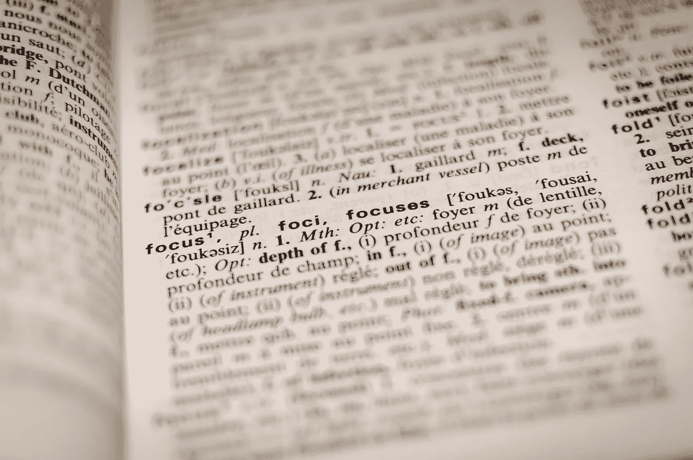
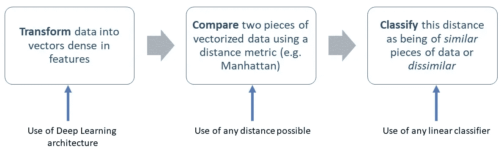
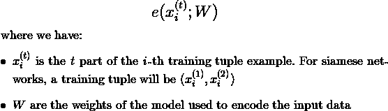
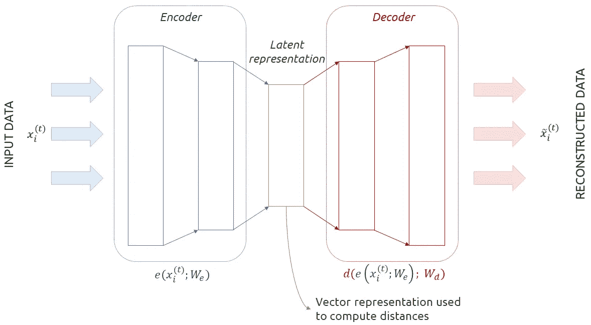
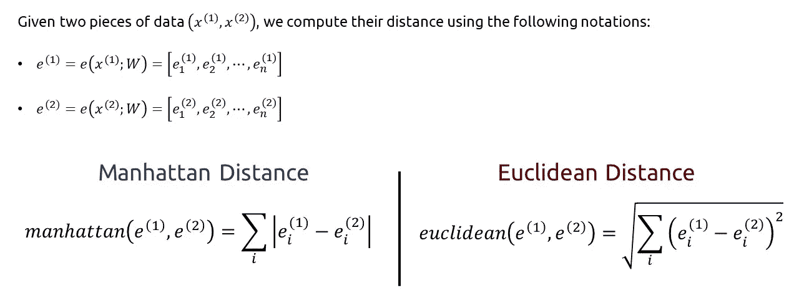
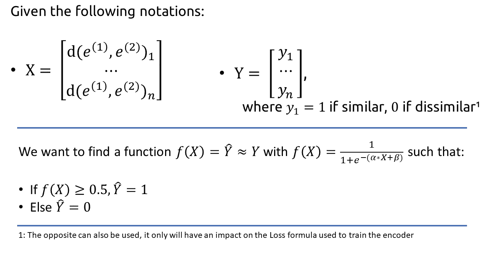
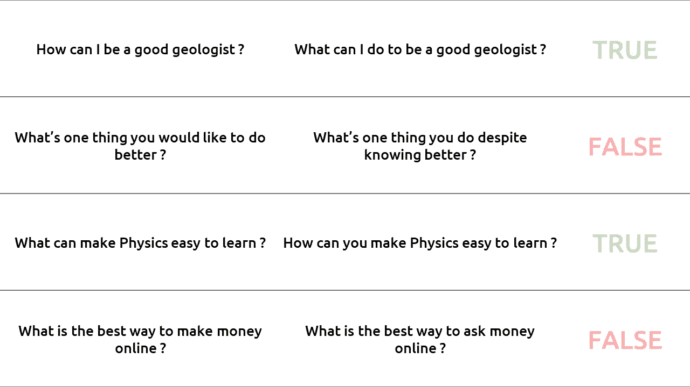
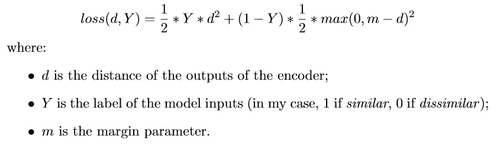
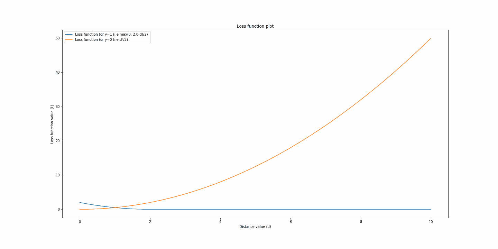
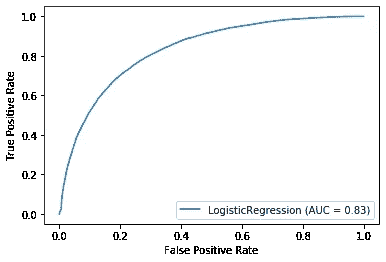

# 序列深度相似性学习导论

> 原文：<https://towardsdatascience.com/introduction-to-deep-similarity-learning-for-sequences-89d9c26f8392?source=collection_archive---------23----------------------->

## 对用于相似性分类任务的深度学习技术的深入回顾。

罗曼·维涅斯在 [Unsplash](https://unsplash.com/s/photos/text?utm_source=unsplash&utm_medium=referral&utm_content=creditCopyText) 上的照片

在这篇文章中，我将阐述相似性学习的一般概念，它涉及哪些过程，以及如何对其进行总结。然后，我将把这些概述的概念应用到带有**问题相似性**的序列相似性检测的上下文中。

# 目录

1.  相似性学习概述
2.  文本相似性学习
3.  源代码(PyTorch 实现)

# 1.深度相似性学习综述

当一个人在进行相似性学习时，总是执行相同的过程:

具有相似性学习的数据处理流水线

正如本信息图中所解释的，任何涉及相似性学习的过程都围绕着 3 个主要概念:

1.  **特征向量中数据的变换**
2.  **使用距离度量对矢量进行比较**
3.  **距离的分类**为*相似*或*不相似*

## 1 .通过编码器的转换

在大多数深度学习任务中，模型的第一层代表有时被称为“*编码阶段*”:它的作用是从输入数据中提取相关特征。

对于本文的其余部分，我们将编写如下编码函数:

编码函数符号的表示

根据输入，该编码器可以采用不同的形式，其中我们发现:

*   **RNN 层**用于**序列**的编码和对比；
*   **CNN 层**用于**时间** / **空间**数据(1D 卷积也可用于**序列**)；

通常，**在**输入数据被这些**编码器**还原成一个矢量后，我们将多层**全连接神经元**堆叠起来**对这些提取的**特征**进行分类。在我们的例子中，我们使用这个**向量**作为我们数据的降维版本来**计算与其他数据的距离**。用数字来表示两个向量的不同，比用两个句子来表示要容易得多。**

总而言之，编码器将使用任何类型的层的组合，这些层将充分地针对其输入数据，生成数据的**潜在表示**，这是一种压缩的、非人类可解释的信息向量。

自动编码器的图示

纵观深度学习的历史，已经创建了多种类型的架构来生成潜在向量。其中一些是:

*   暹罗神经网络*(科赫、泽梅尔和萨拉胡特迪诺夫，2015)*
*   多模态自动编码器*(西尔伯勒和拉帕塔，2015 年)*

在本文中，我们将进一步探索连体神经网络。

## 1.b 距离计算

一旦我们有了矢量化的输入数据，我们就可以使用距离函数来比较这两个向量。最受欢迎的距离是:

*   **曼哈顿**距离
*   **欧几里德**距离

两种最常用距离的比较

一旦计算出距离，我们可以设置一个**阈值**，超过该阈值，我们认为两个数据*不相似*，反之亦然，认为它们*相似*。

## 1.c 距离分类

但是，根据输入数据的不同，设置此阈值可能会很复杂或耗时。为简单起见，我们可以使用另一个分类器，该分类器将**给定一个输入距离，如果该距离是相似或不相似物体之一*则进行分类。*** 我的选择是使用逻辑回归分类器:在我们对应的数据中找到一个线性间隔，以学习对我们的距离进行分类的阈值。

距离分类器的描述(这里是逻辑回归)

# 2.文本相似性学习

## 2 .背景

文本是一种极其难以处理的数据结构:虽然人们常说图像是通用的，但文本是文化的。不管是用的语言还是作者特有的词汇，文本都很难理解，即使对我们来说也是如此。

然而，在某些情况下，我们希望能够测量文本之间的相似性。例如，我们可能想知道:

*   如果根据描述，**两种产品是相同的**；
*   如果**两个问题是**问**同一个**事情。

这最后一个问题是我将在本文中用来谈论文本相似性问题的上下文:它源于 Kaggle *(Quora 问题对)*，由 Quora 团队作为标记为重复或不重复的问题列表发布。

从 Quora 数据集中提取的问题的比较

如 **1.a** 所述，已经为相似性学习任务创建了多种架构。对于这个任务的上下文，我们将重点关注**连体递归神经网络** *(Thyagarajan，2015)* 。

## 2.b 连体递归神经网络架构

连体递归神经网络是一种使用 RNN 堆栈来计算输入数据的固定大小的向量表示的神经网络。

我的暹罗网络的全局视图如下:

我的连体身材

我在 Quora 数据集上使用的架构代码是一个 BiLSTMs(双向 LSTM)堆栈，如下所示:

然后，下面的编码器类使用 BiLSTM 的堆栈:

## 2.c 对比损失

在该模型中，需要注意两个主要组件:

*   它的架构；
*   它的损失。

在 *(Hadsell，Chopra 和 LeCun，2006)* 中描述，对比损失的目标是训练模型将**相似的数据放在一起**(即最小化它们的距离)和**不相似的数据彼此远离**(即最大化它们的距离)。其公式如下:

对比损失公式

这个公式非常容易理解:

*   当两个输入相似( *Y* =1)时，只保留左边的项，距离为平方。因此，最小化损失意味着最小化输入之间的距离，迫使模型学习相似物体的相似表示。
*   当两个输入不同( *Y* =0)时，仅保留正确的项，使用 max 函数。该 max 函数教导模型将两个输入的距离推至大于或等于余量超参数 *m* 。

损失函数图(y=0 时为橙色，y=1 时为蓝色)

# 3.源代码

该项目的源代码可以在 Github 的以下链接中找到:[https://github.com/dimartinot/Text-Semantic-Similarity/](https://github.com/dimartinot/Text-Semantic-Similarity/)

我在所有 3 组数据(train、val 和 test)上实现了 76%到 79%的准确率以及 0.83 的 AUC 分数。

最重要的文件是:

*   [https://github . com/dimartinot/Text-Semantic-Similarity/blob/master/notebook/EDA . ipynb](https://github.com/dimartinot/Text-Semantic-Similarity/blob/master/notebook/EDA.ipynb)探索性数据分析笔记本:用于清理和分析数据集。生成带有预先计算的句子嵌入的数据集的删节版本
*   [https://github . com/dimartinot/Text-Semantic-Similarity/blob/master/notebook/training . ipynb](https://github.com/dimartinot/Text-Semantic-Similarity/blob/master/notebook/Training.ipynb)主训练管道:加载使用 EDA.ipynb 笔记本生成的酸洗数据集
*   [https://github . com/dimartinot/Text-Semantic-Similarity/tree/master/src/model](https://github.com/dimartinot/Text-Semantic-Similarity/tree/master/src/model):主模型文件夹。模型暂时保存在一个文件中，因为它们有很多相似之处。

# **参考文献**

Koch g .，Zemel r .和 Salakhutdinov r .，2015 年。用于一次性图像识别的连体神经网络。 *ICML 深度学习工场。*

西尔贝雷和拉帕塔，2015 年。用自动编码器学习基础意义表征。计算语言学协会第 52 届年会会议录，第 721–732 页。

Thyagarajan，2015 年。用于学习句子相似性的连体递归结构。

Quora。2017. *Quora 问题对*， [Kaggle](https://www.kaggle.com/c/quora-question-pairs/overview)

哈德塞尔，拉伊亚&乔普拉，苏米特&勒昆，扬。2006.通过学习不变映射进行降维。