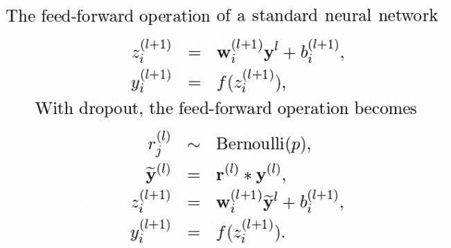

# 为什么辍学在深度神经网络中如此有效

> 原文：<https://towardsdatascience.com/introduction-to-dropout-to-regularize-deep-neural-network-8e9d6b1d4386?source=collection_archive---------23----------------------->

## 数据科学，深度学习

## 辍学是减少深层神经网络依赖性的一种简单方法

艾莉娜·格鲁布尼亚克在 [Unsplash](https://unsplash.com?utm_source=medium&utm_medium=referral) 上的照片

在本文中，您可以探索 dropout，正则化 vs dropout 的优缺点是什么，Dropout 方法在深度学习中如何工作，在深度学习中使用 Dropout 的有效方法是什么，以及如何在深度神经网络中实现 Dropout？

# **什么是深度学习的辍学生？**

**Dropout** 意思是在神经网络中，去掉被掩盖的、明显的单元。在神经网络中，放弃是一种非常流行的克服过度拟合的方法。

**深度学习**框架现在越来越深入。有了这些更大的网络，我们可以实现更好的预测准确性。然而，几年前却不是这样。深度学习有一个过度适应的问题。

那时，大约在 2012 年，Hinton 在他们的论文中提出了通过在训练过程的每次迭代中随机排除特征子集来退出的想法。这个概念彻底改变了深度学习。我们在深度学习方面取得的成就有很大一部分要归功于辍学。

由 [Clarisse Croset](https://unsplash.com/@herfrenchness?utm_source=medium&utm_medium=referral) 在 [Unsplash](https://unsplash.com?utm_source=medium&utm_medium=referral) 上拍摄的照片

# **转正 vs 退学的利弊？**

在**辍学**之前，一个重要的研究领域是**正规化**。在神经网络中引入正则化方法，例如 L1 和 L2 权重罚值，始于 2000 年代中期。尽管如此，这些调整并没有完全解决过度拟合的问题。

Wager 等人在他们 2013 年的论文中指出，在学习特征权重方面，辍学正则化优于 L2 正则化。

# **dropout 方法在深度学习中是如何工作的？**

Dropout 是一种在训练过程中丢弃随机选择的神经元的方法。他们被任意“退学”。这意味着它们对下游神经元激活的贡献在正向传递中暂时消失，任何权重刷新都不会应用于反向传递中的神经元。

你可以想象，如果神经元在训练过程中偶然退出网络，另一个神经元将不得不介入并处理对缺失神经元进行预测所需的描述。这被认为会导致网络学习各种独立的内部表示。

尽管辍学已经成为一种非常成功的技术，但其成功的原因在理论层面上还没有得到很好的理解。

来源:自己的工作

我们可以看到标准的前馈传递:权重乘以输入，加上偏差，并将其传递给激活函数。等式的第二种排列方式阐明了如果我们让学生退学会是什么样子:

*   生成删除掩码:伯努利随机变量(示例 1.0 *(NP . random . random((size))> p)
*   使用屏蔽来断开一些神经元的输入。
*   利用这个新的层来增加权重和偏差
*   最后，使用激活功能。

所有的权重在潜在的指数数量的网络上共享，并且在反向传播期间，只有“稀疏网络”的权重将被刷新。

# **深度学习中使用 Dropout 的有效方法有哪些？**

●根据(Srivastava，2013) Dropout，神经网络可以与随机梯度下降一起训练。对于每个迷你批次中的每个训练案例，独立完成退出。辍学可以利用任何激活功能，他们的实验与逻辑，双曲正切，矫正线性单位产生了可比的结果，但需要不同的训练时间，矫正线性单位是最快的训练。

● Kingma 等人，2015 年推荐的辍学要求指出辍学率，即放弃一个神经元的概率。辍学率通常利用网格搜索进行优化。此外，作为贝叶斯正则化的一个特殊例子，变分丢失是高斯丢失的一个精致的翻译。这种方法允许我们调整辍学率，并且原则上可以用于为每一层、神经元甚至权重设置单独的辍学率。

●由(Ba 等人，2013)进行的另一个实验，增加深度学习算法中的隐藏单元的数量。辍学正则化的一个值得注意的事情是，它实现了大量隐藏单元的相当普遍的性能，因为所有单元都有相等的概率被排除。

# 深度神经网络如何实现 dropout？

●通常，利用 20%-50%的神经元的小丢弃值，其中 20%提供了一个很好的起点。太低的概率具有不显著的影响，并且在系统的欠学习中价值太高的结果。

●当 dropout 在一个更大的网络中使用时，你可能会显示出改进执行的迹象，允许模型有更多的机会学习免费的描述。

●在接近(明显的)时使用叉头，就像隐蔽单元一样。在系统的每一层利用辍学已经证明了巨大的成果。

# 参考

* n . Srivastava，g . hint on，a . krijevsky，Sutskever，I .和 r . Salakhutdinov，2014 年。辍学:防止神经网络过度拟合的简单方法。《机器学习研究杂志》，第 15 卷第 1 期，第 1929-1958 页。

* hint on，G.E .，n . Srivastava，Krizhevsky，a .，Sutskever，I .和 Salakhutdinov，R.R .，2012 年。通过防止特征检测器的共同适应来改进神经网络。arXiv 预印本 arXiv:1207.0580。

●韦杰，王，梁，2013。作为适应性调整的辍学训练。神经信息处理系统的进展(第 351-359 页)。

●北卡罗来纳州斯利瓦斯塔瓦，2013 年。用辍学改进神经网络。多伦多大学，182(566)，第 7 页

●金玛博士、t .萨利曼斯和 m .韦林，2015 年。变分丢失和局部重新参数化技巧。神经信息处理系统进展(第 2575-2583 页)。

巴和弗雷分别于 2013 年出版。用于训练深度神经网络的自适应丢失。神经信息处理系统进展(第 3084-3092 页)。

现在，把你的想法放到 Twitter、Linkedin 和 Github 上吧！！

同意或不同意 Saurav Singla 的观点和例子？想告诉我们你的故事吗？

推文 [@SauravSingla_08](https://twitter.com/SAURAVSINGLA_08) ，评论 [Saurav_Singla](http://www.linkedin.com/in/saurav-singla-5b412320) ，明星 [SauravSingla](https://github.com/sauravsingla) 马上！