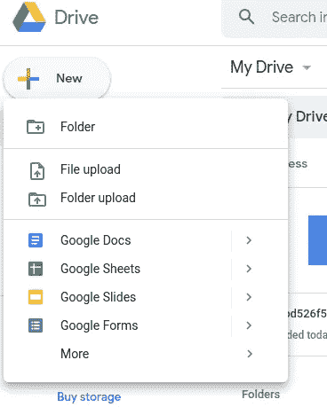

# DVC 介绍:机器学习项目的数据版本控制工具

> 原文：<https://towardsdatascience.com/introduction-to-dvc-data-version-control-tool-for-machine-learning-projects-7cb49c229fe0?source=collection_archive---------20----------------------->

## 就像 Git 一样，但是有数据！


照片由[弗兰基·查马基](https://unsplash.com/@franki?utm_source=medium&utm_medium=referral)在 [Unsplash](https://unsplash.com?utm_source=medium&utm_medium=referral) 上拍摄

# 动机

作为一名数据科学家，您可能会尝试不同的代码、数据和模型组合。因此，对您的代码、数据和模型进行版本化是非常重要的，这样您就可以重现过去的实验。

但是您如何对您的代码、数据和模型进行版本化呢？

Git 是控制代码版本的一个很好的平台，但是对数据和模型进行版本控制并不理想，原因有二:

*   GitHub 有一个 100MB 的严格文件限制，所以上传一个中等大小的二进制文件很容易超过这个限制。
*   用 GitHub 比较不同版本数据的变化很乱。我曾经在使用后手动接受超过 100 次的数据更改，这是一种痛苦。

如果你可以将数据存储在你最喜欢的存储服务中，比如亚马逊 S3、谷歌驱动、谷歌云存储或你自己的本地机器，同时还能对你的数据进行版本控制，这不是很好吗？这正是 DVC 派上用场的时候。

# 什么是 DVC？

DVC 是一个用于数据版本控制的系统。它本质上类似于 Git，但用于数据。有了 DVC，你可以把不同版本数据的信息保存在 Git 中，而把原始数据保存在其他地方。

更好的是，DVC 语法就像 Git！如果你已经知道 Git，学习 DVC 是轻而易举的事。

为了理解如何使用 DVC，让我们从一个例子开始。我将使用[我的存储库](https://github.com/khuyentran1401/Machine-learning-pipeline)作为本文的例子。您可以通过克隆存储库来跟进。

从用 pip 安装软件包开始

```
pip install dvc
```

或与康达

```
conda install -c conda-forge dvc
```

在此找到安装 DVC [的更多方法的说明。](https://dvc.org/doc/install)

# 开始

安装好 DVC 后，在 Git 项目中，通过运行

```
dvc init
```

`.dvc/.gitignore`和`.dvc/config`被创建。提交此更改

```
git commit -m "Initialize DVC"
```

这是我的数据目录的结构

```
data
├── processed
│   ├── test_text.txt
│   ├── train_label.txt
│   ├── train_text.txt
│   ├── val_label.txt
│   └── val_text.txt
└── raw
    ├── mex20_test_full.txt
    ├── mex20_train_labels.txt
    ├── mex20_train.txt
    ├── mex20_val_labels.txt
    └── mex20_val.txt
```

要开始跟踪一个文件或目录，使用`dvc add`

要跟踪数据目录，请使用

```
dvc add data
```

添加的文件或目录的信息将存储在名为`data.dvc`的`.dvc`文件中。这是一个小的文本文件，它存储如何访问原始数据的信息，但不存储原始数据本身。

因为这个文本文件很小，所以可以像源代码一样用 Git 进行版本控制。

现在只需像提交源代码一样提交`dvc`文件。确保在[之前将](https://github.com/khuyentran1401/Machine-learning-pipeline/blob/master/.gitignore) `[data](https://github.com/khuyentran1401/Machine-learning-pipeline/blob/master/.gitignore)` [添加到](https://github.com/khuyentran1401/Machine-learning-pipeline/blob/master/.gitignore) `[.gitignore](https://github.com/khuyentran1401/Machine-learning-pipeline/blob/master/.gitignore)`中，以避免提交数据。

```
git add data.dvc
git commit -m "add data"
```

# 远程存储数据

酷！现在我们创建了一个文件来存储关于原始数据的信息。下一步是确定在哪里存储数据

就像我们如何使用`git add remote`来存储远程存储库的 URL 一样，我们也想使用`dvc remote add`来存储远程存储库的位置。

DVC 允许我们在谷歌驱动、亚马逊 S3、Azure Blob 存储、谷歌云存储、阿里云 OSS、SSH、HDFS 和 HTTP 上存储我们的数据。既然我假设每个人都有 Google Drive，那么让我们来学习如何在 Google Drive 上存储我们的数据

首先在 Google Drive 上创建一个文件夹



一旦我们创建了一个文件夹，我们的链接将是这样的[https://drive . Google . com/drive/folders/1 ynnbbt-4j 0 IDA 0 ekyqqzzbc 93 juuubvh](https://drive.google.com/drive/folders/1ynNBbT-4J0ida0eKYQqZZbC93juUUbVH)

只需添加到 DVC 的链接来存储远程存储的位置

```
dvc remote add -d remote gdrive://1ynNBbT-4J0ida0eKYQqZZbC93juUUbVH
```

`-d`代表默认。关于存储器的信息将保存在`.dvc/config`下

```
[core]remote = remote['remote "remote"']url = gdrive://1ynNBbT-4J0ida0eKYQqZZbC93juUUbVH
```

现在只需提交配置文件

```
git commit .dvc/config -m "Configure remote storage"
```

并将数据推送到 Google Drive

```
dvc push
```

就是这样！现在所有的数据都被推送到 [Google Drive](https://drive.google.com/drive/u/0/folders/1ynNBbT-4J0ida0eKYQqZZbC93juUUbVH) 。查看`[dvc remote add](https://dvc.org/doc/command-reference/remote/add)`了解在其他存储服务中存储数据的更多方法。

要将我们已经提交的变更推送到我们的远程存储库，请键入

```
git push origin <branch>
```

# 获取数据

您的数据存储在安全的地方。但是现在你或者你的队友想要访问这些数据，你或者你的队友应该怎么做？

它是直接向前的。就像平常一样使用`git pull`来改变代码。现在您的本地目录中已经有了`.dvc`文件。

要检索数据，只需输入

```
dvc pull
```

从远程存储器中提取数据。就是这样！

如果您按照教程进行操作，并且您的本地机器中仍然有`data`目录，请删除它，看看`dvc pull`如何从远程存储中检索您的数据。

# 更改

要进行更改，请使用

```
dvc add data
git commit data.dvc -m 'Data updates'
dvc push
git push origin <branch>
```

它是直截了当的，不是吗？

# 在不同版本之间切换

使用 DVC 的全部意义在于，我们可以在不同版本的数据之间切换。那么我们到底该怎么做呢？同样，就像我们用 Git 在不同版本的代码之间切换一样，使用`dvc checkout`在不同版本的数据之间切换

```
git checkout <...>
dvc checkout
```

例如，如果我们想切换到以前版本的数据，请键入

```
git checkout HEAD^1 data.dvc
dvc checkout
```

现在，当数据恢复到以前的版本时，使用

```
git commit data.dvc -m "revert to previous version"
```

保存更改。

基本上，我们用`git chechout`切换到我们代码的另一个版本。`dvc checkout`将`.dvc`文件和目录的相应版本从`.dvc/cache`恢复到工作区。

很酷不是吗？

# 结论

恭喜你！您刚刚学习了如何使用 DVC 控制不同版本的数据！如果您仍然犹豫是否将 DVC 用于您的数据科学项目，那么是时候尝试一下了。语法类似于 Git。使用:

*   `dvc add`跟踪文件
*   `dvc push`将数据推送到远程存储器
*   `dvc pull`从远程存储器中提取数据
*   `dvc checkout`下载其他版本的数据

您和您的队友将会很高兴使用上面的简单命令行将您的数据更改保存在 Git 中，同时将您的数据存储在您最喜欢的存储服务中！

请在这里随意使用本文中的代码

[](https://github.com/khuyentran1401/Machine-learning-pipeline) [## khuyentran 1401/机器学习管道

### 本报告提供了一个如何将 MLflow 和 Hydra 整合到您的机器学习项目中的示例…

github.com](https://github.com/khuyentran1401/Machine-learning-pipeline) 

我喜欢写一些基本的数据科学概念，并尝试不同的算法和数据科学工具。你可以在 LinkedIn 和 T2 Twitter 上与我联系。

星[这个回购](https://github.com/khuyentran1401/Data-science)如果你想检查我写的所有文章的代码。在 Medium 上关注我，了解我的最新数据科学文章，例如:

[](/how-to-create-fake-data-with-faker-a835e5b7a9d9) [## 如何用 Faker 创建假数据

### 您可以收集数据或创建自己的数据

towardsdatascience.com](/how-to-create-fake-data-with-faker-a835e5b7a9d9) [](/how-to-leverage-visual-studio-code-for-your-data-science-projects-7078b70a72f0) [## 如何在数据科学项目中利用 Visual Studio 代码

### 直到发现一种新的有效方法，我们才意识到我们是多么低效

towardsdatascience.com](/how-to-leverage-visual-studio-code-for-your-data-science-projects-7078b70a72f0) [](/top-4-code-viewers-for-data-scientist-in-vscode-e275e492350d) [## VSCode 中数据科学家的 4 大代码查看器

### 让 YAML、JSON、CSV 和 Jupyter Notebook 为你工作，而不是与你作对

towardsdatascience.com](/top-4-code-viewers-for-data-scientist-in-vscode-e275e492350d) [](/introduction-to-hydra-cc-a-powerful-framework-to-configure-your-data-science-projects-ed65713a53c6) [## Hydra.cc 简介:配置数据科学项目的强大框架

### 尝试不同的参数和模型，而无需花费数小时来修改代码！

towardsdatascience.com](/introduction-to-hydra-cc-a-powerful-framework-to-configure-your-data-science-projects-ed65713a53c6) [](/introduction-to-schema-a-python-libary-to-validate-your-data-c6d99e06d56a) [## 模式介绍:验证数据的 Python 库

### 验证您的数据变得更加复杂！

towardsdatascience.com](/introduction-to-schema-a-python-libary-to-validate-your-data-c6d99e06d56a)